#### **TECHNOLOGY EXPLAINERS (INTRODUCTORY LEVEL DETAIL)**

### **3. Terraform** 🏗️

> **📖 What Terraform does:** Infrastructure as Code (IaC) tool that allows you to define, provision, and manage cloud infrastructure using declarative configuration files. Enables version-controlled, reproducible infrastructure deployments across multiple cloud providers.
>
> **🔍 Detailed Breakdown:**
> 
> **Core Concept - Infrastructure as Code:**
> - Write infrastructure definitions in **HCL (HashiCorp Configuration Language)** - human-readable syntax
> - Treat infrastructure like software code: version control, peer review, automated testing
> - Replace manual console clicking with repeatable, documented configurations
> 
> **Key Capabilities:**
> - **Multi-cloud Support**: AWS, Azure, Google Cloud, VMware, and 1000+ providers
> - **Resource Management**: Create, update, and destroy infrastructure resources safely
> - **State Management**: Tracks real infrastructure state vs. desired configuration
> - **Dependency Resolution**: Automatically handles creation order (VPC before subnets, etc.)
> - **Plan & Apply**: Preview changes before execution ("plan") then apply them
> 
> **Real-World Example:**
> ```hcl
> # Create AWS EC2 instance with networking
> resource "aws_instance" "web_server" {
>   ami           = "ami-0c02fb55956c7d316"
>   instance_type = "t3.micro"
>   subnet_id     = aws_subnet.public.id
>   
>   tags = {
>     Name = "DevOps-WebServer"
>     Environment = "Production"
>   }
> }
> ```
> 
> **Terraform Workflow Visualization:**
> ```mermaid
> graph TD
>     A["📝 Write Terraform Config<br/>(main.tf)"] --> B["🔧 terraform init<br/>(Download providers)"]
>     B --> C["📋 terraform plan<br/>(Preview changes)"]
>     C --> D{"✅ Review Plan<br/>(Approve changes?)"}
>     D -->|Yes| E["🚀 terraform apply<br/>(Create resources)"]
>     D -->|No| F["✏️ Modify Config<br/>(Update requirements)"]
>     F --> C
>     E --> G["☁️ Infrastructure Created<br/>(AWS/Azure/GCP)"]
>     G --> H["📊 terraform state<br/>(Track resources)"]
>     H --> I["🔄 Future Updates<br/>(Modify & reapply)"]
>     I --> C
>     
>     style A fill:#e1f5fe
>     style G fill:#e8f5e8
>     style H fill:#fff3e0
> ```
> 
> **DevOps Benefits:**
> - **Consistency**: Same infrastructure across dev, staging, production
> - **Scalability**: Easy to replicate environments or scale resources
> - **Collaboration**: Team can review infrastructure changes like code
> - **Disaster Recovery**: Rebuild entire infrastructure from configuration files
> - **Cost Management**: Track and optimize resource usage through code
> - **Compliance**: Enforce security and compliance policies through code

```bash
# Add HashiCorp GPG key
wget -O- https://apt.releases.hashicorp.com/gpg | sudo gpg --dearmor -o /usr/share/keyrings/hashicorp-archive-keyring.gpg

# Add HashiCorp repository
echo "deb [signed-by=/usr/share/keyrings/hashicorp-archive-keyring.gpg] https://apt.releases.hashicorp.com $(lsb_release -cs) main" | sudo tee /etc/apt/sources.list.d/hashicorp.list

# Update and install Terraform
sudo apt update
sudo apt install -y terraform

# Verify installation
terraform --version

# Enable tab completion
terraform -install-autocomplete
```

---

#### **TECHNOLOGY EXPLAINERS (MID LEVEL DETAIL)**

### **🔐 GitHub Authentication** 🔄

> **❓ "Why can't I just copy-paste the GitHub link like I do on Windows?"**
> 
> Great question! This is a common confusion when moving from traditional Windows development to Linux/DevOps environments. Let's break down the differences:

**🪟 Traditional Windows Workflow (What You're Used To):**
```
1. Go to GitHub.com in browser
2. Copy repository URL (https://github.com/user/repo.git)
3. Use GitHub Desktop or VS Code with built-in Git
4. Paste URL, enter GitHub username/password when prompted
5. Works! (GitHub handles authentication behind the scenes)
```

**🐧 Linux/DevOps Workflow (Why It's Different):**
```
1. Command-line environment (no GUI apps with built-in auth)
2. Automated scripts need secure, passwordless authentication
3. Multiple developers/servers need secure access
4. CI/CD pipelines need programmatic access
5. Security requirements are much higher
```

> **🔍 The Real Difference:**
> On Windows, GitHub Desktop and VS Code handle authentication for you using OAuth and token management. In Linux DevOps environments, YOU need to handle authentication securely for automation and command-line operations.

**🔒 Authentication Methods Comparison:**

| Method | Windows Experience | Linux/DevOps Reality | Security Level |
|--------|-------------------|---------------------|----------------|
| **HTTPS + Password** | ✅ Simple, GUI prompts | ❌ Deprecated by GitHub (2021) | 🔴 Low |
| **HTTPS + Token** | ✅ Auto-managed by apps | ⚠️ Manual token management | 🟡 Medium |
| **SSH Keys** | ❌ Rarely needed | ✅ Industry standard | 🟢 High |

#### **🚀 Setting Up SSH Authentication (Step-by-Step with Explanations)**

> **Why SSH Keys?**
> - 🔐 **More Secure**: No passwords sent over network
> - 🤖 **Automation-Friendly**: Scripts can run without human input
> - 🚀 **Faster**: No authentication prompts during operations
> - 🏢 **Professional Standard**: What all DevOps teams use

**Step 1: Generate Your SSH Key Pair**
```bash
# Generate SSH key pair
ssh-keygen -t ed25519 -C "your.email@example.com"
```

> **What this does:**
> - Creates a **private key** (stays on your computer, NEVER share)
> - Creates a **public key** (you'll give this to GitHub)
> - Like having a special lock (public) and the only key (private)
> - `-t ed25519` = Latest, most secure encryption type
> - `-C "email"` = Label to identify this key

**When prompted:**
```bash
Enter file in which to save the key (/home/username/.ssh/id_ed25519): [Press Enter]
Enter passphrase (empty for no passphrase): [Press Enter or create password]
Enter same passphrase again: [Press Enter or repeat password]
```

> **💡 Passphrase Decision:**
> - **With passphrase**: More secure, but you'll need to enter it
> - **No passphrase**: Convenient for automation, slightly less secure
> - **Recommendation**: Start with no passphrase for learning

**Step 2: Start SSH Agent (Manages Your Keys)**
```bash
eval "$(ssh-agent -s)"
```

> **What this does:**
> - Starts a background service that manages your SSH keys
> - Prevents you from entering passphrase repeatedly
> - Like having a keychain that remembers your keys

**Step 3: Add Your Private Key to SSH Agent**
```bash
ssh-add ~/.ssh/id_ed25519
```

> **What this does:**
> - Tells SSH agent to use your new private key
> - Loads the key into memory for easy access

**Step 4: Copy Your Public Key**
```bash
cat ~/.ssh/id_ed25519.pub
```

> **What this does:**
> - Displays your PUBLIC key (safe to share)
> - You'll copy this entire output to GitHub
> - Starts with `ssh-ed25519` and ends with your email

**🌐 GitHub Authentication Setup Visualization:**

```mermaid
graph TD
    A["💻 Your Ubuntu VM<br/>(Private Key Stored)"] -->|"Encrypted Connection"| B["🔐 SSH Handshake<br/>(Challenge/Response)"]
    B --> C["🌍 GitHub Servers<br/>(Public Key Stored)"]
    
    subgraph "🔑 Key Pair Authentication"
        D["🔒 Private Key<br/>(~/.ssh/id_ed25519)<br/>NEVER SHARE"]
        E["🔓 Public Key<br/>(~/.ssh/id_ed25519.pub)<br/>Share with GitHub"]
    end
    
    A -.->|"Contains"| D
    C -.->|"Contains"| E
    
    F["📝 git push origin main"] --> A
    A --> G["✅ Authenticated & Authorized<br/>(Push Successful)"]
    
    style D fill:#ffcdd2
    style E fill:#c8e6c9
    style G fill:#e8f5e8
```


**Step 5: Add Public Key to GitHub**
1. Go to GitHub.com → Settings → SSH and GPG keys
2. Click "New SSH key"
3. Title: "Ubuntu VM DevOps Key"
4. Paste the ENTIRE output from the `cat` command
5. Click "Add SSH key"

**Step 6: Test Your Connection**
```bash
# Test SSH connection to GitHub
ssh -T git@github.com
```

> **Expected Response:**
> ```bash
> Hi YourUsername! You've successfully authenticated, but GitHub does not provide shell access.
> ```
> 
> **If you see this, SUCCESS!** 🎉

#### **🔄 Workflow Comparison: Before vs After**

**❌ Old Windows Way (Copy-Paste URL):**
```bash
# This WON'T work reliably in DevOps
git clone https://github.com/user/repo.git
# Prompts for username/password (deprecated)
# Or requires manual token management
```

**✅ New DevOps Way (SSH):**
```bash
# This WILL work seamlessly
git clone git@github.com:user/repo.git
# No prompts, automatic authentication
# Works in scripts, CI/CD, automation
```

#### **🛠️ Troubleshooting Common Issues**

**Problem: "Permission denied (publickey)"**
```bash
# Solution: Check if SSH agent is running and key is added
ssh-add -l
# If empty, add your key again:
ssh-add ~/.ssh/id_ed25519
```

**Problem: "Could not open a connection to your authentication agent"**
```bash
# Solution: Start SSH agent
eval "$(ssh-agent -s)"
ssh-add ~/.ssh/id_ed25519
```

**Problem: Wrong repository URL format**
```bash
# ❌ Wrong (HTTPS format)
git remote add origin https://github.com/user/repo.git

# ✅ Correct (SSH format)
git remote add origin git@github.com:user/repo.git

# Fix existing repository:
git remote set-url origin git@github.com:user/repo.git
```

#### **🎯 Why This Matters for DevOps**

> **Real-World Scenario:**
> You're setting up a CI/CD pipeline that automatically:
> 1. Pulls latest code from GitHub
> 2. Runs tests
> 3. Builds Docker images
> 4. Deploys to production
> 
> This pipeline runs 50+ times per day, unattended. SSH keys enable this automation without security risks or manual intervention.

**SSH Keys Enable:**
- 🤖 **Automated Deployments**: CI/CD pipelines work without human input
- 🔒 **Secure Server Access**: Production servers can safely pull updates
- 👥 **Team Collaboration**: Multiple developers with secure, auditable access
- 📊 **Monitoring Scripts**: Automated tools can push metrics and logs
- 🚀 **Scaling**: Works across hundreds of servers simultaneously

---

## 📊 **MERMAID DIAGRAM REQUIREMENTS**

**When to Include Diagrams:**
Include Mermaid diagrams in technology explainers where they add significant value for understanding:

- **Workflow Processes**: Multi-step procedures (CI/CD pipelines, deployment flows)
- **Architecture Overviews**: System components and their relationships
- **Data Flow**: How information moves through systems
- **Decision Trees**: Conditional logic and branching processes
- **Timeline/Sequence**: Ordered operations and dependencies

**Diagram Guidelines:**
- Keep diagrams **simple and focused** on core concepts
- Use **consistent styling** with colors for different types of elements
- Include **clear labels** and **descriptive text**
- Ensure diagrams **complement, don't replace** written explanations
- Test diagram syntax before including in documentation
