# 🐍 Python AWS Integration for DevOps: Complete Automation Guide

## 📖 What This File Does
This guide shows how Python serves as the automation backbone for AWS DevOps operations. You'll learn how to use Python for infrastructure management, deployment automation, monitoring scripts, and cost optimization - bridging the gap between development and cloud operations.

## 🎯 Learning Objectives
- Master Python boto3 SDK for AWS automation
- Learn infrastructure management through Python scripts
- Understand deployment automation with Python
- Build monitoring and alerting systems
- Create cost optimization and resource management tools
- Integrate Python scripts into CI/CD pipelines

## 📋 Prerequisites
- Python fundamentals (see `Python_For_DevOps/` directory)
- Basic AWS services knowledge
- Understanding of JSON and YAML formats
- Command line proficiency

---

## 🌟 **Python + AWS: The DevOps Automation Powerhouse**

### **🔄 Complete Python AWS Integration Ecosystem**

```mermaid
flowchart TD
    subgraph "Infrastructure Automation"
        A["EC2 Management<br/>• Instance lifecycle<br/>• Auto-scaling groups<br/>• Security groups<br/>• Key pair management"] --> B["VPC Networking<br/>• Subnet creation<br/>• Route table management<br/>• Internet gateways<br/>• Load balancer config"]
        C["Storage Management<br/>• S3 operations<br/>• EBS volume management<br/>• Backup automation<br/>• Lifecycle policies"] --> D["Database Operations<br/>• RDS management<br/>• Parameter groups<br/>• Backup/restore<br/>• Performance monitoring"]
    end
    
    subgraph "Deployment Automation"
        E["Application Deployment<br/>• ECS task management<br/>• Lambda functions<br/>• API Gateway setup<br/>• Route 53 configuration"] --> F["CI/CD Integration<br/>• CodePipeline triggers<br/>• Build automation<br/>• Testing integration<br/>• Rollback procedures"]
        G["Container Management<br/>• ECR registry operations<br/>• EKS cluster management<br/>• Fargate deployments<br/>• Service mesh config"] --> H["Configuration Management<br/>• Parameter Store<br/>• Secrets Manager<br/>• Environment variables<br/>• Feature flags"]
    end
    
    subgraph "Monitoring & Operations"
        I["CloudWatch Integration<br/>• Metrics collection<br/>• Log analysis<br/>• Alarm management<br/>• Dashboard creation"] --> J["Cost Optimization<br/>• Resource usage analysis<br/>• Reserved instance management<br/>• Rightsizing recommendations<br/>• Budget alerts"]
        K["Security Automation<br/>• IAM policy management<br/>• Security group auditing<br/>• Compliance checking<br/>• Vulnerability scanning"] --> L["Incident Response<br/>• Automated remediation<br/>• Notification systems<br/>• Runbook automation<br/>• Post-incident analysis"]
    end
    
    A --> E
    B --> F
    C --> G
    D --> H
    E --> I
    F --> J
    G --> K
    H --> L
    
    style A fill:#e8f5e8
    style E fill:#e3f2fd
    style I fill:#fff3e0
    style K fill:#f3e5f5
```



---

## ⚙️ **Essential Python AWS Setup**

### **🔧 Development Environment Configuration**

```python
# requirements.txt for AWS DevOps automation
boto3==1.34.0
botocore==1.34.0
aws-cli==2.15.0
pyyaml==6.0.1
requests==2.31.0
python-dotenv==1.0.0
click==8.1.7
tabulate==0.9.0
colorama==0.4.6
jinja2==3.1.2
```

**Environment Setup Script:**
```python
#!/usr/bin/env python3
"""
AWS DevOps Environment Setup
Sets up Python environment for AWS automation
"""

import os
import sys
import subprocess
import boto3
from botocore.exceptions import ClientError, NoCredentialsError

def check_aws_credentials():
    """Verify AWS credentials are configured"""
    try:
        sts = boto3.client('sts')
        identity = sts.get_caller_identity()
        print(f"✅ AWS credentials configured for account: {identity['Account']}")
        print(f"   User/Role: {identity['Arn']}")
        return True
    except NoCredentialsError:
        print("❌ AWS credentials not configured")
        print("   Run: aws configure")
        return False
    except ClientError as e:
        print(f"❌ AWS credentials error: {e}")
        return False

def setup_environment():
    """Setup Python environment for AWS DevOps"""
    print("🚀 Setting up Python AWS DevOps environment...\n")
    
    # Check Python version
    if sys.version_info < (3, 8):
        print("❌ Python 3.8+ required")
        sys.exit(1)
    print(f"✅ Python {sys.version}")
    
    # Check AWS CLI
    try:
        result = subprocess.run(['aws', '--version'], 
                              capture_output=True, text=True)
        print(f"✅ AWS CLI: {result.stdout.strip()}")
    except FileNotFoundError:
        print("❌ AWS CLI not installed")
        print("   Install: https://docs.aws.amazon.com/cli/latest/userguide/getting-started-install.html")
        sys.exit(1)
    
    # Check AWS credentials
    if not check_aws_credentials():
        sys.exit(1)
    
    # Install Python packages
    print("\n📦 Installing Python packages...")
    subprocess.run([sys.executable, '-m', 'pip', 'install', '-r', 'requirements.txt'])
    
    print("\n🎉 Environment setup complete!")
    print("\nNext steps:")
    print("1. Export AWS_DEFAULT_REGION=us-west-2")
    print("2. Run: python aws_health_check.py")

if __name__ == "__main__":
    setup_environment()
```

---

## 🏗️ **Infrastructure Management with Python**

### **💻 EC2 Instance Management**

```python
#!/usr/bin/env python3
"""
EC2 Instance Management Script
Comprehensive EC2 lifecycle management for DevOps
"""

import boto3
import time
import json
from typing import List, Dict, Optional
from botocore.exceptions import ClientError

class EC2Manager:
    def __init__(self, region='us-west-2'):
        self.ec2 = boto3.client('ec2', region_name=region)
        self.ec2_resource = boto3.resource('ec2', region_name=region)
        self.region = region
    
    def create_instance(self, 
                       instance_type='t3.micro',
                       image_id='ami-0abcdef1234567890',  # Amazon Linux 2
                       key_name=None,
                       security_groups=None,
                       user_data=None,
                       tags=None) -> str:
        """Create EC2 instance with comprehensive configuration"""
        
        try:
            # Default security group if none provided
            if not security_groups:
                security_groups = [self.get_or_create_default_sg()]
            
            # Default user data for basic setup
            if not user_data:
                user_data = """#!/bin/bash
                yum update -y
                yum install -y docker git htop
                systemctl start docker
                systemctl enable docker
                usermod -a -G docker ec2-user
                
                # Install CloudWatch agent
                wget https://s3.amazonaws.com/amazoncloudwatch-agent/amazon_linux/amd64/latest/amazon-cloudwatch-agent.rpm
                rpm -U ./amazon-cloudwatch-agent.rpm
                """
            
            # Default tags
            if not tags:
                tags = {
                    'Name': f'DevOps-Instance-{int(time.time())}',
                    'Environment': 'development',
                    'Project': 'devops-automation',
                    'Owner': 'devops-team',
                    'AutoStop': 'true'
                }
            
            response = self.ec2.run_instances(
                ImageId=image_id,
                MinCount=1,
                MaxCount=1,
                InstanceType=instance_type,
                KeyName=key_name,
                SecurityGroupIds=security_groups,
                UserData=user_data,
                TagSpecifications=[
                    {
                        'ResourceType': 'instance',
                        'Tags': [{'Key': k, 'Value': v} for k, v in tags.items()]
                    }
                ],
                IamInstanceProfile={
                    'Name': 'EC2-CloudWatch-Role'  # For monitoring
                },
                Monitoring={'Enabled': True}  # Enable detailed monitoring
            )
            
            instance_id = response['Instances'][0]['InstanceId']
            print(f"✅ Created instance: {instance_id}")
            
            # Wait for instance to be running
            print("⏳ Waiting for instance to be running...")
            waiter = self.ec2.get_waiter('instance_running')
            waiter.wait(InstanceIds=[instance_id])
            
            # Get instance details
            instance = self.ec2_resource.Instance(instance_id)
            print(f"🚀 Instance {instance_id} is running!")
            print(f"   Public IP: {instance.public_ip_address}")
            print(f"   Private IP: {instance.private_ip_address}")
            
            return instance_id
            
        except ClientError as e:
            print(f"❌ Error creating instance: {e}")
            raise
    
    def get_or_create_default_sg(self) -> str:
        """Get or create default security group for DevOps"""
        sg_name = 'devops-default-sg'
        
        try:
            # Try to find existing security group
            response = self.ec2.describe_security_groups(
                Filters=[
                    {'Name': 'group-name', 'Values': [sg_name]}
                ]
            )
            
            if response['SecurityGroups']:
                return response['SecurityGroups'][0]['GroupId']
            
            # Create new security group
            vpc_id = self.get_default_vpc_id()
            
            response = self.ec2.create_security_group(
                GroupName=sg_name,
                Description='Default security group for DevOps automation',
                VpcId=vpc_id
            )
            
            sg_id = response['GroupId']
            
            # Add inbound rules
            self.ec2.authorize_security_group_ingress(
                GroupId=sg_id,
                IpPermissions=[
                    {
                        'IpProtocol': 'tcp',
                        'FromPort': 22,
                        'ToPort': 22,
                        'IpRanges': [{'CidrIp': '0.0.0.0/0', 'Description': 'SSH access'}]
                    },
                    {
                        'IpProtocol': 'tcp',
                        'FromPort': 80,
                        'ToPort': 80,
                        'IpRanges': [{'CidrIp': '0.0.0.0/0', 'Description': 'HTTP access'}]
                    },
                    {
                        'IpProtocol': 'tcp',
                        'FromPort': 443,
                        'ToPort': 443,
                        'IpRanges': [{'CidrIp': '0.0.0.0/0', 'Description': 'HTTPS access'}]
                    }
                ]
            )
            
            print(f"✅ Created security group: {sg_id}")
            return sg_id
            
        except ClientError as e:
            print(f"❌ Error with security group: {e}")
            raise
    
    def get_default_vpc_id(self) -> str:
        """Get default VPC ID"""
        response = self.ec2.describe_vpcs(
            Filters=[{'Name': 'isDefault', 'Values': ['true']}]
        )
        
        if response['Vpcs']:
            return response['Vpcs'][0]['VpcId']
        else:
            raise Exception("No default VPC found")
    
    def list_instances(self, filters=None) -> List[Dict]:
        """List EC2 instances with optional filters"""
        try:
            if filters is None:
                filters = []
            
            response = self.ec2.describe_instances(Filters=filters)
            
            instances = []
            for reservation in response['Reservations']:
                for instance in reservation['Instances']:
                    # Extract useful information
                    name = 'N/A'
                    for tag in instance.get('Tags', []):
                        if tag['Key'] == 'Name':
                            name = tag['Value']
                            break
                    
                    instances.append({
                        'InstanceId': instance['InstanceId'],
                        'Name': name,
                        'State': instance['State']['Name'],
                        'InstanceType': instance['InstanceType'],
                        'PublicIpAddress': instance.get('PublicIpAddress', 'N/A'),
                        'PrivateIpAddress': instance.get('PrivateIpAddress', 'N/A'),
                        'LaunchTime': instance['LaunchTime']
                    })
            
            return instances
            
        except ClientError as e:
            print(f"❌ Error listing instances: {e}")
            return []
    
    def stop_instances_by_tag(self, tag_key: str, tag_value: str):
        """Stop instances matching specific tag"""
        try:
            # Find instances with matching tag
            response = self.ec2.describe_instances(
                Filters=[
                    {'Name': f'tag:{tag_key}', 'Values': [tag_value]},
                    {'Name': 'instance-state-name', 'Values': ['running']}
                ]
            )
            
            instance_ids = []
            for reservation in response['Reservations']:
                for instance in reservation['Instances']:
                    instance_ids.append(instance['InstanceId'])
            
            if instance_ids:
                self.ec2.stop_instances(InstanceIds=instance_ids)
                print(f"✅ Stopping {len(instance_ids)} instances")
                for instance_id in instance_ids:
                    print(f"   - {instance_id}")
            else:
                print("No running instances found with matching tag")
                
        except ClientError as e:
            print(f"❌ Error stopping instances: {e}")

    def cleanup_old_instances(self, days_old: int = 7):
        """Clean up instances older than specified days"""
        from datetime import datetime, timedelta, timezone
        
        try:
            cutoff_date = datetime.now(timezone.utc) - timedelta(days=days_old)
            
            response = self.ec2.describe_instances(
                Filters=[
                    {'Name': 'instance-state-name', 'Values': ['running', 'stopped']}
                ]
            )
            
            old_instances = []
            for reservation in response['Reservations']:
                for instance in reservation['Instances']:
                    if instance['LaunchTime'] < cutoff_date:
                        # Check if instance has AutoCleanup tag
                        auto_cleanup = False
                        for tag in instance.get('Tags', []):
                            if tag['Key'] == 'AutoCleanup' and tag['Value'].lower() == 'true':
                                auto_cleanup = True
                                break
                        
                        if auto_cleanup:
                            old_instances.append(instance['InstanceId'])
            
            if old_instances:
                print(f"🧹 Found {len(old_instances)} old instances to cleanup")
                response = input("Terminate these instances? (yes/no): ")
                if response.lower() == 'yes':
                    self.ec2.terminate_instances(InstanceIds=old_instances)
                    print("✅ Cleanup initiated")
                else:
                    print("❌ Cleanup cancelled")
            else:
                print("No old instances found for cleanup")
                
        except ClientError as e:
            print(f"❌ Error during cleanup: {e}")

# Example usage
if __name__ == "__main__":
    ec2_manager = EC2Manager()
    
    # Create a new instance
    # instance_id = ec2_manager.create_instance(
    #     instance_type='t3.micro',
    #     key_name='my-key-pair',
    #     tags={
    #         'Name': 'DevOps-Test-Instance',
    #         'Environment': 'development',
    #         'AutoCleanup': 'true'
    #     }
    # )
    
    # List all instances
    print("📋 Current EC2 Instances:")
    instances = ec2_manager.list_instances()
    for instance in instances:
        print(f"   {instance['InstanceId']} | {instance['Name']} | {instance['State']}")
    
    # Stop instances with AutoStop tag
    # ec2_manager.stop_instances_by_tag('AutoStop', 'true')
    
    # Cleanup old instances
    # ec2_manager.cleanup_old_instances(days_old=7)
```

---

## 📦 **S3 and Storage Management**

```python
#!/usr/bin/env python3
"""
S3 Storage Management for DevOps
Comprehensive S3 operations including backup, sync, and lifecycle management
"""

import boto3
import os
import json
import hashlib
from datetime import datetime, timedelta
from typing import List, Dict, Optional
from botocore.exceptions import ClientError

class S3Manager:
    def __init__(self, region='us-west-2'):
        self.s3 = boto3.client('s3', region_name=region)
        self.s3_resource = boto3.resource('s3', region_name=region)
        self.region = region
    
    def create_bucket_with_versioning(self, bucket_name: str, enable_encryption: bool = True) -> bool:
        """Create S3 bucket with versioning and optional encryption"""
        try:
            # Create bucket
            if self.region != 'us-east-1':
                self.s3.create_bucket(
                    Bucket=bucket_name,
                    CreateBucketConfiguration={'LocationConstraint': self.region}
                )
            else:
                self.s3.create_bucket(Bucket=bucket_name)
            
            # Enable versioning
            self.s3.put_bucket_versioning(
                Bucket=bucket_name,
                VersioningConfiguration={'Status': 'Enabled'}
            )
            
            # Enable encryption
            if enable_encryption:
                self.s3.put_bucket_encryption(
                    Bucket=bucket_name,
                    ServerSideEncryptionConfiguration={
                        'Rules': [
                            {
                                'ApplyServerSideEncryptionByDefault': {
                                    'SSEAlgorithm': 'AES256'
                                }
                            }
                        ]
                    }
                )
            
            # Block public access
            self.s3.put_public_access_block(
                Bucket=bucket_name,
                PublicAccessBlockConfiguration={
                    'BlockPublicAcls': True,
                    'IgnorePublicAcls': True,
                    'BlockPublicPolicy': True,
                    'RestrictPublicBuckets': True
                }
            )
            
            # Set lifecycle policy for cost optimization
            self.set_lifecycle_policy(bucket_name)
            
            print(f"✅ Created bucket: {bucket_name}")
            print("   - Versioning enabled")
            print("   - Encryption enabled")
            print("   - Public access blocked")
            print("   - Lifecycle policy applied")
            
            return True
            
        except ClientError as e:
            print(f"❌ Error creating bucket: {e}")
            return False
    
    def set_lifecycle_policy(self, bucket_name: str):
        """Set intelligent lifecycle policy for cost optimization"""
        lifecycle_policy = {
            'Rules': [
                {
                    'ID': 'IntelligentTieringRule',
                    'Status': 'Enabled',
                    'Filter': {'Prefix': ''},
                    'Transitions': [
                        {
                            'Days': 30,
                            'StorageClass': 'STANDARD_IA'
                        },
                        {
                            'Days': 90,
                            'StorageClass': 'GLACIER'
                        },
                        {
                            'Days': 365,
                            'StorageClass': 'DEEP_ARCHIVE'
                        }
                    ]
                },
                {
                    'ID': 'DeleteIncompleteMultipartUploads',
                    'Status': 'Enabled',
                    'Filter': {'Prefix': ''},
                    'AbortIncompleteMultipartUpload': {
                        'DaysAfterInitiation': 7
                    }
                }
            ]
        }
        
        try:
            self.s3.put_bucket_lifecycle_configuration(
                Bucket=bucket_name,
                LifecycleConfiguration=lifecycle_policy
            )
            print(f"✅ Lifecycle policy applied to {bucket_name}")
        except ClientError as e:
            print(f"❌ Error setting lifecycle policy: {e}")
    
    def sync_directory_to_s3(self, local_path: str, bucket_name: str, s3_prefix: str = ''):
        """Sync local directory to S3 with progress tracking"""
        import time
        
        try:
            total_files = 0
            uploaded_files = 0
            
            # Count total files
            for root, dirs, files in os.walk(local_path):
                total_files += len(files)
            
            print(f"📤 Syncing {total_files} files to s3://{bucket_name}/{s3_prefix}")
            
            for root, dirs, files in os.walk(local_path):
                for file in files:
                    local_file_path = os.path.join(root, file)
                    relative_path = os.path.relpath(local_file_path, local_path)
                    s3_key = os.path.join(s3_prefix, relative_path).replace('\\', '/')
                    
                    # Check if file needs to be uploaded (compare etags)
                    needs_upload = True
                    try:
                        response = self.s3.head_object(Bucket=bucket_name, Key=s3_key)
                        s3_etag = response['ETag'].strip('"')
                        
                        # Calculate local file MD5
                        with open(local_file_path, 'rb') as f:
                            local_md5 = hashlib.md5(f.read()).hexdigest()
                        
                        if local_md5 == s3_etag:
                            needs_upload = False
                    except ClientError:
                        pass  # File doesn't exist in S3, needs upload
                    
                    if needs_upload:
                        self.s3.upload_file(
                            local_file_path,
                            bucket_name,
                            s3_key,
                            ExtraArgs={
                                'Metadata': {
                                    'uploaded-by': 'devops-automation',
                                    'upload-time': datetime.utcnow().isoformat()
                                }
                            }
                        )
                        uploaded_files += 1
                        print(f"   ↗️  {relative_path}")
                    else:
                        print(f"   ✓  {relative_path} (already synced)")
            
            print(f"✅ Sync complete: {uploaded_files}/{total_files} files uploaded")
            
        except ClientError as e:
            print(f"❌ Error syncing to S3: {e}")
    
    def backup_with_retention(self, source_bucket: str, backup_bucket: str, retention_days: int = 30):
        """Create backup with retention policy"""
        try:
            timestamp = datetime.utcnow().strftime('%Y-%m-%d-%H-%M-%S')
            backup_prefix = f"backups/{timestamp}/"
            
            # List objects in source bucket
            paginator = self.s3.get_paginator('list_objects_v2')
            pages = paginator.paginate(Bucket=source_bucket)
            
            copied_objects = 0
            for page in pages:
                if 'Contents' not in page:
                    continue
                
                for obj in page['Contents']:
                    source_key = obj['Key']
                    backup_key = backup_prefix + source_key
                    
                    # Copy object
                    copy_source = {'Bucket': source_bucket, 'Key': source_key}
                    self.s3.copy_object(
                        CopySource=copy_source,
                        Bucket=backup_bucket,
                        Key=backup_key,
                        MetadataDirective='COPY'
                    )
                    copied_objects += 1
            
            print(f"✅ Backup complete: {copied_objects} objects backed up to {backup_prefix}")
            
            # Clean up old backups
            self.cleanup_old_backups(backup_bucket, retention_days)
            
        except ClientError as e:
            print(f"❌ Error creating backup: {e}")
    
    def cleanup_old_backups(self, bucket_name: str, retention_days: int):
        """Remove backups older than retention period"""
        try:
            cutoff_date = datetime.utcnow() - timedelta(days=retention_days)
            
            paginator = self.s3.get_paginator('list_objects_v2')
            pages = paginator.paginate(Bucket=bucket_name, Prefix='backups/')
            
            objects_to_delete = []
            for page in pages:
                if 'Contents' not in page:
                    continue
                
                for obj in page['Contents']:
                    if obj['LastModified'].replace(tzinfo=None) < cutoff_date:
                        objects_to_delete.append({'Key': obj['Key']})
            
            if objects_to_delete:
                # Delete in batches of 1000
                for i in range(0, len(objects_to_delete), 1000):
                    batch = objects_to_delete[i:i+1000]
                    self.s3.delete_objects(
                        Bucket=bucket_name,
                        Delete={'Objects': batch}
                    )
                
                print(f"🧹 Cleaned up {len(objects_to_delete)} old backup objects")
            else:
                print("No old backups to clean up")
                
        except ClientError as e:
            print(f"❌ Error cleaning up backups: {e}")

# Example usage
if __name__ == "__main__":
    s3_manager = S3Manager()
    
    # Create backup bucket
    bucket_name = 'devops-automation-backups-' + str(int(time.time()))
    # s3_manager.create_bucket_with_versioning(bucket_name)
    
    # Sync local directory to S3
    # s3_manager.sync_directory_to_s3('./logs', bucket_name, 'application-logs/')
    
    # Create backup with retention
    # s3_manager.backup_with_retention('source-bucket', bucket_name, retention_days=30)
    
    print("S3 operations completed!")
```

---

## 🔄 **CI/CD Integration with Python**

```python
#!/usr/bin/env python3
"""
CI/CD Pipeline Integration Scripts
Python automation for deployment pipelines
"""

import boto3
import json
import time
import subprocess
import os
from typing import Dict, List, Optional
from botocore.exceptions import ClientError

class DeploymentManager:
    def __init__(self, region='us-west-2'):
        self.codepipeline = boto3.client('codepipeline', region_name=region)
        self.codebuild = boto3.client('codebuild', region_name=region)
        self.ecs = boto3.client('ecs', region_name=region)
        self.ecr = boto3.client('ecr', region_name=region)
        self.region = region
    
    def trigger_pipeline(self, pipeline_name: str) -> bool:
        """Trigger CodePipeline execution"""
        try:
            response = self.codepipeline.start_pipeline_execution(
                name=pipeline_name
            )
            
            execution_id = response['pipelineExecutionId']
            print(f"✅ Pipeline {pipeline_name} triggered")
            print(f"   Execution ID: {execution_id}")
            
            return True
            
        except ClientError as e:
            print(f"❌ Error triggering pipeline: {e}")
            return False
    
    def wait_for_pipeline(self, pipeline_name: str, execution_id: str, timeout: int = 1800):
        """Wait for pipeline execution to complete"""
        try:
            start_time = time.time()
            
            while time.time() - start_time < timeout:
                response = self.codepipeline.get_pipeline_execution(
                    pipelineName=pipeline_name,
                    pipelineExecutionId=execution_id
                )
                
                status = response['pipelineExecution']['status']
                
                if status == 'Succeeded':
                    print(f"✅ Pipeline {pipeline_name} completed successfully")
                    return True
                elif status in ['Failed', 'Cancelled', 'Superseded']:
                    print(f"❌ Pipeline {pipeline_name} failed with status: {status}")
                    return False
                else:
                    print(f"⏳ Pipeline status: {status}")
                    time.sleep(30)
            
            print(f"⏰ Pipeline timeout after {timeout} seconds")
            return False
            
        except ClientError as e:
            print(f"❌ Error monitoring pipeline: {e}")
            return False
    
    def deploy_to_ecs(self, 
                     cluster_name: str, 
                     service_name: str, 
                     image_uri: str,
                     task_definition_family: str) -> bool:
        """Deploy new image to ECS service"""
        try:
            # Get current task definition
            response = self.ecs.describe_task_definition(
                taskDefinition=task_definition_family
            )
            
            current_td = response['taskDefinition']
            
            # Create new task definition with updated image
            new_td = {
                'family': current_td['family'],
                'taskRoleArn': current_td.get('taskRoleArn'),
                'executionRoleArn': current_td.get('executionRoleArn'),
                'networkMode': current_td.get('networkMode'),
                'requiresCompatibilities': current_td.get('requiresCompatibilities', []),
                'cpu': current_td.get('cpu'),
                'memory': current_td.get('memory'),
                'containerDefinitions': []
            }
            
            # Update container definitions with new image
            for container in current_td['containerDefinitions']:
                container['image'] = image_uri
                new_td['containerDefinitions'].append(container)
            
            # Register new task definition
            response = self.ecs.register_task_definition(**new_td)
            new_td_arn = response['taskDefinition']['taskDefinitionArn']
            
            print(f"✅ New task definition registered: {new_td_arn}")
            
            # Update service
            response = self.ecs.update_service(
                cluster=cluster_name,
                service=service_name,
                taskDefinition=new_td_arn
            )
            
            print(f"✅ Service {service_name} updated")
            
            # Wait for deployment to complete
            return self.wait_for_deployment(cluster_name, service_name)
            
        except ClientError as e:
            print(f"❌ Error deploying to ECS: {e}")
            return False
    
    def wait_for_deployment(self, cluster_name: str, service_name: str, timeout: int = 600) -> bool:
        """Wait for ECS deployment to stabilize"""
        try:
            print(f"⏳ Waiting for deployment to stabilize...")
            
            waiter = self.ecs.get_waiter('services_stable')
            waiter.wait(
                cluster=cluster_name,
                services=[service_name],
                WaiterConfig={
                    'Delay': 15,
                    'MaxAttempts': timeout // 15
                }
            )
            
            print(f"✅ Deployment stabilized")
            return True
            
        except Exception as e:
            print(f"❌ Deployment failed to stabilize: {e}")
            return False
    
    def rollback_deployment(self, cluster_name: str, service_name: str) -> bool:
        """Rollback to previous task definition"""
        try:
            # Get service details
            response = self.ecs.describe_services(
                cluster=cluster_name,
                services=[service_name]
            )
            
            if not response['services']:
                print(f"❌ Service {service_name} not found")
                return False
            
            service = response['services'][0]
            current_td_arn = service['taskDefinition']
            
            # Get task definition family
            td_family = current_td_arn.split('/')[-1].split(':')[0]
            
            # List task definitions to find previous version
            response = self.ecs.list_task_definitions(
                familyPrefix=td_family,
                status='ACTIVE',
                sort='DESC'
            )
            
            task_definitions = response['taskDefinitionArns']
            
            if len(task_definitions) < 2:
                print(f"❌ No previous task definition found for rollback")
                return False
            
            # Get previous task definition (second in the list)
            previous_td_arn = task_definitions[1]
            
            print(f"🔄 Rolling back to: {previous_td_arn}")
            
            # Update service with previous task definition
            response = self.ecs.update_service(
                cluster=cluster_name,
                service=service_name,
                taskDefinition=previous_td_arn
            )
            
            print(f"✅ Rollback initiated")
            
            # Wait for rollback to complete
            return self.wait_for_deployment(cluster_name, service_name)
            
        except ClientError as e:
            print(f"❌ Error during rollback: {e}")
            return False

class DockerManager:
    """Docker operations for CI/CD"""
    
    @staticmethod
    def build_and_push_image(image_name: str, tag: str, ecr_repository_uri: str) -> bool:
        """Build Docker image and push to ECR"""
        try:
            full_image_name = f"{image_name}:{tag}"
            ecr_image_uri = f"{ecr_repository_uri}:{tag}"
            
            # Build Docker image
            print(f"🔨 Building Docker image: {full_image_name}")
            result = subprocess.run([
                'docker', 'build', '-t', full_image_name, '.'
            ], check=True, capture_output=True, text=True)
            
            print(f"✅ Image built successfully")
            
            # Tag for ECR
            subprocess.run([
                'docker', 'tag', full_image_name, ecr_image_uri
            ], check=True)
            
            # Get ECR login token
            ecr_client = boto3.client('ecr')
            response = ecr_client.get_authorization_token()
            
            token = response['authorizationData'][0]['authorizationToken']
            endpoint = response['authorizationData'][0]['proxyEndpoint']
            
            # Docker login to ECR
            import base64
            username, password = base64.b64decode(token).decode().split(':')
            
            subprocess.run([
                'docker', 'login', '-u', username, '-p', password, endpoint
            ], check=True, capture_output=True)
            
            # Push image
            print(f"📤 Pushing image to ECR: {ecr_image_uri}")
            subprocess.run([
                'docker', 'push', ecr_image_uri
            ], check=True)
            
            print(f"✅ Image pushed successfully")
            return True
            
        except subprocess.CalledProcessError as e:
            print(f"❌ Docker operation failed: {e}")
            return False
        except Exception as e:
            print(f"❌ Error: {e}")
            return False

# Deployment script example
if __name__ == "__main__":
    import sys
    import argparse
    
    parser = argparse.ArgumentParser(description='DevOps Deployment Manager')
    parser.add_argument('--action', choices=['deploy', 'rollback', 'build'], required=True)
    parser.add_argument('--cluster', help='ECS cluster name')
    parser.add_argument('--service', help='ECS service name')
    parser.add_argument('--image', help='Docker image name')
    parser.add_argument('--tag', help='Docker image tag')
    parser.add_argument('--ecr-repo', help='ECR repository URI')
    
    args = parser.parse_args()
    
    deployment_manager = DeploymentManager()
    
    if args.action == 'build':
        if not all([args.image, args.tag, args.ecr_repo]):
            print("❌ Build action requires --image, --tag, and --ecr-repo")
            sys.exit(1)
        
        success = DockerManager.build_and_push_image(
            args.image, args.tag, args.ecr_repo
        )
        sys.exit(0 if success else 1)
    
    elif args.action == 'deploy':
        if not all([args.cluster, args.service, args.ecr_repo, args.tag]):
            print("❌ Deploy action requires --cluster, --service, --ecr-repo, and --tag")
            sys.exit(1)
        
        image_uri = f"{args.ecr_repo}:{args.tag}"
        success = deployment_manager.deploy_to_ecs(
            args.cluster, args.service, image_uri, args.service
        )
        sys.exit(0 if success else 1)
    
    elif args.action == 'rollback':
        if not all([args.cluster, args.service]):
            print("❌ Rollback action requires --cluster and --service")
            sys.exit(1)
        
        success = deployment_manager.rollback_deployment(args.cluster, args.service)
        sys.exit(0 if success else 1)
```

Now I'll commit these changes and note that we still need the Shell Scripting integration file:

<function_calls>
<invoke name="run_terminal_cmd">
<parameter name="command">git add . 