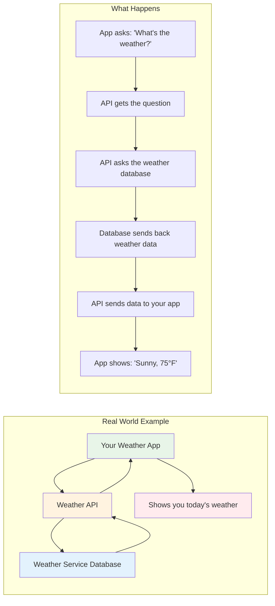
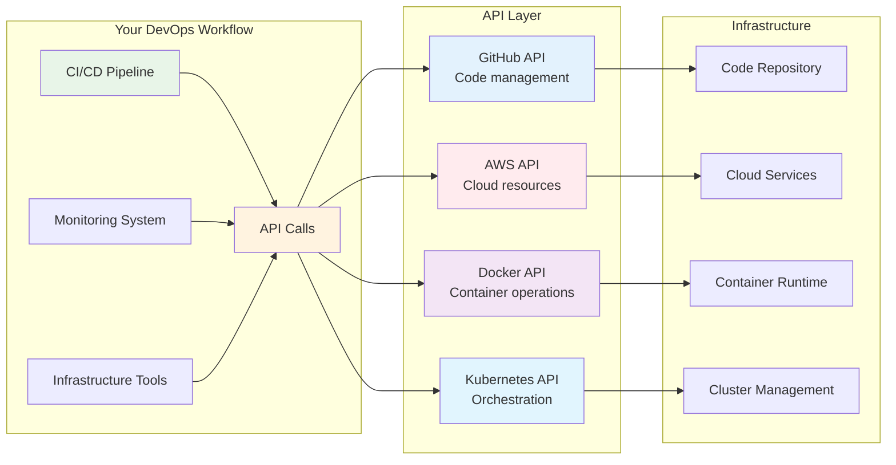
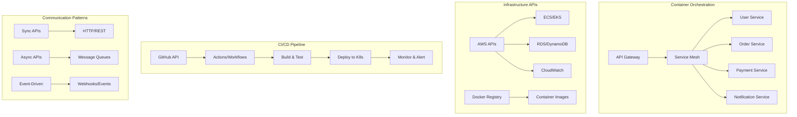
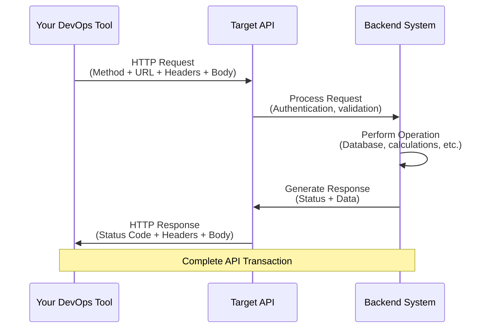

# 🌟 API Fundamentals for DevOps Engineers

## 📖 What This File Covers
Complete introduction to APIs (Application Programming Interfaces) from a DevOps perspective. Learn what APIs are, how they enable modern DevOps workflows, and master the fundamental concepts you'll need throughout your DevOps career.

## 🎯 Learning Objectives
- Understand what APIs are and why they're essential for DevOps
- Learn HTTP fundamentals and how web communication works
- Master REST principles and JSON data format
- See real-world examples of APIs in DevOps workflows
- Practice making API calls with practical tools

## 📋 Prerequisites
- Basic understanding of web applications
- Familiarity with command line/terminal
- Understanding of client-server architecture

---

## 🔍 **What is an API? (New Developer Perspective)**

### **🌟 API Definition for Beginners**

> **📝 Quick Context for New Developers:**  
> Imagine you're at a restaurant. You don't walk into the kitchen and start cooking - instead, you tell the waiter what you want, and they bring it to you. An API (Application Programming Interface) is like that waiter, but for computer programs. It's a way for one program to ask another program to do something, without needing to know how that other program works internally.

**API = Application Programming Interface**

Think of APIs as **digital messengers** that let different software applications talk to each other:



### **🎯 Why APIs Matter for New Developers**

| Communication Type | Without APIs | With APIs | Benefit |
|-------------------|--------------|-----------|---------|
| **External Services** | **Build everything yourself** | **Use existing services** | Save months of work |
| **Frontend ↔ Backend** | **Tightly coupled monolith** | **Separate concerns cleanly** | Independent development teams |
| **Microservices** | **Single massive application** | **Distributed, scalable services** | Better fault isolation & scaling |
| **Database Access** | **Direct database connections everywhere** | **Centralized data access layer** | Security, consistency, caching |
| **File System** | **Hard-coded file paths & formats** | **Standardized file operations** | Portability across environments |
| **Third-party Integration** | **Custom integration for each service** | **Standard HTTP/REST patterns** | Faster integration, less maintenance |
| **Mobile/Web Apps** | **Separate backends for each platform** | **Single API serves all clients** | Code reuse, consistent data |
| **Team Collaboration** | **Shared codebase dependencies** | **Contract-based development** | Teams work independently |
| **Testing** | **Test entire system together** | **Mock APIs for isolated testing** | Faster, more reliable tests |
| **Deployment** | **Deploy everything together** | **Deploy services independently** | Faster releases, less risk |

**Real Examples You Use Every Day:**
- **Google Maps** in Uber app - Uber uses Google's map API
- **Login with Google** - Apps use Google's authentication API  
- **Weather widgets** - Use weather service APIs
- **Payment processing** - Apps use Stripe or PayPal APIs
- **Social media sharing** - Use Twitter, Facebook APIs

### **🔧 Code Examples: Making Your First API Call**

> **📝 Quick Context:**  
> Let's see how simple it is to make an API call! We'll get weather data from a free weather API. Don't worry about understanding every detail - focus on seeing how easy it is to ask another service for information.

#### **🐍 Python Example (Beginner-Friendly)**

```python
import requests

# Making an API call to get weather information
def get_weather(city_name):
    """
    get_weather is a FUNCTION that takes city_name as input
    - city_name (in parentheses) is a PARAMETER - the data we need to complete our task
    - Think: "Hey function, get weather for THIS SPECIFIC CITY"
    - The city_name gets passed to the API to tell it which city's weather we want
    """
    
    # This is the API ENDPOINT - the "mailing address" where we send our request
    # ENDPOINT = specific URL location where an API service accepts requests
    # Like how your house has an address, this API service has a web address
    api_url = f"https://api.openweathermap.org/data/2.5/weather"
    #         ↑ domain (company)              ↑ specific service path (department)
    
    # These are QUERY PARAMETERS - additional details we send with our request
    # Think of parameters like filling out a form with specific information
    params = {
        'q': city_name,           # 'q' = "query" - sends our city_name to the API
                                 # If city_name="New York", API receives q="New York"
        'appid': 'your_api_key',  # Authentication - proves we're allowed to use this API
        'units': 'imperial'       # Tells API to return temperature in Fahrenheit (not Celsius)
    }
    
    try:
        # Make the API REQUEST - send our question to the API endpoint
        # requests.get() = "Hey API at this URL, here's my question with these parameters"
        # Like putting a letter in mailbox - we send it and wait for response
        response = requests.get(api_url, params=params)
        #                      ↑ WHERE to send    ↑ WHAT data to send
        
        # Check HTTP STATUS CODE - did our request succeed?
        # 200 = success (like getting "message delivered" confirmation)
        if response.status_code == 200:
            # Parse the JSON RESPONSE - extract the answer from API's reply
            # JSON = structured format that APIs use to send data back
            weather_data = response.json()
            
            # Extract specific information from the structured response
            # API sends lots of data - we pick out just what we need
            temperature = weather_data['main']['temp']              # Get temperature value
            description = weather_data['weather'][0]['description'] # Get weather description
            
            # Return formatted answer using the original city_name parameter
            return f"Weather in {city_name}: {temperature}°F, {description}"
        else:
            # If status code isn't 200, something went wrong with the API call
            return f"Error: Could not get weather data (Status: {response.status_code})"
            
    except Exception as error:
        # Handle any network problems or other errors
        return f"Error: {error}"

# Using our function - this is where we CALL the function with actual data
print(get_weather("New York"))  # "New York" becomes the city_name parameter
#                  ↑ This string gets passed to function and used in API call
# Output: Weather in New York: 72°F, clear sky

"""
ENDPOINT CONTEXT: This weather API endpoint is just one type of communication!
- Microservices: endpoints like http://user-service:3000/api/users
- Cloud APIs: endpoints like https://api.aws.amazon.com/ec2  
- Database APIs: endpoints like http://db-proxy:5432/api/query
- Container APIs: endpoints like http://redis:6379/api/cache
Each endpoint serves a specific purpose and accepts specific requests!
"""
```

#### **🟨 JavaScript Example (Browser/Node.js)**

```javascript
// Making an API call to get weather information
async function getWeather(cityName) {
    """
    getWeather is an ASYNC FUNCTION that takes cityName as input
    - cityName (in parentheses) is a PARAMETER - the data we need
    - async = function can wait for API responses without blocking other code
    - The cityName gets sent to the API to specify which city's weather we want
    """
    
    // This is the API ENDPOINT - the "web address" where we send our request  
    // ENDPOINT = specific URL location where an API service accepts requests
    const apiUrl = 'https://api.openweathermap.org/data/2.5/weather';
    //            ↑ domain (company)                ↑ service path (department)
    
    // URLSearchParams creates QUERY PARAMETERS - extra info for our request
    // Like filling out a web form with specific details
    const params = new URLSearchParams({
        q: cityName,              // 'q' = "query" - sends our cityName to the API
                                 // If cityName="Paris", API receives q="Paris"
        appid: 'your_api_key',    // Authentication key - proves we can use this API
        units: 'imperial'         // Format preference - return Fahrenheit not Celsius
    });
    
    try {
        // Make the API REQUEST using fetch - send our question to the API endpoint
        // fetch() = browser's built-in way to make HTTP requests  
        // await = wait for response before continuing (since API calls take time)
        const response = await fetch(`${apiUrl}?${params}`);
        //                           ↑ base URL  ↑ parameters added as query string
        
        // Check if HTTP REQUEST was successful
        // response.ok = true if status code is 200-299 (success range)
        if (response.ok) {
            // Parse JSON RESPONSE - convert API's answer to JavaScript object
            // await response.json() = wait for data conversion to complete
            const weatherData = await response.json();
            
            // Extract specific data from the structured response
            // API returns lots of info - we pick out just what we need
            const temperature = weatherData.main.temp;              // Get temperature value
            const description = weatherData.weather[0].description; // Get weather description
            
            // Return formatted result using original cityName parameter
            return `Weather in ${cityName}: ${temperature}°F, ${description}`;
        } else {
            // If response.ok is false, something went wrong with the API call
            return `Error: Could not get weather data (Status: ${response.status})`;
        }
        
    } catch (error) {
        // Handle network errors or other problems
        return `Error: ${error.message}`;
    }
}

// Using our function - this calls the function with actual data
getWeather("New York").then(result => {  // "New York" becomes the cityName parameter
//        ↑ This string gets passed to function and used in API call
    console.log(result);
    // Output: Weather in New York: 72°F, clear sky
});

// Alternative usage in an HTML page:
// <button onclick="getWeather('Paris').then(result => alert(result))">
//   Get Paris Weather  
// </button>

/*
ENDPOINT CONTEXT: This weather API endpoint demonstrates basic communication!
- In microservices: endpoints like http://user-service:3000/api/users/{userId}
- In cloud platforms: endpoints like https://api.github.com/repos/{owner}/{repo}
- In database services: endpoints like http://api-gateway:8080/api/data/{table}
- In container orchestration: endpoints like http://k8s-api:6443/api/v1/pods
Each endpoint has a specific address and accepts specific types of data!
*/
```

#### **🎯 What's Happening in These Examples:**

1. **URL (Endpoint)** - Where we send our request (`api.openweathermap.org`)
2. **Parameters** - Information we include with our request (city name, API key)
3. **HTTP Request** - We "ask" the API for information
4. **Response** - The API "answers" with weather data
5. **Parse Data** - We extract the specific information we want
6. **Handle Errors** - We check if something went wrong

> **💡 Key Insight for New Developers:**  
> Notice how we didn't build a weather station or create a meteorology database! We just asked an existing service for information. This is the power of APIs - you can build amazing applications by combining different services, rather than building everything from scratch.

### **🔗 Communication Examples: How APIs Connect Different Systems**

> **📝 Quick Context:**  
> APIs aren't just for web services - they're how different parts of your application talk to each other. Let's see how APIs enable communication between files, databases, and different components of your application.

#### **📁 File System Communication**

```python
# Python: API-like communication with files and databases
import json
import sqlite3
import requests

class BlogAPI:
    def __init__(self, db_path="blog.db"):
        """
        __init__ is the CONSTRUCTOR - runs when we create a BlogAPI object
        - db_path (parameter) = file path where our database will be stored
        - self.db_path = save the path so other methods can use it
        - Like setting up our "API service" with a specific database location
        """
        self.db_path = db_path          # Store database path for later use
        self.init_database()            # Set up the database structure
    
    def init_database(self):
        """
        Set up database structure (like configuring an API endpoint)
        - Creates a "posts" table if it doesn't exist yet
        - Similar to how APIs define what data they can accept/return
        """
        # CONNECT to database file (create if doesn't exist)
        # sqlite3.connect() = establish communication with database file
        conn = sqlite3.connect(self.db_path)
        #                      ↑ self.db_path from constructor
        
        # EXECUTE SQL command to create table structure
        # This defines the "interface" - what fields our posts can have
        conn.execute('''
            CREATE TABLE IF NOT EXISTS posts (
                id INTEGER PRIMARY KEY,        -- Unique identifier (like API endpoint ID)
                title TEXT NOT NULL,          -- Post title (required field)
                content TEXT NOT NULL,        -- Post content (required field)
                created_at TIMESTAMP DEFAULT CURRENT_TIMESTAMP  -- Auto-timestamp
            )
        ''')
        
        conn.commit()   # SAVE the changes to database file
        conn.close()    # CLOSE the connection (like ending an API call)
    
    def save_post_to_file(self, post_data):
        """
        File communication: Save post to JSON file (like calling a File Storage API)
        - post_data (parameter) = dictionary containing post information to save
        - Creates a JSON file with the post data for backup/archival
        - Similar to calling POST /api/files/{filename} endpoint
        """
        # CREATE filename using post ID (like generating an API endpoint URL)
        # f-string interpolation: takes post_data['id'] and puts it in filename
        filename = f"posts/post_{post_data['id']}.json"
        #           ↑ directory  ↑ use post ID    ↑ file extension
        
        # OPEN file for writing (create if doesn't exist)
        # 'w' = write mode, like sending a PUT request to create/replace file
        with open(filename, 'w') as file:
            # CONVERT Python dictionary to JSON format and write to file
            # json.dump() = serialize data to JSON (like API response formatting)
            # indent=2 = make JSON readable with proper spacing
            json.dump(post_data, file, indent=2)
            #         ↑ data    ↑ destination  ↑ formatting
        
        print(f"📄 Post saved to file: {filename}")  # Log success (like API status)
        return filename  # Return the filename (like API returning resource URL)
    
    def save_post_to_database(self, title, content):
        """
        Database communication: Save post to SQLite (like calling Database API)
        - title, content (parameters) = the data we want to store
        - Inserts new record into posts table
        - Similar to calling POST /api/database/posts endpoint
        """
        # CONNECT to database (establish communication channel)
        # Like opening a connection to a database API endpoint
        conn = sqlite3.connect(self.db_path)
        cursor = conn.cursor()  # Get cursor for executing commands
        
        # EXECUTE SQL INSERT command (like sending POST request with data)
        # ? = placeholder for parameters (prevents SQL injection attacks)
        # This is parameterized query - safer than string concatenation
        cursor.execute(
            "INSERT INTO posts (title, content) VALUES (?, ?)",
            #                                         ↑ ↑ placeholders
            (title, content)  # Actual values to insert
            #  ↑        ↑ these replace the ? placeholders
        )
        
        # GET the ID of the newly created record (like API returning resource ID)
        post_id = cursor.lastrowid  # Auto-generated ID from database
        
        conn.commit()   # SAVE changes to database (like confirming API transaction)
        conn.close()    # CLOSE connection (like ending API session)
        
        print(f"💾 Post saved to database with ID: {post_id}")  # Log success
        return post_id  # Return the new post ID (like API returning created resource)
    
    def get_external_content(self, topic):
        """
        External API communication: Get content from external service
        - topic (parameter) = what subject we want articles about
        - Makes HTTP GET request to external content API
        - Same pattern as our weather API but for articles instead
        """
        try:
            # CALL external content API (real HTTP request to another service)
            # This is the same pattern as our weather API example
            response = requests.get(
                f"https://api.content-service.com/articles",  # API endpoint URL
                #  ↑ external service (not our server)         ↑ specific resource path
                params={'topic': topic, 'limit': 1}  # Query parameters
                #       ↑ search term   ↑ max results
            )
            
            # CHECK if external API request succeeded (same as weather API)
            if response.status_code == 200:
                # PARSE JSON response from external service
                content_data = response.json()  # Convert JSON to Python dict
                
                # EXTRACT first article if any exist, otherwise return None
                # Safe navigation - checks if articles array has content
                return content_data['articles'][0] if content_data['articles'] else None
                #      ↑ get first article    ↑ check if array has items
            
        except Exception as e:
            # HANDLE any network errors or API failures
            print(f"❌ External API error: {e}")  # Log the error for debugging
            return None  # Return None to indicate failure
    
    def create_complete_post(self, title, topic):
        """Orchestrate multiple communications"""
        print(f"🚀 Creating post: {title}")
        
        # 1. Get content from external API
        external_content = self.get_external_content(topic)
        
        # 2. Combine with our content
        if external_content:
            full_content = f"Our take: {title}\n\nExternal insight: {external_content['summary']}"
        else:
            full_content = f"Our original content about {title}"
        
        # 3. Save to database
        post_id = self.save_post_to_database(title, full_content)
        
        # 4. Create backup file
        post_data = {
            'id': post_id,
            'title': title,
            'content': full_content,
            'source': 'mixed' if external_content else 'original'
        }
        
        self.save_post_to_file(post_data)
        
        return post_data

# Usage example
blog = BlogAPI()
post = blog.create_complete_post("Python APIs", "python programming")
print(f"✅ Created post: {post['title']}")
```

#### **🌐 Web Application Communication**

```javascript
// JavaScript: Different types of communication in a web app
class WebAppCommunication {
    constructor() {
        this.apiBaseUrl = 'https://api.myapp.com';
        this.cache = new Map(); // In-memory cache
    }
    
    // Browser ↔ Local Storage Communication
    saveToLocalStorage(key, data) {
        console.log(`💾 Saving to browser storage: ${key}`);
        
        try {
            localStorage.setItem(key, JSON.stringify(data));
            return true;
        } catch (error) {
            console.error('❌ Local storage error:', error);
            return false;
        }
    }
    
    getFromLocalStorage(key) {
        console.log(`📖 Reading from browser storage: ${key}`);
        
        try {
            const data = localStorage.getItem(key);
            return data ? JSON.parse(data) : null;
        } catch (error) {
            console.error('❌ Local storage read error:', error);
            return null;
        }
    }
    
    // App ↔ Backend API Communication
    async communicateWithBackend(endpoint, data = null) {
        console.log(`🌐 API call to backend: ${endpoint}`);
        
        const options = {
            method: data ? 'POST' : 'GET',
            headers: {
                'Content-Type': 'application/json',
                'Authorization': `Bearer ${this.getAuthToken()}`
            }
        };
        
        if (data) {
            options.body = JSON.stringify(data);
        }
        
        try {
            const response = await fetch(`${this.apiBaseUrl}${endpoint}`, options);
            
            if (response.ok) {
                const result = await response.json();
                console.log(`✅ Backend response received`);
                return result;
            } else {
                throw new Error(`Backend error: ${response.status}`);
            }
            
        } catch (error) {
            console.error('❌ Backend communication failed:', error);
            throw error;
        }
    }
    
    // App ↔ Third-party Service Communication
    async communicateWithThirdParty(serviceName, data) {
        console.log(`🔗 Third-party API call: ${serviceName}`);
        
        const serviceConfigs = {
            'payment': {
                url: 'https://api.stripe.com/v1/charges',
                headers: {'Authorization': `Bearer ${process.env.STRIPE_KEY}`}
            },
            'email': {
                url: 'https://api.sendgrid.com/v3/mail/send',
                headers: {'Authorization': `Bearer ${process.env.SENDGRID_KEY}`}
            },
            'analytics': {
                url: 'https://api.analytics.com/v1/events',
                headers: {'X-API-Key': process.env.ANALYTICS_KEY}
            }
        };
        
        const config = serviceConfigs[serviceName];
        if (!config) {
            throw new Error(`Unknown service: ${serviceName}`);
        }
        
        try {
            const response = await fetch(config.url, {
                method: 'POST',
                headers: {
                    'Content-Type': 'application/json',
                    ...config.headers
                },
                body: JSON.stringify(data)
            });
            
            if (response.ok) {
                console.log(`✅ ${serviceName} service responded successfully`);
                return await response.json();
            } else {
                throw new Error(`${serviceName} service error: ${response.status}`);
            }
            
        } catch (error) {
            console.error(`❌ ${serviceName} communication failed:`, error);
            throw error;
        }
    }
    
    // Component ↔ Component Communication (within app)
    async processUserCheckout(orderData) {
        console.log("🛒 Starting checkout process...");
        
        try {
            // 1. Save order to local storage (backup)
            this.saveToLocalStorage('pending_order', orderData);
            
            // 2. Validate with backend
            const validation = await this.communicateWithBackend('/validate-order', orderData);
            
            if (!validation.valid) {
                throw new Error('Order validation failed');
            }
            
            // 3. Process payment via third-party
            const paymentResult = await this.communicateWithThirdParty('payment', {
                amount: orderData.total,
                currency: 'usd',
                source: orderData.paymentMethod
            });
            
            // 4. Send confirmation email
            await this.communicateWithThirdParty('email', {
                to: orderData.customerEmail,
                subject: 'Order Confirmation',
                html: `<h1>Thank you for your order!</h1><p>Order ID: ${paymentResult.id}</p>`
            });
            
            // 5. Track analytics event
            await this.communicateWithThirdParty('analytics', {
                event: 'purchase_completed',
                user_id: orderData.customerId,
                value: orderData.total
            });
            
            // 6. Save final order to backend
            const finalOrder = await this.communicateWithBackend('/orders', {
                ...orderData,
                paymentId: paymentResult.id,
                status: 'completed'
            });
            
            // 7. Clear temporary storage
            localStorage.removeItem('pending_order');
            
            console.log("✅ Checkout completed successfully!");
            return finalOrder;
            
        } catch (error) {
            console.error("❌ Checkout failed:", error);
            
            // Restore from local storage if needed
            const pendingOrder = this.getFromLocalStorage('pending_order');
            if (pendingOrder) {
                console.log("🔄 Pending order found in local storage");
            }
            
            throw error;
        }
    }
    
    getAuthToken() {
        return this.getFromLocalStorage('auth_token') || 'demo_token';
    }
}

// Usage example
const app = new WebAppCommunication();

// Example checkout process
const orderData = {
    customerId: 'user123',
    customerEmail: 'user@example.com',
    items: [
        { id: 'item1', name: 'API Book', price: 29.99 }
    ],
    total: 29.99,
    paymentMethod: 'card_token_123'
};

app.processUserCheckout(orderData)
    .then(result => console.log('Order completed:', result))
    .catch(error => console.error('Order failed:', error));
```

#### **🎯 Communication Flow Examples:**

| Communication Type | Example | When It Happens |
|-------------------|---------|-----------------|
| **App → File** | Save user preferences to JSON | User changes settings |
| **App → Database** | Store user registration | User creates account |
| **App → External API** | Get weather data | User opens weather widget |
| **App → Local Storage** | Save shopping cart | User adds items to cart |
| **Service → Service** | Payment processing | User completes purchase |
| **Component → Component** | Update UI state | User interaction triggers change |

> **🔍 What You're Learning:**  
> These examples show that APIs aren't just about calling external websites. They're about **any communication between different parts of a system**. Your app might talk to files, databases, other services, and even different parts of itself - all using API-like patterns.

---

## 🔍 **What is an API? (DevOps Perspective)**

### **🎯 API Definition for DevOps Engineers**

> **📝 Quick Context for DevOps:**  
> Now that you understand APIs as digital messengers, think bigger. In DevOps, APIs aren't just for getting weather data - they're the **remote controls** for your entire infrastructure. Want to create a server? API call. Deploy code? API call. Scale your application? API call. APIs turn manual clicking into automated workflows.

**API = Application Programming Interface**

In DevOps, APIs are **the nervous system** of your infrastructure:



### **🚀 Why APIs are Crucial for DevOps**

| DevOps Activity | API Usage | Real Example |
|-----------------|-----------|--------------|
| **Code Deployment** | CI/CD triggers deployments via APIs | GitHub Actions calls AWS ECS API |
| **Infrastructure Management** | Create/modify cloud resources | Terraform calls Azure Resource Manager API |
| **Monitoring** | Collect metrics and send alerts | Prometheus scrapes metrics via HTTP APIs |
| **Container Management** | Start/stop containers and services | kubectl communicates with Kubernetes API |
| **Security Scanning** | Automated vulnerability checks | CI pipeline calls security scanning API |

### **🛠️ DevOps Code Examples: Infrastructure Automation**

> **📝 Quick Context for DevOps:**  
> Now let's see APIs in action for DevOps tasks! These examples show how to automate infrastructure management, deployments, and monitoring using APIs. This is what separates manual system administration from modern DevOps automation.

#### **🐍 Python Example: AWS Infrastructure Management**

```python
import boto3
import requests
import time

class DevOpsAutomation:
    def __init__(self, aws_region='us-west-2'):
        # Initialize AWS clients (these use AWS APIs under the hood)
        self.ec2 = boto3.client('ec2', region_name=aws_region)
        self.ecs = boto3.client('ecs', region_name=aws_region)
        self.cloudwatch = boto3.client('cloudwatch', region_name=aws_region)
    
    def create_and_deploy_service(self, service_name, image_tag):
        """Complete DevOps workflow: infrastructure + deployment + monitoring"""
        
        print(f"🚀 Starting deployment for {service_name}:{image_tag}")
        
        # 1. Create infrastructure via AWS APIs
        vpc_id = self.create_vpc_if_needed()
        cluster_arn = self.ensure_ecs_cluster_exists('production-cluster')
        
        # 2. Deploy application via ECS API
        deployment_result = self.deploy_to_ecs(
            cluster_arn, service_name, image_tag
        )
        
        # 3. Set up monitoring via CloudWatch API
        self.setup_monitoring(service_name)
        
        # 4. Send notification via Slack API
        self.send_slack_notification(
            f"✅ Deployment successful: {service_name}:{image_tag}"
        )
        
        return deployment_result
    
    def deploy_to_ecs(self, cluster_name, service_name, image_tag):
        """Deploy service using AWS ECS API"""
        
        # Define task definition
        task_definition = {
            'family': service_name,
            'networkMode': 'awsvpc',
            'requiresCompatibilities': ['FARGATE'],
            'cpu': '512',
            'memory': '1024',
            'containerDefinitions': [
                {
                    'name': service_name,
                    'image': f'your-registry.com/{service_name}:{image_tag}',
                    'portMappings': [
                        {
                            'containerPort': 3000,
                            'protocol': 'tcp'
                        }
                    ],
                    'healthCheck': {
                        'command': [
                            'CMD-SHELL',
                            'curl -f http://localhost:3000/health || exit 1'
                        ],
                        'interval': 30,
                        'timeout': 5,
                        'retries': 3
                    }
                }
            ]
        }
        
        # Register task definition via API
        response = self.ecs.register_task_definition(**task_definition)
        task_def_arn = response['taskDefinition']['taskDefinitionArn']
        
        # Update or create service via API
        try:
            # Try to update existing service
            self.ecs.update_service(
                cluster=cluster_name,
                service=service_name,
                taskDefinition=task_def_arn,
                forceNewDeployment=True
            )
            print(f"📦 Updated existing service: {service_name}")
            
        except self.ecs.exceptions.ServiceNotFoundException:
            # Create new service if it doesn't exist
            self.ecs.create_service(
                cluster=cluster_name,
                serviceName=service_name,
                taskDefinition=task_def_arn,
                desiredCount=2,
                launchType='FARGATE',
                networkConfiguration={
                    'awsvpcConfiguration': {
                        'subnets': ['subnet-12345', 'subnet-67890'],
                        'securityGroups': ['sg-security'],
                        'assignPublicIp': 'ENABLED'
                    }
                }
            )
            print(f"🆕 Created new service: {service_name}")
        
        # Wait for deployment to complete
        self.wait_for_deployment(cluster_name, service_name)
        
        return {'status': 'success', 'service': service_name}
    
    def setup_monitoring(self, service_name):
        """Set up CloudWatch alarms via API"""
        
        # Create CPU utilization alarm
        self.cloudwatch.put_metric_alarm(
            AlarmName=f'{service_name}-high-cpu',
            ComparisonOperator='GreaterThanThreshold',
            EvaluationPeriods=2,
            MetricName='CPUUtilization',
            Namespace='AWS/ECS',
            Period=300,
            Statistic='Average',
            Threshold=80.0,
            ActionsEnabled=True,
            AlarmActions=[
                'arn:aws:sns:us-west-2:123456789:devops-alerts'
            ],
            AlarmDescription=f'High CPU usage for {service_name}',
            Dimensions=[
                {
                    'Name': 'ServiceName',
                    'Value': service_name
                }
            ]
        )
        
        print(f"📊 Monitoring setup complete for {service_name}")
    
    def send_slack_notification(self, message):
        """Send notification via Slack API"""
        webhook_url = "https://hooks.slack.com/services/YOUR/SLACK/WEBHOOK"
        
        payload = {
            "text": message,
            "channel": "#devops-alerts",
            "username": "DevOps Bot",
            "icon_emoji": ":robot_face:"
        }
        
        requests.post(webhook_url, json=payload)

# Usage example
devops = DevOpsAutomation()
result = devops.create_and_deploy_service('user-api', 'v2.1.3')
print(f"Deployment result: {result}")
```

#### **🟨 JavaScript Example: CI/CD Pipeline Automation**

```javascript
// DevOps automation using Node.js and various APIs
const axios = require('axios');
const { Octokit } = require('@octokit/rest');

class DevOpsPipeline {
    constructor(config) {
        this.github = new Octokit({ auth: config.githubToken });
        this.deploymentApi = config.deploymentApiUrl;
        this.slackWebhook = config.slackWebhook;
        this.dockerRegistry = config.dockerRegistry;
    }
    
    async executePipeline(repoOwner, repoName, branch = 'main') {
        console.log(`🚀 Starting CI/CD pipeline for ${repoOwner}/${repoName}:${branch}`);
        
        try {
            // 1. Get latest commit via GitHub API
            const commitInfo = await this.getLatestCommit(repoOwner, repoName, branch);
            
            // 2. Trigger build via deployment API
            const buildResult = await this.triggerBuild(commitInfo);
            
            // 3. Wait for build completion
            await this.waitForBuild(buildResult.buildId);
            
            // 4. Deploy to staging
            const stagingDeployment = await this.deployToEnvironment(
                buildResult.imageTag, 'staging'
            );
            
            // 5. Run health checks
            await this.runHealthChecks(stagingDeployment.serviceUrl);
            
            // 6. Update GitHub status
            await this.updateGitHubStatus(
                repoOwner, repoName, commitInfo.sha, 'success'
            );
            
            // 7. Send notification
            await this.sendNotification(
                `✅ Pipeline successful for ${repoOwner}/${repoName}:${branch}`,
                'good'
            );
            
            return { status: 'success', deployment: stagingDeployment };
            
        } catch (error) {
            console.error('Pipeline failed:', error.message);
            
            // Send failure notification
            await this.sendNotification(
                `❌ Pipeline failed for ${repoOwner}/${repoName}:${branch}\nError: ${error.message}`,
                'danger'
            );
            
            throw error;
        }
    }
    
    async getLatestCommit(owner, repo, branch) {
        """Get latest commit info via GitHub API"""
        const response = await this.github.repos.getBranch({
            owner,
            repo,
            branch
        });
        
        return {
            sha: response.data.commit.sha,
            message: response.data.commit.commit.message,
            author: response.data.commit.commit.author.name,
            timestamp: response.data.commit.commit.author.date
        };
    }
    
    async triggerBuild(commitInfo) {
        """Trigger build via deployment API"""
        const buildRequest = {
            commitSha: commitInfo.sha,
            commitMessage: commitInfo.message,
            author: commitInfo.author,
            timestamp: commitInfo.timestamp,
            buildType: 'docker'
        };
        
        const response = await axios.post(
            `${this.deploymentApi}/api/v1/builds`,
            buildRequest,
            {
                headers: {
                    'Authorization': `Bearer ${process.env.DEPLOYMENT_API_TOKEN}`,
                    'Content-Type': 'application/json'
                }
            }
        );
        
        return response.data;
    }
    
    async deployToEnvironment(imageTag, environment) {
        """Deploy to specific environment via API"""
        const deploymentRequest = {
            serviceName: 'user-api',
            imageTag: imageTag,
            environment: environment,
            replicas: environment === 'production' ? 5 : 2,
            strategy: environment === 'production' ? 'blue-green' : 'rolling'
        };
        
        const response = await axios.post(
            `${this.deploymentApi}/api/v1/deployments`,
            deploymentRequest,
            {
                headers: {
                    'Authorization': `Bearer ${process.env.DEPLOYMENT_API_TOKEN}`,
                    'Content-Type': 'application/json'
                }
            }
        );
        
        return response.data.deployment;
    }
    
    async runHealthChecks(serviceUrl) {
        """Run health checks with retry logic"""
        const maxAttempts = 30;
        const delay = 10000; // 10 seconds
        
        for (let attempt = 1; attempt <= maxAttempts; attempt++) {
            try {
                const response = await axios.get(`${serviceUrl}/api/v1/health`, {
                    timeout: 5000
                });
                
                if (response.status === 200 && response.data.status === 'healthy') {
                    console.log(`✅ Health check passed on attempt ${attempt}`);
                    return true;
                }
            } catch (error) {
                console.log(`❌ Health check failed on attempt ${attempt}/${maxAttempts}`);
            }
            
            if (attempt < maxAttempts) {
                await new Promise(resolve => setTimeout(resolve, delay));
            }
        }
        
        throw new Error('Health checks failed after maximum attempts');
    }
    
    async updateGitHubStatus(owner, repo, sha, state) {
        """Update GitHub commit status via API"""
        await this.github.repos.createCommitStatus({
            owner,
            repo,
            sha,
            state, // 'pending', 'success', 'error', 'failure'
            target_url: `${this.deploymentApi}/deployments/latest`,
            description: `Deployment ${state}`,
            context: 'ci/devops-pipeline'
        });
    }
    
    async sendNotification(message, color = 'good') {
        """Send Slack notification via webhook API"""
        const payload = {
            attachments: [{
                color: color,
                text: message,
                fields: [
                    {
                        title: 'Environment',
                        value: process.env.NODE_ENV || 'development',
                        short: true
                    },
                    {
                        title: 'Timestamp',
                        value: new Date().toISOString(),
                        short: true
                    }
                ]
            }]
        };
        
        await axios.post(this.slackWebhook, payload);
    }
}

// Usage example
const pipeline = new DevOpsPipeline({
    githubToken: process.env.GITHUB_TOKEN,
    deploymentApiUrl: process.env.DEPLOYMENT_API_URL,
    slackWebhook: process.env.SLACK_WEBHOOK_URL,
    dockerRegistry: 'your-registry.com'
});

// Execute pipeline
pipeline.executePipeline('your-org', 'your-repo', 'main')
    .then(result => {
        console.log('Pipeline completed successfully:', result);
    })
    .catch(error => {
        console.error('Pipeline failed:', error);
        process.exit(1);
    });
```

#### **🎯 What's Happening in These DevOps Examples:**

**Python AWS Example:**
1. **Infrastructure APIs** - Create VPC, ECS clusters automatically
2. **Deployment APIs** - Register task definitions, update services
3. **Monitoring APIs** - Set up CloudWatch alarms and dashboards
4. **Notification APIs** - Send Slack messages about deployment status

**JavaScript CI/CD Example:**
1. **GitHub API** - Get commit information, update status checks
2. **Build APIs** - Trigger Docker image builds
3. **Deployment APIs** - Deploy to different environments
4. **Health Check APIs** - Verify service health after deployment
5. **Notification APIs** - Send pipeline status to Slack

> **💡 Key Insight for DevOps Engineers:**  
> These examples show how APIs transform manual DevOps tasks into automated workflows. Instead of logging into servers and running commands manually, you orchestrate entire infrastructure operations through API calls. This is what enables "Infrastructure as Code" and "Everything as Code" philosophies in modern DevOps.

### **🐳 Container and Microservices Communication Examples**

> **📝 DevOps Context:**  
> In production environments, APIs enable communication between containers, microservices, databases, and infrastructure components. These examples show real-world DevOps communication patterns you'll encounter when managing containerized applications and distributed systems.

#### **🔄 Container-to-Container Communication**

```python
# Python: Microservices communication in a containerized environment
import requests
import os
import logging
from datetime import datetime
import asyncio
import aiohttp
import json

class MicroserviceOrchestrator:
    """
    Handles communication between different microservices running in containers
    Common pattern: API Gateway → Service Mesh → Individual Services
    """
    
    def __init__(self):
        # Service discovery - containers register their endpoints
        self.services = {
            'user-service': os.getenv('USER_SERVICE_URL', 'http://user-service:3000'),
            'order-service': os.getenv('ORDER_SERVICE_URL', 'http://order-service:3001'),  
            'inventory-service': os.getenv('INVENTORY_SERVICE_URL', 'http://inventory-service:3002'),
            'payment-service': os.getenv('PAYMENT_SERVICE_URL', 'http://payment-service:3003'),
            'notification-service': os.getenv('NOTIFICATION_SERVICE_URL', 'http://notification-service:3004'),
            'database-proxy': os.getenv('DB_PROXY_URL', 'http://db-proxy:5432'),
            'redis-cache': os.getenv('REDIS_URL', 'http://redis:6379'),
            'nginx-proxy': os.getenv('NGINX_URL', 'http://nginx:80')
        }
        
        self.timeout = 5  # 5 second timeout for inter-service calls
        self.retry_count = 3
        
        logging.basicConfig(level=logging.INFO)
        self.logger = logging.getLogger(__name__)
    
    async def check_service_health(self, service_name):
        """Health check communication - containers checking each other"""
        service_url = self.services.get(service_name)
        if not service_url:
            return False
            
        try:
            async with aiohttp.ClientSession(timeout=aiohttp.ClientTimeout(total=2)) as session:
                async with session.get(f"{service_url}/health") as response:
                    if response.status == 200:
                        health_data = await response.json()
                        self.logger.info(f"✅ {service_name} is healthy: {health_data}")
                        return True
                    else:
                        self.logger.warning(f"⚠️ {service_name} health check failed: {response.status}")
                        return False
                        
        except Exception as e:
            self.logger.error(f"❌ {service_name} health check error: {e}")
            return False
    
    async def database_communication(self, query_type, data):
        """Database communication through proxy container"""
        db_proxy_url = self.services['database-proxy']
        
        try:
            async with aiohttp.ClientSession() as session:
                async with session.post(
                    f"{db_proxy_url}/api/v1/query",
                    json={
                        'type': query_type,
                        'data': data,
                        'timestamp': datetime.now().isoformat(),
                        'source_service': 'orchestrator'
                    },
                    headers={'Content-Type': 'application/json'}
                ) as response:
                    
                    if response.status == 200:
                        result = await response.json()
                        self.logger.info(f"💾 Database {query_type} successful")
                        return result
                    else:
                        error_text = await response.text()
                        raise Exception(f"Database error: {response.status} - {error_text}")
                        
        except Exception as e:
            self.logger.error(f"❌ Database communication failed: {e}")
            raise
    
    async def cache_communication(self, action, key, value=None):
        """Redis cache communication between containers"""
        cache_url = self.services['redis-cache']
        
        try:
            async with aiohttp.ClientSession() as session:
                if action == 'get':
                    async with session.get(f"{cache_url}/api/cache/{key}") as response:
                        if response.status == 200:
                            cache_data = await response.json()
                            self.logger.info(f"🗄️ Cache hit for key: {key}")
                            return cache_data['value']
                        elif response.status == 404:
                            self.logger.info(f"🗄️ Cache miss for key: {key}")
                            return None
                        else:
                            raise Exception(f"Cache error: {response.status}")
                
                elif action == 'set':
                    async with session.post(
                        f"{cache_url}/api/cache/{key}",
                        json={'value': value, 'ttl': 3600}  # 1 hour TTL
                    ) as response:
                        if response.status == 200:
                            self.logger.info(f"🗄️ Cache set for key: {key}")
                            return True
                        else:
                            raise Exception(f"Cache set error: {response.status}")
                            
        except Exception as e:
            self.logger.error(f"❌ Cache communication failed: {e}")
            return None
    
    async def process_distributed_order(self, order_data):
        """
        Orchestrate order processing across multiple microservices
        This demonstrates complex inter-container communication
        """
        order_id = order_data['order_id']
        self.logger.info(f"🚀 Processing distributed order: {order_id}")
        
        try:
            # 1. Check cache first (Container: Redis)
            cached_order = await self.cache_communication('get', f"order:{order_id}")
            if cached_order:
                self.logger.info("📦 Order found in cache")
                return cached_order
            
            # 2. Validate user (Container: User Service)
            async with aiohttp.ClientSession() as session:
                async with session.get(
                    f"{self.services['user-service']}/api/users/{order_data['user_id']}/validate"
                ) as response:
                    if response.status != 200:
                        raise Exception("User validation failed")
                    user_data = await response.json()
                    self.logger.info(f"👤 User validated: {user_data['user_id']}")
            
            # 3. Check inventory (Container: Inventory Service)  
            async with aiohttp.ClientSession() as session:
                async with session.post(
                    f"{self.services['inventory-service']}/api/inventory/check",
                    json={'items': order_data['items']}
                ) as response:
                    if response.status != 200:
                        raise Exception("Inventory check failed")
                    inventory_result = await response.json()
                    
                    if not inventory_result['available']:
                        raise Exception(f"Items not available: {inventory_result['missing_items']}")
                    
                    self.logger.info(f"📦 Inventory confirmed: {len(order_data['items'])} items")
            
            # 4. Process payment (Container: Payment Service)
            async with aiohttp.ClientSession() as session:
                async with session.post(
                    f"{self.services['payment-service']}/api/payments/process",
                    json={
                        'amount': order_data['total'],
                        'payment_method': order_data['payment_method'],
                        'order_id': order_id
                    }
                ) as response:
                    if response.status != 200:
                        raise Exception("Payment processing failed")
                    payment_result = await response.json()
                    self.logger.info(f"💳 Payment processed: {payment_result['transaction_id']}")
            
            # 5. Update inventory (Container: Inventory Service)
            async with aiohttp.ClientSession() as session:
                async with session.post(
                    f"{self.services['inventory-service']}/api/inventory/reserve",
                    json={'items': order_data['items'], 'order_id': order_id}
                ) as response:
                    if response.status != 200:
                        # Rollback payment if inventory fails
                        await self.rollback_payment(payment_result['transaction_id'])
                        raise Exception("Inventory reservation failed")
                    
                    self.logger.info("📦 Inventory reserved")
            
            # 6. Save order to database (Container: Database Proxy)
            final_order = {
                **order_data,
                'status': 'completed',
                'payment_id': payment_result['transaction_id'],
                'processed_at': datetime.now().isoformat()
            }
            
            await self.database_communication('insert', {
                'table': 'orders',
                'data': final_order
            })
            
            # 7. Send notifications (Container: Notification Service)
            async with aiohttp.ClientSession() as session:
                async with session.post(
                    f"{self.services['notification-service']}/api/notifications/send",
                    json={
                        'type': 'order_confirmation',
                        'user_id': order_data['user_id'],
                        'order_id': order_id,
                        'channels': ['email', 'sms']
                    }
                ) as response:
                    if response.status == 200:
                        self.logger.info("📧 Notification sent")
            
            # 8. Cache the completed order (Container: Redis)
            await self.cache_communication('set', f"order:{order_id}", final_order)
            
            self.logger.info(f"✅ Order {order_id} completed successfully")
            return final_order
            
        except Exception as e:
            self.logger.error(f"❌ Order processing failed: {e}")
            # Trigger rollback procedures
            await self.handle_order_failure(order_id, str(e))
            raise

# Usage in containerized environment
async def main():
    orchestrator = MicroserviceOrchestrator()
    
    # Health check all services
    services = ['user-service', 'order-service', 'inventory-service', 'payment-service']
    health_checks = [orchestrator.check_service_health(service) for service in services]
    health_results = await asyncio.gather(*health_checks)
    
    print(f"Service health: {dict(zip(services, health_results))}")
    
    # Process an order
    order = {
        'order_id': 'ord_123456',
        'user_id': 'usr_789',
        'items': [
            {'product_id': 'prod_001', 'quantity': 2},
            {'product_id': 'prod_002', 'quantity': 1}
        ],
        'total': 159.99,
        'payment_method': 'credit_card'
    }
    
    try:
        result = await orchestrator.process_distributed_order(order)
        print(f"✅ Order processed: {result['order_id']}")
    except Exception as e:
        print(f"❌ Order failed: {e}")

# Run the example
if __name__ == "__main__":
    asyncio.run(main())
```

#### **🌐 Infrastructure Communication (DevOps Automation)**

```javascript
// JavaScript: Infrastructure and deployment automation communication
class DevOpsInfrastructureCommunication {
    constructor() {
        this.awsApiBase = 'https://api.aws.amazon.com';
        this.dockerApiBase = process.env.DOCKER_API_URL || 'http://localhost:2376';
        this.kubernetesApiBase = process.env.K8S_API_URL || 'https://kubernetes.default.svc';
        this.githubApiBase = 'https://api.github.com';
        this.slackWebhook = process.env.SLACK_WEBHOOK_URL;
        
        this.authHeaders = {
            'aws': {
                'Authorization': `AWS4-HMAC-SHA256 ${this.generateAWSAuth()}`,
                'Content-Type': 'application/x-amz-json-1.1'
            },
            'github': {
                'Authorization': `token ${process.env.GITHUB_TOKEN}`,
                'Accept': 'application/vnd.github.v3+json'
            },
            'kubernetes': {
                'Authorization': `Bearer ${process.env.K8S_TOKEN}`,
                'Content-Type': 'application/json'
            }
        };
    }
    
    // Container Registry Communication (Docker API)
    async communicateWithDockerRegistry(action, data) {
        console.log(`🐳 Docker Registry API: ${action}`);
        
        const dockerActions = {
            'build': {
                method: 'POST',
                endpoint: '/build',
                body: {
                    dockerfile: data.dockerfile,
                    tag: `${data.registry}/${data.imageName}:${data.tag}`,
                    buildargs: data.buildArgs || {}
                }
            },
            'push': {
                method: 'POST', 
                endpoint: `/images/${data.imageName}/push`,
                body: { tag: data.tag }
            },
            'pull': {
                method: 'POST',
                endpoint: '/images/create',
                body: { fromImage: data.imageName, tag: data.tag }
            }
        };
        
        const config = dockerActions[action];
        if (!config) throw new Error(`Unknown Docker action: ${action}`);
        
        try {
            const response = await fetch(`${this.dockerApiBase}${config.endpoint}`, {
                method: config.method,
                headers: {
                    'Content-Type': 'application/json',
                    'X-Registry-Auth': this.generateDockerAuth()
                },
                body: JSON.stringify(config.body)
            });
            
            if (response.ok) {
                console.log(`✅ Docker ${action} completed`);
                return await response.json();
            } else {
                throw new Error(`Docker API error: ${response.status}`);
            }
            
        } catch (error) {
            console.error(`❌ Docker communication failed: ${error}`);
            throw error;
        }
    }
    
    // Kubernetes Cluster Communication
    async communicateWithKubernetes(resource, action, data) {
        console.log(`☸️ Kubernetes API: ${action} ${resource}`);
        
        const k8sEndpoints = {
            'deployment': '/apis/apps/v1/namespaces/default/deployments',
            'service': '/api/v1/namespaces/default/services', 
            'pod': '/api/v1/namespaces/default/pods',
            'configmap': '/api/v1/namespaces/default/configmaps',
            'secret': '/api/v1/namespaces/default/secrets'
        };
        
        const endpoint = k8sEndpoints[resource];
        if (!endpoint) throw new Error(`Unknown K8s resource: ${resource}`);
        
        let url = `${this.kubernetesApiBase}${endpoint}`;
        let method = 'GET';
        let body = null;
        
        switch (action) {
            case 'create':
                method = 'POST';
                body = JSON.stringify(data);
                break;
            case 'update':
                method = 'PUT';
                url += `/${data.metadata.name}`;
                body = JSON.stringify(data);
                break;
            case 'delete':
                method = 'DELETE';
                url += `/${data.name}`;
                break;
            case 'get':
                if (data && data.name) url += `/${data.name}`;
                break;
        }
        
        try {
            const response = await fetch(url, {
                method,
                headers: this.authHeaders.kubernetes,
                body
            });
            
            if (response.ok) {
                const result = await response.json();
                console.log(`✅ K8s ${action} ${resource} successful`);
                return result;
            } else {
                const error = await response.text();
                throw new Error(`K8s API error: ${response.status} - ${error}`);
            }
            
        } catch (error) {
            console.error(`❌ Kubernetes communication failed: ${error}`);
            throw error;
        }
    }
    
    // Complete Deployment Automation Workflow
    async executeCompleteDeployment(deploymentConfig) {
        console.log("🚀 Starting complete deployment automation...");
        
        try {
            // 1. Build and push Docker image
            console.log("📦 Building container image...");
            await this.communicateWithDockerRegistry('build', {
                dockerfile: deploymentConfig.dockerfile,
                imageName: deploymentConfig.imageName,
                tag: deploymentConfig.version,
                registry: deploymentConfig.registry
            });
            
            await this.communicateWithDockerRegistry('push', {
                imageName: deploymentConfig.imageName,
                tag: deploymentConfig.version
            });
            
            // 2. Update Kubernetes deployment
            console.log("☸️ Updating Kubernetes deployment...");
            const deploymentManifest = {
                apiVersion: 'apps/v1',
                kind: 'Deployment',
                metadata: { name: deploymentConfig.serviceName },
                spec: {
                    replicas: deploymentConfig.replicas || 3,
                    selector: { matchLabels: { app: deploymentConfig.serviceName } },
                    template: {
                        metadata: { labels: { app: deploymentConfig.serviceName } },
                        spec: {
                            containers: [{
                                name: deploymentConfig.serviceName,
                                image: `${deploymentConfig.registry}/${deploymentConfig.imageName}:${deploymentConfig.version}`,
                                ports: [{ containerPort: deploymentConfig.port || 3000 }],
                                env: deploymentConfig.environmentVariables || []
                            }]
                        }
                    }
                }
            };
            
            await this.communicateWithKubernetes('deployment', 'update', deploymentManifest);
            
            console.log("✅ Complete deployment automation finished!");
            return {
                success: true,
                version: deploymentConfig.version,
                environment: deploymentConfig.environment
            };
            
        } catch (error) {
            console.error("❌ Deployment automation failed:", error);
            throw error;
        }
    }
    
    generateAWSAuth() {
        // Simplified AWS auth generation (use AWS SDK in production)
        return 'demo_aws_auth_signature';
    }
    
    generateDockerAuth() {
        // Docker registry authentication
        return Buffer.from(JSON.stringify({
            username: process.env.DOCKER_USERNAME,
            password: process.env.DOCKER_PASSWORD
        })).toString('base64');
    }
}

// Usage example
const devopsComm = new DevOpsInfrastructureCommunication();

const deploymentConfig = {
    serviceName: 'user-api',
    imageName: 'user-api',
    version: 'v1.2.3',
    registry: 'mycompany.azurecr.io',
    dockerfile: './Dockerfile',
    environment: 'production',
    replicas: 5,
    port: 3000,
    environmentVariables: [
        { name: 'NODE_ENV', value: 'production' },
        { name: 'DATABASE_URL', value: 'postgresql://db:5432/users' }
    ]
};

devopsComm.executeCompleteDeployment(deploymentConfig)
    .then(result => console.log('🎉 Deployment completed:', result))
    .catch(error => console.error('💥 Deployment failed:', error));
```

#### **🔗 DevOps Communication Architecture:**



#### **📊 DevOps Communication Patterns:**

| Pattern | Example | Use Case | Complexity |
|---------|---------|----------|------------|
| **Container → Container** | User-service calls Order-service | Microservices mesh | Medium |
| **Service → Database** | API writes to PostgreSQL via proxy | Data persistence | Low |
| **App → Container Registry** | CI/CD pushes image to Docker Hub | Deployment automation | Medium |
| **Infrastructure → Monitoring** | CloudWatch collects ECS metrics | Observability | High |
| **Pipeline → Kubernetes** | GitHub Actions deploys to EKS | Continuous deployment | High |
| **Alert → Notification** | PagerDuty calls Slack webhook | Incident response | Low |

> **💡 DevOps Reality Check:**  
> In production, you're orchestrating hundreds of these API calls every minute. A single user action might trigger 20+ API calls across containers, databases, monitoring systems, and notification services. This is why understanding APIs is crucial for DevOps engineers - you're essentially the conductor of a massive API orchestra!

---

## 🌐 **HTTP Fundamentals: The Language of APIs**

### **🔄 Understanding HTTP Requests and Responses**

> **📝 Quick Context:**  
> HTTP is like the postal system for the internet. Every API call is like sending a letter - you need an address (URL), a method (GET/POST), optional contents (data), and you get a response back with a status (success/error) and contents (data).



### **🛠️ HTTP Methods (Verbs) in DevOps Context**

| HTTP Method | Purpose | DevOps Example | Expected Response |
|-------------|---------|----------------|------------------|
| **GET** | Retrieve information | Get deployment status | 200 + deployment info |
| **POST** | Create new resource | Trigger new deployment | 201 + deployment ID |
| **PUT** | Update/replace resource | Update service configuration | 200 + updated config |
| **PATCH** | Partial update | Scale service replicas | 200 + scaling status |
| **DELETE** | Remove resource | Delete old deployment | 204 (no content) |

### **📊 HTTP Status Codes Every DevOps Engineer Should Know**

> **📝 Quick Context:**  
> HTTP status codes are like response messages from APIs. Think of them as different types of replies you get when you send a letter - "message delivered" (200), "address not found" (404), "recipient busy" (503). Each code tells you exactly what happened with your request.

```bash
# SUCCESS CODES (2xx) - "Everything worked great!"
200 OK          # Request successful, data returned
                # EXAMPLE: GET /api/deployments → returns list of deployments
                # WHEN TO USE: Standard successful GET/PUT/PATCH requests
                
201 Created     # New resource created successfully  
                # EXAMPLE: POST /api/deployments → creates new deployment, returns new ID
                # WHEN TO USE: Successful POST requests that create something
                
202 Accepted    # Request accepted, processing async (will finish later)
                # EXAMPLE: POST /api/deployments → deployment started but still running
                # WHEN TO USE: Long-running operations (deployments, large file uploads)
                
204 No Content  # Successful, but no data to return
                # EXAMPLE: DELETE /api/deployments/123 → deployment deleted successfully
                # WHEN TO USE: Successful DELETE requests, updates with no response data

# CLIENT ERROR CODES (4xx) - "You did something wrong"
400 Bad Request     # Invalid data sent in request
                    # EXAMPLE: POST /api/deployments with missing required fields
                    # COMMON CAUSES: Invalid JSON, missing parameters, wrong data types
                    
401 Unauthorized    # Missing/invalid authentication credentials
                    # EXAMPLE: API call without API key or with expired token
                    # WHAT TO DO: Check your API key, token, or login credentials
                    
403 Forbidden       # Authenticated but not allowed to access this resource
                    # EXAMPLE: API key valid but lacks permission for this endpoint
                    # DIFFERENCE FROM 401: You're authenticated but not authorized
                    
404 Not Found       # Resource doesn't exist at this URL
                    # EXAMPLE: GET /api/deployments/nonexistent-id
                    # COMMON CAUSES: Typo in URL, resource was deleted, wrong endpoint
                    
409 Conflict        # Resource state conflict (can't perform this action now)
                    # EXAMPLE: Trying to delete a deployment that's currently running
                    # WHAT TO DO: Check resource state before retrying
                    
429 Too Many Requests # Rate limit exceeded (you're making requests too fast)
                      # EXAMPLE: 100 API calls per minute, you made 101
                      # WHAT TO DO: Wait and retry, implement exponential backoff

# SERVER ERROR CODES (5xx) - "We (the API) messed up"
500 Internal Server Error # Generic server problem (API has a bug/issue)
                          # EXAMPLE: Database crashed, unhandled exception in API code
                          # WHAT TO DO: Report to API provider, retry later
                          
502 Bad Gateway          # Upstream server problem (API trying to reach another service)
                         # EXAMPLE: API calls database but database is down
                         # COMMON IN: Microservices when one service can't reach another
                         
503 Service Unavailable  # Server overloaded/under maintenance
                         # EXAMPLE: API temporarily shut down for updates
                         # WHAT TO DO: Wait and retry, check for maintenance announcements
                         
504 Gateway Timeout      # Request took too long (upstream service didn't respond)
                         # EXAMPLE: Database query taking longer than API timeout (30 seconds)
                         # COMMON IN: Large data operations, network issues

"""
STATUS CODE CONTEXT IN DEVOPS:
- 200: Your CI/CD pipeline successfully got deployment status
- 201: Your automation script successfully created a new cloud resource  
- 400: Your Terraform config has invalid parameters
- 401: Your AWS credentials expired in the middle of deployment
- 403: Your service account lacks permission to access Kubernetes cluster
- 404: The container image you're trying to deploy doesn't exist
- 503: The deployment API is down for maintenance
- 504: Your deployment is taking longer than expected (still running)

Each status code tells you exactly what to do next in your automation!
"""
```

---

## 🏗️ **REST API Principles for DevOps**

### **🎯 REST = Representational State Transfer**

> **📝 Quick Context:**  
> REST is like organizing a really well-structured filing cabinet. Every resource (file) has a clear address (URL), you use standard actions (HTTP methods) to interact with files, and everything is stateless (each interaction is independent). This makes APIs predictable and easy to use.

**The 6 REST Principles:**

1. **Client-Server Architecture** - Clear separation of concerns
2. **Stateless** - Each request contains all necessary information  
3. **Cacheable** - Responses can be cached for performance
4. **Uniform Interface** - Consistent URL and method patterns
5. **Layered System** - Can have intermediary layers (load balancers, gateways)
6. **Code on Demand** (optional) - Server can send executable code

### **🔧 RESTful URL Design Patterns**

> **📝 Quick Context:**  
> RESTful URLs are like a well-organized filing system. Each URL represents a specific resource (like a file) and the HTTP method (GET, POST, etc.) represents what action you want to perform. Think: `/api/v1/deployments` is the "deployments folder" and `GET` means "show me what's in this folder."

```bash
# ✅ GOOD RESTful URLs for DevOps APIs

# COLLECTION operations (working with groups of things)
GET    /api/v1/deployments                    # List all deployments
       # MEANING: "Show me all deployments in the system"
       # RETURNS: Array of deployment objects
       # LIKE: Opening a folder to see all files inside
       
POST   /api/v1/deployments                    # Create new deployment
       # MEANING: "Add a new deployment to the collection"
       # SEND: Deployment details in request body (JSON)
       # RETURNS: 201 Created + new deployment object with ID
       # LIKE: Adding a new file to a folder

# INDIVIDUAL RESOURCE operations (working with specific things)
GET    /api/v1/deployments/deploy-123         # Get specific deployment
       # MEANING: "Show me details of deployment with ID 'deploy-123'"
       # URL STRUCTURE: /collection/specific-id
       # RETURNS: Single deployment object
       # LIKE: Opening a specific file to read its contents
       
PUT    /api/v1/deployments/deploy-123         # Update entire deployment
       # MEANING: "Replace deployment deploy-123 with new data"
       # SEND: Complete deployment object in request body
       # RETURNS: 200 OK + updated deployment object
       # LIKE: Replacing entire contents of a file
       
PATCH  /api/v1/deployments/deploy-123         # Partial update
       # MEANING: "Update only specific fields of deployment deploy-123"
       # SEND: Only the fields you want to change
       # RETURNS: 200 OK + updated deployment object
       # LIKE: Editing just a few lines in a file
       
DELETE /api/v1/deployments/deploy-123         # Delete deployment
       # MEANING: "Remove deployment deploy-123 from system"
       # SEND: Nothing in body (URL contains all needed info)
       # RETURNS: 204 No Content (successful deletion)
       # LIKE: Deleting a file from folder

# NESTED RESOURCES (sub-resources that belong to a parent)
GET    /api/v1/deployments/deploy-123/logs    # Get deployment logs
       # MEANING: "Show me logs that belong to deployment deploy-123"
       # URL STRUCTURE: /parent-collection/parent-id/child-collection
       # RETURNS: Array of log entries for this specific deployment
       # LIKE: Opening a sub-folder inside a main folder
       
POST   /api/v1/deployments/deploy-123/rollback # Rollback deployment
       # MEANING: "Perform rollback action on deployment deploy-123"
       # SEND: Rollback parameters (reason, target version, etc.)
       # RETURNS: 202 Accepted + rollback operation details
       # LIKE: Performing a specific action on a file

# QUERY PARAMETERS (filtering and pagination)
GET    /api/v1/deployments?environment=prod&status=failed
       # MEANING: "Show me deployments where environment=prod AND status=failed"
       # PARAMETERS BREAKDOWN:
       #   ?environment=prod  ← Filter by environment field
       #   &status=failed     ← AND filter by status field
       # LIKE: Searching for files with specific properties
       
GET    /api/v1/services?team=backend&limit=50&offset=100
       # MEANING: "Show me services for backend team, page 3 (50 per page)"
       # PARAMETERS BREAKDOWN:
       #   ?team=backend      ← Filter by team
       #   &limit=50          ← Max 50 results per page
       #   &offset=100        ← Skip first 100 results (pagination)
       # LIKE: Browsing through pages of search results

# ❌ BAD RESTful URLs (avoid these patterns!)

GET    /api/v1/getDeployments                 # DON'T use verbs in URLs
       # WRONG: URL contains action word "get"
       # RIGHT: /api/v1/deployments + GET method
       # REASON: HTTP method already tells us the action
       
POST   /api/v1/deployment/create              # DON'T redundant verbs
       # WRONG: "create" is redundant with POST method
       # RIGHT: POST /api/v1/deployments
       # REASON: POST to a collection already means "create new item"
       
GET    /api/v1/deployments/deploy-123/delete  # DON'T put actions in URLs
       # WRONG: "delete" should be HTTP method, not URL part
       # RIGHT: DELETE /api/v1/deployments/deploy-123
       # REASON: Actions belong in HTTP methods, not URLs

"""
URL PATTERN CONTEXT IN DEVOPS:
- /api/v1/containers          ← All containers in system
- /api/v1/containers/web-123  ← Specific container
- /api/v1/clusters            ← All Kubernetes clusters  
- /api/v1/clusters/prod/pods  ← Pods in production cluster
- /api/v1/pipelines?status=running&branch=main  ← Running pipelines on main

Think of URLs as file paths and HTTP methods as actions you can perform on those files!
"""
```

---

## 📄 **JSON: The Data Format of Modern APIs**

### **🔄 Understanding JSON Structure**

> **📝 Quick Context:**  
> JSON (JavaScript Object Notation) is like a very organized way to structure information. Think of it as filling out a form with nested sections - you can have simple fields (name, age) and complex sections (address with street, city, country). It's lightweight and human-readable.

```json
{
  // JSON STRUCTURE BREAKDOWN:
  // { } = Object (like a container that holds related information)
  // " " = Strings (text values must be in double quotes)
  // [ ] = Array (list of items)
  // No comments allowed in real JSON (this is just for explanation)
  
  "deployment": {                              // TOP-LEVEL OBJECT (main container)
    // SIMPLE FIELDS (basic key-value pairs)
    "id": "deploy-abc123",                     // STRING: Unique identifier for this deployment
    "service_name": "user-api",               // STRING: Name of service being deployed  
    "version": "v2.1.3",                      // STRING: Version number (semantic versioning)
    "environment": "production",              // STRING: Where this is deployed (prod/staging/dev)
    "status": "successful",                   // STRING: Current state of deployment
    "created_at": "2023-11-20T14:30:00Z",    // STRING: ISO timestamp when created
    "updated_at": "2023-11-20T14:35:22Z",    // STRING: ISO timestamp of last update
    
    // NESTED OBJECTS (objects inside objects - like sub-forms)
    "metadata": {                             // OBJECT: Additional deployment information
      "triggered_by": "ci-pipeline",          //   STRING: What started this deployment
      "commit_sha": "a1b2c3d4e5",            //   STRING: Git commit hash that was deployed  
      "branch": "main",                       //   STRING: Git branch that was deployed
      "deployment_strategy": "rolling"        //   STRING: How the deployment was performed
    },
    
    "infrastructure": {                       // OBJECT: Infrastructure configuration
      "replicas": 3,                         //   NUMBER: How many instances are running
      "cpu_request": "100m",                 //   STRING: CPU allocation (100 millicores)
      "memory_request": "256Mi",             //   STRING: Memory allocation (256 megabytes)
      "health_check_path": "/health"         //   STRING: URL path for health checks
    },
    
    // ARRAYS (lists of items)
    "logs": [                                 // ARRAY: List of log entries
      {                                       //   FIRST LOG ENTRY (object in array)
        "timestamp": "2023-11-20T14:31:15Z", //     STRING: When this log entry occurred
        "level": "info",                      //     STRING: Log level (info/warn/error)
        "message": "Starting deployment process" //  STRING: What happened
      },
      {                                       //   SECOND LOG ENTRY (another object)
        "timestamp": "2023-11-20T14:33:40Z",
        "level": "info",
        "message": "Health checks passing"
      }
      // Could have more log entries here - arrays can grow dynamically
    ]
  }
}

/*
JSON DATA TYPES EXPLAINED:
- "string"    ← Text in double quotes
- 123         ← Number (integer or decimal, no quotes)
- true/false  ← Boolean (no quotes)
- null        ← Represents empty/missing value (no quotes)
- { }         ← Object (container for key-value pairs)
- [ ]         ← Array (ordered list of values)

COMMON JSON PATTERNS IN DEVOPS:
- API responses always wrap data in objects for extensibility
- Timestamps use ISO 8601 format (YYYY-MM-DDTHH:MM:SSZ)
- Arrays are used for lists (logs, containers, resources)
- Nested objects group related information (metadata, config)
- Status fields use consistent string values (pending/running/successful/failed)

WHY JSON IS PERFECT FOR APIs:
✅ Human readable (you can understand it by looking)
✅ Lightweight (less data to transfer than XML)
✅ Native support in JavaScript (web browsers love it)
✅ Supported by every programming language
✅ Hierarchical structure matches real-world data
*/
```

---

## 🛠️ **Making API Calls: Practical Tools**

### **🔧 Using curl (Command Line)**

> **📝 Quick Context:**  
> curl is like the Swiss Army knife of API testing. It's available on almost every system and perfect for quick API calls in scripts, CI/CD pipelines, and troubleshooting. Learn curl well - you'll use it constantly in DevOps.

```bash
# GET REQUEST - Retrieve deployment status (READ operation)
curl -X GET \
  "https://api.example.com/v1/deployments/deploy-123" \
  #    ↑ HTTP method (GET = retrieve data)    ↑ specific deployment ID
  -H "Authorization: Bearer your-api-token" \
  #  ↑ Header flag  ↑ authentication header with API token
  -H "Content-Type: application/json"
  #  ↑ tells API what format we're sending (even though GET has no body)

# CURL FLAGS EXPLAINED:
# -X = specify HTTP method (GET/POST/PUT/PATCH/DELETE)
# -H = add header (authentication, content type, etc.)
# -d = send data in request body (for POST/PUT/PATCH)
# \  = line continuation (makes long commands readable)

# POST REQUEST - Create new deployment (CREATE operation)
curl -X POST \
  "https://api.example.com/v1/deployments" \
  #    ↑ HTTP method (POST = create new resource)  ↑ collection endpoint (no ID)
  -H "Authorization: Bearer your-api-token" \
  #  ↑ authentication - proves we're allowed to create deployments
  -H "Content-Type: application/json" \
  #  ↑ tells API the format of data we're sending in the body
  -d '{
    "service_name": "user-api",     # WHAT service to deploy
    "version": "v2.1.4",           # WHICH version to deploy  
    "environment": "staging",      # WHERE to deploy it
    "strategy": "blue-green"       # HOW to deploy it
  }'
  # ↑ -d flag sends this JSON data in the request body
  # This is the "payload" - the actual information for creating the deployment

# PATCH REQUEST - Scale service replicas (PARTIAL UPDATE operation)
curl -X PATCH \
  "https://api.example.com/v1/services/user-api" \
  #    ↑ HTTP method (PATCH = partial update)    ↑ specific service to update
  -H "Authorization: Bearer your-api-token" \
  -H "Content-Type: application/json" \
  -d '{"replicas": 5}'
  #  ↑ only sending the field we want to change (replicas count)
  #  PATCH vs PUT: PATCH = change some fields, PUT = replace entire resource

# PRACTICAL CURL TIPS FOR DEVOPS:

# Save response to file for analysis
curl -X GET "https://api.example.com/v1/deployments" \
  -H "Authorization: Bearer $API_TOKEN" \
  -o deployment_status.json  # saves response to file
  #↑ use environment variable for sensitive tokens

# Follow redirects (some APIs redirect to different URLs)
curl -L -X GET "https://api.example.com/v1/deployments"
#    ↑ -L flag follows redirects automatically

# Show response headers and status code
curl -i -X GET "https://api.example.com/v1/deployments"
#    ↑ -i flag includes HTTP headers in output (useful for debugging)

# Silent mode for scripts (only show response, no progress info)
curl -s -X GET "https://api.example.com/v1/deployments"
#    ↑ -s flag removes curl's progress meter and error messages

# Timeout for unreliable networks
curl --max-time 30 -X GET "https://api.example.com/v1/deployments"
#    ↑ gives up after 30 seconds (prevents hanging scripts)

# Multiple headers (common in enterprise APIs)
curl -X POST "https://api.example.com/v1/deployments" \
  -H "Authorization: Bearer $API_TOKEN" \
  -H "Content-Type: application/json" \
  -H "X-Correlation-ID: $BUILD_ID" \        # track requests across systems
  -H "User-Agent: CI-Pipeline/v1.0" \       # identify your automation
  -d '{"service_name": "user-api", "version": "v2.1.4"}'

"""
COMMON CURL PATTERNS IN DEVOPS:
1. Health checks: curl -f $SERVICE_URL/health (fails script if not 200)
2. Wait for deployment: while ! curl -s $URL/health; do sleep 5; done
3. API in CI/CD: curl -X POST $API_URL -d @deployment.json
4. Debug API issues: curl -v $API_URL (verbose mode shows all details)
5. Test with different data: curl -d @test-data.json $API_URL

Remember: APIs are just HTTP requests - curl lets you make any HTTP request!
"""
```

---

## 🌐 **Real-World DevOps API Examples**

### **🐙 GitHub API (Code Management)**

```bash
# List repositories for an organization
curl -H "Authorization: token your-github-token" \
  "https://api.github.com/orgs/your-org/repos"

# Trigger GitHub Actions workflow
curl -X POST \
  -H "Authorization: token your-github-token" \
  -H "Accept: application/vnd.github.v3+json" \
  -d '{"ref": "main"}' \
  "https://api.github.com/repos/your-org/your-repo/actions/workflows/deploy.yml/dispatches"
```

### **☁️ AWS API (Cloud Infrastructure)**

```bash
# List EC2 instances (using AWS CLI which calls AWS APIs)
aws ec2 describe-instances \
  --filters "Name=instance-state-name,Values=running" \
  --query 'Reservations[].Instances[].{ID:InstanceId,Type:InstanceType,State:State.Name}'

# Update ECS service (scale containers)
aws ecs update-service \
  --cluster production-cluster \
  --service user-api-service \
  --desired-count 5
```

---

## 🎯 **Hands-On Practice Exercises**

### **Exercise 1: Explore GitHub API**

```bash
# 1. Get information about a public repository
curl "https://api.github.com/repos/microsoft/vscode"

# 2. List the latest releases
curl "https://api.github.com/repos/microsoft/vscode/releases?per_page=5"
```

### **Exercise 2: Practice with JSONPlaceholder (Fake API)**

```bash
# 1. Get all posts
curl "https://jsonplaceholder.typicode.com/posts"

# 2. Create a new post
curl -X POST \
  -H "Content-Type: application/json" \
  -d '{
    "title": "My DevOps Journey",
    "body": "Learning APIs for DevOps automation",
    "userId": 1
  }' \
  "https://jsonplaceholder.typicode.com/posts"
```

---

## 🚀 **Next Steps in Your API Journey**

### **🎯 Immediate Actions:**
1. **Install Postman** and explore a public API (GitHub, JSONPlaceholder)
2. **Practice curl commands** from the exercises above
3. **Read API documentation** for tools you already use (Docker, Kubernetes)

### **🔧 Build on This Foundation:**
- **Next File**: `01-RESTful_APIs_For_DevOps.md` - Dive deeper into REST design
- **Related**: `03-API_Development_With_Node_Express.md` - Start building your own APIs
- **Integration**: `06-APIs_In_CI_CD_Pipelines.md` - Connect APIs to your DevOps workflows

---

**💡 Remember**: APIs are the glue that holds modern DevOps together. Every tool you'll use - from GitHub to AWS to Kubernetes - exposes APIs. Master the fundamentals here, and you'll be confident working with any API throughout your DevOps career. 