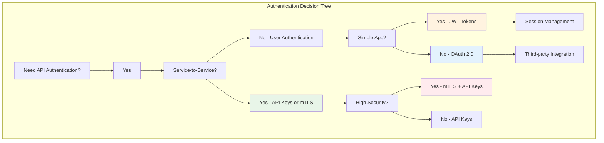
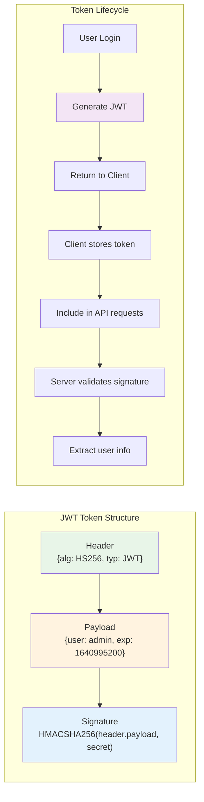
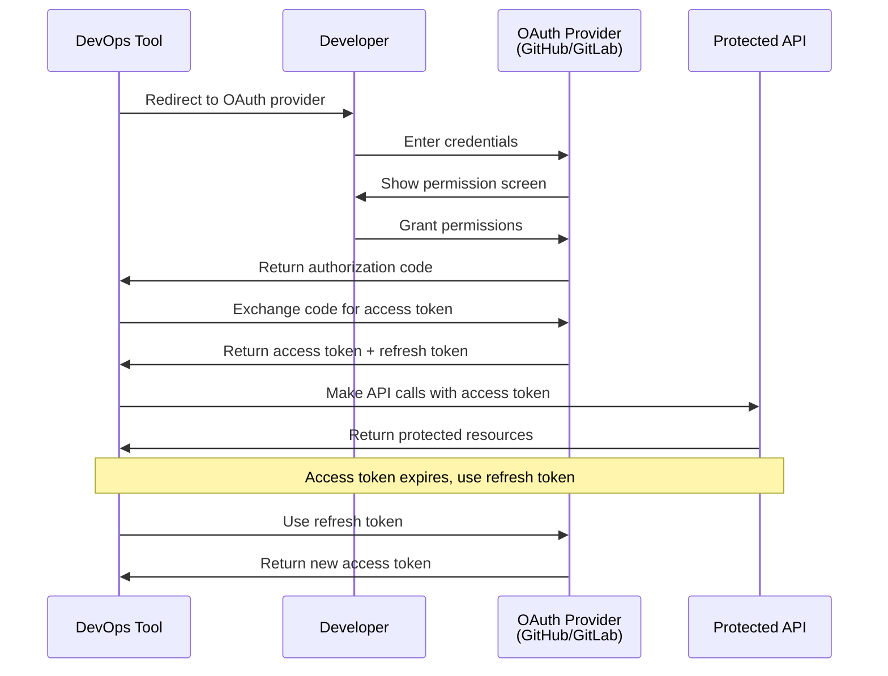

# 🔐 API Authentication & Security for DevOps

## 📖 What This File Covers
Master API authentication and security patterns essential for DevOps workflows. Learn how to secure APIs, implement proper authentication, and handle API security in automated systems and CI/CD pipelines.

## 🎯 Learning Objectives
- Understand different authentication methods and when to use each
- Implement secure API key management for DevOps workflows
- Master JWT tokens and OAuth flows in automation contexts
- Secure APIs against common vulnerabilities
- Design authentication for CI/CD pipelines and microservices

## 📋 Prerequisites
- Understanding of API fundamentals (see `00-API_Fundamentals_For_DevOps.md`)
- Basic security concepts (encryption, hashing)
- Experience with HTTP headers and requests

---

## 🔑 **Authentication Methods in DevOps Context**

### **🎯 Choosing the Right Authentication Method**

> **📝 Quick Context:**  
> API authentication is like choosing the right key for different doors. A simple key (API key) works for your garage, but you need a sophisticated security system (OAuth) for a bank vault. Each method has trade-offs between security, complexity, and use case.



### **🛡️ Authentication Methods Comparison**

| Method | Security Level | Complexity | Use Case | DevOps Example |
|--------|---------------|------------|----------|----------------|
| **API Keys** | Medium | Low | Service-to-service | CI/CD → Cloud APIs |
| **JWT Tokens** | High | Medium | User sessions | Dashboard authentication |
| **OAuth 2.0** | Very High | High | Third-party access | GitHub App permissions |
| **mTLS** | Maximum | Very High | Critical services | Payment system APIs |
| **Basic Auth** | Low | Very Low | Internal tools | Development APIs |

---

## 🔐 **API Keys: The DevOps Standard**

### **🎯 API Key Best Practices**

> **📝 Quick Context:**  
> API keys are like house keys - you want them to be unique, hard to copy, and easy to replace if lost. In DevOps, you'll use API keys constantly for automating cloud services, so managing them securely is crucial for your infrastructure's security.

```javascript
// Node.js example: Proper API key management
const crypto = require('crypto');

class APIKeyManager {
    constructor() {
        this.keys = new Map();
        this.keyMetadata = new Map();
    }
    
    // Generate secure API key
    generateApiKey(service, permissions = []) {
        const apiKey = 'sk-' + crypto.randomBytes(32).toString('hex');
        const hashedKey = crypto.createHash('sha256').update(apiKey).digest('hex');
        
        this.keys.set(hashedKey, {
            service,
            permissions,
            createdAt: new Date(),
            lastUsed: null,
            usageCount: 0
        });
        
        return apiKey; // Return once, never store plaintext
    }
    
    // Validate API key
    validateApiKey(apiKey) {
        const hashedKey = crypto.createHash('sha256').update(apiKey).digest('hex');
        const keyData = this.keys.get(hashedKey);
        
        if (!keyData) {
            return { valid: false, error: 'Invalid API key' };
        }
        
        // Update usage statistics
        keyData.lastUsed = new Date();
        keyData.usageCount++;
        
        return {
            valid: true,
            service: keyData.service,
            permissions: keyData.permissions
        };
    }
    
    // Rotate API key
    rotateApiKey(oldApiKey) {
        const oldHashed = crypto.createHash('sha256').update(oldApiKey).digest('hex');
        const oldData = this.keys.get(oldHashed);
        
        if (!oldData) {
            throw new Error('API key not found');
        }
        
        // Generate new key with same permissions
        const newApiKey = this.generateApiKey(oldData.service, oldData.permissions);
        
        // Remove old key
        this.keys.delete(oldHashed);
        
        return newApiKey;
    }
}
```

### **🔧 API Key Implementation in Express.js**

```javascript
const express = require('express');
const rateLimit = require('express-rate-limit');
const app = express();

// Rate limiting for API key endpoints
const apiKeyLimiter = rateLimit({
    windowMs: 15 * 60 * 1000, // 15 minutes
    max: 100, // limit each API key to 100 requests per windowMs
    keyGenerator: (req) => req.headers['x-api-key'] || req.ip,
    message: {
        error: 'rate_limit_exceeded',
        message: 'Too many API requests, please try again later.'
    }
});

// API key authentication middleware
function authenticateApiKey(requiredPermissions = []) {
    return (req, res, next) => {
        const apiKey = req.headers['x-api-key'] || 
                      req.headers['authorization']?.replace('Bearer ', '');
        
        if (!apiKey) {
            return res.status(401).json({
                error: 'authentication_required',
                message: 'API key required in X-API-Key header or Authorization header'
            });
        }
        
        const validation = apiKeyManager.validateApiKey(apiKey);
        
        if (!validation.valid) {
            return res.status(401).json({
                error: 'authentication_failed',
                message: validation.error
            });
        }
        
        // Check permissions
        const hasPermission = requiredPermissions.every(permission => 
            validation.permissions.includes(permission)
        );
        
        if (requiredPermissions.length > 0 && !hasPermission) {
            return res.status(403).json({
                error: 'insufficient_permissions',
                message: 'API key lacks required permissions',
                required: requiredPermissions,
                granted: validation.permissions
            });
        }
        
        req.apiKey = {
            service: validation.service,
            permissions: validation.permissions
        };
        
        next();
    };
}

// Protected endpoints
app.get('/api/v1/deployments', 
    apiKeyLimiter,
    authenticateApiKey(['deployments:read']),
    (req, res) => {
        res.json({ deployments: [] });
    }
);

app.post('/api/v1/deployments',
    apiKeyLimiter, 
    authenticateApiKey(['deployments:create']),
    (req, res) => {
        res.status(201).json({ deployment: { id: 'deploy-123' } });
    }
);
```

### **🌐 API Key Management in Cloud Environments**

```bash
# AWS Secrets Manager (Production approach)
# Store API keys securely
aws secretsmanager create-secret \
    --name "devops-api-keys/github" \
    --description "GitHub API token for CI/CD" \
    --secret-string '{"token":"ghp_xxxxxxxxxxxx"}'

# Retrieve in CI/CD pipeline
API_TOKEN=$(aws secretsmanager get-secret-value \
    --secret-id "devops-api-keys/github" \
    --query SecretString --output text | jq -r .token)

# Azure Key Vault equivalent
az keyvault secret set \
    --vault-name "devops-keyvault" \
    --name "github-api-token" \
    --value "ghp_xxxxxxxxxxxx"

# Retrieve from Azure Key Vault
API_TOKEN=$(az keyvault secret show \
    --vault-name "devops-keyvault" \
    --name "github-api-token" \
    --query value -o tsv)
```

---

## 🎫 **JWT Tokens: Stateless Authentication**

### **🔄 Understanding JWT Structure**

> **📝 Quick Context:**  
> JWT tokens are like a tamper-proof ID badge that contains your identity and permissions. Unlike a simple API key, JWT tokens expire automatically and can carry information about the user without needing to check a database every time.



### **🛠️ JWT Implementation for DevOps APIs**

```javascript
const jwt = require('jsonwebtoken');
const bcrypt = require('bcrypt');

class DevOpsJWTManager {
    constructor(secretKey) {
        this.secretKey = secretKey;
        this.refreshTokens = new Set(); // In production, use Redis
    }
    
    // Generate JWT token with DevOps-specific claims
    generateTokens(user) {
        const payload = {
            sub: user.id,
            username: user.username,
            role: user.role,
            permissions: user.permissions,
            environments: user.allowedEnvironments,
            iat: Math.floor(Date.now() / 1000),
            exp: Math.floor(Date.now() / 1000) + (15 * 60), // 15 minutes
            iss: 'devops-api',
            aud: 'devops-clients'
        };
        
        const refreshPayload = {
            sub: user.id,
            type: 'refresh',
            iat: Math.floor(Date.now() / 1000),
            exp: Math.floor(Date.now() / 1000) + (7 * 24 * 60 * 60) // 7 days
        };
        
        const accessToken = jwt.sign(payload, this.secretKey);
        const refreshToken = jwt.sign(refreshPayload, this.secretKey);
        
        this.refreshTokens.add(refreshToken);
        
        return { accessToken, refreshToken };
    }
    
    // Validate JWT token
    validateToken(token) {
        try {
            const decoded = jwt.verify(token, this.secretKey);
            
            // Check if token is expired
            if (decoded.exp < Math.floor(Date.now() / 1000)) {
                return { valid: false, error: 'Token expired' };
            }
            
            return { valid: true, payload: decoded };
        } catch (error) {
            return { valid: false, error: error.message };
        }
    }
    
    // Refresh access token
    refreshAccessToken(refreshToken) {
        try {
            const decoded = jwt.verify(refreshToken, this.secretKey);
            
            if (!this.refreshTokens.has(refreshToken)) {
                throw new Error('Refresh token not found');
            }
            
            if (decoded.type !== 'refresh') {
                throw new Error('Invalid token type');
            }
            
            // Generate new access token
            const user = { id: decoded.sub }; // Fetch user from database
            const { accessToken } = this.generateTokens(user);
            
            return accessToken;
        } catch (error) {
            throw new Error('Invalid refresh token');
        }
    }
}

// JWT Authentication middleware
function authenticateJWT(requiredPermissions = [], requiredEnvironment = null) {
    return (req, res, next) => {
        const authHeader = req.headers.authorization;
        const token = authHeader && authHeader.split(' ')[1];
        
        if (!token) {
            return res.status(401).json({
                error: 'authentication_required',
                message: 'JWT token required'
            });
        }
        
        const validation = jwtManager.validateToken(token);
        
        if (!validation.valid) {
            return res.status(401).json({
                error: 'authentication_failed', 
                message: validation.error
            });
        }
        
        const { payload } = validation;
        
        // Check permissions
        if (requiredPermissions.length > 0) {
            const hasPermission = requiredPermissions.every(permission =>
                payload.permissions.includes(permission)
            );
            
            if (!hasPermission) {
                return res.status(403).json({
                    error: 'insufficient_permissions',
                    message: 'Token lacks required permissions'
                });
            }
        }
        
        // Check environment access
        if (requiredEnvironment && !payload.environments.includes(requiredEnvironment)) {
            return res.status(403).json({
                error: 'environment_access_denied',
                message: `Access denied for environment: ${requiredEnvironment}`
            });
        }
        
        req.user = payload;
        next();
    };
}
```

---

## 🔒 **OAuth 2.0: Third-Party Integration**

### **🔄 OAuth 2.0 Flow for DevOps Tools**

> **📝 Quick Context:**  
> OAuth is like giving a valet the keys to your car - they can drive it, but only for specific purposes and for a limited time. In DevOps, OAuth lets tools like CI/CD systems access your GitHub or cloud accounts without giving them your actual password.



### **🛠️ OAuth Implementation for GitHub Integration**

```javascript
const axios = require('axios');

class GitHubOAuthManager {
    constructor(clientId, clientSecret, redirectUri) {
        this.clientId = clientId;
        this.clientSecret = clientSecret;
        this.redirectUri = redirectUri;
        this.baseUrl = 'https://github.com/login/oauth';
        this.apiUrl = 'https://api.github.com';
    }
    
    // Generate OAuth authorization URL
    getAuthorizationUrl(scopes = ['repo', 'workflow'], state = null) {
        const params = new URLSearchParams({
            client_id: this.clientId,
            redirect_uri: this.redirectUri,
            scope: scopes.join(' '),
            state: state || this.generateState()
        });
        
        return `${this.baseUrl}/authorize?${params.toString()}`;
    }
    
    // Exchange authorization code for access token
    async exchangeCodeForToken(code, state) {
        try {
            const response = await axios.post(`${this.baseUrl}/access_token`, {
                client_id: this.clientId,
                client_secret: this.clientSecret,
                code: code,
                redirect_uri: this.redirectUri,
                state: state
            }, {
                headers: {
                    'Accept': 'application/json'
                }
            });
            
            return {
                access_token: response.data.access_token,
                token_type: response.data.token_type,
                scope: response.data.scope
            };
        } catch (error) {
            throw new Error(`OAuth token exchange failed: ${error.message}`);
        }
    }
    
    // Make authenticated API call
    async makeApiCall(accessToken, endpoint, method = 'GET', data = null) {
        try {
            const config = {
                method,
                url: `${this.apiUrl}${endpoint}`,
                headers: {
                    'Authorization': `token ${accessToken}`,
                    'Accept': 'application/vnd.github.v3+json',
                    'User-Agent': 'DevOps-API-Client'
                }
            };
            
            if (data) {
                config.data = data;
            }
            
            const response = await axios(config);
            return response.data;
        } catch (error) {
            throw new Error(`GitHub API call failed: ${error.message}`);
        }
    }
    
    // Generate secure state parameter
    generateState() {
        return require('crypto').randomBytes(32).toString('hex');
    }
}

// Express.js OAuth routes
app.get('/auth/github', (req, res) => {
    const authUrl = githubOAuth.getAuthorizationUrl(
        ['repo', 'workflow', 'admin:repo_hook'],
        req.session.oauthState
    );
    res.redirect(authUrl);
});

app.get('/auth/github/callback', async (req, res) => {
    try {
        const { code, state } = req.query;
        
        // Validate state parameter
        if (state !== req.session.oauthState) {
            return res.status(400).json({ error: 'Invalid state parameter' });
        }
        
        const tokens = await githubOAuth.exchangeCodeForToken(code, state);
        
        // Store tokens securely (use encryption in production)
        req.session.githubToken = tokens.access_token;
        
        res.json({ message: 'GitHub integration successful' });
    } catch (error) {
        res.status(400).json({ error: error.message });
    }
});
```

---

## 🛡️ **API Security Best Practices**

### **🔐 Input Validation and Sanitization**

```javascript
const Joi = require('joi');
const rateLimit = require('express-rate-limit');
const helmet = require('helmet');

// Input validation schemas
const deploymentSchema = Joi.object({
    service_name: Joi.string().alphanum().min(3).max(50).required(),
    version: Joi.string().pattern(/^v?\d+\.\d+\.\d+$/).required(),
    environment: Joi.string().valid('development', 'staging', 'production').required(),
    replicas: Joi.number().integer().min(1).max(100).default(1),
    strategy: Joi.string().valid('rolling', 'blue-green', 'canary').default('rolling')
});

// Validation middleware
function validateRequest(schema) {
    return (req, res, next) => {
        const { error, value } = schema.validate(req.body, {
            abortEarly: false,
            stripUnknown: true
        });
        
        if (error) {
            return res.status(400).json({
                error: 'validation_error',
                message: 'Request validation failed',
                details: error.details.map(detail => ({
                    field: detail.path.join('.'),
                    message: detail.message
                }))
            });
        }
        
        req.validatedBody = value;
        next();
    };
}

// Security middleware setup
app.use(helmet({
    contentSecurityPolicy: {
        directives: {
            defaultSrc: ["'self'"],
            styleSrc: ["'self'", "'unsafe-inline'"],
            scriptSrc: ["'self'"],
            imgSrc: ["'self'", "data:", "https:"]
        }
    },
    hsts: {
        maxAge: 31536000,
        includeSubDomains: true,
        preload: true
    }
}));

// Rate limiting by API key/user
const createRateLimiter = (windowMs, max, keyGenerator) => 
    rateLimit({
        windowMs,
        max,
        keyGenerator,
        standardHeaders: true,
        legacyHeaders: false,
        message: {
            error: 'rate_limit_exceeded',
            message: 'Too many requests, please try again later.'
        }
    });

// Different rate limits for different operations
const readLimiter = createRateLimiter(
    15 * 60 * 1000, // 15 minutes
    1000, // 1000 requests
    (req) => req.user?.sub || req.ip
);

const writeLimiter = createRateLimiter(
    15 * 60 * 1000, // 15 minutes  
    100, // 100 requests
    (req) => req.user?.sub || req.ip
);
```

### **🔍 Audit Logging and Monitoring**

```javascript
const winston = require('winston');

// Security audit logger
const auditLogger = winston.createLogger({
    level: 'info',
    format: winston.format.combine(
        winston.format.timestamp(),
        winston.format.json()
    ),
    transports: [
        new winston.transports.File({ filename: 'audit.log' }),
        new winston.transports.Console({
            format: winston.format.simple()
        })
    ]
});

// Audit logging middleware
function auditLog(action) {
    return (req, res, next) => {
        const startTime = Date.now();
        
        res.on('finish', () => {
            const duration = Date.now() - startTime;
            
            auditLogger.info('API Request', {
                action,
                method: req.method,
                url: req.url,
                statusCode: res.statusCode,
                duration,
                userAgent: req.get('User-Agent'),
                ip: req.ip,
                user: req.user?.username || 'anonymous',
                apiKey: req.apiKey?.service || null,
                timestamp: new Date().toISOString()
            });
        });
        
        next();
    };
}

// Usage in routes
app.post('/api/v1/deployments',
    auditLog('deployment_create'),
    authenticateJWT(['deployments:create']),
    validateRequest(deploymentSchema),
    writeLimiter,
    (req, res) => {
        // Deployment logic here
        res.status(201).json({ deployment: { id: 'deploy-123' } });
    }
);
```

---

## 🔄 **Authentication in CI/CD Pipelines**

### **🚀 GitHub Actions with Secure Authentication**

```yaml
# .github/workflows/deploy.yml
name: Secure API Deployment

on:
  push:
    branches: [main]
  workflow_dispatch:

jobs:
  deploy:
    runs-on: ubuntu-latest
    
    steps:
    - uses: actions/checkout@v3
    
    - name: Setup Node.js
      uses: actions/setup-node@v3
      with:
        node-version: '18'
        cache: 'npm'
    
    - name: Install dependencies
      run: npm ci
    
    - name: Run security audit
      run: npm audit --audit-level high
    
    - name: Deploy to staging
      env:
        # Use GitHub secrets for API keys
        STAGING_API_KEY: ${{ secrets.STAGING_API_KEY }}
        DEPLOYMENT_API_URL: ${{ secrets.DEPLOYMENT_API_URL }}
      run: |
        curl -X POST \
          "$DEPLOYMENT_API_URL/api/v1/deployments" \
          -H "Authorization: Bearer $STAGING_API_KEY" \
          -H "Content-Type: application/json" \
          -d '{
            "service_name": "api-service",
            "version": "${{ github.sha }}",
            "environment": "staging"
          }'
    
    - name: Deploy to production
      if: github.ref == 'refs/heads/main'
      env:
        PROD_API_KEY: ${{ secrets.PROD_API_KEY }}
        DEPLOYMENT_API_URL: ${{ secrets.DEPLOYMENT_API_URL }}
      run: |
        curl -X POST \
          "$DEPLOYMENT_API_URL/api/v1/deployments" \
          -H "Authorization: Bearer $PROD_API_KEY" \
          -H "Content-Type: application/json" \
          -d '{
            "service_name": "api-service", 
            "version": "${{ github.sha }}",
            "environment": "production"
          }'
```

### **🔐 Kubernetes Service Account Authentication**

```yaml
# k8s-service-account.yaml
apiVersion: v1
kind: ServiceAccount
metadata:
  name: api-deployment-sa
  namespace: devops-system
---
apiVersion: rbac.authorization.k8s.io/v1
kind: ClusterRole
metadata:
  name: api-deployment-role
rules:
- apiGroups: ["apps"]
  resources: ["deployments"]
  verbs: ["get", "list", "create", "update", "patch"]
- apiGroups: [""]
  resources: ["services", "pods"]
  verbs: ["get", "list"]
---
apiVersion: rbac.authorization.k8s.io/v1
kind: ClusterRoleBinding
metadata:
  name: api-deployment-binding
subjects:
- kind: ServiceAccount
  name: api-deployment-sa
  namespace: devops-system
roleRef:
  kind: ClusterRole
  name: api-deployment-role
  apiGroup: rbac.authorization.k8s.io
```

---

## 🎯 **Hands-On Security Exercises**

### **Exercise 1: Implement API Key Rotation**

```bash
# Create a script to rotate API keys safely
#!/bin/bash

OLD_KEY="your-old-api-key"
NEW_KEY="your-new-api-key"

# Test new key works
echo "Testing new API key..."
response=$(curl -s -w "%{http_code}" \
  -H "Authorization: Bearer $NEW_KEY" \
  "https://api.example.com/v1/health")

if [[ "${response: -3}" == "200" ]]; then
    echo "New key works, updating production..."
    
    # Update key in production (example with AWS Secrets Manager)
    aws secretsmanager update-secret \
        --secret-id "api-keys/production" \
        --secret-string "{\"key\":\"$NEW_KEY\"}"
    
    echo "Key rotated successfully"
else
    echo "New key failed, keeping old key"
    exit 1
fi
```

### **Exercise 2: JWT Token Validation**

```javascript
// Test JWT token validation
const testToken = "eyJhbGciOiJIUzI1NiIsInR5cCI6IkpXVCJ9...";

// Decode without verification (for debugging)
const decoded = jwt.decode(testToken, { complete: true });
console.log('Header:', decoded.header);
console.log('Payload:', decoded.payload);
console.log('Signature:', decoded.signature);

// Verify with secret
try {
    const verified = jwt.verify(testToken, 'your-secret-key');
    console.log('Token valid:', verified);
} catch (error) {
    console.log('Token invalid:', error.message);
}
```

---

## 🚀 **Next Steps: Advanced API Security**

### **🎯 Immediate Actions:**
1. **Implement API key authentication** in a test API
2. **Set up JWT tokens** for a development project
3. **Practice OAuth integration** with GitHub API
4. **Configure rate limiting** and audit logging

### **🔧 Advanced Topics to Explore:**
- **Next File**: `03-API_Development_With_Node_Express.md` - Build secure APIs
- **Related**: `07-API_Gateway_Patterns.md` - Enterprise security patterns
- **Integration**: `14-API_Security_Compliance.md` - Compliance and regulations

---

**🔒 Security First**: In DevOps, API security isn't optional - it's the foundation that everything else builds on. A single insecure API can compromise your entire infrastructure. Master these authentication patterns, and you'll build systems that are both powerful and secure. 