# 🧪 API Testing & Validation for DevOps

## 📖 What This File Covers
Master API testing and validation strategies essential for DevOps workflows. Learn to test async operations, validate deployment APIs, and implement comprehensive testing strategies that ensure reliability in automated systems.

## 🎯 Learning Objectives
- Test async API operations with proper error handling
- Validate API responses and implement robust error scenarios
- Create automated test suites for DevOps APIs
- Test long-running operations like deployments and health checks
- Integrate API testing into CI/CD pipelines
- Mock external services for reliable testing

## 📋 Prerequisites
- Understanding of API fundamentals (see `00-API_Fundamentals_For_DevOps.md`)
- Basic JavaScript/Node.js knowledge
- Familiarity with REST API concepts
- Experience with API development (see `03-API_Development_With_Node_Express.md`)

---

## 🎯 **Why API Testing Matters in DevOps**

### **🚨 The Cost of Untested APIs**

> **📝 Real-World Scenario:**  
> A deployment API fails silently in production. The CI/CD pipeline thinks the deployment succeeded, but the application is actually down. This leads to 2 hours of downtime before anyone notices. Proper API testing would have caught this in staging.

```mermaid
flowchart TD
    subgraph "Without API Testing"
        A["API Bug in Code"] --> B["Passes Basic Checks"]
        B --> C["Deploys to Production"]
        C --> D["Silent Failure"]
        D --> E["2 Hours Downtime"]
        E --> F["Customer Impact"]
    end
    
    subgraph "With Comprehensive API Testing"
        G["API Bug in Code"] --> H["Caught in Unit Tests"]
        H --> I["Caught in Integration Tests"]
        I --> J["Caught in Contract Tests"]
        J --> K["Fixed Before Production"]
        K --> L["Zero Downtime"]
    end
    
    style D fill:#ffebee
    style E fill:#ffcdd2
    style F fill:#f8bbd9
    style H fill:#e8f5e8
    style I fill:#c8e6c9
    style J fill:#a5d6a7
    style L fill:#66bb6a
```



### **🔍 DevOps API Testing Pyramid**

| Test Level | Speed | Feedback | Coverage | Examples |
|------------|-------|----------|----------|----------|
| **Unit Tests** | ⚡ Fast | Immediate | High | Function logic, validation |
| **Integration Tests** | 🚶 Medium | Quick | Medium | API endpoints, database |
| **Contract Tests** | 🚶 Medium | Quick | Focused | API contracts, schemas |
| **End-to-End Tests** | 🐌 Slow | Delayed | Low | Full deployment flow |

---

## 🧪 **Setting Up API Testing Environment**

### **🔧 Testing Stack Setup**

📄 **File Path**: `/api-testing-project/package.json`
```json
{
  "name": "devops-api-testing",
  "version": "1.0.0",
  "scripts": {
    "test": "jest",
    "test:watch": "jest --watch",
    "test:coverage": "jest --coverage",
    "test:integration": "jest --testPathPattern=integration",
    "test:unit": "jest --testPathPattern=unit"
  },
  "devDependencies": {
    "jest": "^29.7.0",
    "supertest": "^6.3.3",
    "nock": "^13.3.8",
    "msw": "^2.0.0",
    "@types/jest": "^29.5.8",
    "axios-mock-adapter": "^1.22.0"
  },
  "dependencies": {
    "express": "^4.18.0",
    "axios": "^1.6.0",
    "joi": "^17.11.0"
  }
}
```

📄 **File Path**: `/api-testing-project/jest.config.js`
```javascript
module.exports = {
  testEnvironment: 'node',
  coverageDirectory: 'coverage',
  collectCoverageFrom: [
    'src/**/*.js',
    '!src/server.js',
    '!src/**/*.test.js'
  ],
  coverageReporters: ['text', 'lcov', 'html'],
  setupFilesAfterEnv: ['<rootDir>/tests/setup.js'],
  testMatch: [
    '<rootDir>/tests/**/*.test.js'
  ],
  verbose: true,
  testTimeout: 30000 // 30 seconds for async operations
};
```

📄 **File Path**: `/api-testing-project/tests/setup.js`
```javascript
// Global test setup
const { MongoMemoryServer } = require('mongodb-memory-server');

// Global test configuration
global.console = {
  ...console,
  // Suppress logs during testing unless needed
  log: jest.fn(),
  warn: jest.fn(),
  error: jest.fn()
};

// Setup before all tests
beforeAll(async () => {
  // Start in-memory database for testing
  global.__MONGOINSTANCE = await MongoMemoryServer.create();
  process.env.NODE_ENV = 'test';
  process.env.LOG_LEVEL = 'error';
});

// Cleanup after all tests
afterAll(async () => {
  if (global.__MONGOINSTANCE) {
    await global.__MONGOINSTANCE.stop();
  }
});

// Reset state between tests
beforeEach(() => {
  jest.clearAllMocks();
});
```

---

## 🔄 **Testing Async API Operations**

### **⚡ Basic Async API Testing Patterns**

📄 **File Path**: `/tests/unit/async-operations.test.js`
```javascript
const request = require('supertest');
const app = require('../../src/app');

describe('Async API Operations', () => {
  describe('POST /api/v1/deployments', () => {
    it('should create deployment and return immediately with pending status', async () => {
      // Test async operation initiation
      const deploymentData = {
        service_name: 'test-api',
        version: 'v1.0.0',
        environment: 'staging'
      };
      
      const response = await request(app)
        .post('/api/v1/deployments')
        .send(deploymentData)
        .expect(202); // Accepted, not completed
      
      expect(response.body.deployment).toMatchObject({
        service_name: 'test-api',
        version: 'v1.0.0',
        environment: 'staging',
        status: 'pending'
      });
      
      expect(response.body.deployment.id).toBeDefined();
      expect(response.body.deployment.created_at).toBeDefined();
    });
    
    it('should handle deployment validation errors', async () => {
      // Test async operation validation
      const invalidData = {
        service_name: '', // Invalid: empty string
        version: 'invalid-version', // Invalid: wrong format
        environment: 'invalid-env' // Invalid: not allowed
      };
      
      const response = await request(app)
        .post('/api/v1/deployments')
        .send(invalidData)
        .expect(400);
      
      expect(response.body).toMatchObject({
        error: 'validation_error',
        message: 'Request validation failed',
        details: expect.arrayContaining([
          expect.objectContaining({
            field: expect.any(String),
            message: expect.any(String)
          })
        ])
      });
    });
  });

  describe('GET /api/v1/deployments/:id', () => {
    it('should track deployment progress over time', async () => {
      // Create deployment first
      const createResponse = await request(app)
        .post('/api/v1/deployments')
        .send({
          service_name: 'test-api',
          version: 'v1.0.0',
          environment: 'staging'
        });
      
      const deploymentId = createResponse.body.deployment.id;
      
      // Poll deployment status (simulating real-world usage)
      let status = 'pending';
      let attempts = 0;
      const maxAttempts = 10;
      
      while (status === 'pending' && attempts < maxAttempts) {
        await new Promise(resolve => setTimeout(resolve, 100)); // Wait 100ms
        
        const statusResponse = await request(app)
          .get(`/api/v1/deployments/${deploymentId}`)
          .expect(200);
        
        status = statusResponse.body.deployment.status;
        attempts++;
        
        // Verify status is valid
        expect(['pending', 'running', 'successful', 'failed']).toContain(status);
      }
      
      expect(attempts).toBeLessThan(maxAttempts);
      expect(['successful', 'failed', 'running']).toContain(status);
    });
    
    it('should return 404 for non-existent deployment', async () => {
      const fakeId = '550e8400-e29b-41d4-a716-446655440000';
      
      await request(app)
        .get(`/api/v1/deployments/${fakeId}`)
        .expect(404)
        .expect((res) => {
          expect(res.body).toMatchObject({
            error: 'deployment_not_found',
            message: expect.stringContaining(fakeId)
          });
        });
    });
  });
});
```

---

## 🎭 **Mocking External Services**

### **🔧 API Mocking for Reliable Tests**

📄 **File Path**: `/tests/unit/external-api-mocks.test.js`
```javascript
const nock = require('nock');
const axios = require('axios');
const { deployToKubernetes, checkDockerRegistry } = require('../../src/services/external');

describe('External API Mocking', () => {
  afterEach(() => {
    nock.cleanAll();
  });
  
  describe('Kubernetes API Integration', () => {
    it('should handle successful deployment to Kubernetes', async () => {
      // Mock Kubernetes API response
      const kubernetesApi = nock('https://k8s-api.example.com')
        .post('/api/v1/namespaces/default/deployments')
        .reply(201, {
          metadata: {
            name: 'test-api',
            namespace: 'default',
            uid: 'abc-123-def'
          },
          status: {
            replicas: 3,
            readyReplicas: 0,
            updatedReplicas: 3
          }
        });
      
      const result = await deployToKubernetes({
        name: 'test-api',
        image: 'test-api:v1.0.0',
        replicas: 3
      });
      
      expect(result).toMatchObject({
        success: true,
        deploymentId: 'abc-123-def',
        replicas: 3
      });
      
      expect(kubernetesApi.isDone()).toBe(true);
    });
    
    it('should handle Kubernetes API failures with retry', async () => {
      // Mock failed attempts followed by success
      const kubernetesApi = nock('https://k8s-api.example.com')
        .post('/api/v1/namespaces/default/deployments')
        .reply(500, { error: 'Internal server error' })
        .post('/api/v1/namespaces/default/deployments')
        .reply(500, { error: 'Internal server error' })
        .post('/api/v1/namespaces/default/deployments')
        .reply(201, {
          metadata: { name: 'test-api', uid: 'abc-123-def' },
          status: { replicas: 3 }
        });
      
      const result = await deployToKubernetes({
        name: 'test-api',
        image: 'test-api:v1.0.0',
        replicas: 3
      });
      
      expect(result.success).toBe(true);
      expect(kubernetesApi.isDone()).toBe(true);
    });
  });
});
```

---

**🧪 Testing Foundation Complete**: This establishes the core testing patterns for async API operations and external service mocking. The next sections cover health checks, contract testing, CI/CD integration, and advanced patterns.

---

📄 **File Path**: `DevOps/00-Code_Practices/02-Code_Conventions_And_Patterns/API_Design_Patterns/04-API_Testing_Validation.md`

📖 **What This File Does**: Provides comprehensive API testing strategies focusing on async operations, mocking external services, and DevOps-specific validation patterns that bridge the gap to async programming concepts.

🔧 **Configuration Notes**: This file introduces async/await testing patterns that directly connect to the async programming patterns file, giving developers hands-on experience with async concepts in a practical API testing context. 