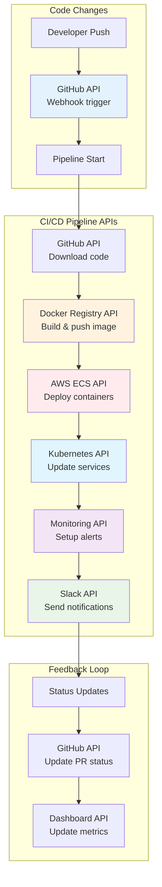

# 🔄 APIs in CI/CD Pipelines: Automation Excellence

## 📖 What This File Covers
Master the integration of APIs into CI/CD pipelines for complete DevOps automation. Learn how APIs enable seamless deployment workflows, infrastructure management, and monitoring throughout the software delivery lifecycle.

## 🎯 Learning Objectives
- Integrate APIs into GitHub Actions, GitLab CI, and Jenkins pipelines
- Automate deployments using cloud APIs (AWS, Azure, GCP)
- Implement API-driven infrastructure as code workflows
- Create monitoring and notification systems using APIs
- Handle API failures and retry mechanisms in pipelines

## 📋 Prerequisites
- Understanding of CI/CD concepts and pipeline basics
- Familiarity with API fundamentals and authentication
- Experience with at least one CI/CD platform (GitHub Actions, GitLab CI, etc.)
- Basic knowledge of cloud services (AWS, Azure, or GCP)

---

## 🔄 **APIs as the CI/CD Backbone**

### **🎯 How APIs Enable Modern CI/CD**

> **📝 Quick Context:**  
> Modern CI/CD is essentially a choreographed dance of API calls. Your pipeline doesn't manually log into servers - it uses APIs to talk to GitHub, build Docker images, deploy to Kubernetes, update monitoring dashboards, and send Slack notifications. APIs make this automation possible and reliable.



### **🚀 API Integration Benefits in CI/CD**

| Traditional Manual Process | API-Driven Automation | Time Saved |
|----------------------------|------------------------|------------|
| Manual server SSH + commands | Cloud API deployment calls | 45 min → 2 min |
| Manual Docker image building | Registry API + automated builds | 30 min → 5 min |
| Manual environment setup | Infrastructure as Code APIs | 2 hours → 10 min |
| Manual testing coordination | API-triggered test suites | 1 hour → 15 min |
| Manual status updates | Webhook + notification APIs | 15 min → instant |

---

## 🔧 **GitHub Actions with API Integration**

### **🎯 Complete Deployment Pipeline with APIs**

📄 **File Path**: `.github/workflows/api-deploy.yml`
```yaml
name: API-Driven Deployment Pipeline

on:
  push:
    branches: [main, develop]
  pull_request:
    branches: [main]
  workflow_dispatch:
    inputs:
      environment:
        description: 'Deployment environment'
        required: true
        default: 'staging'
        type: choice
        options:
        - staging
        - production

env:
  DOCKER_REGISTRY: 'your-registry.com'
  IMAGE_NAME: 'devops-api'
  
jobs:
  build-and-test:
    runs-on: ubuntu-latest
    outputs:
      image-tag: ${{ steps.meta.outputs.tags }}
      image-digest: ${{ steps.build.outputs.digest }}
    
    steps:
    - name: Checkout code
      uses: actions/checkout@v4
    
    - name: Setup Node.js
      uses: actions/setup-node@v4
      with:
        node-version: '18'
        cache: 'npm'
    
    - name: Install dependencies
      run: npm ci
    
    - name: Run tests
      run: npm test
    
    - name: Run security audit
      run: npm audit --audit-level high
    
    - name: Generate Docker metadata
      id: meta
      uses: docker/metadata-action@v5
      with:
        images: ${{ env.DOCKER_REGISTRY }}/${{ env.IMAGE_NAME }}
        tags: |
          type=ref,event=branch
          type=ref,event=pr
          type=sha,prefix={{branch}}-
          type=raw,value=latest,enable={{is_default_branch}}
    
    - name: Build and push Docker image
      id: build
      uses: docker/build-push-action@v5
      with:
        context: .
        push: true
        tags: ${{ steps.meta.outputs.tags }}
        labels: ${{ steps.meta.outputs.labels }}
    
    - name: Update deployment status via API
      env:
        DEPLOYMENT_API_URL: ${{ secrets.DEPLOYMENT_API_URL }}
        API_TOKEN: ${{ secrets.DEPLOYMENT_API_TOKEN }}
      run: |
        curl -X POST "$DEPLOYMENT_API_URL/api/v1/deployments" \
          -H "Authorization: Bearer $API_TOKEN" \
          -H "Content-Type: application/json" \
          -d '{
            "service_name": "${{ env.IMAGE_NAME }}",
            "version": "${{ github.sha }}",
            "environment": "build",
            "status": "image_built",
            "image_tag": "${{ steps.meta.outputs.tags }}",
            "commit_sha": "${{ github.sha }}",
            "branch": "${{ github.ref_name }}",
            "triggered_by": "${{ github.actor }}"
          }'

  deploy-staging:
    needs: build-and-test
    if: github.ref == 'refs/heads/develop' || github.event_name == 'workflow_dispatch'
    runs-on: ubuntu-latest
    environment: staging
    
    steps:
    - name: Deploy to AWS ECS via API
      env:
        AWS_ACCESS_KEY_ID: ${{ secrets.AWS_ACCESS_KEY_ID }}
        AWS_SECRET_ACCESS_KEY: ${{ secrets.AWS_SECRET_ACCESS_KEY }}
        AWS_REGION: ${{ secrets.AWS_REGION }}
      run: |
        # Update ECS service with new image
        aws ecs update-service \
          --cluster staging-cluster \
          --service ${{ env.IMAGE_NAME }}-service \
          --force-new-deployment \
          --task-definition $(aws ecs describe-services \
            --cluster staging-cluster \
            --services ${{ env.IMAGE_NAME }}-service \
            --query 'services[0].taskDefinition' --output text)
    
    - name: Wait for deployment completion
      env:
        AWS_REGION: ${{ secrets.AWS_REGION }}
      run: |
        aws ecs wait services-stable \
          --cluster staging-cluster \
          --services ${{ env.IMAGE_NAME }}-service
    
    - name: Run health checks via API
      env:
        STAGING_API_URL: ${{ secrets.STAGING_API_URL }}
      run: |
        # Wait for service to be healthy
        for i in {1..30}; do
          response=$(curl -s -w "%{http_code}" \
            "$STAGING_API_URL/api/v1/health" || echo "000")
          
          if [[ "${response: -3}" == "200" ]]; then
            echo "Health check passed"
            break
          fi
          
          if [[ $i == 30 ]]; then
            echo "Health check failed after 5 minutes"
            exit 1
          fi
          
          echo "Waiting for service to be healthy... (attempt $i/30)"
          sleep 10
        done
    
    - name: Update deployment status
      if: always()
      env:
        DEPLOYMENT_API_URL: ${{ secrets.DEPLOYMENT_API_URL }}
        API_TOKEN: ${{ secrets.DEPLOYMENT_API_TOKEN }}
      run: |
        STATUS="${{ job.status == 'success' && 'successful' || 'failed' }}"
        curl -X PATCH "$DEPLOYMENT_API_URL/api/v1/deployments/latest" \
          -H "Authorization: Bearer $API_TOKEN" \
          -H "Content-Type: application/json" \
          -d "{
            \"status\": \"$STATUS\",
            \"environment\": \"staging\",
            \"deployed_at\": \"$(date -u +%Y-%m-%dT%H:%M:%SZ)\"
          }"
    
    - name: Send Slack notification
      if: always()
      env:
        SLACK_WEBHOOK_URL: ${{ secrets.SLACK_WEBHOOK_URL }}
      run: |
        STATUS="${{ job.status == 'success' && '✅ Success' || '❌ Failed' }}"
        COLOR="${{ job.status == 'success' && 'good' || 'danger' }}"
        
        curl -X POST "$SLACK_WEBHOOK_URL" \
          -H "Content-Type: application/json" \
          -d "{
            \"attachments\": [{
              \"color\": \"$COLOR\",
              \"title\": \"Staging Deployment $STATUS\",
              \"fields\": [
                {\"title\": \"Service\", \"value\": \"${{ env.IMAGE_NAME }}\", \"short\": true},
                {\"title\": \"Version\", \"value\": \"${{ github.sha }}\", \"short\": true},
                {\"title\": \"Branch\", \"value\": \"${{ github.ref_name }}\", \"short\": true},
                {\"title\": \"Actor\", \"value\": \"${{ github.actor }}\", \"short\": true}
              ]
            }]
          }"

  deploy-production:
    needs: deploy-staging
    if: github.ref == 'refs/heads/main'
    runs-on: ubuntu-latest
    environment: production
    
    steps:
    - name: Create production deployment via API
      env:
        DEPLOYMENT_API_URL: ${{ secrets.DEPLOYMENT_API_URL }}
        API_TOKEN: ${{ secrets.DEPLOYMENT_API_TOKEN }}
      run: |
        DEPLOYMENT_ID=$(curl -X POST "$DEPLOYMENT_API_URL/api/v1/deployments" \
          -H "Authorization: Bearer $API_TOKEN" \
          -H "Content-Type: application/json" \
          -d '{
            "service_name": "${{ env.IMAGE_NAME }}",
            "version": "${{ github.sha }}",
            "environment": "production",
            "strategy": "blue-green",
            "replicas": 5,
            "health_check_path": "/api/v1/health"
          }' | jq -r '.deployment.id')
        
        echo "DEPLOYMENT_ID=$DEPLOYMENT_ID" >> $GITHUB_ENV
    
    - name: Monitor deployment progress
      env:
        DEPLOYMENT_API_URL: ${{ secrets.DEPLOYMENT_API_URL }}
        API_TOKEN: ${{ secrets.DEPLOYMENT_API_TOKEN }}
      run: |
        # Poll deployment status
        for i in {1..60}; do
          response=$(curl -s "$DEPLOYMENT_API_URL/api/v1/deployments/$DEPLOYMENT_ID" \
            -H "Authorization: Bearer $API_TOKEN")
          
          status=$(echo "$response" | jq -r '.deployment.status')
          
          case $status in
            "successful")
              echo "Deployment completed successfully"
              exit 0
              ;;
            "failed")
              echo "Deployment failed"
              exit 1
              ;;
            "pending"|"running")
              echo "Deployment in progress... (attempt $i/60)"
              sleep 30
              ;;
            *)
              echo "Unknown status: $status"
              ;;
          esac
        done
        
        echo "Deployment timed out"
        exit 1
```

---

## 🏗️ **Infrastructure as Code with APIs**

### **🔧 Terraform with API Integration**

📄 **File Path**: `infrastructure/main.tf`
```hcl
# Configure providers
terraform {
  required_providers {
    aws = {
      source  = "hashicorp/aws"
      version = "~> 5.0"
    }
    datadog = {
      source  = "DataDog/datadog"
      version = "~> 3.20"
    }
  }
}

# Data source for deployment API
data "http" "current_deployment" {
  url = "${var.deployment_api_url}/api/v1/deployments/latest"
  
  request_headers = {
    Authorization = "Bearer ${var.deployment_api_token}"
    Accept        = "application/json"
  }
}

locals {
  deployment_data = jsondecode(data.http.current_deployment.response_body)
  image_tag       = local.deployment_data.deployment.version
  service_name    = local.deployment_data.deployment.service_name
}

# ECS Task Definition with dynamic image
resource "aws_ecs_task_definition" "api_service" {
  family                   = var.service_name
  network_mode            = "awsvpc"
  requires_compatibilities = ["FARGATE"]
  cpu                     = 512
  memory                  = 1024
  execution_role_arn      = aws_iam_role.ecs_execution_role.arn
  
  container_definitions = jsonencode([
    {
      name  = var.service_name
      image = "${var.docker_registry}/${local.service_name}:${local.image_tag}"
      
      portMappings = [
        {
          containerPort = 3000
          hostPort      = 3000
          protocol      = "tcp"
        }
      ]
      
      environment = [
        {
          name  = "NODE_ENV"
          value = var.environment
        },
        {
          name  = "PORT"
          value = "3000"
        }
      ]
      
      healthCheck = {
        command     = ["CMD-SHELL", "curl -f http://localhost:3000/api/v1/health || exit 1"]
        interval    = 30
        timeout     = 5
        retries     = 3
        startPeriod = 60
      }
      
      logConfiguration = {
        logDriver = "awslogs"
        options = {
          awslogs-group         = aws_cloudwatch_log_group.api_service.name
          awslogs-region        = var.aws_region
          awslogs-stream-prefix = "ecs"
        }
      }
    }
  ])
}

# Auto-update deployment status via local-exec
resource "null_resource" "update_deployment_status" {
  triggers = {
    task_definition_arn = aws_ecs_task_definition.api_service.arn
  }
  
  provisioner "local-exec" {
    command = <<-EOT
      curl -X PATCH "${var.deployment_api_url}/api/v1/deployments/latest" \
        -H "Authorization: Bearer ${var.deployment_api_token}" \
        -H "Content-Type: application/json" \
        -d '{
          "status": "infrastructure_updated",
          "task_definition_arn": "${aws_ecs_task_definition.api_service.arn}",
          "updated_at": "'$(date -u +%Y-%m-%dT%H:%M:%SZ)'"
        }'
    EOT
  }
}

# Create monitoring dashboard via API
resource "datadog_dashboard" "api_service" {
  title       = "${var.service_name} - ${var.environment}"
  description = "Monitoring dashboard for ${var.service_name}"
  layout_type = "ordered"
  
  widget {
    alert_graph_definition {
      alert_id = datadog_monitor.api_health.id
      viz_type = "timeseries"
      title    = "API Health Status"
    }
  }
  
  widget {
    timeseries_definition {
      title = "Request Rate"
      request {
        q = "sum:aws.ecs.service.running{service_name:${var.service_name}}"
        display_type = "line"
      }
    }
  }
}
```

### **🔄 GitLab CI with Infrastructure APIs**

📄 **File Path**: `.gitlab-ci.yml`
```yaml
stages:
  - build
  - test
  - deploy-infrastructure
  - deploy-application
  - verify
  - notify

variables:
  DOCKER_REGISTRY: "registry.gitlab.com"
  IMAGE_NAME: "$CI_PROJECT_PATH"
  TERRAFORM_VERSION: "1.6.0"

build:
  stage: build
  image: docker:24.0.5
  services:
    - docker:24.0.5-dind
  script:
    - docker build -t $DOCKER_REGISTRY/$IMAGE_NAME:$CI_COMMIT_SHA .
    - docker push $DOCKER_REGISTRY/$IMAGE_NAME:$CI_COMMIT_SHA
    
    # Register build via API
    - |
      curl -X POST "$DEPLOYMENT_API_URL/api/v1/builds" \
        -H "Authorization: Bearer $DEPLOYMENT_API_TOKEN" \
        -H "Content-Type: application/json" \
        -d "{
          \"commit_sha\": \"$CI_COMMIT_SHA\",
          \"branch\": \"$CI_COMMIT_REF_NAME\",
          \"image_tag\": \"$CI_COMMIT_SHA\",
          \"build_url\": \"$CI_PIPELINE_URL\",
          \"triggered_by\": \"$GITLAB_USER_LOGIN\"
        }"

deploy-infrastructure:
  stage: deploy-infrastructure
  image: 
    name: hashicorp/terraform:$TERRAFORM_VERSION
    entrypoint: [""]
  before_script:
    - cd infrastructure
    - terraform init
  script:
    # Get latest deployment info via API
    - |
      DEPLOYMENT_INFO=$(curl -s "$DEPLOYMENT_API_URL/api/v1/deployments/latest" \
        -H "Authorization: Bearer $DEPLOYMENT_API_TOKEN")
      
      export TF_VAR_image_tag=$(echo "$DEPLOYMENT_INFO" | jq -r '.deployment.version')
      export TF_VAR_replicas=$(echo "$DEPLOYMENT_INFO" | jq -r '.deployment.replicas')
    
    - terraform plan -out=tfplan
    - terraform apply tfplan
    
    # Update infrastructure status via API
    - |
      curl -X POST "$DEPLOYMENT_API_URL/api/v1/infrastructure" \
        -H "Authorization: Bearer $DEPLOYMENT_API_TOKEN" \
        -H "Content-Type: application/json" \
        -d "{
          \"environment\": \"$CI_ENVIRONMENT_NAME\",
          \"status\": \"updated\",
          \"terraform_state\": \"applied\",
          \"pipeline_id\": \"$CI_PIPELINE_ID\"
        }"
  
  artifacts:
    paths:
      - infrastructure/tfplan
    expire_in: 1 hour

verify-deployment:
  stage: verify
  image: curlimages/curl:8.4.0
  script:
    # Health check with retry
    - |
      for i in $(seq 1 30); do
        response=$(curl -s -w "%{http_code}" "$APPLICATION_URL/api/v1/health" || echo "000")
        
        if [ "${response: -3}" = "200" ]; then
          echo "Health check passed"
          break
        fi
        
        if [ $i -eq 30 ]; then
          echo "Health check failed after 5 minutes"
          exit 1
        fi
        
        echo "Waiting for service to be healthy... (attempt $i/30)"
        sleep 10
      done
    
    # Run integration tests via API
    - |
      curl -X POST "$TESTING_API_URL/api/v1/test-suites/integration/run" \
        -H "Authorization: Bearer $TESTING_API_TOKEN" \
        -H "Content-Type: application/json" \
        -d "{
          \"target_url\": \"$APPLICATION_URL\",
          \"environment\": \"$CI_ENVIRONMENT_NAME\",
          \"commit_sha\": \"$CI_COMMIT_SHA\"
        }"

notify-slack:
  stage: notify
  image: curlimages/curl:8.4.0
  when: always
  script:
    - |
      if [ "$CI_JOB_STATUS" = "success" ]; then
        STATUS="✅ Success"
        COLOR="good"
      else
        STATUS="❌ Failed"
        COLOR="danger"
      fi
      
      curl -X POST "$SLACK_WEBHOOK_URL" \
        -H "Content-Type: application/json" \
        -d "{
          \"attachments\": [{
            \"color\": \"$COLOR\",
            \"title\": \"Deployment $STATUS\",
            \"fields\": [
              {\"title\": \"Environment\", \"value\": \"$CI_ENVIRONMENT_NAME\", \"short\": true},
              {\"title\": \"Commit\", \"value\": \"$CI_COMMIT_SHA\", \"short\": true},
              {\"title\": \"Branch\", \"value\": \"$CI_COMMIT_REF_NAME\", \"short\": true},
              {\"title\": \"Pipeline\", \"value\": \"<$CI_PIPELINE_URL|$CI_PIPELINE_ID>\", \"short\": true}
            ]
          }]
        }"
```

---

## 📊 **Monitoring and Observability APIs**

### **🔍 Automated Monitoring Setup**

📄 **File Path**: `scripts/setup-monitoring.sh`
```bash
#!/bin/bash

# Setup monitoring for deployed services via APIs
set -e

DEPLOYMENT_API_URL="${DEPLOYMENT_API_URL:-https://api.example.com}"
API_TOKEN="${DEPLOYMENT_API_TOKEN}"
GRAFANA_API_URL="${GRAFANA_API_URL:-https://grafana.example.com}"
GRAFANA_TOKEN="${GRAFANA_TOKEN}"

# Get deployment information
echo "Getting deployment information..."
DEPLOYMENT_INFO=$(curl -s "$DEPLOYMENT_API_URL/api/v1/deployments/latest" \
  -H "Authorization: Bearer $API_TOKEN")

SERVICE_NAME=$(echo "$DEPLOYMENT_INFO" | jq -r '.deployment.service_name')
ENVIRONMENT=$(echo "$DEPLOYMENT_INFO" | jq -r '.deployment.environment')
VERSION=$(echo "$DEPLOYMENT_INFO" | jq -r '.deployment.version')

echo "Setting up monitoring for $SERVICE_NAME in $ENVIRONMENT (version: $VERSION)"

# Create Grafana dashboard
DASHBOARD_JSON=$(cat <<EOF
{
  "dashboard": {
    "id": null,
    "title": "$SERVICE_NAME - $ENVIRONMENT",
    "tags": ["devops", "api", "$ENVIRONMENT"],
    "timezone": "browser",
    "panels": [
      {
        "id": 1,
        "title": "Request Rate",
        "type": "graph",
        "targets": [
          {
            "expr": "rate(http_requests_total{service=\"$SERVICE_NAME\",env=\"$ENVIRONMENT\"}[5m])",
            "legendFormat": "Requests/sec"
          }
        ],
        "gridPos": {"h": 8, "w": 12, "x": 0, "y": 0}
      },
      {
        "id": 2,
        "title": "Response Time",
        "type": "graph",
        "targets": [
          {
            "expr": "histogram_quantile(0.95, rate(http_request_duration_seconds_bucket{service=\"$SERVICE_NAME\",env=\"$ENVIRONMENT\"}[5m]))",
            "legendFormat": "95th percentile"
          }
        ],
        "gridPos": {"h": 8, "w": 12, "x": 12, "y": 0}
      },
      {
        "id": 3,
        "title": "Error Rate",
        "type": "graph",
        "targets": [
          {
            "expr": "rate(http_requests_total{service=\"$SERVICE_NAME\",env=\"$ENVIRONMENT\",status=~\"5..\"}[5m])",
            "legendFormat": "5xx errors/sec"
          }
        ],
        "gridPos": {"h": 8, "w": 24, "x": 0, "y": 8}
      }
    ],
    "time": {"from": "now-1h", "to": "now"},
    "refresh": "5s"
  },
  "overwrite": true
}
EOF
)

# Create dashboard via Grafana API
echo "Creating Grafana dashboard..."
DASHBOARD_RESPONSE=$(curl -s -X POST "$GRAFANA_API_URL/api/dashboards/db" \
  -H "Authorization: Bearer $GRAFANA_TOKEN" \
  -H "Content-Type: application/json" \
  -d "$DASHBOARD_JSON")

DASHBOARD_URL=$(echo "$DASHBOARD_RESPONSE" | jq -r '.url')
echo "Dashboard created: $GRAFANA_API_URL$DASHBOARD_URL"

# Create alerts via API
echo "Setting up alerts..."

# High error rate alert
ERROR_RATE_ALERT=$(cat <<EOF
{
  "alert": {
    "name": "$SERVICE_NAME-$ENVIRONMENT-high-error-rate",
    "message": "High error rate detected in $SERVICE_NAME ($ENVIRONMENT)",
    "frequency": "10s",
    "conditions": [
      {
        "query": {
          "params": ["A", "5m", "now"],
          "queryType": "prometheus",
          "refId": "A"
        },
        "reducer": {
          "params": [],
          "type": "last"
        },
        "evaluator": {
          "params": [0.05],
          "type": "gt"
        }
      }
    ],
    "executionErrorState": "alerting",
    "noDataState": "no_data",
    "for": "1m"
  }
}
EOF
)

curl -s -X POST "$GRAFANA_API_URL/api/alerts" \
  -H "Authorization: Bearer $GRAFANA_TOKEN" \
  -H "Content-Type: application/json" \
  -d "$ERROR_RATE_ALERT"

# Update deployment with monitoring info
echo "Updating deployment with monitoring information..."
curl -X PATCH "$DEPLOYMENT_API_URL/api/v1/deployments/latest" \
  -H "Authorization: Bearer $API_TOKEN" \
  -H "Content-Type: application/json" \
  -d "{
    \"monitoring\": {
      \"dashboard_url\": \"$GRAFANA_API_URL$DASHBOARD_URL\",
      \"alerts_configured\": true,
      \"setup_at\": \"$(date -u +%Y-%m-%dT%H:%M:%SZ)\"
    }
  }"

echo "Monitoring setup completed successfully!"
```

---

## 🔄 **API Error Handling and Retry Mechanisms**

### **🛡️ Robust API Calls in Pipelines**

📄 **File Path**: `scripts/api-helpers.sh`
```bash
#!/bin/bash

# Robust API calling functions for CI/CD pipelines

# Function: Make API call with retry and exponential backoff
api_call_with_retry() {
    local method="$1"
    local url="$2"
    local data="$3"
    local headers="$4"
    local max_retries="${5:-3}"
    local base_delay="${6:-2}"
    
    local attempt=1
    local delay=$base_delay
    
    while [ $attempt -le $max_retries ]; do
        echo "API call attempt $attempt/$max_retries: $method $url"
        
        if [ "$method" = "GET" ]; then
            response=$(curl -s -w "%{http_code}" $headers "$url")
        else
            response=$(curl -s -w "%{http_code}" -X "$method" $headers \
                -H "Content-Type: application/json" \
                -d "$data" "$url")
        fi
        
        http_code="${response: -3}"
        response_body="${response%???}"
        
        case $http_code in
            200|201|202|204)
                echo "API call successful (HTTP $http_code)"
                echo "$response_body"
                return 0
                ;;
            429)
                echo "Rate limit hit (HTTP 429), waiting $delay seconds..."
                sleep $delay
                delay=$((delay * 2))
                ;;
            5*)
                echo "Server error (HTTP $http_code), retrying in $delay seconds..."
                sleep $delay
                delay=$((delay * 2))
                ;;
            *)
                echo "API call failed (HTTP $http_code): $response_body"
                return 1
                ;;
        esac
        
        attempt=$((attempt + 1))
    done
    
    echo "API call failed after $max_retries attempts"
    return 1
}

# Function: Wait for deployment to complete
wait_for_deployment() {
    local deployment_id="$1"
    local api_url="$2"
    local api_token="$3"
    local timeout="${4:-1800}" # 30 minutes default
    
    local start_time=$(date +%s)
    local end_time=$((start_time + timeout))
    
    echo "Waiting for deployment $deployment_id to complete..."
    
    while [ $(date +%s) -lt $end_time ]; do
        response=$(api_call_with_retry "GET" \
            "$api_url/api/v1/deployments/$deployment_id" \
            "" \
            "-H 'Authorization: Bearer $api_token'")
        
        if [ $? -eq 0 ]; then
            status=$(echo "$response" | jq -r '.deployment.status')
            
            case $status in
                "successful")
                    echo "Deployment completed successfully"
                    return 0
                    ;;
                "failed")
                    echo "Deployment failed"
                    echo "$response" | jq -r '.deployment.logs[]'
                    return 1
                    ;;
                "pending"|"running")
                    echo "Deployment in progress (status: $status)..."
                    sleep 30
                    ;;
                *)
                    echo "Unknown deployment status: $status"
                    sleep 30
                    ;;
            esac
        else
            echo "Failed to check deployment status, retrying..."
            sleep 30
        fi
    done
    
    echo "Deployment timed out after $timeout seconds"
    return 1
}

# Function: Send notification with fallback
send_notification() {
    local message="$1"
    local status="$2"
    local slack_webhook="$3"
    local email_api="$4"
    
    # Try Slack first
    if [ -n "$slack_webhook" ]; then
        slack_payload=$(cat <<EOF
{
    "text": "$message",
    "attachments": [{
        "color": "$([ "$status" = "success" ] && echo "good" || echo "danger")",
        "fields": [
            {"title": "Status", "value": "$status", "short": true},
            {"title": "Pipeline", "value": "$CI_PIPELINE_URL", "short": true}
        ]
    }]
}
EOF
        )
        
        if api_call_with_retry "POST" "$slack_webhook" "$slack_payload" "" 2; then
            echo "Slack notification sent successfully"
            return 0
        fi
    fi
    
    # Fallback to email API
    if [ -n "$email_api" ]; then
        email_payload=$(cat <<EOF
{
    "to": ["devops-team@example.com"],
    "subject": "Pipeline Notification: $status",
    "body": "$message\n\nPipeline: $CI_PIPELINE_URL"
}
EOF
        )
        
        if api_call_with_retry "POST" "$email_api/send" "$email_payload" \
            "-H 'Authorization: Bearer $EMAIL_API_TOKEN'"; then
            echo "Email notification sent successfully"
            return 0
        fi
    fi
    
    echo "Failed to send notification via all channels"
    return 1
}

# Function: Health check with custom validation
health_check_with_validation() {
    local url="$1"
    local expected_version="$2"
    local max_attempts="${3:-30}"
    
    for i in $(seq 1 $max_attempts); do
        response=$(curl -s "$url/api/v1/health" || echo '{}')
        
        if [ $? -eq 0 ]; then
            status=$(echo "$response" | jq -r '.status // "unknown"')
            version=$(echo "$response" | jq -r '.version // "unknown"')
            
            if [ "$status" = "healthy" ]; then
                if [ -n "$expected_version" ] && [ "$version" != "$expected_version" ]; then
                    echo "Health check passed but version mismatch: expected $expected_version, got $version"
                    sleep 10
                    continue
                fi
                
                echo "Health check passed (version: $version)"
                return 0
            fi
        fi
        
        echo "Health check failed (attempt $i/$max_attempts)"
        sleep 10
    done
    
    echo "Health check failed after $max_attempts attempts"
    return 1
}

# Export functions for use in other scripts
export -f api_call_with_retry
export -f wait_for_deployment
export -f send_notification
export -f health_check_with_validation
```

---

## 🎯 **Hands-On Pipeline Exercises**

### **Exercise 1: Build a Simple API-Driven Pipeline**

Create a GitHub Actions workflow that:
1. Builds and tests your API
2. Calls a deployment API to trigger deployment
3. Waits for deployment completion
4. Runs health checks
5. Sends notifications

### **Exercise 2: Infrastructure Automation**

Set up Terraform configuration that:
1. Reads deployment information from an API
2. Creates cloud resources based on API data
3. Updates the API with infrastructure details
4. Configures monitoring dashboards

### **Exercise 3: Multi-Environment Pipeline**

Design a pipeline that:
1. Deploys to staging automatically
2. Waits for manual approval for production
3. Uses different API endpoints per environment
4. Handles rollbacks via API calls

---

## 🚀 **Next Steps: Advanced Pipeline Patterns**

### **🎯 Immediate Actions:**
1. **Set up a basic pipeline** with API integration
2. **Implement retry mechanisms** for API calls
3. **Add monitoring** and notification APIs
4. **Practice error handling** scenarios

### **🔧 Advanced Topics:**
- **Next**: `07-API_Gateway_Patterns.md` - Enterprise API management
- **Related**: `08-API_Monitoring_Observability.md` - Advanced monitoring
- **Integration**: `12-Cloud_Native_APIs.md` - Serverless and container APIs

---

**🔄 APIs Make CI/CD Powerful**: By integrating APIs throughout your pipeline, you transform manual, error-prone processes into reliable, automated workflows. Your pipeline becomes a coordinated symphony of API calls that can deploy, monitor, and maintain your applications with minimal human intervention. 