# 🛠️ Essential DevOps Tools Installation Guide

## 📋 Learning Objectives

By completing this guide, you will:
- ✅ Install all essential DevOps tools on your Ubuntu VM
- ✅ Understand the purpose and use case for each tool
- ✅ Configure tools for optimal development workflow
- ✅ Verify installations and test basic functionality

---

## 🎯 Prerequisites

- ✅ Ubuntu VM set up and running (completed previous guide)
- ✅ Internet connection available
- ✅ Terminal access with sudo privileges
- ✅ Basic familiarity with Linux commands

---

## 📦 Core Development Tools

### **1. Version Control - Git** 🔄

> **📖 What Git does:** Distributed version control system that tracks changes in source code, enables collaboration among developers, and maintains complete history of project evolution. Essential foundation for all DevOps workflows and CI/CD pipelines.
>
> **🔍 Detailed Breakdown:**
> 
> **Core Concept - Distributed Version Control:**
> - Every developer has complete project history locally (not just latest version)
> - Work offline and sync changes when ready
> - Multiple developers can work simultaneously without conflicts
> - Branching and merging enable parallel development workflows
> 
> **Key Capabilities:**
> - **Change Tracking**: Every modification is recorded with author, timestamp, and description  
> - **Branching Strategy**: Create feature branches, hotfix branches, release branches
> - **Merge Management**: Combine changes from different contributors safely
> - **Remote Repositories**: Sync with GitHub, GitLab, Bitbucket for collaboration
> - **Rollback Capability**: Revert to any previous version instantly
> - **Blame/History**: See who changed what and when for debugging
> 
> **Real-World DevOps Example:**
> ```bash
> # Feature development workflow
> git checkout -b feature/user-authentication
> # Make changes to authentication system
> git add auth/login.py auth/middleware.py
> git commit -m "Add JWT authentication with role-based access"
> git push origin feature/user-authentication
> # Create pull request for code review
> # After approval, merge to main branch
> git checkout main
> git merge feature/user-authentication
> git push origin main
> # Automatic CI/CD pipeline deploys to staging
> ```
> 
> **Git Workflow Visualization:**
> ```mermaid
> gitgraph
>     commit id: "Initial commit"
>     commit id: "Add user model"
>     branch feature/auth
>     checkout feature/auth
>     commit id: "Add login endpoint"
>     commit id: "Add JWT middleware"
>     commit id: "Add role validation"
>     checkout main
>     commit id: "Fix bug in user service"
>     merge feature/auth
>     commit id: "Deploy to staging"
>     commit id: "Deploy to production"
> ```
> 
> **DevOps Git Process Flow:**
> ```mermaid
> graph TD
>     A["👨‍💻 Developer<br/>Creates Feature Branch"] --> B["📝 Code Changes<br/>Local Development"]
>     B --> C["✅ Local Testing<br/>Unit Tests Pass"]
>     C --> D["📤 Push to Remote<br/>GitHub/GitLab"]
>     D --> E["🔍 Pull Request<br/>Code Review"]
>     E --> F{"✨ Review Approved?"}
>     F -->|No| G["🔧 Address Feedback<br/>Update Code"]
>     G --> C
>     F -->|Yes| H["🔄 Merge to Main<br/>Integration Branch"]
>     H --> I["🚀 CI/CD Trigger<br/>Automated Pipeline"]
>     I --> J["🧪 Automated Tests<br/>Integration & E2E"]
>     J --> K["📦 Build & Deploy<br/>Staging Environment"]
>     K --> L["✅ Production Deploy<br/>After Approval"]
>     
>     style A fill:#e1f5fe
>     style H fill:#e8f5e8
>     style L fill:#fff3e0
> ```
> 
> **DevOps Benefits:**
> - **CI/CD Integration**: Triggers automated builds, tests, and deployments
> - **Code Reviews**: Pull requests ensure quality and knowledge sharing
> - **Release Management**: Tag versions, maintain release branches
> - **Rollback Safety**: Quick reversion to stable versions during incidents
> - **Team Collaboration**: Multiple developers work without stepping on each other
> - **Audit Trail**: Complete history for compliance and debugging

**Purpose:** Source code version control and collaboration

#### **Installation:**
```bash
# Update package list
sudo apt update

# Install Git
sudo apt install -y git

# Verify installation
git --version
```

#### **Configuration:**
```bash
# Set global configuration
git config --global user.name "Your Full Name"
git config --global user.email "your.email@example.com"
git config --global init.defaultBranch main

# Optional: Set preferred editor
git config --global core.editor nano

# Verify configuration
git config --list
```

#### **🔐 GitHub Authentication: Why It's More Complex Than Windows**

> **❓ "Why can't I just copy-paste the GitHub link like I do on Windows?"**
> 
> Great question! This is a common confusion when moving from traditional Windows development to Linux/DevOps environments. Let's break down the differences:

**🪟 Traditional Windows Workflow (What You're Used To):**
```
1. Go to GitHub.com in browser
2. Copy repository URL (https://github.com/user/repo.git)
3. Use GitHub Desktop or VS Code with built-in Git
4. Paste URL, enter GitHub username/password when prompted
5. Works! (GitHub handles authentication behind the scenes)
```

**🐧 Linux/DevOps Workflow (Why It's Different):**
```
1. Command-line environment (no GUI apps with built-in auth)
2. Automated scripts need secure, passwordless authentication
3. Multiple developers/servers need secure access
4. CI/CD pipelines need programmatic access
5. Security requirements are much higher
```

> **🔍 The Real Difference:**
> On Windows, GitHub Desktop and VS Code handle authentication for you using OAuth and token management. In Linux DevOps environments, YOU need to handle authentication securely for automation and command-line operations.

**🔒 Authentication Methods Comparison:**

| Method | Windows Experience | Linux/DevOps Reality | Security Level |
|--------|-------------------|---------------------|----------------|
| **HTTPS + Password** | ✅ Simple, GUI prompts | ❌ Deprecated by GitHub (2021) | 🔴 Low |
| **HTTPS + Token** | ✅ Auto-managed by apps | ⚠️ Manual token management | 🟡 Medium |
| **SSH Keys** | ❌ Rarely needed | ✅ Industry standard | 🟢 High |

#### **🚀 Setting Up SSH Authentication (Step-by-Step with Explanations)**

> **Why SSH Keys?**
> - 🔐 **More Secure**: No passwords sent over network
> - 🤖 **Automation-Friendly**: Scripts can run without human input
> - 🚀 **Faster**: No authentication prompts during operations
> - 🏢 **Professional Standard**: What all DevOps teams use

**Step 1: Generate Your SSH Key Pair**
```bash
# Generate SSH key pair
ssh-keygen -t ed25519 -C "your.email@example.com"
```

> **What this does:**
> - Creates a **private key** (stays on your computer, NEVER share)
> - Creates a **public key** (you'll give this to GitHub)
> - Like having a special lock (public) and the only key (private)
> - `-t ed25519` = Latest, most secure encryption type
> - `-C "email"` = Label to identify this key

**When prompted:**
```bash
Enter file in which to save the key (/home/username/.ssh/id_ed25519): [Press Enter]
Enter passphrase (empty for no passphrase): [Press Enter or create password]
Enter same passphrase again: [Press Enter or repeat password]
```

> **💡 Passphrase Decision:**
> - **With passphrase**: More secure, but you'll need to enter it
> - **No passphrase**: Convenient for automation, slightly less secure
> - **Recommendation**: Start with no passphrase for learning

**Step 2: Start SSH Agent (Manages Your Keys)**
```bash
eval "$(ssh-agent -s)"
```

> **What this does:**
> - Starts a background service that manages your SSH keys
> - Prevents you from entering passphrase repeatedly
> - Like having a keychain that remembers your keys

**Step 3: Add Your Private Key to SSH Agent**
```bash
ssh-add ~/.ssh/id_ed25519
```

> **What this does:**
> - Tells SSH agent to use your new private key
> - Loads the key into memory for easy access

**Step 4: Copy Your Public Key**
```bash
cat ~/.ssh/id_ed25519.pub
```

> **What this does:**
> - Displays your PUBLIC key (safe to share)
> - You'll copy this entire output to GitHub
> - Starts with `ssh-ed25519` and ends with your email

**🌐 GitHub Authentication Setup Visualization:**

```mermaid
graph TD
    A["💻 Your Ubuntu VM<br/>(Private Key Stored)"] -->|"Encrypted Connection"| B["🔐 SSH Handshake<br/>(Challenge/Response)"]
    B --> C["🌍 GitHub Servers<br/>(Public Key Stored)"]
    
    subgraph "🔑 Key Pair Authentication"
        D["🔒 Private Key<br/>(~/.ssh/id_ed25519)<br/>NEVER SHARE"]
        E["🔓 Public Key<br/>(~/.ssh/id_ed25519.pub)<br/>Share with GitHub"]
    end
    
    A -.->|"Contains"| D
    C -.->|"Contains"| E
    
    F["📝 git push origin main"] --> A
    A --> G["✅ Authenticated & Authorized<br/>(Push Successful)"]
    
    style D fill:#ffcdd2
    style E fill:#c8e6c9
    style G fill:#e8f5e8
```


**Step 5: Add Public Key to GitHub**
1. Go to GitHub.com → Settings → SSH and GPG keys
2. Click "New SSH key"
3. Title: "Ubuntu VM DevOps Key"
4. Paste the ENTIRE output from the `cat` command
5. Click "Add SSH key"

**Step 6: Test Your Connection**
```bash
# Test SSH connection to GitHub
ssh -T git@github.com
```

> **Expected Response:**
> ```bash
> Hi YourUsername! You've successfully authenticated, but GitHub does not provide shell access.
> ```
> 
> **If you see this, SUCCESS!** 🎉

#### **🔄 Workflow Comparison: Before vs After**

**❌ Old Windows Way (Copy-Paste URL):**
```bash
# This WON'T work reliably in DevOps
git clone https://github.com/user/repo.git
# Prompts for username/password (deprecated)
# Or requires manual token management
```

**✅ New DevOps Way (SSH):**
```bash
# This WILL work seamlessly
git clone git@github.com:user/repo.git
# No prompts, automatic authentication
# Works in scripts, CI/CD, automation
```

#### **🛠️ Troubleshooting Common Issues**

**Problem: "Permission denied (publickey)"**
```bash
# Solution: Check if SSH agent is running and key is added
ssh-add -l
# If empty, add your key again:
ssh-add ~/.ssh/id_ed25519
```

**Problem: "Could not open a connection to your authentication agent"**
```bash
# Solution: Start SSH agent
eval "$(ssh-agent -s)"
ssh-add ~/.ssh/id_ed25519
```

**Problem: Wrong repository URL format**
```bash
# ❌ Wrong (HTTPS format)
git remote add origin https://github.com/user/repo.git

# ✅ Correct (SSH format)
git remote add origin git@github.com:user/repo.git

# Fix existing repository:
git remote set-url origin git@github.com:user/repo.git
```

#### **🎯 Why This Matters for DevOps**

> **Real-World Scenario:**
> You're setting up a CI/CD pipeline that automatically:
> 1. Pulls latest code from GitHub
> 2. Runs tests
> 3. Builds Docker images
> 4. Deploys to production
> 
> This pipeline runs 50+ times per day, unattended. SSH keys enable this automation without security risks or manual intervention.

**SSH Keys Enable:**
- 🤖 **Automated Deployments**: CI/CD pipelines work without human input
- 🔒 **Secure Server Access**: Production servers can safely pull updates
- 👥 **Team Collaboration**: Multiple developers with secure, auditable access
- 📊 **Monitoring Scripts**: Automated tools can push metrics and logs
- 🚀 **Scaling**: Works across hundreds of servers simultaneously

### **2. Text Editors** ✏️

#### **Nano (Simple):**
```bash
# Already installed, configure for better experience
echo 'set mouse' >> ~/.nanorc
echo 'set linenumbers' >> ~/.nanorc
echo 'set tabstospaces' >> ~/.nanorc
echo 'set tabsize 2' >> ~/.nanorc
```

#### **Vim (Advanced):**
```bash
# Install Vim
sudo apt install -y vim

# Basic Vim configuration
cat << 'EOF' > ~/.vimrc
set number
set tabstop=2
set shiftwidth=2
set expandtab
set autoindent
syntax on
set mouse=a
EOF
```

#### **Visual Studio Code (Recommended):**
```bash
# Add Microsoft repository
wget -qO- https://packages.microsoft.com/keys/microsoft.asc | gpg --dearmor > packages.microsoft.gpg
sudo install -o root -g root -m 644 packages.microsoft.gpg /etc/apt/trusted.gpg.d/
sudo sh -c 'echo "deb [arch=amd64,arm64,armhf signed-by=/etc/apt/trusted.gpg.d/packages.microsoft.gpg] https://packages.microsoft.com/repos/code stable main" > /etc/apt/sources.list.d/vscode.list'

# Install VS Code
sudo apt update
sudo apt install -y code

# Launch VS Code
code
```

### **3. Package Managers** 📦

> **What are Package Managers?**
> Package managers automate the installation, updating, and removal of software packages. They handle dependencies, ensure version compatibility, and provide a consistent way to manage software across different systems.

#### **Snap (Universal Packages):**
> **📖 What it does:** Snap packages contain all dependencies bundled together, making them work across different Linux distributions without compatibility issues. Ideal for installing modern applications that need specific library versions.

```bash
# Snap is pre-installed on Ubuntu, verify
snap version

# Update snap packages
sudo snap refresh
```

#### **Homebrew for Linux (Optional):**
> **📖 What it does:** Originally designed for macOS, Homebrew for Linux provides a familiar package management experience and access to a vast repository of development tools. Great for developers who work across macOS and Linux environments.

```bash
# Install Homebrew
/bin/bash -c "$(curl -fsSL https://raw.githubusercontent.com/Homebrew/install/HEAD/install.sh)"

# Add to PATH
echo 'eval "$(/home/linuxbrew/.linuxbrew/bin/brew shellenv)"' >> ~/.bashrc
source ~/.bashrc

# Verify installation
brew --version
```

---

## 🔧 System Utilities

### **1. System Monitoring Tools** 📊

> **Why System Monitoring Matters in DevOps:**
> DevOps engineers need to monitor system performance, identify bottlenecks, and troubleshoot issues quickly. These tools provide real-time insights into system health, resource usage, and performance metrics essential for maintaining reliable infrastructure.

#### **Htop (Enhanced top):**
> **📖 What it does:** An interactive process viewer that shows running processes, CPU usage, memory consumption, and system load in an easy-to-read colorized format. Much more user-friendly than the traditional `top` command.

```bash
sudo apt install -y htop

# Configure htop
htop
# Press F2 to configure, F10 to save and exit
```

#### **Neofetch (System Information):**
> **📖 What it does:** Displays system information in a visually appealing way, showing OS version, kernel, CPU, GPU, memory, and more. Useful for quickly identifying system specs and sharing system configuration information.

```bash
sudo apt install -y neofetch

# Run to see system info
neofetch

# Add to shell startup (optional)
echo 'neofetch' >> ~/.bashrc
```

#### **Tree (Directory Structure):**
> **📖 What it does:** Visualizes directory structures in a tree format, making it easy to understand project layouts, navigate complex folder hierarchies, and document file organization. Essential for understanding project structure at a glance.

```bash
sudo apt install -y tree

# Test tree command
tree ~/ -L 2
```

### **2. Network Tools** 🌐

> **Why Network Tools are Critical for DevOps:**
> DevOps involves managing distributed systems, APIs, microservices, and cloud infrastructure. Network tools help diagnose connectivity issues, test API endpoints, monitor network performance, and troubleshoot communication between services.

#### **Network Utilities:**
> **📖 What they do:** 
> - **ping**: Tests connectivity to hosts
> - **traceroute**: Shows network path to destination
> - **nmap**: Scans ports and services
> - **netcat**: Swiss-army knife for network connections
> - **telnet**: Tests TCP connections
> - **nslookup**: Queries DNS records

```bash
# Install essential networking tools
sudo apt install -y \
  net-tools \
  iputils-ping \
  traceroute \
  nmap \
  netcat \
  telnet \
  dnsutils

# Test tools
ping -c 3 google.com
nslookup google.com
```

#### **Curl and Wget (Enhanced):**
> **📖 What they do:** 
> - **curl**: Transfer data to/from servers, test APIs, download files with extensive protocol support
> - **wget**: Download files from web servers, mirror websites, resume interrupted downloads

```bash
# Already installed, but ensure latest versions
sudo apt install -y curl wget

# Test curl
curl -I https://httpbin.org/status/200

# Test wget
wget -O /tmp/test.html https://httpbin.org/html
```

### **3. File and Archive Tools** 📁

> **Why Archive Tools Matter in DevOps:**
> DevOps workflows involve packaging applications, creating backups, distributing software, and handling various compressed formats from different sources. These tools enable efficient file management and data transfer across systems.

> **📖 What they do:**
> - **zip/unzip**: Universal compression format for cross-platform compatibility
> - **tar**: Archive multiple files into single file, preserve permissions
> - **gzip/gunzip**: Fast compression for backups and data transfer
> - **7zip**: High compression ratios for efficient storage
> - **rar/unrar**: Handle proprietary RAR archives

```bash
# Install compression and archive tools
sudo apt install -y \
  zip unzip \
  tar \
  gzip gunzip \
  p7zip-full \
  rar unrar

# Test archive tools
echo "test file" > test.txt
zip test.zip test.txt
unzip -l test.zip
rm test.txt test.zip
```

---

## 🐍 Programming Languages

### **1. Python Development** 🐍

> **📖 What Python provides for DevOps:** High-level programming language that serves as the foundation for DevOps automation, infrastructure management, and tooling. Python's readable syntax, extensive libraries, and cross-platform compatibility make it essential for modern DevOps workflows.
>
> **🔍 Detailed Breakdown:**
> 
> **Core Concept - Automation and Infrastructure as Code:**
> - Simple, readable syntax that enables rapid development and maintenance
> - Extensive standard library plus thousands of third-party packages
> - Cross-platform compatibility (Linux, macOS, Windows)
> - Strong integration with cloud APIs and DevOps tools
> 
> **Key Capabilities for DevOps:**
> - **Infrastructure Automation**: Provisioning, configuration, and management scripts
> - **API Integration**: Interact with REST APIs, cloud services, and web services
> - **Data Processing**: Parse logs, process metrics, generate reports
> - **Configuration Management**: Template generation, configuration validation
> - **CI/CD Scripting**: Build scripts, deployment automation, testing frameworks
> - **Monitoring Tools**: Custom metrics collection, alerting systems
> 
> **Real-World DevOps Example:**
> ```python
> # AWS resource management script
> import boto3
> import yaml
> from datetime import datetime
> 
> def deploy_web_application(config_file):
>     # Load configuration
>     with open(config_file, 'r') as f:
>         config = yaml.safe_load(f)
>     
>     # Initialize AWS clients
>     ec2 = boto3.client('ec2')
>     s3 = boto3.client('s3')
>     
>     # Create S3 bucket for application assets
>     bucket_name = f"webapp-{config['environment']}-{datetime.now().strftime('%Y%m%d')}"
>     s3.create_bucket(Bucket=bucket_name)
>     
>     # Launch EC2 instances
>     response = ec2.run_instances(
>         ImageId=config['ami_id'],
>         MinCount=config['min_instances'],
>         MaxCount=config['max_instances'],
>         InstanceType=config['instance_type'],
>         KeyName=config['key_pair'],
>         SecurityGroups=[config['security_group']],
>         UserData=config['user_data_script']
>     )
>     
>     # Tag resources
>     instance_ids = [i['InstanceId'] for i in response['Instances']]
>     ec2.create_tags(
>         Resources=instance_ids,
>         Tags=[
>             {'Key': 'Environment', 'Value': config['environment']},
>             {'Key': 'Application', 'Value': config['app_name']},
>             {'Key': 'Owner', 'Value': 'DevOps-Team'}
>         ]
>     )
>     
>     return {
>         'bucket': bucket_name,
>         'instances': instance_ids,
>         'deployment_time': datetime.now().isoformat()
>     }
> 
> # Usage
> if __name__ == "__main__":
>     result = deploy_web_application('production-config.yaml')
>     print(f"Deployment completed: {result}")
> ```
> 
> **DevOps Benefits:**
> - **Rapid Development**: Quick prototyping and iteration of automation scripts
> - **Ecosystem Integration**: Seamless integration with Ansible, Terraform, Docker
> - **Cloud Native**: Native SDKs for AWS, Azure, GCP, and other cloud providers
> - **Testing Framework**: Built-in unittest, pytest for infrastructure testing
> - **Documentation**: Self-documenting code improves team collaboration
> - **Versatility**: Single language for scripts, APIs, data processing, and web apps
> - **Community Support**: Vast community with extensive documentation and examples

> **Why Python is Essential for DevOps:**
> Python is the lingua franca of DevOps automation. It's used for infrastructure scripting, configuration management (Ansible), cloud automation (AWS CLI, boto3), monitoring tools, and building custom DevOps utilities. Its readable syntax and extensive libraries make it perfect for rapid automation development.

#### **Python 3 and Package Management:**
> **📖 What it includes:**
> - **python3**: The Python interpreter for running scripts and applications
> - **pip3**: Package installer for Python libraries and dependencies
> - **python3-venv**: Virtual environment creation for project isolation
> - **Essential packages**: Core libraries for DevOps automation and cloud interaction

```bash
# Install Python 3 and pip (usually pre-installed)
sudo apt install -y python3 python3-pip python3-venv

# Verify installation
python3 --version
pip3 --version

# Install essential Python packages
pip3 install --user \
  requests \
  pyyaml \
  jinja2 \
  boto3 \
  ansible-core
```

#### **Python Virtual Environment Setup:**
> **📖 What virtual environments do:** Isolate project dependencies to avoid conflicts between different projects. Each environment has its own Python interpreter and package installations, ensuring consistent and reproducible development environments.

```bash
# Create development directory
mkdir -p ~/Development/python-projects

# Create virtual environment
cd ~/Development/python-projects
python3 -m venv devops-env

# Activate virtual environment
source devops-env/bin/activate

# Install packages in virtual environment
pip install requests pyyaml boto3

# Deactivate when done
deactivate
```

> **⚠️ Important:** These are **Linux commands** to be run inside your Ubuntu VM, not on Windows. Key indicators:
> - `python3` (Linux naming vs Windows `python`)
> - `source` command (Windows uses `devops-env\Scripts\activate`)
> - `~/` home directory (Windows uses `%USERPROFILE%` or `$env:USERPROFILE`)
> - Forward slashes `/` in paths (Windows uses backslashes `\`)
> 
> **To run these:** SSH into your VM or open terminal directly in Ubuntu.

### **2. Node.js Development** 🟢

> **📖 What Node.js provides for DevOps:** JavaScript runtime environment that enables server-side JavaScript execution, powers modern web applications, and provides essential build tools for frontend development. Critical for full-stack DevOps workflows and modern CI/CD pipelines.
>
> **🔍 Detailed Breakdown:**
> 
> **Core Concept - JavaScript Everywhere:**
> - Single language (JavaScript) for both frontend and backend development
> - Event-driven, non-blocking I/O model ideal for microservices
> - NPM ecosystem with 1.5M+ packages for rapid development
> - Excellent for building APIs, web services, and build tools
> 
> **Key DevOps Capabilities:**
> - **Modern Web Applications**: React, Vue, Angular applications that DevOps teams deploy
> - **Build Tools & Automation**: Webpack, Vite, Gulp for asset compilation and optimization
> - **API Development**: Express.js, Fastify for RESTful services and microservices
> - **Real-time Applications**: WebSocket servers, chat applications, live dashboards
> - **CLI Tools**: Custom command-line utilities and automation scripts
> - **Package Management**: NPM/Yarn for dependency management and private registries
> 
> **Real-World DevOps Example:**
> ```javascript
> // Deployment automation script (deploy.js)
> const { exec } = require('child_process');
> const fs = require('fs').promises;
> const path = require('path');
> 
> class DeploymentManager {
>   constructor(config) {
>     this.config = config;
>     this.logFile = `deployment-${Date.now()}.log`;
>   }
> 
>   async deployApplication() {
>     console.log('🚀 Starting deployment process...');
>     
>     try {
>       // Build application
>       await this.runCommand('npm run build');
>       console.log('✅ Application built successfully');
>       
>       // Run tests
>       await this.runCommand('npm test');
>       console.log('✅ Tests passed');
>       
>       // Deploy to S3
>       await this.runCommand(`aws s3 sync ./dist s3://${this.config.bucket} --delete`);
>       console.log('✅ Files uploaded to S3');
>       
>       // Invalidate CloudFront
>       await this.runCommand(`aws cloudfront create-invalidation --distribution-id ${this.config.distributionId} --paths "/*"`);
>       console.log('✅ CDN cache invalidated');
>       
>       // Send notification
>       await this.sendSlackNotification('🎉 Deployment completed successfully!');
>       
>     } catch (error) {
>       console.error('❌ Deployment failed:', error.message);
>       await this.sendSlackNotification(`🚨 Deployment failed: ${error.message}`);
>       throw error;
>     }
>   }
> 
>   async runCommand(command) {
>     return new Promise((resolve, reject) => {
>       exec(command, (error, stdout, stderr) => {
>         if (error) {
>           reject(new Error(`Command failed: ${command}\n${stderr}`));
>         } else {
>           resolve(stdout);
>         }
>       });
>     });
>   }
> 
>   async sendSlackNotification(message) {
>     const payload = {
>       channel: '#deployments',
>       text: message,
>       username: 'DevOps Bot'
>     };
>     
>     await fetch(this.config.slackWebhook, {
>       method: 'POST',
>       headers: { 'Content-Type': 'application/json' },
>       body: JSON.stringify(payload)
>     });
>   }
> }
> 
> // Usage
> const config = {
>   bucket: 'my-app-production',
>   distributionId: 'E1234567890',
>   slackWebhook: process.env.SLACK_WEBHOOK_URL
> };
> 
> const deployer = new DeploymentManager(config);
> deployer.deployApplication().catch(console.error);
> ```
> 
> **DevOps Benefits:**
> - **Full-Stack Consistency**: Same language and tools for frontend and backend
> - **Rapid Development**: Extensive NPM ecosystem accelerates development
> - **Microservices Ready**: Lightweight, fast startup times ideal for containers
> - **Modern Tooling**: Webpack, ESLint, Prettier integrate seamlessly with CI/CD
> - **Cloud Integration**: AWS SDK, Azure SDK, GCP SDK for cloud automation
> - **Container Optimization**: Small, efficient Docker images with Alpine Linux
> - **Developer Experience**: Hot reloading, debugging tools improve productivity

> **Why Node.js in DevOps:**
> Node.js powers many modern web applications and microservices. DevOps engineers need it for building frontend applications, running build tools, managing JavaScript-based automation scripts, and working with modern CI/CD pipelines that often use npm-based workflows.

#### **Install Node.js via NodeSource:**
> **📖 What it includes:**
> - **Node.js**: JavaScript runtime for server-side applications and build tools
> - **npm**: Package manager for JavaScript libraries and build tools
> - **NodeSource**: Official repository ensuring latest stable versions

```bash
# Add NodeSource repository
curl -fsSL https://deb.nodesource.com/setup_20.x | sudo -E bash -

# Install Node.js
sudo apt install -y nodejs

# Verify installation
node --version
npm --version

# Update npm to latest
sudo npm install -g npm@latest
```

#### **Install Yarn (Alternative Package Manager):**
> **📖 What Yarn does:** Fast, reliable, and secure dependency management for JavaScript projects. Often preferred over npm for better performance, deterministic installs, and improved security features.

```bash
# Install Yarn
curl -sS https://dl.yarnpkg.com/debian/pubkey.gpg | sudo apt-key add -
echo "deb https://dl.yarnpkg.com/debian/ stable main" | sudo tee /etc/apt/sources.list.d/yarn.list
sudo apt update
sudo apt install -y yarn

# Verify installation
yarn --version
```

### **3. Go Language (Optional)** 🔵

> **Why Go is Valuable for DevOps:**
> Go is increasingly popular for DevOps tools due to its performance, simple deployment (single binary), and excellent concurrency. Many modern DevOps tools like Docker, Kubernetes, Terraform, and Prometheus are written in Go.

> **📖 What this setup provides:**
> - **Go compiler and runtime**: Build and run Go applications
> - **Go workspace**: Organized directory structure for Go projects
> - **PATH configuration**: Easy access to Go tools and compiled binaries

```bash
# Download and install Go
wget https://go.dev/dl/go1.21.5.linux-amd64.tar.gz
sudo tar -xzf go1.21.5.linux-amd64.tar.gz -C /usr/local
rm go1.21.5.linux-amd64.tar.gz

# Add Go to PATH
echo 'export PATH=$PATH:/usr/local/go/bin' >> ~/.bashrc
echo 'export GOPATH=$HOME/go' >> ~/.bashrc
source ~/.bashrc

# Verify installation
go version

# Create Go workspace
mkdir -p ~/go/{bin,pkg,src}
```

---

## ☁️ Cloud and DevOps Tools

> **Why These Tools are DevOps Essentials:**
> These tools form the core of modern DevOps practices: cloud management, containerization, infrastructure as code, and configuration management. Together, they enable scalable, reproducible, and automated infrastructure and deployment workflows.

### **1. AWS CLI** 🚀

> **📖 What AWS CLI does:** Command-line interface for Amazon Web Services that enables programmatic management of AWS resources, automation of cloud operations, and integration with CI/CD pipelines. Essential tool for infrastructure management and cloud automation.
>
> **🔍 Detailed Breakdown:**
> 
> **Core Concept - Cloud Infrastructure Management:**
> - Single command-line tool to manage all AWS services and resources
> - Programmatic access to AWS APIs without using web console
> - Script-friendly output formats (JSON, YAML, table, text)
> - Cross-platform compatibility (Linux, macOS, Windows)
> 
> **Key Capabilities:**
> - **Resource Management**: Create, modify, delete AWS resources programmatically
> - **Automation Scripts**: Integrate AWS operations into shell scripts and CI/CD
> - **Bulk Operations**: Perform operations on multiple resources simultaneously  
> - **Configuration Profiles**: Manage multiple AWS accounts and regions
> - **Output Formatting**: Parse results with jq, grep, or other text processing tools
> - **Security Integration**: Use IAM roles, temporary credentials, MFA
> 
> **Real-World DevOps Example:**
> ```bash
> # Deploy infrastructure and application
> # Create S3 bucket for static website
> aws s3 mb s3://my-devops-website-bucket
> 
> # Deploy static files
> aws s3 sync ./dist/ s3://my-devops-website-bucket --delete
> 
> # Update CloudFront distribution
> aws cloudfront create-invalidation \
>   --distribution-id E1234567890 \
>   --paths "/*"
> 
> # Scale EC2 Auto Scaling Group
> aws autoscaling update-auto-scaling-group \
>   --auto-scaling-group-name production-asg \
>   --desired-capacity 5
> 
> # Query application logs
> aws logs filter-log-events \
>   --log-group-name /aws/lambda/user-service \
>   --start-time $(date -d '1 hour ago' +%s)000
> ```
> 
> **AWS CLI Infrastructure Management Flow:**
> ```mermaid
> graph TD
>     A["💻 DevOps Engineer<br/>(Local Machine)"] --> B["🔧 AWS CLI Commands<br/>(Programmatic Access)"]
>     B --> C["🌐 AWS API Gateway<br/>(REST API Calls)"]
>     C --> D["☁️ AWS Services"]
>     
>     D --> E["📦 EC2<br/>(Virtual Servers)"]
>     D --> F["🗄️ S3<br/>(Object Storage)"]
>     D --> G["🔍 CloudWatch<br/>(Monitoring & Logs)"]
>     D --> H["🌍 CloudFront<br/>(CDN)"]
>     D --> I["⚡ Lambda<br/>(Serverless Functions)"]
>     D --> J["🗃️ RDS<br/>(Managed Databases)"]
>     
>     E --> K["🚀 Application Deployment"]
>     F --> K
>     G --> L["📊 Monitoring & Alerting"]
>     H --> M["🌐 Global Content Delivery"]
>     I --> N["⚙️ Automated Workflows"]
>     J --> O["💾 Data Persistence"]
>     
>     style A fill:#e1f5fe
>     style B fill:#fff3e0
>     style D fill:#e8f5e8
>     style K fill:#ffebee
> ```
> 
> **AWS CLI Automation Pipeline:**
> ```mermaid
> sequenceDiagram
>     participant Dev as Developer
>     participant CLI as AWS CLI
>     participant S3 as S3 Bucket
>     participant CF as CloudFront
>     participant ASG as Auto Scaling
>     participant CW as CloudWatch
>     
>     Dev->>CLI: aws s3 sync ./dist/ s3://bucket
>     CLI->>S3: Upload files
>     S3-->>CLI: Upload complete
>     
>     Dev->>CLI: aws cloudfront create-invalidation
>     CLI->>CF: Invalidate cache
>     CF-->>CLI: Invalidation started
>     
>     Dev->>CLI: aws autoscaling update-auto-scaling-group
>     CLI->>ASG: Scale to 5 instances
>     ASG-->>CLI: Scaling initiated
>     
>     Dev->>CLI: aws logs filter-log-events
>     CLI->>CW: Query logs
>     CW-->>CLI: Return log entries
>     CLI-->>Dev: Display results
> ```
> 
> **DevOps Benefits:**
> - **Infrastructure Automation**: Script complex cloud infrastructure provisioning
> - **CI/CD Integration**: Deploy applications and update infrastructure automatically  
> - **Cost Management**: Start/stop resources programmatically to optimize costs
> - **Monitoring Integration**: Query CloudWatch metrics and logs programmatically
> - **Security Automation**: Rotate credentials, apply security policies at scale
> - **Disaster Recovery**: Automated backup and restore procedures
> - **Multi-Environment Management**: Consistent operations across dev/staging/prod

> **📖 What AWS CLI does:** Command-line interface for Amazon Web Services that allows you to manage AWS resources, automate deployments, and integrate AWS services into scripts and CI/CD pipelines. Essential for cloud infrastructure management and automation.

```bash
# Install AWS CLI v2
curl "https://awscli.amazonaws.com/awscli-exe-linux-x86_64.zip" -o "awscliv2.zip"
unzip awscliv2.zip
sudo ./aws/install
rm -rf aws awscliv2.zip

# Verify installation
aws --version

# Configure AWS CLI (you'll need AWS credentials later)
aws configure list
```

### **2. Docker** 🐳

> **📖 What Docker does:** Containerization platform that packages applications and dependencies into lightweight, portable containers. Enables consistent environments across development, testing, and production, eliminating "it works on my machine" problems.
>
> **🔍 Detailed Breakdown:**
> 
> **Core Concept - Containerization:**
> - Package application code, dependencies, libraries, and OS components together
> - Containers share the host OS kernel (more efficient than virtual machines)
> - Immutable infrastructure: containers are disposable and replaceable
> - Consistent runtime environment from laptop to production servers
> 
> **Key Capabilities:**
> - **Image Management**: Build, version, and distribute application images
> - **Container Orchestration**: Run, stop, scale containers programmatically
> - **Resource Isolation**: CPU, memory, and storage limits per container
> - **Network Management**: Container-to-container and external communication
> - **Volume Management**: Persistent data storage independent of container lifecycle
> - **Multi-stage Builds**: Optimize image size and security through layered builds
> 
> **Real-World DevOps Example:**
> ```dockerfile
> # Multi-stage build for Node.js application
> FROM node:18-alpine AS builder
> WORKDIR /app
> COPY package*.json ./
> RUN npm ci --only=production
> 
> FROM node:18-alpine AS runtime
> WORKDIR /app
> COPY --from=builder /app/node_modules ./node_modules
> COPY . .
> EXPOSE 3000
> USER node
> CMD ["npm", "start"]
> ```
> 
> **Docker Containerization Workflow:**
> ```mermaid
> graph TD
>     A["📝 Write Dockerfile<br/>(Application + Dependencies)"] --> B["🔨 docker build<br/>(Create Image)"]
>     B --> C["📦 Docker Image<br/>(Immutable Artifact)"]
>     C --> D["🚀 docker run<br/>(Start Container)"]
>     D --> E["🏃 Running Container<br/>(Isolated Process)"]
>     E --> F["🔄 Container Lifecycle<br/>(Start/Stop/Restart)"]
>     
>     C --> G["📤 docker push<br/>(Registry Upload)"]
>     G --> H["☁️ Container Registry<br/>(DockerHub/ECR/ACR)"]
>     H --> I["🌐 Production Servers<br/>(docker pull & run)"]
>     
>     style A fill:#e1f5fe
>     style C fill:#fff3e0
>     style E fill:#e8f5e8
>     style I fill:#ffebee
> ```
> 
> **Container vs VM Architecture:**
> ```mermaid
> graph TD
>     subgraph "Virtual Machines"
>         VM1["VM 1<br/>App A<br/>Guest OS<br/>Libraries"]
>         VM2["VM 2<br/>App B<br/>Guest OS<br/>Libraries"]
>         VM3["VM 3<br/>App C<br/>Guest OS<br/>Libraries"]
>         HYP["Hypervisor"]
>         HOST1["Host Operating System"]
>         HW1["Hardware"]
>         
>         VM1 --> HYP
>         VM2 --> HYP
>         VM3 --> HYP
>         HYP --> HOST1
>         HOST1 --> HW1
>     end
>     
>     subgraph "Containers (Docker)"
>         C1["Container 1<br/>App A<br/>Libraries"]
>         C2["Container 2<br/>App B<br/>Libraries"]
>         C3["Container 3<br/>App C<br/>Libraries"]
>         DE["Docker Engine"]
>         HOST2["Host Operating System"]
>         HW2["Hardware"]
>         
>         C1 --> DE
>         C2 --> DE
>         C3 --> DE
>         DE --> HOST2
>         HOST2 --> HW2
>     end
>     
>     style C1 fill:#e8f5e8
>     style C2 fill:#e8f5e8
>     style C3 fill:#e8f5e8
>     style DE fill:#e1f5fe
> ```
> 
> **DevOps Benefits:**
> - **Environment Consistency**: Same container runs identically everywhere
> - **Rapid Deployment**: Start containers in seconds vs. minutes for VMs
> - **Resource Efficiency**: Higher density than virtual machines
> - **Microservices Architecture**: Each service runs in isolated containers
> - **CI/CD Pipeline Integration**: Build once, deploy anywhere strategy
> - **Scalability**: Horizontal scaling through container replication
> - **Development Productivity**: Eliminate environment setup complexity

> **📖 What Docker does:** Containerization platform that packages applications and dependencies into lightweight, portable containers. Enables consistent environments across development, testing, and production. Fundamental for microservices architecture and modern application deployment.

```bash
# Remove old Docker versions
sudo apt remove -y docker docker-engine docker.io containerd runc

# Install Docker dependencies
sudo apt install -y \
  apt-transport-https \
  ca-certificates \
  curl \
  gnupg \
  lsb-release

# Add Docker's official GPG key
curl -fsSL https://download.docker.com/linux/ubuntu/gpg | sudo gpg --dearmor -o /usr/share/keyrings/docker-archive-keyring.gpg

# Set up Docker repository
echo \
  "deb [arch=$(dpkg --print-architecture) signed-by=/usr/share/keyrings/docker-archive-keyring.gpg] https://download.docker.com/linux/ubuntu \
  $(lsb_release -cs) stable" | sudo tee /etc/apt/sources.list.d/docker.list > /dev/null

# Install Docker Engine
sudo apt update
sudo apt install -y docker-ce docker-ce-cli containerd.io docker-buildx-plugin docker-compose-plugin

# Add user to Docker group
sudo usermod -aG docker $USER

# Start and enable Docker
sudo systemctl start docker
sudo systemctl enable docker

# Logout and login again for group changes to take effect
newgrp docker

# Verify installation
docker --version
docker run hello-world
```

### **3. Terraform** 🏗️

> **📖 What Terraform does:** Infrastructure as Code (IaC) tool that allows you to define, provision, and manage cloud infrastructure using declarative configuration files. Enables version-controlled, reproducible infrastructure deployments across multiple cloud providers.
>
> **🔍 Detailed Breakdown:**
> 
> **Core Concept - Infrastructure as Code:**
> - Write infrastructure definitions in **HCL (HashiCorp Configuration Language)** - human-readable syntax
> - Treat infrastructure like software code: version control, peer review, automated testing
> - Replace manual console clicking with repeatable, documented configurations
> 
> **Key Capabilities:**
> - **Multi-cloud Support**: AWS, Azure, Google Cloud, VMware, and 1000+ providers
> - **Resource Management**: Create, update, and destroy infrastructure resources safely
> - **State Management**: Tracks real infrastructure state vs. desired configuration
> - **Dependency Resolution**: Automatically handles creation order (VPC before subnets, etc.)
> - **Plan & Apply**: Preview changes before execution ("plan") then apply them
> 
> **Real-World Example:**
> ```hcl
> # Create AWS EC2 instance with networking
> resource "aws_instance" "web_server" {
>   ami           = "ami-0c02fb55956c7d316"
>   instance_type = "t3.micro"
>   subnet_id     = aws_subnet.public.id
>   
>   tags = {
>     Name = "DevOps-WebServer"
>     Environment = "Production"
>   }
> }
> ```
> 
> **Terraform Workflow Visualization:**
> ```mermaid
> graph TD
>     A["📝 Write Terraform Config<br/>(main.tf)"] --> B["🔧 terraform init<br/>(Download providers)"]
>     B --> C["📋 terraform plan<br/>(Preview changes)"]
>     C --> D{"✅ Review Plan<br/>(Approve changes?)"}
>     D -->|Yes| E["🚀 terraform apply<br/>(Create resources)"]
>     D -->|No| F["✏️ Modify Config<br/>(Update requirements)"]
>     F --> C
>     E --> G["☁️ Infrastructure Created<br/>(AWS/Azure/GCP)"]
>     G --> H["📊 terraform state<br/>(Track resources)"]
>     H --> I["🔄 Future Updates<br/>(Modify & reapply)"]
>     I --> C
>     
>     style A fill:#e1f5fe
>     style G fill:#e8f5e8
>     style H fill:#fff3e0
> ```
> 
> **DevOps Benefits:**
> - **Consistency**: Same infrastructure across dev, staging, production
> - **Scalability**: Easy to replicate environments or scale resources
> - **Collaboration**: Team can review infrastructure changes like code
> - **Disaster Recovery**: Rebuild entire infrastructure from configuration files
> - **Cost Management**: Track and optimize resource usage through code
> - **Compliance**: Enforce security and compliance policies through code

```bash
# Add HashiCorp GPG key
wget -O- https://apt.releases.hashicorp.com/gpg | sudo gpg --dearmor -o /usr/share/keyrings/hashicorp-archive-keyring.gpg

# Add HashiCorp repository
echo "deb [signed-by=/usr/share/keyrings/hashicorp-archive-keyring.gpg] https://apt.releases.hashicorp.com $(lsb_release -cs) main" | sudo tee /etc/apt/sources.list.d/hashicorp.list

# Update and install Terraform
sudo apt update
sudo apt install -y terraform

# Verify installation
terraform --version

# Enable tab completion
terraform -install-autocomplete
```

### **4. Ansible** ⚙️

> **📖 What Ansible does:** Agentless configuration management and automation platform that uses SSH to configure systems, deploy applications, and orchestrate complex workflows. Uses human-readable YAML syntax to describe desired system states, making infrastructure management accessible and version-controllable.
>
> **🔍 Detailed Breakdown:**
> 
> **Core Concept - Declarative Configuration Management:**
> - Describe desired system state rather than imperative step-by-step commands
> - Agentless architecture: no software installation required on target systems
> - Idempotent operations: running the same playbook multiple times produces the same result
> - Push-based model: control machine pushes configurations to target systems
> 
> **Key Capabilities:**
> - **Configuration Management**: Ensure consistent system configurations across environments
> - **Application Deployment**: Automate complex multi-tier application deployments  
> - **Infrastructure Provisioning**: Create and configure cloud resources programmatically
> - **Orchestration**: Coordinate complex workflows across multiple systems
> - **Security Automation**: Apply security policies, patches, and compliance checks
> - **Inventory Management**: Dynamic and static inventory systems for large environments
> 
> **Real-World DevOps Example:**
> ```yaml
> # deploy-web-app.yml - Complete application deployment playbook
> ---
> - name: Deploy Web Application
>   hosts: web_servers
>   become: yes
>   vars:
>     app_name: "customer-portal"
>     app_version: "{{ lookup('env', 'BUILD_NUMBER') | default('latest') }}"
>     deploy_user: "webapp"
>     app_port: 3000
> 
>   tasks:
>     - name: Create application user
>       user:
>         name: "{{ deploy_user }}"
>         system: yes
>         shell: /bin/bash
>         home: "/opt/{{ app_name }}"
>         create_home: yes
> 
>     - name: Install Node.js dependencies
>       package:
>         name: 
>           - nodejs
>           - npm
>           - nginx
>         state: present
> 
>     - name: Download application artifact
>       get_url:
>         url: "https://artifacts.company.com/{{ app_name }}/{{ app_version }}.tar.gz"
>         dest: "/tmp/{{ app_name }}-{{ app_version }}.tar.gz"
>         mode: '0644'
> 
>     - name: Extract application
>       unarchive:
>         src: "/tmp/{{ app_name }}-{{ app_version }}.tar.gz"
>         dest: "/opt/{{ app_name }}"
>         owner: "{{ deploy_user }}"
>         group: "{{ deploy_user }}"
>         remote_src: yes
> 
>     - name: Install NPM dependencies
>       npm:
>         path: "/opt/{{ app_name }}"
>         production: yes
>       become_user: "{{ deploy_user }}"
> 
>     - name: Configure systemd service
>       template:
>         src: webapp.service.j2
>         dest: "/etc/systemd/system/{{ app_name }}.service"
>       notify: restart application
> 
>     - name: Configure Nginx reverse proxy
>       template:
>         src: nginx-app.conf.j2
>         dest: "/etc/nginx/sites-available/{{ app_name }}"
>       notify: restart nginx
> 
>     - name: Enable Nginx site
>       file:
>         src: "/etc/nginx/sites-available/{{ app_name }}"
>         dest: "/etc/nginx/sites-enabled/{{ app_name }}"
>         state: link
> 
>     - name: Start and enable services
>       systemd:
>         name: "{{ item }}"
>         state: started
>         enabled: yes
>         daemon_reload: yes
>       loop:
>         - "{{ app_name }}"
>         - nginx
> 
>   handlers:
>     - name: restart application
>       systemd:
>         name: "{{ app_name }}"
>         state: restarted
> 
>     - name: restart nginx
>       systemd:
>         name: nginx
>         state: restarted
> ```
> 
> **Ansible Configuration Management Flow:**
> ```mermaid
> graph TD
>     A["📝 Ansible Playbook<br/>(YAML Configuration)"] --> B["📋 Inventory File<br/>(Target Servers)"]
>     B --> C["🎯 Ansible Control Node<br/>(Your Machine)"]
>     C --> D["🔐 SSH Connections<br/>(Agentless)"]
>     
>     D --> E["🖥️ Web Server 1<br/>(Ubuntu 20.04)"]
>     D --> F["🖥️ Web Server 2<br/>(Ubuntu 20.04)"]
>     D --> G["🖥️ Database Server<br/>(Ubuntu 20.04)"]
>     
>     E --> H["📦 Install Packages<br/>(nginx, nodejs)"]
>     F --> H
>     G --> I["🗄️ Configure Database<br/>(PostgreSQL)"]
>     
>     H --> J["⚙️ Configure Services<br/>(systemd, nginx)"]
>     I --> J
>     J --> K["🚀 Deploy Application<br/>(Zero Downtime)"]
>     K --> L["✅ Verify Deployment<br/>(Health Checks)"]
>     
>     style A fill:#e1f5fe
>     style C fill:#fff3e0
>     style K fill:#e8f5e8
>     style L fill:#c8e6c9
> ```
> 
> **Ansible Deployment Sequence:**
> ```mermaid
> sequenceDiagram
>     participant AC as Ansible Controller
>     participant WS1 as Web Server 1
>     participant WS2 as Web Server 2
>     participant DB as Database Server
>     participant LB as Load Balancer
>     
>     Note over AC: ansible-playbook deploy.yml
>     
>     AC->>DB: Install & configure PostgreSQL
>     DB-->>AC: Database ready
>     
>     par Deploy to Web Servers
>         AC->>WS1: Install Node.js & nginx
>         AC->>WS2: Install Node.js & nginx
>     end
>     
>     WS1-->>AC: Packages installed
>     WS2-->>AC: Packages installed
>     
>     par Configure Applications
>         AC->>WS1: Deploy app & configure services
>         AC->>WS2: Deploy app & configure services
>     end
>     
>     WS1-->>AC: App deployed & running
>     WS2-->>AC: App deployed & running
>     
>     AC->>LB: Update backend pool
>     LB-->>AC: Configuration updated
>     
>     Note over AC,LB: Deployment Complete ✅
> ```
> 
> **DevOps Benefits:**
> - **Infrastructure as Code**: Version-controlled, repeatable infrastructure configurations
> - **Zero Downtime Deployments**: Rolling updates and blue/green deployment strategies
> - **Compliance Automation**: Enforce security policies and regulatory requirements
> - **Multi-Environment Management**: Consistent deployments across dev/staging/production
> - **Disaster Recovery**: Rapidly rebuild systems from playbooks
> - **Team Collaboration**: Human-readable YAML enables non-programmers to contribute
> - **Integration Ready**: Works with CI/CD pipelines, monitoring tools, and cloud platforms

> **📖 What Ansible does:** Agentless configuration management and automation tool that uses SSH to configure systems, deploy applications, and orchestrate complex workflows. Uses simple YAML syntax to describe automation tasks, making it accessible and version-controllable.

```bash
# Install Ansible via apt
sudo apt update
sudo apt install -y ansible

# Verify installation
ansible --version

# Create Ansible directory structure
mkdir -p ~/Development/ansible/{playbooks,inventory,roles}

# Test Ansible
echo "localhost ansible_connection=local" > ~/Development/ansible/inventory/local
ansible localhost -i ~/Development/ansible/inventory/local -m ping
```

---

## 🔨 Development Utilities

### **1. Build Tools** 🔧

> **Why Build Tools Matter in DevOps:**
> DevOps often involves compiling software from source, building custom tools, and working with applications that require compilation. These tools provide the foundation for building software and dependencies.

> **📖 What these tools do:**
> - **build-essential**: Meta-package including gcc, g++, make, and libc development files
> - **cmake**: Cross-platform build system generator
> - **make**: Build automation tool for compiling and linking programs
> - **gcc/g++**: GNU compiler collection for C and C++
> - **gdb**: GNU debugger for troubleshooting compiled programs

```bash
# Install build essentials
sudo apt install -y \
  build-essential \
  cmake \
  make \
  gcc \
  g++ \
  gdb

# Install additional development tools
sudo apt install -y \
  autoconf \
  automake \
  libtool \
  pkg-config

# Verify installation
gcc --version
make --version
```

### **2. Database Tools** 🗄️

> **Why Database Tools are Important:**
> DevOps engineers frequently work with databases for application data, monitoring metrics, and configuration storage. These client tools enable database administration, backup operations, and integration testing.

#### **SQLite (Lightweight Database):**
> **📖 What SQLite does:** Serverless, file-based database perfect for development, testing, and small-scale applications. Often used for local development and embedded systems.

```bash
sudo apt install -y sqlite3

# Test SQLite
sqlite3 test.db "CREATE TABLE test (id INTEGER, name TEXT);"
sqlite3 test.db "INSERT INTO test VALUES (1, 'DevOps');"
sqlite3 test.db "SELECT * FROM test;"
rm test.db
```

#### **PostgreSQL Client:**
> **📖 What it does:** Command-line client for connecting to PostgreSQL databases, running queries, and performing database administration tasks.

```bash
sudo apt install -y postgresql-client

# Verify installation
psql --version
```

#### **MySQL Client:**
> **📖 What it does:** Command-line client for MySQL/MariaDB databases, enabling database connections, query execution, and administrative operations.

```bash
sudo apt install -y mysql-client

# Verify installation
mysql --version
```

### **3. JSON and YAML Tools** 📋

> **Why JSON/YAML Tools are Essential:**
> DevOps configurations, API responses, and infrastructure definitions heavily use JSON and YAML formats. These tools enable parsing, querying, and manipulating structured data in automation scripts and command-line workflows.

> **📖 What they do:**
> - **jq**: Command-line JSON processor for filtering, transforming, and extracting data from JSON
> - **yq**: YAML processor similar to jq, for parsing and manipulating YAML files

```bash
# Install jq for JSON processing
sudo apt install -y jq

# Test jq
echo '{"name": "DevOps", "version": "1.0"}' | jq .

# Install yq for YAML processing
sudo snap install yq

# Test yq
echo -e "name: DevOps\nversion: 1.0" | yq .
```

---

## 🔍 Monitoring and Debugging Tools

### **1. System Monitoring** 📊

> **Why Advanced Monitoring Tools are Crucial:**
> DevOps requires deep visibility into system performance to identify bottlenecks, troubleshoot issues, and optimize resource utilization. These tools provide specialized monitoring capabilities beyond basic system commands.

> **📖 What each tool does:**
> - **iotop**: Real-time I/O monitoring per process
> - **nethogs**: Network bandwidth monitoring per process
> - **nload**: Real-time network traffic visualization
> - **ncdu**: Interactive disk usage analyzer with navigation
> - **glances**: Comprehensive system overview with web interface

```bash
# Install system monitoring tools
sudo apt install -y \
  iotop \
  nethogs \
  nload \
  ncdu \
  glances

# Test monitoring tools
# iotop - I/O monitoring
# nethogs - Network monitoring per process
# nload - Network traffic monitoring
# ncdu - Disk usage analyzer
# glances - System overview
```

### **2. Log Analysis** 📄

> **Why Log Analysis Tools Matter:**
> Logs are crucial for troubleshooting, security monitoring, and understanding system behavior. These tools make log analysis more efficient with features like real-time monitoring, colorization, and advanced filtering.

> **📖 What they do:**
> - **multitail**: Monitor multiple log files simultaneously in split windows
> - **ccze**: Colorize log output for better readability and pattern recognition
> - **lnav**: Advanced log navigator with automatic format detection and SQL-like queries

```bash
# Install log analysis tools
sudo apt install -y \
  multitail \
  ccze \
  lnav

# Test log analysis
# multitail - Multiple log files
# ccze - Colorized log viewing
# lnav - Log navigator
```

---

## 🧪 Testing and Quality Tools

### **1. Code Quality** ✨

> **Why Code Quality Tools are Essential:**
> DevOps emphasizes automation and reliability, which requires high-quality, maintainable code. These tools enforce coding standards, catch potential issues early, and ensure consistency across teams and projects.

> **📖 What each tool does:**
> - **pylint**: Comprehensive Python code analyzer for bugs, style, and complexity
> - **flake8**: Fast Python linter combining multiple tools for style and error checking
> - **black**: Uncompromising Python code formatter for consistent style
> - **yamllint**: YAML file linter to catch syntax errors and enforce formatting standards

```bash
# Install code quality tools
pip3 install --user \
  pylint \
  flake8 \
  black \
  yamllint

# Test Python linting
echo "print('Hello DevOps')" > test.py
pylint test.py
black test.py
rm test.py

# Test YAML linting
echo -e "name: test\nversion: 1.0" > test.yml
yamllint test.yml
rm test.yml
```

### **2. Load Testing** ⚡

> **Why Load Testing is Critical in DevOps:**
> Performance testing ensures applications can handle expected traffic loads and helps identify bottlenecks before production deployment. Essential for validating scalability and reliability of systems.

> **📖 What these tools do:**
> - **Apache Bench (ab)**: Simple, reliable HTTP load testing tool for basic performance testing
> - **wrk**: Modern HTTP benchmarking tool with scriptable load patterns and detailed statistics

```bash
# Install Apache Bench for load testing
sudo apt install -y apache2-utils

# Test with httpbin
ab -n 100 -c 10 https://httpbin.org/status/200

# Install wrk (modern load testing tool)
sudo apt install -y wrk

# Test wrk
wrk -t2 -c5 -d10s https://httpbin.org/status/200
```

---

## 🎨 Shell Enhancement

> **Why Shell Enhancement Improves DevOps Productivity:**
> DevOps engineers spend significant time in the command line. Enhanced shells provide better tab completion, syntax highlighting, command suggestions, and productivity features that reduce errors and speed up common tasks.

### **1. Oh My Zsh Setup** 🐚

> **📖 What Oh My Zsh provides:**
> - **Zsh shell**: Advanced shell with better tab completion and scripting features than bash
> - **Oh My Zsh framework**: Plugin system and themes for enhanced functionality
> - **Autosuggestions**: Command suggestions based on history
> - **Syntax highlighting**: Real-time command validation with color coding
> - **DevOps plugins**: Built-in support for Docker, AWS, Terraform, Ansible, and more

```bash
# Install Zsh
sudo apt install -y zsh

# Install Oh My Zsh
sh -c "$(curl -fsSL https://raw.github.com/ohmyzsh/ohmyzsh/master/tools/install.sh)"

# Install useful plugins
git clone https://github.com/zsh-users/zsh-autosuggestions ${ZSH_CUSTOM:-~/.oh-my-zsh/custom}/plugins/zsh-autosuggestions
git clone https://github.com/zsh-users/zsh-syntax-highlighting.git ${ZSH_CUSTOM:-~/.oh-my-zsh/custom}/plugins/zsh-syntax-highlighting

# Edit ~/.zshrc to add plugins
sed -i 's/plugins=(git)/plugins=(git docker aws terraform ansible zsh-autosuggestions zsh-syntax-highlighting)/' ~/.zshrc

# Make Zsh default shell
chsh -s $(which zsh)
```

### **2. Bash Enhancement (Alternative)** 🔧

> **📖 What bash enhancement provides:**
> - **bash-completion**: Advanced tab completion for commands and their options
> - **Custom aliases**: Shortcuts for frequently used commands
> - **Improved prompt**: Better visual feedback and information display

```bash
# Install bash-completion
sudo apt install -y bash-completion

# Add useful aliases
cat << 'EOF' >> ~/.bashrc

# DevOps aliases
alias ll='ls -alF'
alias la='ls -A'
alias l='ls -CF'
alias ..='cd ..'
alias ...='cd ../..'
alias grep='grep --color=auto'
alias fgrep='fgrep --color=auto'
alias egrep='egrep --color=auto'

# Docker aliases
alias dps='docker ps'
alias dpsa='docker ps -a'
alias di='docker images'
alias dc='docker-compose'

# Git aliases
alias gs='git status'
alias ga='git add'
alias gc='git commit'
alias gp='git push'
alias gl='git log --oneline'

# System aliases
alias df='df -h'
alias du='du -h'
alias free='free -h'
alias ports='netstat -tulanp'
EOF

# Reload bashrc
source ~/.bashrc
```

---

## ✅ Installation Verification

### **Comprehensive System Check:**

```bash
#!/bin/bash
# Create verification script
cat << 'EOF' > ~/verify_tools.sh
#!/bin/bash

echo "=== DevOps Tools Verification ==="
echo

# Version Control
echo "📝 Version Control:"
git --version
echo

# Text Editors
echo "✏️ Text Editors:"
nano --version | head -1
vim --version | head -1
code --version | head -1
echo

# Programming Languages
echo "🐍 Programming Languages:"
python3 --version
pip3 --version
node --version
npm --version
echo

# Cloud Tools
echo "☁️ Cloud Tools:"
aws --version
docker --version
terraform --version
ansible --version
echo

# Utilities
echo "🔧 Utilities:"
curl --version | head -1
wget --version | head -1
jq --version
htop --version | head -1
echo

# System Info
echo "💻 System Information:"
neofetch
echo

echo "✅ All tools verified successfully!"
EOF

# Make script executable and run
chmod +x ~/verify_tools.sh
~/verify_tools.sh
```

---

## 🚨 Troubleshooting Common Issues

### **Issue: Permission Denied for Docker**
```bash
# Solution: Add user to docker group and relogin
sudo usermod -aG docker $USER
newgrp docker
```

### **Issue: Node.js/npm Permission Errors**
```bash
# Solution: Configure npm to use different directory
mkdir ~/.npm-global
npm config set prefix '~/.npm-global'
echo 'export PATH=~/.npm-global/bin:$PATH' >> ~/.bashrc
source ~/.bashrc
```

### **Issue: Python Package Installation Errors**
```bash
# Solution: Use virtual environments
python3 -m venv ~/venv
source ~/venv/bin/activate
pip install package_name
```

### **Issue: AWS CLI Not Found**
```bash
# Solution: Check PATH and reinstall if needed
echo $PATH
which aws
# If not found, reinstall AWS CLI
```

---

## 📚 Best Practices

### **Tool Management:**
- **Keep tools updated** regularly
- **Use package managers** when possible
- **Document custom configurations**
- **Create backup scripts** for configurations

### **Security:**
- **Regularly update** all installed packages
- **Use secure package sources** only
- **Verify checksums** for manual downloads
- **Keep credentials secure** and use proper authentication

### **Performance:**
- **Monitor resource usage** of development tools
- **Use lightweight alternatives** when appropriate
- **Clean up unused packages** periodically
- **Configure tools** for optimal performance

---

## 🎯 Next Steps

With all essential tools installed:

1. **Practice using each tool** with simple examples
2. **Create your first DevOps project** using multiple tools
3. **Configure VS Code** with relevant extensions
4. **Set up your development workflow**
5. **Start learning terminal/command line** basics

Your Ubuntu VM is now fully equipped for DevOps learning and development!

---

📄 **File Path:** `/DevOps/01-Fundamentals_And_Environment_Setup/02-Development_Environment_Setup/Essential_Tools_Installation/DevOps_Tools_Installation.md` 