# 🌿 Git Branching Strategies: From Solo Development to Enterprise Teams

**Comprehensive guide to Git branching strategies for different development contexts**

This guide covers branching strategies from simple solo development workflows to complex enterprise team environments managing billion-dollar production applications.

---

## 📋 **Table of Contents**

### **Part 1: Solo Developer Branching Strategies**
- [Simple Feature Branching](#simple-feature-branching)
- [Personal Development Workflow](#personal-development-workflow)
- [Solo Project Organization](#solo-project-organization)
- [Branch Visualization for Solo Work](#branch-visualization-for-solo-work)

### **Part 2: Enterprise Team Production Environments**
- [Git Flow Model](#git-flow-model-enterprise)
- [GitHub Flow for Continuous Deployment](#github-flow-for-continuous-deployment)
- [GitLab Flow for Complex Releases](#gitlab-flow-for-complex-releases)
- [Enterprise Branch Protection](#enterprise-branch-protection)
- [Production Release Strategies](#production-release-strategies)
- [Enterprise Branch Visualization](#enterprise-branch-visualization)

---

# **Part 1: Solo Developer Branching Strategies**

## Simple Feature Branching

**📋 What it is:** A straightforward approach where you create a new branch for each feature or bug fix, keeping your main branch clean and stable.

### **🔧 Basic Solo Workflow**


**🔍 GitGraph Explanation:**

This diagram shows Git's **branching workflow** for solo development, reading **left to right**:

**📍 Main Branch (Blue line - Top row):**
- **Row 1**: The primary `main` branch - your stable, production-ready code
- **Commits 1-2**: Initial project setup commits on main
- **Merge points**: Where feature branches get integrated back into main
- **Final state**: Clean main branch with completed features

**🌿 feature/login Branch (Purple line - Middle section):**
- **Branch creation**: `branch feature/login` creates isolated workspace
- **Checkout**: `checkout feature/login` switches to work on this feature
- **Commits 3-4**: Login development (form + validation) - isolated from main
- **Merge back**: Feature gets integrated into main when complete

**🌿 feature/dashboard Branch (Green line - Bottom section):**
- **Second feature**: Created after login feature is merged
- **Commits 5-6**: Dashboard development (creation + widgets)
- **Final merge**: Dashboard feature integrated into main

**⚡ Key Concepts:**
- **Sequential development**: Features developed one at a time
- **Branch isolation**: Each feature branch doesn't affect main or other features
- **Merge integration**: Completed work flows back into main branch
- **Clean history**: Each feature is a discrete unit of work
- **Solo workflow**: No conflicts since one developer controls all branches

**🎯 Why This Pattern Works for Solo Developers:**
- **Safe experimentation**: Main branch stays stable while you try new features
- **Easy rollback**: Can delete feature branch if idea doesn't work
- **Portfolio ready**: Clean commit history shows organized development process
- **Professional habits**: Practices same workflow used in team environments

**🔄 Solo Developer Sequence:**


**🔄 Solo Developer Branch Flow:**


### **💡 Solo Developer Commands**

```bash
# Start new feature
git checkout main
git pull origin main
git checkout -b feature/user-profile

# Work on feature
git add .
git commit -m "Add user profile page"
git commit -m "Add profile editing functionality"

# Merge back to main
git checkout main
git merge feature/user-profile
git branch -d feature/user-profile
git push origin main
```

### **🎯 Benefits for Solo Developers**

- **Clean History**: Each feature is isolated
- **Easy Rollback**: Can easily revert specific features
- **Experimentation**: Try ideas without affecting main code
- **Portfolio Ready**: Clean commit history for job applications

---

## Personal Development Workflow

### **📊 Solo Project Branch Structure**

```mermaid
graph TD
    subgraph "Solo Developer Repository"
        A[main 🟢] --> B[feature/new-ui 🔄]
        A --> C[feature/api-integration 🔄]
        A --> D[experiment/react-hooks 🧪]
        A --> E[hotfix/bug-123 ⚡]
        
        B --> B1[Working on redesign]
        C --> C1[Adding REST API]
        D --> D1[Learning/Testing]
        E --> E1[Quick bug fix]
    end
    
    style A fill:#c8e6c9
    style B fill:#e3f2fd
    style C fill:#e3f2fd
    style D fill:#fff3e0
    style E fill:#ffebee
```



### **🔄 Personal Branch Types**

| Branch Type | Purpose | Naming Convention | Lifecycle |
|-------------|---------|------------------|-----------|
| `main` | Stable, working code | `main` | Permanent |
| `feature/*` | New functionality | `feature/user-auth` | Temporary |
| `experiment/*` | Learning/testing | `experiment/new-framework` | Temporary |
| `hotfix/*` | Quick bug fixes | `hotfix/login-error` | Very short |

---

## Solo Project Organization

### **📁 Recommended Solo Workflow**


**📁 Solo Project Sequence:**


**📁 Solo Project Branch Flow:**


**🔧 Solo Project Commands:**
```bash
# 1. Project Setup
git init
git add README.md
git commit -m "Initial commit"
git branch -M main
git remote add origin https://github.com/username/project.git
git push -u origin main

# 2. Feature Development
git checkout -b feature/authentication
# ... work on feature ...
git add .
git commit -m "feat: add user authentication system"

# 3. Testing locally
git checkout main
git merge feature/authentication
# ... test everything works ...

# 4. Clean up and push
git branch -d feature/authentication
git push origin main
```

### **🎨 Solo Branch Visualization with Status**


---

# **Part 2: Enterprise Team Production Environments**

## Git Flow Model (Enterprise)

**📋 What it is:** A robust branching model designed for projects with scheduled releases and multiple developers working simultaneously.

### **🏢 Enterprise Git Flow Structure**


**🏢 Enterprise Git Flow Sequence:**

```mermaid
sequenceDiagram
    participant PM as Product Manager
    participant Dev as Developer
    participant QA as QA Engineer
    participant DevOps as DevOps Engineer
    participant Prod as Production
    
    PM->>Dev: Feature requirements
    Dev->>Dev: git checkout develop
    Dev->>Dev: git checkout -b feature/payment-system
    Dev->>Dev: git add . && git commit (Stripe integration)
    Dev->>Dev: git add . && git commit (Payment validation)
    
    Dev->>QA: Create Pull Request
    QA->>QA: Review and test feature
    QA->>Dev: Approval ✅
    
    Dev->>Dev: git checkout develop
    Dev->>Dev: git merge feature/payment-system
    
    DevOps->>DevOps: git checkout main
    DevOps->>DevOps: git checkout -b release/v1.1.0
    DevOps->>DevOps: git add . && git commit (Prepare release)
    
    DevOps->>Prod: git checkout main
    DevOps->>Prod: git merge release/v1.1.0
    DevOps->>Prod: git tag v1.1.0 && git push
    
    Note over Prod: Production deployment
    
    alt Critical Issue Found
        DevOps->>DevOps: git checkout -b hotfix/security-patch
        DevOps->>DevOps: git add . && git commit (Fix security)
        DevOps->>Prod: git merge hotfix/security-patch
        DevOps->>Prod: git tag v1.1.1 && git push
    end
```


**🏢 Enterprise Git Flow Branch Structure:**


### **🎯 Enterprise Branch Types**

| Branch | Purpose | Merges From | Merges To | Lifecycle |
|--------|---------|-------------|-----------|-----------|
| `main` | Production-ready code | `release/*`, `hotfix/*` | Never | Permanent |
| `develop` | Integration branch | `feature/*`, `release/*`, `hotfix/*` | `release/*` | Permanent |
| `feature/*` | New features | `develop` | `develop` | Temporary |
| `release/*` | Release preparation | `develop` | `main`, `develop` | Temporary |
| `hotfix/*` | Critical production fixes | `main` | `main`, `develop` | Very short |

---

## GitHub Flow for Continuous Deployment

**📋 What it is:** A simplified workflow perfect for teams practicing continuous deployment with automated testing and deployment pipelines.

### **🚀 Continuous Deployment Workflow**

```mermaid
graph TD
    subgraph "GitHub Flow - Production Environment"
        A[main 🟢<br/>Always Deployable] --> B[feature/user-notifications 🔄]
        A --> C[feature/payment-optimization 🔄]
        A --> D[feature/mobile-app-api 🔄]
        
        B --> B1[Create PR #247]
        B1 --> B2[Code Review]
        B2 --> B3[CI/CD Tests Pass ✅]
        B3 --> B4[Deploy to Staging]
        B4 --> B5[QA Approval]
        B5 --> B6[Merge to main]
        B6 --> B7[Auto-deploy to Production 🚀]
        
        C --> C1[PR #248 - In Review]
        D --> D1[PR #249 - Draft]
    end
    
    style A fill:#c8e6c9
    style B7 fill:#4caf50
    style B3 fill:#81c784
```



### **🚀 GitHub Flow Workflow**


**🔍 GitGraph Explanation:**

This diagram shows **GitHub Flow for continuous deployment**, reading **left to right**:

**📍 Main Branch (Blue line - Always deployable):**
- **Row 1**: The `main` branch represents **always deployable** production code
- **Commits 1-2**: Main always stays in production-ready state
- **Merge points**: Features get integrated and **immediately deployed**
- **Pull updates**: Team pulls latest changes after each deployment
- **Core principle**: Main branch = Production environment

**🌿 feature/payment-optimization Branch (Purple line):**
- **Branch creation**: Short-lived feature branch for payment optimization
- **Commits 3-4**: Feature development (optimization + tests)
- **PR creation**: `push+PR: Create PR #247` - triggers code review process
- **Merge & deploy**: Feature automatically deploys after merge approval

**🌿 feature/mobile-api Branch (Green line):**
- **Second feature**: Created after first feature is live in production
- **Commit 5**: Mobile API development
- **PR process**: Same review and auto-deployment pattern

**⚡ Key Concepts (GitHub Flow vs Git Flow):**
- **No develop branch**: Features merge directly to main
- **Continuous deployment**: Every merge triggers production deployment
- **Feature branches**: Short-lived, focused on single feature
- **Automated pipeline**: CI/CD handles testing and deployment
- **Fast iteration**: Features go live within hours/days, not weeks

**🎯 Why GitHub Flow Works for Teams:**
- **Simplicity**: Only main + feature branches (no complex branch hierarchy)
- **Speed**: Features reach users immediately after approval
- **Quality gates**: Automated testing and code review before merge
- **Rollback ready**: Main always deployable, easy to revert if needed
- **Team coordination**: Everyone works from same main branch source

**🚀 GitHub Flow Sequence:**


**🚀 GitHub Flow Branch Structure:**

```mermaid
flowchart LR
    subgraph "Main Branch (Always Deployable)"
        A["main<br/>Always deployable"] --> K["main<br/>Always deployable"]
    end
    
    subgraph "feature/payment-optimization Branch"
        B["feature/payment-optimization<br/>Branch created"] --> C["Optimize payments<br/>commit"]
        C --> D["Add tests<br/>commit"]
    end
    
    subgraph "feature/mobile-api Branch"
        L["feature/mobile-api<br/>Next feature"] --> M["Mobile API<br/>commit"]
    end
    
    subgraph "GitHub PR Process"
        E["GitHub<br/>Push + Create PR #247"] --> G["Team<br/>Code review ✅"]
        G --> H["GitHub<br/>Merge PR"]
        N["GitHub<br/>Push + Create PR #248"]
    end
    
    subgraph "CI/CD Pipeline"
        F["CI/CD<br/>Automated tests ✅"] --> I["CI/CD<br/>Auto-deploy pipeline"]
        O["CI/CD<br/>Tests ✅"]
    end
    
    subgraph "Production Deployments"
        I --> J["Production<br/>Feature live"]
        O --> P["Production<br/>Mobile API live"]
    end
    
    subgraph "Workflow Flow"
        A --> B
        D --> E
        E --> F
        F --> G
        H --> I
        J --> K
        K --> L
        M --> N
        N --> O
    end
    
    style A fill:#e1f5fe
    style K fill:#e1f5fe
    style J fill:#c8e6c9
    style P fill:#c8e6c9
    style B fill:#f3e5f5
    style L fill:#f3e5f5
    style F fill:#e8f5e8
    style O fill:#e8f5e8
```


**🔧 Enterprise GitHub Flow Commands:**

```bash
# Developer workflow
git checkout main
git pull origin main
git checkout -b feature/payment-optimization

# Development work
git add .
git commit -m "feat: optimize payment processing by 40%"
git commit -m "test: add comprehensive payment tests"
git commit -m "docs: update payment API documentation"

# Create Pull Request
git push origin feature/payment-optimization
# Create PR via GitHub UI with detailed description

# After code review and CI/CD approval
# Merge happens via GitHub UI
# Automatic deployment to production triggers
```

---

## GitLab Flow for Complex Releases

**📋 What it is:** Combines the simplicity of GitHub Flow with the release management capabilities needed for complex enterprise environments.

### **🏭 Enterprise GitLab Flow**

```mermaid
graph TD
    subgraph "GitLab Flow - Enterprise Environment"
        A[main 🟢] --> B[pre-production 🟡]
        B --> C[production 🔴]
        
        A --> D[feature/advanced-analytics 🔄]
        A --> E[feature/security-enhancement 🔄]
        
        D --> D1[Merge to main]
        D1 --> D2[Auto-deploy to staging]
        D2 --> D3[Promote to pre-production]
        D3 --> D4[Load testing & security scans]
        D4 --> D5[Promote to production]
        
        F[hotfix/critical-bug] --> A
        F --> B
        F --> C
    end
    
    style A fill:#c8e6c9
    style B fill:#fff3e0
    style C fill:#ffebee
    style D5 fill:#4caf50
```



---

## Enterprise Branch Protection

### **🛡️ Production Branch Protection Rules**

```yaml
# .github/branch-protection.yml
branch_protection:
  main:
    required_status_checks:
      - continuous-integration
      - security-scan
      - code-quality
      - performance-test
    required_reviews: 2
    dismiss_stale_reviews: true
    require_code_owner_reviews: true
    restrictions:
      users: []
      teams: ["senior-developers", "tech-leads"]
```

### **🔒 Enterprise Protection Levels**

| Branch | Protection Level | Requirements |
|--------|-----------------|--------------|
| `main` | **Maximum** | 2+ approvals, CI/CD pass, security scan, code owner review |
| `develop` | **High** | 1+ approval, CI/CD pass, automated tests |
| `release/*` | **High** | 1+ approval, full test suite, performance benchmarks |
| `feature/*` | **Medium** | CI/CD pass, automated tests |

---

## Production Release Strategies

### **🚀 Enterprise Release Pipeline**


### **📊 Release Strategy Comparison**

| Strategy | Use Case | Risk Level | Rollback Time | Complexity |
|----------|----------|------------|---------------|------------|
| **Big Bang** | Small teams, simple apps | High | Hours | Low |
| **Rolling** | Medium apps, some downtime OK | Medium | Minutes | Medium |
| **Blue-Green** | Zero downtime required | Low | Seconds | High |
| **Canary** | High-risk changes | Very Low | Immediate | Very High |
| **Feature Flags** | Gradual rollouts | Minimal | Instant | High |

### **⚡ Emergency Hotfix Workflow**


**⚡ Emergency Hotfix Sequence:**

```mermaid
sequenceDiagram
    participant User as End User
    participant Monitor as Monitoring
    participant Dev as On-Call Developer
    participant Main as Main Branch
    participant Develop as Develop Branch
    participant Prod as Production
    
    User->>Prod: Reports critical security issue 🚨
    Monitor->>Dev: Alert triggered - P0 incident
    
    Dev->>Main: git checkout main && git pull
    Dev->>Dev: git checkout -b hotfix/critical-security
    Dev->>Dev: git add . && git commit (Security fix)
    Dev->>Dev: git add . && git commit (Test fix)
    
    Dev->>Main: git checkout main
    Dev->>Main: git merge hotfix/critical-security
    Dev->>Prod: git tag v2.1.1 && git push (Emergency deploy)
    
    Prod->>User: Security issue resolved ✅
    
    Dev->>Develop: git checkout develop
    Dev->>Develop: git merge hotfix/critical-security
    Dev->>Develop: git push (Sync hotfix)
    
    Note over Dev: Cleanup hotfix branch
    Note over Prod: Production secured
    Note over Develop: Teams have the fix
```


**⚡ Emergency Hotfix Branch Flow:**

```mermaid
flowchart LR
    subgraph "Main Branch (Production)"
        C["Main<br/>git checkout main"] --> G["Main<br/>git checkout main"]
        G --> H["Main<br/>git merge hotfix"]
    end
    
    subgraph "hotfix/critical-security Branch"
        D["Hotfix<br/>git checkout -b hotfix/critical-security"] --> E["Hotfix<br/>Security fix commit"]
        E --> F["Hotfix<br/>Test fix commit"]
    end
    
    subgraph "Develop Branch (Team Sync)"
        K["Develop<br/>git checkout develop"] --> L["Develop<br/>git merge hotfix"]
        L --> M["Develop<br/>git push sync"]
    end
    
    subgraph "Incident Response"
        A["User<br/>Reports security issue 🚨"] --> B["Monitor<br/>Alert P0 incident"]
        B --> C
    end
    
    subgraph "Production Deployment"
        H --> I["Prod<br/>git tag v2.1.1 + push"]
        I --> J["User<br/>Security issue resolved ✅"]
    end
    
    subgraph "Emergency Operations"
        C --> D
        F --> G
        I --> K
    end
    
    style A fill:#ffebee
    style B fill:#ff5722
    style C fill:#e1f5fe
    style G fill:#e1f5fe
    style H fill:#e1f5fe
    style D fill:#ffebee
    style E fill:#ffebee
    style F fill:#ffebee
    style I fill:#c8e6c9
    style J fill:#4caf50
    style K fill:#e3f2fd
    style L fill:#e3f2fd
    style M fill:#e3f2fd
```


**🔧 Emergency Hotfix Commands:**
```bash
# Production issue detected! 🚨

# Create hotfix from main (production)
git checkout main
git pull origin main
git checkout -b hotfix/critical-security

# Fix the issue
git add . && git commit -m "fix: patch security vulnerability"
git add . && git commit -m "test: verify security fix"

# Deploy to production immediately
git checkout main
git merge hotfix/critical-security
git tag v2.1.1 && git push origin v2.1.1  # merge+tag node
git push origin main  # push+deploy node → triggers production deployment

# Sync fix back to develop branch
git checkout develop
git merge hotfix/critical-security
git push origin develop

# Cleanup
git branch -d hotfix/critical-security
git push origin --delete hotfix/critical-security
```

---

## Enterprise Branch Visualization

### **🏢 Complete Enterprise Repository Structure**

```mermaid
graph TD
    subgraph "Enterprise Production Repository"
        A[main 🟢<br/>Production Ready] --> B[develop 🔵<br/>Integration Branch]
        
        B --> C[feature/microservice-auth 👥]
        B --> D[feature/payment-gateway-v2 💳]
        B --> E[feature/mobile-app-backend 📱]
        B --> F[feature/analytics-dashboard 📊]
        
        A --> G[release/v2.1.0 🚀]
        A --> H[hotfix/security-cve-2024 ⚡]
        
        C --> C1[Team: Auth Squad<br/>5 developers]
        D --> D1[Team: Payments<br/>3 developers]
        E --> E1[Team: Mobile<br/>4 developers]
        F --> F1[Team: Analytics<br/>2 developers]
        
        G --> G1[Release Manager<br/>QA Team<br/>DevOps Team]
        H --> H1[Security Team<br/>On-call Engineer]
    end
    
    style A fill:#c8e6c9
    style B fill:#e3f2fd
    style G fill:#f3e5f5
    style H fill:#ffebee
```

### **🔄 Enterprise Team Workflow**

```mermaid
sequenceDiagram
    participant Dev as Developer
    participant FB as Feature Branch
    participant Dev_B as Develop Branch
    participant CI as CI/CD Pipeline
    participant QA as QA Team
    participant Main as Main Branch
    participant Prod as Production
    
    Dev->>FB: Create feature branch
    Dev->>FB: Commit changes
    Dev->>FB: Push to remote
    FB->>CI: Trigger automated tests
    CI->>FB: Tests pass ✅
    FB->>Dev_B: Create Pull Request
    QA->>Dev_B: Code review
    Dev_B->>CI: Trigger integration tests
    CI->>Dev_B: All tests pass ✅
    Dev_B->>Main: Merge via Release Branch
    Main->>Prod: Automated deployment
    Prod->>CI: Health checks & monitoring
```

### **📈 Enterprise Branch Metrics**

| Metric | Target | Current | Status |
|--------|--------|---------|---------|
| **Main Branch Uptime** | 99.99% | 99.97% | 🟡 Monitor |
| **Feature Branch Lifecycle** | < 5 days | 3.2 days | ✅ Good |
| **Code Review Time** | < 4 hours | 2.1 hours | ✅ Excellent |
| **CI/CD Pipeline Success** | > 95% | 97.3% | ✅ Good |
| **Hotfix Response Time** | < 30 minutes | 18 minutes | ✅ Excellent |
| **Release Frequency** | 2x/week | 2.3x/week | ✅ Good |

---

## 🎯 **Key Takeaways**

### **For Solo Developers:**
- Keep it simple with feature branching
- Focus on clean commit history
- Use descriptive branch names
- Regular cleanup of merged branches

### **For Enterprise Teams:**
- Implement comprehensive branch protection
- Automate testing and deployment
- Establish clear code review processes
- Monitor branch health and metrics
- Plan for rapid hotfix deployment
- Use feature flags for risk mitigation

### **Universal Best Practices:**
- Always work in feature branches
- Keep branches focused and small
- Write descriptive commit messages
- Test before merging
- Clean up merged branches
- Document your branching strategy

---

**🔗 Related Documentation:**
- [`Terminal_Commands/Git_Commands.md`](../../../Terminal_Commands/Git_Commands.md) - Complete Git command reference
- [`03-Branching_And_Merging.md`](./03-Branching_And_Merging.md) - Basic branching concepts
- [`02-Git_Commands_And_Workflow.md`](./02-Git_Commands_And_Workflow.md) - Essential Git workflows 