# 🎨 Visual Git Branching Guide: Multiple Perspectives

**Comprehensive visual explanations of Git branching strategies with varying levels of detail**

This guide provides multiple visual representations of the same Git workflows to help you understand branching strategies from different angles and levels of complexity.

---

## 📋 **Visual Guide Contents**

### **Level 1: Simple Overviews**
- [Basic Feature Branch (3 Views)](#basic-feature-branch-3-views)
- [Hotfix Workflow (3 Views)](#hotfix-workflow-3-views)
- [Release Process (3 Views)](#release-process-3-views)

### **Level 2: Detailed Workflows**
- [Solo Developer Deep Dive](#solo-developer-deep-dive)
- [Team Collaboration Detailed](#team-collaboration-detailed)
- [Enterprise Git Flow Expanded](#enterprise-git-flow-expanded)

### **Level 3: Complex Scenarios**
- [Multi-Team Development](#multi-team-development)
- [Conflict Resolution Variations](#conflict-resolution-variations)
- [Release Management Strategies](#release-management-strategies)

---

# **Level 1: Simple Overviews**

## Basic Feature Branch (4 Views)

### **View 1: ASCII Text Visualization (Simple & Fast)**
```
main:       A---B-------G---H
                 \     /
feature/login:    C---D---E---F
```

> **🎯 ASCII Visualization Explained:**  
> This text-based diagram shows the basic feature branch workflow using simple characters. The `main` branch flows horizontally (A→B→G→H), while the `feature/login` branch splits off after commit B, develops independently (C→D→E→F), then merges back into main at commit G. The `\` shows where the branch diverged, and `/` shows where it merged back.
>
> **📍 What Each Letter Represents & How to Access:**
> 
> **Commits (Each Letter = A Specific Code Snapshot):**
> - **A** = Initial commit (Setup)
> - **B** = Homepage added to main branch  
> - **C** = Feature branch created, login form added
> - **D** = Validation logic added to login
> - **E** = Tests added for login feature
> - **F** = Final login feature commit
> - **G** = Merge commit (combines C-D-E-F into main)
> - **H** = Deploy commit (push to production)
>
> <div style="background-color: white; border: 1px solid #ddd; padding: 15px; border-radius: 5px; margin: 10px 0;">
>
> **📋 Understanding Feature Branch Workflow - The Development Process:**
>
>   **💻 Local Git Workflow - Individual Developer:**
> 
>   The local workflow represents an **individual developer** working on their own machine, creating features in isolation before sharing with the team. This approach is used for personal development, experimentation, or when working on assigned features independently.
>
>   ```bash
>   # Starting from main branch (commit B):
>   git checkout main                    # Ensure you're on main branch
>   git pull origin main                 # Get latest changes (commit B)
>   
>   # Create and work on feature branch:
>   git checkout -b feature/login        # Creates commit C (branch point)
>   # Make code changes...
>   git add . && git commit -m "Add login form"      # Commit D
>   git add . && git commit -m "Add validation"      # Commit E  
>   git add . && git commit -m "Add tests"           # Commit F
>   
>   # Merge back to main:
>   git checkout main                    # Switch back to main
>   git merge feature/login              # Creates commit G (merge)
>   git push origin main                 # Creates commit H (deploy)
>   git branch -d feature/login          # Clean up feature branch
>   ```
>
>   **🌐 Team Collaboration Workflow - Code Review Process:**
>
>   The team workflow adds **review and approval layers** used by development teams, open-source projects, and any scenario requiring code quality checks before changes reach production.
>
>   ```bash
>   # Individual work (commits C, D, E, F):
>   git checkout -b feature/login        # Create feature branch
>   # Make commits D, E, F as above...
>   git push origin feature/login        # Push feature branch to GitHub
>   
>   # Team collaboration via GitHub:
>   # 1. Create Pull Request on GitHub (feature/login → main)
>   # 2. Team reviews code, requests changes, approves
>   # 3. Merge via GitHub interface (creates commit G)
>   # 4. Deploy pipeline triggers (creates commit H)
>   
>   # Local cleanup:
>   git checkout main                    # Switch to main
>   git pull origin main                 # Get merged changes (G + H)
>   git branch -d feature/login          # Delete local feature branch
>   ```
>
>   **🔄 The Workflow Progression Explained:**
>   - **A→B** = Main branch development (setup and homepage)
>   - **B→C** = Feature branch creation (starting login feature)
>   - **C→D→E→F** = Isolated feature development (login implementation)
>   - **F→G** = Integration back to main (merge commit)
>   - **G→H** = Production deployment (release to users)
>
> </div>

### **View 2: GitGraph - Command Focus**


**🔄 Basic Feature Sequence:**


**🔄 Basic Feature Branch Flow:**


### **View 2: Flowchart - Process Focus**


### **View 3: Timeline - Chronological Focus**
```mermaid
gantt
    title Feature Development Timeline
    dateFormat X
    axisFormat %d
    
    section Main Branch
    Initial Setup    :done, main1, 0, 1d
    Homepage Added   :done, main2, 1d, 1d
    Merge Feature    :done, main3, 5d, 1d
    Deploy Feature   :done, main4, 6d, 1d
    
    section Feature Branch
    Create Branch    :done, feat1, 2d, 1d
    Login Form       :done, feat2, 2d, 1d
    Add Validation   :done, feat3, 3d, 1d
    Add Tests        :done, feat4, 4d, 1d
    Ready for Merge  :done, feat5, 5d, 1d
```

---

## Hotfix Workflow (4 Views)

### **View 1: ASCII Text Visualization (Emergency Pattern)**
```
main:       A---B-------F---G
                 \     /
develop:          C---D
                   \   /
hotfix/critical:    E--/
```

> **🎯 ASCII Hotfix Explained:**  
> This shows the emergency hotfix pattern where a critical bug is discovered in production (A-B). A hotfix branch is created directly from main, the fix is implemented (E), then merged back to both main (F) and develop (G) to keep all branches synchronized.

### **View 2: GitGraph - Emergency Response**


**🚨 Hotfix Emergency Sequence:**


**🚨 Hotfix Emergency Branch Flow:**

```mermaid
flowchart LR
    subgraph "Main Branch (Production)"
        B["Main<br/>Normal work"] --> E["Main<br/>git checkout main"]
        E --> I["Main<br/>git merge hotfix/critical"]
    end
    
    subgraph "hotfix/critical Branch"
        F["Hotfix<br/>git checkout -b hotfix/critical"] --> G["Hotfix<br/>URGENT FIX commit"]
        G --> H["Hotfix<br/>Test fix commit"]
    end
    
    subgraph "Develop Branch (Ongoing Work)"
        C["Develop<br/>Feature work continues"] --> L["Develop<br/>git merge hotfix/critical"]
    end
    
    subgraph "Production Environment"
        A["Prod<br/>v1.0.0 deployed"] --> J["Prod<br/>git tag v1.0.1 + push"]
        J --> K["User<br/>Bug fixed! ✅"]
    end
    
    subgraph "Emergency Operations"
        A --> B
        B --> C
        C --> D["User<br/>Reports critical bug 🚨"]
        D --> E
        E --> F
        H --> I
        I --> J
        J --> L
    end
    
    style A fill:#c8e6c9
    style B fill:#e1f5fe
    style C fill:#e3f2fd
    style D fill:#ffebee
    style E fill:#e1f5fe
    style F fill:#ffebee
    style G fill:#ffebee
    style H fill:#ffebee
    style I fill:#e1f5fe
    style J fill:#c8e6c9
    style K fill:#4caf50
    style L fill:#e3f2fd
```


### **View 2: State Diagram - Status Focus**

```mermaid
stateDiagram-v2
    [*] --> Production_Stable
    Production_Stable --> Critical_Bug_Detected
    Critical_Bug_Detected --> Hotfix_Branch_Created
    Hotfix_Branch_Created --> Developing_Fix
    Developing_Fix --> Testing_Fix
    Testing_Fix --> Fix_Complete
    Fix_Complete --> Merge_to_Production
    Merge_to_Production --> Deploy_Hotfix
    Deploy_Hotfix --> Sync_to_Develop
    Sync_to_Develop --> Production_Stable
    
    Critical_Bug_Detected : 🚨 Production Issue
    Hotfix_Branch_Created : 🔧 Emergency Branch
    Fix_Complete : ✅ Fix Verified
    Deploy_Hotfix : 🚀 Live Deployment
```


### **View 3: Sequence - Actor Interaction**

```mermaid
sequenceDiagram
    participant User as End User
    participant Monitor as Monitoring
    participant Dev as Developer
    participant Prod as Production
    participant Develop as Develop Branch
    
    User->>Prod: Reports critical bug 🚨
    Monitor->>Dev: Alert triggered
    Dev->>Prod: git checkout main
    Dev->>Dev: git checkout -b hotfix/critical
    Dev->>Dev: Fix the issue
    Dev->>Dev: git add . && git commit
    Dev->>Dev: Test fix locally
    Dev->>Prod: git checkout main
    Dev->>Prod: git merge hotfix/critical
    Dev->>Prod: git tag v1.0.1 && git push
    Prod->>User: Bug fixed! ✅
    Dev->>Develop: git merge hotfix/critical
    Note over Dev: Sync fix to develop branch
```


---

## Release Process (4 Views)

### **View 1: ASCII Text Visualization (Release Flow)**
```
main:       A---------H---I
             \       /
develop:      B---C---D---J
               \       /
release/v1.0:   E---F---G
```

> **🎯 ASCII Release Explained:**  
> This shows the release branch pattern where features are integrated in develop (B-C-D), then a release branch is created (E) for final preparation (F-G), merged to main for production (H), tagged (I), and merged back to develop (J) to sync changes.

### **View 2: GitGraph - Release Branch Flow**


**🚀 Release Process Sequence:**

```mermaid
sequenceDiagram
    participant PM as Product Manager
    participant Dev as Developer
    participant Develop as Develop Branch
    participant Release as Release Branch
    participant QA as QA Team
    participant Main as Main Branch
    participant Prod as Production
    
    PM->>Dev: Release v1.0 planning
    Dev->>Develop: git checkout develop
    Dev->>Develop: git add . && git commit (Feature A)
    Dev->>Develop: git add . && git commit (Feature B)
    Dev->>Develop: git add . && git commit (Feature C)
    
    Dev->>Release: git checkout -b release/v1.0
    Dev->>Release: git add . && git commit (Version bump)
    Dev->>Release: git add . && git commit (Bug fixes)
    Dev->>Release: git add . && git commit (Final polish)
    
    Release->>QA: Ready for testing
    QA->>Release: Testing complete ✅
    
    Dev->>Main: git checkout main
    Dev->>Main: git merge release/v1.0
    Dev->>Prod: git tag v1.0.0 && git push (Release deploy)
    
    Prod->>PM: v1.0.0 live in production ✅
    
    Dev->>Develop: git checkout develop
    Dev->>Develop: git merge release/v1.0
    Dev->>Develop: git push (Release back)
    
    Note over Prod: Version 1.0 released
    Note over Develop: Ready for next features
```


**🚀 Release Process Branch Flow:**


### **View 2: Pipeline - CI/CD Focus**


### **View 3: Milestone - Project Management**


---

# **Level 2: Detailed Workflows**

## Solo Developer Deep Dive

### **ASCII Solo Workflow Overview**
```
main:       A---B---C-------I---J
                     \     /
feature/auth:         D---E---F---G---H
                           \       /
hotfix/security:            K-----L
```

> **🎯 Solo Developer Pattern:**  
> Shows typical solo development with feature branches (D-H), hotfixes (K-L), and clean merges back to main. Solo developers often work with simpler branching since there's no need for complex review processes.

### **Complete Solo Workflow - GitGraph**


**👤 Complete Solo Workflow Sequence:**


**👤 Complete Solo Workflow Branch Flow:**

```mermaid
flowchart LR
    subgraph "Main Branch (Production)"
        A["Local<br/>git init + Initial"] --> F["Main<br/>git checkout + pull + merge"]
        F --> M["Main<br/>git merge hotfix"]
        M --> R["Main<br/>git merge dashboard"]
    end
    
    subgraph "feature/authentication Branch"
        C["Auth<br/>git checkout -b authentication"] --> D["Auth<br/>User model + Login + JWT + Tests"]
    end
    
    subgraph "feature/dashboard Branch"
        H["Dashboard<br/>git checkout -b dashboard"] --> I["Dashboard<br/>UI + Charts commits"]
        O["Dashboard<br/>git checkout dashboard"] --> Q["Dashboard<br/>Complete dashboard commit"]
    end
    
    subgraph "hotfix/security Branch"
        K["Hotfix<br/>git checkout -b security 🚨"] --> L["Hotfix<br/>Security patch commit"]
    end
    
    subgraph "Remote Repository"
        B["Remote<br/>git push first upload"] --> E["Remote<br/>git push backup"]
        E --> G["Remote<br/>git push auth complete"]
        G --> N["Remote<br/>git push emergency"]
        N --> S["Remote<br/>git push dashboard live"]
    end
    
    subgraph "Stash Operations"
        I --> J["Stash<br/>git stash save WIP"]
        J --> P["Stash<br/>git stash pop resume"]
        P --> Q
    end
    
    subgraph "Workflow Operations"
        A --> B
        B --> C
        D --> E
        F --> G
        G --> H
        J --> K
        L --> M
        M --> N
        N --> O
        Q --> R
        R --> S
    end
    
    style A fill:#e1f5fe
    style F fill:#e1f5fe
    style M fill:#e1f5fe
    style R fill:#e1f5fe
    style B fill:#c8e6c9
    style E fill:#c8e6c9
    style G fill:#c8e6c9
    style N fill:#c8e6c9
    style S fill:#c8e6c9
    style C fill:#f3e5f5
    style H fill:#f3e5f5
    style O fill:#f3e5f5
    style J fill:#fff3e0
    style P fill:#fff3e0
    style K fill:#ffebee
    style L fill:#ffebee
```


### **Solo Developer Decision Tree**


### **Solo Work Patterns - State Machine**


---

## Team Collaboration Detailed

### **Multi-Developer Workflow - GitGraph**
```mermaid
gitGraph
    commit id: "add+commit: Team setup"
    branch develop
    checkout develop
    commit id: "branch+push: Dev branch"
    
    branch alice/user-auth
    checkout alice/user-auth
    commit id: "add+commit: Alice start"
    commit id: "add+commit: Auth logic"
    
    checkout develop
    branch bob/payment-api
    checkout bob/payment-api
    commit id: "add+commit: Bob start"
    commit id: "add+commit: Payment setup"
    
    checkout alice/user-auth
    commit id: "add+commit: Auth tests"
    commit id: "push+PR: Alice PR #1"
    
    checkout develop
    merge alice/user-auth
    commit id: "merge: Alice approved"
    
    checkout bob/payment-api
    commit id: "pull: Sync develop"
    commit id: "add+commit: Payment logic"
    commit id: "push+PR: Bob PR #2"
    
    checkout develop
    merge bob/payment-api
    commit id: "merge: Bob approved"
    
    checkout main
    merge develop
    commit id: "push: Release prep"
```

**👥 Multi-Developer Team Sequence:**
```mermaid
sequenceDiagram
    participant Alice as Alice (Auth Dev)
    participant Bob as Bob (Payment Dev)
    participant Develop as Develop Branch
    participant AliceBranch as alice/user-auth
    participant BobBranch as bob/payment-api
    participant GitHub as GitHub
    participant Team as Team Review
    participant Main as Main Branch
    
    Alice->>Develop: git checkout develop
    Alice->>AliceBranch: git checkout -b alice/user-auth
    Alice->>AliceBranch: git commit (Alice start, Auth logic)
    
    Bob->>Develop: git checkout develop
    Bob->>BobBranch: git checkout -b bob/payment-api
    Bob->>BobBranch: git commit (Bob start, Payment setup)
    
    Alice->>AliceBranch: git commit (Auth tests)
    Alice->>GitHub: git push + Create PR #1
    
    GitHub->>Team: Request code review for Alice
    Team->>GitHub: Code review ✅
    GitHub->>Develop: Merge alice/user-auth
    
    Bob->>Develop: git pull origin develop (Sync Alice's work)
    Bob->>BobBranch: git checkout bob/payment-api
    Bob->>BobBranch: git commit (Payment logic with Alice's auth)
    Bob->>GitHub: git push + Create PR #2
    
    GitHub->>Team: Request code review for Bob
    Team->>GitHub: Code review ✅
    GitHub->>Develop: Merge bob/payment-api
    
    Team->>Main: git checkout main
    Team->>Main: git merge develop (Release prep)
    
    Note over Alice, Bob: Coordinated parallel development
    Note over Develop: Integration branch keeps team synchronized
```

**👥 Multi-Developer Team Branch Flow:**
```mermaid
flowchart LR
    subgraph "Main Branch (Production)"
        P["Main<br/>git merge develop"] --> Q["Release<br/>Release prep"]
    end
    
    subgraph "Develop Branch (Integration)"
        B["Develop<br/>git branch develop"] --> J["Develop<br/>Merge alice/user-auth"]
        J --> O["Develop<br/>Merge bob/payment-api"]
        O --> P
    end
    
    subgraph "alice/user-auth Branch"
        C["Alice<br/>git checkout -b alice/user-auth"] --> E["Alice<br/>Start + Auth logic commits"]
        E --> G["Alice<br/>Auth tests commit"]
    end
    
    subgraph "bob/payment-api Branch"
        D["Bob<br/>git checkout -b bob/payment-api"] --> F["Bob<br/>Start + Payment setup commits"]
        K["Bob<br/>git pull develop (Sync)"] --> L["Bob<br/>Payment logic commit"]
    end
    
    subgraph "GitHub PR Process"
        G --> H["GitHub<br/>Alice PR #1"]
        H --> I["Team<br/>Review Alice ✅"]
        L --> M["GitHub<br/>Bob PR #2"]
        M --> N["Team<br/>Review Bob ✅"]
    end
    
    subgraph "Team Setup & Operations"
        A["Team<br/>Setup project"] --> B
        B --> C
        B --> D
        I --> J
        J --> K
        N --> O
    end
    
    style A fill:#e3f2fd
    style B fill:#e3f2fd
    style J fill:#e3f2fd
    style O fill:#e3f2fd
    style P fill:#e1f5fe
    style C fill:#e8f5e8
    style E fill:#e8f5e8
    style G fill:#e8f5e8
    style D fill:#fff3e0
    style F fill:#fff3e0
    style K fill:#fff3e0
    style L fill:#fff3e0
    style H fill:#f3e5f5
    style M fill:#f3e5f5
    style I fill:#c8e6c9
    style N fill:#c8e6c9
    style Q fill:#4caf50
```

### **Team Collaboration Matrix**
```mermaid
graph TB
    subgraph "Team Structure"
        TL[Tech Lead]
        SR1[Senior Dev 1]
        SR2[Senior Dev 2]
        JR1[Junior Dev 1]
        JR2[Junior Dev 2]
    end
    
    subgraph "Branch Responsibilities"
        MAIN[main branch]
        DEV[develop branch]
        REL[release branches]
        FEAT[feature branches]
        HOT[hotfix branches]
    end
    
    subgraph "Review Process"
        CR[Code Review]
        QA[QA Testing]
        MERGE[Merge Decision]
        DEPLOY[Deployment]
    end
    
    TL --> MAIN
    TL --> REL
    TL --> HOT
    TL --> MERGE
    TL --> DEPLOY
    
    SR1 --> DEV
    SR2 --> DEV
    SR1 --> CR
    SR2 --> CR
    
    JR1 --> FEAT
    JR2 --> FEAT
    
    FEAT --> CR
    CR --> QA
    QA --> MERGE
    MERGE --> DEV
    DEV --> REL
    REL --> MAIN
    
    style TL fill:#f3e5f5
    style MAIN fill:#c8e6c9
    style HOT fill:#ffebee
```

### **Conflict Resolution Process**
```mermaid
sequenceDiagram
    participant Dev1 as Developer 1
    participant Dev2 as Developer 2
    participant Remote as Remote Repository
    participant Conflict as Conflict Resolution
    
    Dev1->>Remote: git push feature-A
    Dev2->>Remote: git push feature-B (conflict!)
    Remote-->>Dev2: Push rejected - not up to date
    
    Dev2->>Remote: git pull origin main
    Remote-->>Dev2: Merge conflict detected
    
    Dev2->>Conflict: Open merge tool
    Conflict->>Dev2: Show conflicting changes
    
    Note over Dev2: Manually resolve conflicts
    Dev2->>Dev2: Edit conflicted files
    Dev2->>Dev2: git add resolved-files
    Dev2->>Dev2: git commit -m "resolve: merge conflicts"
    
    Dev2->>Remote: git push origin feature-B
    Remote-->>Dev2: Push successful ✅
    
    Dev1->>Remote: git pull origin main
    Remote-->>Dev1: Get latest changes including Dev2's work
```

---

## Enterprise Git Flow Expanded

### **Complete Enterprise Flow - GitGraph**
```mermaid
gitGraph
    commit id: "tag+push: v2.0.0 PROD"
    branch develop
    checkout develop
    commit id: "branch+push: Dev v2.1"
    
    branch feature/microservices
    checkout feature/microservices
    commit id: "add+commit: Service A"
    commit id: "add+commit: Service B"
    commit id: "add+commit: API Gateway"
    commit id: "push+PR: Microservices PR"
    
    checkout develop
    branch feature/ui-redesign
    checkout feature/ui-redesign
    commit id: "add+commit: New components"
    commit id: "add+commit: Responsive design"
    
    checkout develop
    merge feature/microservices
    commit id: "merge: Microservices ✅"
    
    checkout feature/ui-redesign
    commit id: "pull: Sync develop"
    commit id: "resolve+commit: Fix conflicts"
    commit id: "push+PR: UI Redesign PR"
    
    checkout develop
    merge feature/ui-redesign
    commit id: "merge: UI Redesign ✅"
    
    branch release/v2.1.0
    checkout release/v2.1.0
    commit id: "add+commit: Version 2.1.0"
    commit id: "add+commit: Release notes"
    commit id: "add+commit: Bug fixes"
    
    checkout main
    merge release/v2.1.0
    commit id: "tag+push: v2.1.0 PROD"
    
    checkout develop
    merge release/v2.1.0
    
    checkout main
    branch hotfix/security-2.1.1
    checkout hotfix/security-2.1.1
    commit id: "add+commit: Security patch"
    checkout main
    merge hotfix/security-2.1.1
    commit id: "tag+push: v2.1.1 PROD"
    
    checkout develop
    merge hotfix/security-2.1.1
    commit id: "merge: Security sync"
```

### **Enterprise Approval Process**
```mermaid
flowchart TD
    A[Feature Request] --> B[Technical Design]
    B --> C[Architecture Review]
    C --> D{Approved?}
    D -->|No| E[Revise Design]
    E --> C
    D -->|Yes| F[Create Feature Branch]
    
    F --> G[Development Phase]
    G --> H[Unit Tests]
    H --> I[Code Review]
    I --> J{Review Passed?}
    J -->|No| K[Address Feedback]
    K --> G
    J -->|Yes| L[Merge to Develop]
    
    L --> M[Integration Tests]
    M --> N[QA Testing]
    N --> O{QA Passed?}
    O -->|No| P[Fix Issues]
    P --> G
    O -->|Yes| Q[Release Branch]
    
    Q --> R[Staging Deployment]
    R --> S[Performance Testing]
    S --> T[Security Scan]
    T --> U[Business Approval]
    U --> V{Ready for Prod?}
    V -->|No| W[Address Issues]
    W --> R
    V -->|Yes| X[Production Deployment]
    
    style A fill:#e3f2fd
    style X fill:#c8e6c9
    style D fill:#fff3e0
    style J fill:#fff3e0
    style O fill:#fff3e0
    style V fill:#fff3e0
```

### **Enterprise Branch Governance**
```mermaid
graph TB
    subgraph "Branch Protection Rules"
        MAIN_RULES[main branch<br/>• 2+ approvals required<br/>• CI/CD must pass<br/>• No direct pushes<br/>• Admin override only]
        DEV_RULES[develop branch<br/>• 1+ approval required<br/>• All tests must pass<br/>• Automated deployment to staging]
        REL_RULES[release/* branches<br/>• Release manager approval<br/>• Full test suite<br/>• Performance benchmarks]
        FEAT_RULES[feature/* branches<br/>• Peer review<br/>• Unit tests pass<br/>• Coding standards check]
    end
    
    subgraph "Access Control"
        ADMIN[Repository Admins<br/>• Can override protections<br/>• Manage branch rules<br/>• Emergency access]
        MAINTAINER[Maintainers<br/>• Merge to main/develop<br/>• Create release branches<br/>• Review permissions]
        DEVELOPER[Developers<br/>• Create feature branches<br/>• Submit pull requests<br/>• Code review]
        CONTRACTOR[External Contributors<br/>• Fork repository<br/>• Submit external PRs<br/>• Limited access]
    end
    
    ADMIN --> MAIN_RULES
    ADMIN --> DEV_RULES
    MAINTAINER --> DEV_RULES
    MAINTAINER --> REL_RULES
    DEVELOPER --> FEAT_RULES
    CONTRACTOR --> FEAT_RULES
    
    style MAIN_RULES fill:#ffebee
    style ADMIN fill:#f3e5f5
    style CONTRACTOR fill:#e8f5e8
```

---

# **Level 3: Complex Scenarios**

## Multi-Team Development

### **Multiple Teams - GitGraph**
```mermaid
gitGraph
    commit id: "add+commit: Platform base"
    branch develop
    checkout develop
    commit id: "branch+push: Dev setup"
    
    branch team-auth/sso-integration
    checkout team-auth/sso-integration
    commit id: "add+commit: SSO provider"
    commit id: "add+commit: SAML config"
    
    checkout develop
    branch team-payments/stripe-v2
    checkout team-payments/stripe-v2
    commit id: "add+commit: Stripe SDK v2"
    commit id: "add+commit: Webhook handling"
    
    checkout develop
    branch team-mobile/api-v3
    checkout team-mobile/api-v3
    commit id: "add+commit: Mobile API v3"
    commit id: "add+commit: Push notifications"
    
    checkout team-auth/sso-integration
    commit id: "push+PR: SSO PR #101"
    
    checkout develop
    merge team-auth/sso-integration
    commit id: "merge: SSO Team ✅"
    
    checkout team-payments/stripe-v2
    commit id: "pull: Sync latest"
    commit id: "add+commit: Payment flows"
    commit id: "push+PR: Payments PR #102"
    
    checkout develop
    merge team-payments/stripe-v2
    commit id: "merge: Payments Team ✅"
    
    checkout team-mobile/api-v3
    commit id: "pull: Sync develop"
    commit id: "resolve+commit: API conflicts"
    commit id: "push+PR: Mobile PR #103"
    
    checkout develop
    merge team-mobile/api-v3
    commit id: "merge: Mobile Team ✅"
```

### **Team Coordination Matrix**
```mermaid
graph TB
    subgraph "Team Authentication"
        AUTH_LEAD[Auth Team Lead]
        AUTH_DEV1[Auth Developer 1]
        AUTH_DEV2[Auth Developer 2]
        AUTH_QA[Auth QA Engineer]
    end
    
    subgraph "Team Payments"
        PAY_LEAD[Payments Team Lead]
        PAY_DEV1[Payments Developer 1]
        PAY_DEV2[Payments Developer 2]
        PAY_QA[Payments QA Engineer]
    end
    
    subgraph "Team Mobile"
        MOB_LEAD[Mobile Team Lead]
        MOB_DEV1[Mobile Developer 1]
        MOB_DEV2[Mobile Developer 2]
        MOB_QA[Mobile QA Engineer]
    end
    
    subgraph "Shared Resources"
        ARCH[Platform Architect]
        DEVOPS[DevOps Engineer]
        MAIN_QA[Integration QA]
        PROD_OWNER[Product Owner]
    end
    
    AUTH_LEAD --> ARCH
    PAY_LEAD --> ARCH
    MOB_LEAD --> ARCH
    
    AUTH_QA --> MAIN_QA
    PAY_QA --> MAIN_QA
    MOB_QA --> MAIN_QA
    
    ARCH --> DEVOPS
    MAIN_QA --> DEVOPS
    DEVOPS --> PROD_OWNER
    
    style ARCH fill:#f3e5f5
    style DEVOPS fill:#e3f2fd
    style MAIN_QA fill:#fff3e0
    style PROD_OWNER fill:#e8f5e8
```

### **Cross-Team Dependencies**
```mermaid
sequenceDiagram
    participant AuthTeam as Authentication Team
    participant PayTeam as Payments Team
    participant MobTeam as Mobile Team
    participant Integration as Integration Environment
    
    AuthTeam->>Integration: Deploy SSO changes
    Note over Integration: SSO service updated
    
    PayTeam->>PayTeam: Update payment flows to use SSO
    PayTeam->>Integration: Deploy payment changes
    Note over Integration: Payments now use SSO
    
    MobTeam->>MobTeam: Update mobile API for new auth
    MobTeam->>Integration: Deploy mobile API v3
    Note over Integration: Mobile API integrated
    
    Integration->>Integration: Run cross-team integration tests
    
    alt All tests pass
        Integration->>AuthTeam: ✅ Integration successful
        Integration->>PayTeam: ✅ Integration successful
        Integration->>MobTeam: ✅ Integration successful
    else Tests fail
        Integration->>AuthTeam: ❌ Integration issues
        Integration->>PayTeam: ❌ Integration issues
        Integration->>MobTeam: ❌ Integration issues
        Note over AuthTeam,MobTeam: Teams coordinate to fix issues
    end
```

---

## Conflict Resolution Variations

### **Simple Conflict - GitGraph**
```mermaid
gitGraph
    commit id: "add+commit: Shared base"
    branch alice-work
    checkout alice-work
    commit id: "add+commit: Alice changes"
    checkout main
    branch bob-work
    checkout bob-work
    commit id: "add+commit: Bob changes"
    checkout main
    merge alice-work
    commit id: "push: Alice merged first"
    checkout bob-work
    commit id: "pull: Get Alice changes"
    commit id: "resolve+commit: Fix conflicts"
    checkout main
    merge bob-work
    commit id: "push: Bob merged after resolve"
```

### **Complex Conflict Resolution**
```mermaid
flowchart TD
    A[Start Merge] --> B{Conflicts Detected?}
    B -->|No| C[Auto-merge Success ✅]
    B -->|Yes| D[Identify Conflict Types]
    
    D --> E[Content Conflicts]
    D --> F[Rename Conflicts]
    D --> G[Delete/Modify Conflicts]
    
    E --> H[Open Merge Tool]
    F --> I[Choose File Version]
    G --> J[Decide Keep/Delete]
    
    H --> K[Edit Conflicted Sections]
    I --> L[Rename Resolution]
    J --> M[File Resolution]
    
    K --> N[Test Changes]
    L --> N
    M --> N
    
    N --> O{Tests Pass?}
    O -->|No| P[Fix Issues]
    P --> N
    O -->|Yes| Q[Stage Resolved Files]
    
    Q --> R[Commit Resolution]
    R --> S[Push Changes]
    S --> T[Merge Complete ✅]
    
    style B fill:#fff3e0
    style O fill:#fff3e0
    style C fill:#c8e6c9
    style T fill:#c8e6c9
```

### **Conflict Resolution Strategies**
```mermaid
graph TB
    subgraph "Conflict Types"
        CONTENT[Content Conflicts<br/>Same lines modified<br/>differently]
        RENAME[Rename Conflicts<br/>File renamed in<br/>both branches]
        DELETE[Delete/Modify<br/>File deleted in one<br/>modified in other]
        BINARY[Binary Conflicts<br/>Binary files<br/>changed differently]
    end
    
    subgraph "Resolution Strategies"
        MANUAL[Manual Resolution<br/>• Edit conflicted sections<br/>• Choose best parts<br/>• Create new solution]
        TOOL[Merge Tool<br/>• Visual diff tool<br/>• Side-by-side comparison<br/>• Guided resolution]
        OURS[Take Ours<br/>• Keep current branch<br/>• Discard incoming<br/>• Fast resolution]
        THEIRS[Take Theirs<br/>• Accept incoming<br/>• Discard current<br/>• Trust other developer]
    end
    
    subgraph "Best Practices"
        COMMUNICATE[Communication<br/>• Talk to other dev<br/>• Understand changes<br/>• Coordinate approach]
        TEST[Thorough Testing<br/>• Run all tests<br/>• Manual verification<br/>• Integration checks]
        DOCUMENT[Documentation<br/>• Explain resolution<br/>• Update comments<br/>• Share learnings]
    end
    
    CONTENT --> MANUAL
    CONTENT --> TOOL
    RENAME --> MANUAL
    DELETE --> MANUAL
    BINARY --> OURS
    BINARY --> THEIRS
    
    MANUAL --> COMMUNICATE
    TOOL --> TEST
    OURS --> DOCUMENT
    THEIRS --> DOCUMENT
    
    style CONTENT fill:#ffebee
    style MANUAL fill:#e3f2fd
    style COMMUNICATE fill:#e8f5e8
```

---

## Release Management Strategies

### **Multiple Release Strategies - Comparison**

#### **Strategy 1: Git Flow Release**
```mermaid
gitGraph
    commit id: "add+commit: Feature complete"
    branch develop
    checkout develop
    commit id: "add+commit: All features"
    branch release/v2.0
    checkout release/v2.0
    commit id: "add+commit: Version bump"
    commit id: "add+commit: Bug fixes"
    commit id: "add+commit: Documentation"
    checkout main
    merge release/v2.0
    commit id: "tag+push: v2.0.0 RELEASE"
    checkout develop
    merge release/v2.0
    commit id: "merge: Release back to dev"
```

#### **Strategy 2: GitHub Flow Release**
```mermaid
gitGraph
    commit id: "pull: Always deployable"
    branch feature/final-feature
    checkout feature/final-feature
    commit id: "add+commit: Last feature"
    commit id: "push+PR: Ready for release"
    checkout main
    merge feature/final-feature
    commit id: "merge+deploy: Auto-release"
    commit id: "tag+push: v2.0.0 TAG"
```

#### **Strategy 3: Release Train**
```mermaid
gantt
    title Release Train Schedule
    dateFormat YYYY-MM-DD
    section Sprint 1
    Feature Development :active, sprint1, 2024-01-01, 2024-01-14
    Code Freeze        :milestone, freeze1, 2024-01-14, 0d
    section Sprint 2
    Bug Fixes Only     :sprint2, 2024-01-15, 2024-01-28
    Release Prep       :prep1, 2024-01-25, 2024-01-28
    section Release
    Production Deploy  :milestone, release1, 2024-01-29, 0d
    Hotfix Window      :hotfix1, 2024-01-29, 2024-02-05
    section Sprint 3
    Next Features      :sprint3, 2024-01-29, 2024-02-11
    Code Freeze        :milestone, freeze2, 2024-02-11, 0d
```

### **Release Quality Gates**
```mermaid
flowchart LR
    subgraph "Development Phase"
        A[Feature Complete] --> B[Unit Tests Pass]
        B --> C[Code Review Approved]
        C --> D[Integration Tests Pass]
    end
    
    subgraph "Pre-Release Testing"
        D --> E[Performance Tests]
        E --> F[Security Scan]
        F --> G[Accessibility Check]
        G --> H[Documentation Review]
    end
    
    subgraph "Release Validation Phase"
        H --> I[Staging Deployment]
        I --> J[User Acceptance Testing]
        J --> K[Load Testing]
        K --> L[Business Sign-off]
    end
    
    subgraph "Production Deployment"
        L --> M[Production Deployment]
        M --> N[Health Checks]
        N --> O[Monitoring Alerts]
        O --> P[Release Complete ✅]
    end
    
    style A fill:#e3f2fd
    style P fill:#c8e6c9
    style E fill:#fff3e0
    style F fill:#fff3e0
    style J fill:#fff3e0
    style L fill:#fff3e0
```

### **Rollback Strategy Decision Tree**
```mermaid
flowchart TD
    A[Issue Detected in Production] --> B{Severity Level?}
    
    B -->|Critical - Service Down| C[Immediate Rollback]
    B -->|High - Major Feature Broken| D[Quick Assessment]
    B -->|Medium - Minor Issues| E[Hotfix Evaluation]
    B -->|Low - Cosmetic Issues| F[Schedule Fix]
    
    C --> G[Execute Rollback Plan]
    G --> H[Restore Previous Version]
    H --> I[Verify Service Recovery]
    I --> J[Post-Incident Analysis]
    
    D --> K{Can Fix in < 30 min?}
    K -->|Yes| L[Deploy Hotfix]
    K -->|No| C
    
    E --> M{Can Fix in < 2 hours?}
    M -->|Yes| L
    M -->|No| N[Schedule Maintenance Window]
    
    F --> O[Add to Next Release]
    
    L --> P[Test Hotfix]
    P --> Q{Hotfix Successful?}
    Q -->|Yes| R[Issue Resolved ✅]
    Q -->|No| C
    
    style C fill:#ffcdd2
    style G fill:#f44336,color:#fff
    style R fill:#c8e6c9
    style B fill:#fff3e0
    style K fill:#fff3e0
    style M fill:#fff3e0
    style Q fill:#fff3e0
```

---

## 🎯 **Visual Learning Summary**

### **Diagram Type Guide**
| Diagram Type | Best For | Use When |
|--------------|----------|----------|
| **GitGraph** | Showing exact Git commands and branch relationships | Learning Git workflows, understanding branch merging |
| **Flowchart** | Process flows and decision making | Understanding workflow logic, troubleshooting |
| **Sequence** | Actor interactions and timing | Team collaboration, conflict resolution |
| **State** | Status changes and transitions | Understanding project phases, release states |
| **Gantt** | Timeline and scheduling | Project planning, release management |
| **Graph** | Relationships and hierarchies | Team structure, dependencies |

### **Complexity Levels**
- **Level 1 (Simple)**: Basic concepts, single developer, straightforward workflows
- **Level 2 (Detailed)**: Team collaboration, multiple branches, review processes  
- **Level 3 (Complex)**: Enterprise scenarios, multi-team coordination, advanced strategies

### **Key Takeaways**
1. **Multiple Perspectives Help**: Same workflow shown different ways reinforces understanding
2. **Visual Hierarchy**: Start simple, add complexity gradually
3. **Command Context**: Always show which Git commands create each state
4. **Real Scenarios**: Use realistic examples that developers encounter
5. **Decision Support**: Include decision trees for complex situations

---

**🔗 Related Files:**
- [`04-Branching_Strategies.md`](./04-Branching_Strategies.md) - Main branching strategies guide
- [`../../../Terminal_Commands/Git_Commands.md`](../../../Terminal_Commands/Git_Commands.md) - Git command reference
- [`03-Branching_And_Merging.md`](./03-Branching_And_Merging.md) - Basic branching concepts 