# 🔄 Push & Pull Team Practices: Collaborative Git Workflows

**Comprehensive guide to push/pull best practices for different team environments and collaboration patterns**

This guide covers push and pull strategies that enforce team conventions, from small agile teams to large enterprise organizations managing complex codebases.

---

## 🚀 **Getting Started: Repository Access & Team Collaboration**

### **📋 Essential Question: How Do I Actually Get Access to Work on a Team Repository?**

When joining a team project, there are **two main approaches** for contributing code, depending on your relationship to the repository:

### **🔐 Approach 1: Direct Repository Access (Team Members)**

**👥 When you're a team member/employee:**
- Repository owner **adds you as a collaborator** with write permissions
- You **clone the repository directly** (not a fork)
- You **push directly** to the same repository (usually to feature branches)
- **No pull requests between forks** - just branch-to-branch within the same repo

```bash
# Team member workflow:
git clone https://github.com/company/main-project.git
cd main-project
git checkout -b feature/your-feature
# Work on your feature
git push origin feature/your-feature
# Create PR from feature/your-feature to main (same repo)
```

#### **📝 How Repository Owners Add Collaborators (Multiple Methods)**

**🎯 Method 1: GitHub Web Interface (Most Common)**
1. Repository owner goes to: `https://github.com/owner/repo-name/settings/access`
2. Click **"Manage access"** tab
3. Click **"Invite a collaborator"** 
4. Enter collaborator's **GitHub username** or **email address**
5. Select permission level: **Write** (most common for team members)
6. Click **"Add [username] to this repository"**
7. Collaborator receives **email invitation** to accept

**⚡ Method 2: GitHub Organization Teams (Enterprise)**
1. Organization owner creates **teams** with different permission levels
2. Add repository to team with specific permissions
3. Add users to teams (bulk management)
4. Teams can have **Read**, **Write**, or **Admin** access to multiple repositories

```bash
# Organization structure example:
Company-GitHub-Org/
├── Team: Frontend-Developers (Write access)
│   ├── alice@company.com
│   ├── bob@company.com
│   └── charlie@company.com
├── Team: Backend-Developers (Write access)
│   ├── david@company.com
│   └── emma@company.com
└── Team: DevOps-Team (Admin access)
    ├── frank@company.com
    └── grace@company.com
```

**🔧 Method 3: GitHub CLI (Command Line)**
```bash
# Repository owner uses GitHub CLI
gh auth login
gh repo edit owner/repo-name --add-collaborator username --permission=write

# Bulk add multiple collaborators
gh repo edit owner/repo-name --add-collaborator alice,bob,charlie --permission=write
```

**⚙️ Method 4: GitHub API (Automated/Programmatic)**
```bash
# Using curl with GitHub API (requires token)
curl -X PUT \
  -H "Authorization: token YOUR_GITHUB_TOKEN" \
  -H "Accept: application/vnd.github.v3+json" \
  https://api.github.com/repos/owner/repo-name/collaborators/username \
  -d '{"permission":"write"}'
```

**📧 Method 5: Email Invitation (When GitHub Username Unknown)**
1. Repository settings → Manage access
2. Enter **email address** instead of username
3. Person receives email with link to **create GitHub account** or **link existing account**
4. Once they have GitHub account, they automatically get repository access

#### **✅ What Happens After Being Added as Collaborator:**

```mermaid
sequenceDiagram
    participant Owner as Repository Owner
    participant GitHub as GitHub
    participant NewDev as New Team Member
    participant Repo as Repository
    
    Owner->>GitHub: Add collaborator (Write permission)
    GitHub->>NewDev: Send email invitation
    NewDev->>GitHub: Accept invitation
    GitHub->>NewDev: Grant repository access
    
    NewDev->>Repo: git clone (now has write access)
    NewDev->>Repo: git push origin feature-branch ✅
    
    Note over NewDev: Can now push directly to repository
    Note over Owner: Collaborator appears in repository settings
```



#### **🚨 Common Issues & Solutions:**

| Issue | Solution |
|-------|----------|
| **Email not received** | Check spam folder, verify email in GitHub settings |
| **"Permission denied" when pushing** | Collaborator hasn't accepted invitation yet |
| **Can't find invitation** | Repository owner can resend from Manage access page |
| **Wrong permission level** | Owner can change permissions in repository settings |
| **Two-factor authentication required** | Enable 2FA on GitHub account before accessing |

### **🍴 Approach 2: Fork & Pull Request (External Contributors)**

**🌟 When you're an external contributor/open source:**
- You **fork the repository** to your own GitHub account
- You **clone your fork** (not the original repository)
- You **push to your fork**, then create **pull request to original repo**
- This is the **standard open source contribution model**

```bash
# External contributor workflow:
git clone https://github.com/YOUR-USERNAME/main-project.git  # Your fork
cd main-project
git checkout -b feature/your-contribution
# Work on your feature
git push origin feature/your-contribution  # Push to YOUR fork
# Create PR from your fork to original repository
```

### **⚡ Quick Decision Tree: Which Approach Am I Using?**

```mermaid
flowchart TD
    A["Are you working on a team repository?"] --> B{"Do you have write<br/>access to the original repo?"}
    B -->|Yes| C["👥 Direct Access<br/>Clone original repo<br/>Push to feature branches<br/>PR within same repo"]
    B -->|No| D["🍴 Fork & PR<br/>Fork to your account<br/>Clone your fork<br/>PR from fork to original"]
    
    C --> E["Common for:<br/>• Company employees<br/>• Team members<br/>• Regular contributors"]
    D --> F["Common for:<br/>• Open source contributions<br/>• External developers<br/>• One-time contributors"]
    
    style C fill:#e8f5e8
    style D fill:#f3e5f5
    style E fill:#e8f5e8
    style F fill:#f3e5f5
```



### **🔑 Repository Permissions Levels**

| Permission Level | Can Do | Cannot Do | Typical Role |
|------------------|--------|-----------|--------------|
| **Read** | Clone, view, fork | Push, merge, admin | Public contributors |
| **Write** | Clone, push, create branches | Force push to main, admin | Team developers |
| **Admin** | Everything + settings | - | Project maintainers |
| **Owner** | Everything | - | Repository creator |

### **💡 Important: This Guide Assumes Direct Repository Access**

**🎯 All workflows in this guide assume you're a team member with write access working within the same repository.** 

If you're contributing via **fork & pull request**, the commands remain the same, but remember:
- Your `origin` points to **your fork**
- You'll need to set up `upstream` to track the **original repository**
- Pull requests go **from your fork to the original repository**

```bash
# For fork contributors - add upstream reference:
git remote add upstream https://github.com/original-owner/main-project.git
git fetch upstream
git checkout main
git merge upstream/main  # Keep your fork synchronized
```

---

## 📋 **Table of Contents**

### **Part 1: Team Convention Patterns**
- [Always Pull Before Push (Standard Teams)](#always-pull-before-push-standard-teams)
- [Rebase vs Merge Strategies](#rebase-vs-merge-strategies)
- [Protected Branch Workflows](#protected-branch-workflows)
- [Force Push Protocols](#force-push-protocols)

### **Part 2: Advanced Team Patterns**
- [Multi-Repository Coordination](#multi-repository-coordination)
- [Feature Flag Push Strategies](#feature-flag-push-strategies)
- [Continuous Integration Push Gates](#continuous-integration-push-gates)
- [Emergency Push Procedures](#emergency-push-procedures)

### **Part 3: Enterprise-Scale Patterns**
- [Large Team Coordination (50+ Developers)](#large-team-coordination-50-developers)
- [Global Team Timezone Management](#global-team-timezone-management)
- [Release Train Push Orchestration](#release-train-push-orchestration)
- [Security-First Push Workflows](#security-first-push-workflows)

---

# **Part 1: Team Convention Patterns**

## Always Pull Before Push (Standard Teams)

**📋 Convention:** Never push without first pulling the latest changes to avoid conflicts and maintain clean history.

### **🔄 Standard Pull-Before-Push Workflow**


**🔄 Standard Team Pull-Before-Push Sequence:**

```mermaid
sequenceDiagram
    participant Alice as Alice
    participant Bob as Bob
    participant Charlie as Charlie
    participant Remote as Remote Repository
    participant CI as CI/CD Pipeline
    
    Alice->>Alice: git add . && git commit (Work completed)
    Alice->>Remote: git pull origin main (Check for updates)
    Remote->>Alice: No conflicts, up to date ✅
    Alice->>Remote: git push origin main
    Remote->>CI: Trigger build pipeline
    
    Bob->>Bob: git add . && git commit (Work completed)
    Bob->>Remote: git pull origin main (Check for updates)
    Remote->>Bob: New commits from Alice
    Bob->>Bob: git merge (Auto-merge successful)
    Bob->>Remote: git push origin main
    
    Charlie->>Charlie: git add . && git commit (Work completed)
    Charlie->>Remote: git pull origin main (Check for updates)
    Remote->>Charlie: New commits from Alice & Bob
    Charlie->>Charlie: git merge (Conflict detected!)
    Charlie->>Charlie: Resolve conflicts manually
    Charlie->>Charlie: git add . && git commit (Merge resolution)
    Charlie->>Remote: git push origin main
    
    Note over Alice, Charlie: Pull-before-push prevents remote conflicts
    Note over CI: Clean linear history maintained
```


**🔄 Standard Team Pull-Before-Push Flow:**


### **💡 Standard Team Commands & Convention**

```bash
# ENFORCED TEAM CONVENTION: Always pull before push

# 1. Complete your work
git add .
git commit -m "feat: add user authentication system"

# 2. MANDATORY: Pull latest changes first
git pull origin main

# 3. Handle any conflicts if they exist
# (Git will stop here if conflicts detected)
git status  # Check for conflicts
# Edit conflicted files manually
git add resolved-file.js
git commit -m "resolve: merge conflicts with main"

# 4. Now safe to push
git push origin main

# NEVER do this in team environment:
# git push --force  ❌ (breaks team's work)
# git push origin main (without pulling first) ❌
```

---

## Rebase vs Merge Strategies

**📋 Convention:** Different teams prefer different integration strategies that affect push/pull patterns.

### **🔄 Rebase-First Team Strategy**


**🔄 Rebase Team Strategy Sequence:**


**🔄 Rebase Team Strategy Flow:**


### **🔀 Merge-Commit Team Strategy**


**🔀 Merge-Commit Team Strategy Sequence:**


**🔀 Merge-Commit Team Strategy Flow:**


### **⚖️ Strategy Comparison for Teams**

| Strategy | History Style | Conflict Resolution | Team Preference | Use Case |
|----------|---------------|-------------------|-----------------|----------|
| **Rebase** | Linear, clean | During rebase | Advanced teams | Open source, clean history |
| **Merge** | Branched, detailed | During merge | Mixed-skill teams | Enterprise, audit trails |

---

## Protected Branch Workflows

**📋 Convention:** Main/production branches require pull requests and reviews, enforcing specific push/pull patterns.

### **🛡️ Protected Main Branch Workflow**


**🛡️ Protected Branch Sequence:**

```mermaid
sequenceDiagram
    participant Charlie as Charlie (Developer)
    participant Feature as feature/charlie-ui
    participant GitHub as GitHub (Protected)
    participant CI as CI/CD Pipeline
    participant Review as Code Review Team
    participant Main as Main Branch (Protected)
    participant Deploy as Production
    
    Charlie->>Feature: git checkout -b feature/charlie-ui
    Charlie->>Feature: git commit (UI components, Responsive design)
    Charlie->>GitHub: git push origin feature/charlie-ui
    Charlie->>GitHub: Create Pull Request #123
    
    GitHub->>CI: Trigger automated tests
    CI->>GitHub: Tests pass ✅
    
    GitHub->>Review: Request code review
    Review->>GitHub: Changes requested 📝
    
    Charlie->>Feature: git add . && git commit (Address feedback)
    Charlie->>Main: git checkout main && git pull
    Charlie->>Feature: git checkout feature && git merge main
    Charlie->>GitHub: git push origin feature (Update PR)
    
    GitHub->>CI: Re-run tests
    CI->>GitHub: Tests pass ✅
    
    Review->>GitHub: Approve PR ✅
    GitHub->>Main: Merge pull request (Protected merge)
    GitHub->>Deploy: Trigger deployment
    
    Note over Charlie: Cannot push directly to main
    Note over GitHub: All changes go through PR process
```


**🛡️ Protected Branch Flow:**

```mermaid
flowchart LR
    subgraph "Main Branch (Protected)"
        M["GitHub<br/>Protected merge to main"] --> N["Deploy<br/>Production deployment"]
    end
    
    subgraph "feature/charlie-ui Branch"
        A["Charlie<br/>feature/charlie-ui branch"] --> B["Charlie<br/>UI components + Responsive commits"]
        B --> C["Charlie<br/>git push origin feature"]
        G["Charlie<br/>Address feedback commit"] --> I["Charlie<br/>git checkout feature + merge main"]
        I --> J["Charlie<br/>git push origin feature"]
    end
    
    subgraph "GitHub PR Process"
        C --> D["GitHub<br/>Create PR #123"]
        D --> E["CI<br/>Automated tests ✅"]
        E --> F["Review<br/>Changes requested 📝"]
        F --> G
        J --> K["CI<br/>Re-run tests ✅"]
        K --> L["Review<br/>Approve PR ✅"]
        L --> M
    end
    
    subgraph "Charlie Integration Work"
        H["Charlie<br/>git checkout main + pull"] --> I
    end
    
    style C fill:#f3e5f5
    style D fill:#f3e5f5
    style E fill:#c8e6c9
    style F fill:#fff3e0
    style H fill:#e1f5fe
    style I fill:#e3f2fd
    style J fill:#f3e5f5
    style K fill:#c8e6c9
    style L fill:#4caf50
    style M fill:#c8e6c9
    style N fill:#4caf50
```


---

## Force Push Protocols

**📋 Convention:** Controlled force push protocols for advanced teams managing complex feature branches and history cleanup.

### **⚠️ Controlled Force Push - Feature Branch Cleanup**


**⚠️ Controlled Force Push Sequence:**


**⚠️ Controlled Force Push Flow:**


### **💡 Safe Force Push Commands & Protocol**

```bash
# TEAM PROTOCOL: Force push only on isolated feature branches

# 1. Ensure you own the branch (no collaborators)
git branch -r | grep feature/david-cleanup  # Verify it's your branch

# 2. Notify team of intent to rewrite history
# "Cleaning up feature/david-cleanup history - force push incoming"

# 3. Interactive rebase to clean history
git rebase -i HEAD~4
# In editor: squash commits, improve messages

# 4. Verify the cleaned history
git log --oneline -5

# 5. Safe force push (checks for conflicts)
git push --force-with-lease origin feature/david-cleanup

# NEVER force push to shared branches:
# git push --force origin main  ❌ (destroys team's work)
# git push --force origin develop  ❌ (shared integration branch)

# SAFE force push targets:
# ✅ Your feature branches
# ✅ Experimental branches
# ✅ After team coordination
```

### **🚫 Force Push Safety Rules**

| Branch Type | Force Push | Reason | Alternative |
|-------------|-----------|---------|-------------|
| `main` | **NEVER** ❌ | Shared production | Use revert commits |
| `develop` | **NEVER** ❌ | Team integration | Coordinate with team |
| `release/*` | **NEVER** ❌ | Deployment pipeline | Create new release branch |
| `feature/your-name/*` | **Careful** ⚠️ | Your isolated work | Notify team first |
| `hotfix/*` | **NEVER** ❌ | Emergency fixes | Keep simple, linear |

---

# **Part 2: Advanced Team Patterns**

## Multi-Repository Coordination

**📋 Convention:** Large projects split across multiple repositories require coordinated push/pull strategies to maintain compatibility.

### **🔗 Multi-Repo Sync Workflow**


**🔗 Multi-Repository Coordination Sequence:**

```mermaid
sequenceDiagram
    participant API as API Repository
    participant Frontend as Frontend Repository
    participant Mobile as Mobile Repository
    participant CI as CI/CD Pipeline
    participant Deploy as Deployment
    participant Team as Development Team
    
    Team->>API: git commit (API v1.1 with breaking changes)
    Team->>API: git push origin main
    API->>CI: Trigger API tests
    CI->>API: Tests pass ✅
    
    API->>Team: Notify breaking changes via webhook
    Team->>Frontend: git checkout main && git pull
    Team->>Frontend: Update API client to v1.1
    Team->>Frontend: git commit (Adapt to API changes)
    Team->>Frontend: git push origin main
    
    API->>Mobile: API version compatibility check
    Team->>Mobile: git checkout main && git pull
    Team->>Mobile: Update API client to v1.1
    Team->>Mobile: git commit (Adapt to API changes)
    Team->>Mobile: git push origin main
    
    CI->>Deploy: Run integration tests (API + Frontend + Mobile)
    Deploy->>Deploy: All systems compatible ✅
    
    Deploy->>API: git tag v1.1.0
    Deploy->>Frontend: git tag v1.1.0
    Deploy->>Mobile: git tag v1.1.0
    
    Note over Team: Coordinated release across all repositories
    Note over Deploy: All components remain compatible
```


**🔗 Multi-Repository Coordination Flow:**

```mermaid
flowchart LR
    subgraph "API Repository"
        A["API Team<br/>Breaking changes commit"] --> B["API<br/>git push origin main"]
        B --> C["CI<br/>API tests pass ✅"]
    end
    
    subgraph "Frontend Repository"
        E["Frontend Team<br/>git pull API changes"] --> F["Frontend<br/>Update API client"]
        F --> G["Frontend<br/>git push adaptation"]
    end
    
    subgraph "Mobile Repository"
        H["Mobile Team<br/>git pull API changes"] --> I["Mobile<br/>Update API client"]
        I --> J["Mobile<br/>git push adaptation"]
    end
    
    subgraph "Cross-Repo Coordination"
        C --> D["Webhook<br/>Notify breaking changes"]
        D --> E
        D --> H
        G --> K["CI<br/>Integration tests"]
        J --> K
        K --> L["Deploy<br/>Tag coordinated release"]
    end
    
    style A fill:#fff3e0
    style B fill:#e1f5fe
    style C fill:#c8e6c9
    style D fill:#f3e5f5
    style E fill:#e1f5fe
    style F fill:#e3f2fd
    style G fill:#e1f5fe
    style H fill:#e1f5fe
    style I fill:#e3f2fd
    style J fill:#e1f5fe
    style K fill:#c8e6c9
    style L fill:#4caf50
```


---

## Feature Flag Push Strategies

**📋 Convention:** Feature flags allow teams to push incomplete features safely, decoupling deployment from feature release.

### **🎛️ Feature Flag Development Workflow**

```mermaid
gitGraph
    commit id: "add+commit: Feature flag setup"
    commit id: "add+commit: Feature partial (flag off)"
    commit id: "push: Safe deployment"
    commit id: "add+commit: Feature complete (flag off)"
    commit id: "push: Ready for testing"
    commit id: "config: Enable flag (staging)"
    commit id: "add+commit: Bug fixes"
    commit id: "config: Enable flag (production)"
    commit id: "add+commit: Remove flag code"
```

**🎛️ Feature Flag Strategy Sequence:**
```mermaid
sequenceDiagram
    participant Emma as Emma (Developer)
    participant Feature as Feature Branch
    participant Main as Main Branch
    participant Staging as Staging Environment
    participant Prod as Production Environment
    participant Config as Feature Flag Service
    participant Users as End Users
    
    Emma->>Feature: git commit (Feature flag setup)
    Emma->>Feature: git commit (Partial implementation, flag OFF)
    Emma->>Main: git checkout main && git merge feature
    Emma->>Main: git push origin main
    
    Main->>Staging: Deploy with feature flag OFF
    Staging->>Config: Feature "new-checkout" = false
    
    Emma->>Feature: git commit (Complete implementation, flag OFF)
    Emma->>Main: git merge feature && git push
    
    Main->>Staging: Deploy complete feature (still OFF)
    Config->>Staging: Enable "new-checkout" = true (staging only)
    Staging->>Staging: Test new checkout flow ✅
    
    Main->>Prod: Deploy to production (flag OFF)
    Config->>Prod: Enable "new-checkout" = true (production)
    Users->>Prod: Experience new checkout flow
    
    Emma->>Main: git commit (Remove feature flag code)
    Emma->>Main: git push origin main
    
    Note over Emma: Feature deployed safely without risk
    Note over Users: Gradual rollout controlled via config
```

**🎛️ Feature Flag Strategy Flow:**
```mermaid
flowchart LR
    subgraph "Main Branch Development"
        A["Emma<br/>Feature flag setup"] --> B["Emma<br/>Partial code (flag OFF)"]
        B --> C["Emma<br/>git push to main"]
        E["Emma<br/>Complete feature (flag OFF)"] --> F["Emma<br/>git push to main"]
        L["Emma<br/>Remove flag code"] --> M["Emma<br/>git push cleanup"]
    end
    
    subgraph "Staging Environment"
        C --> D["Staging<br/>Deploy with flag OFF"]
        D --> E
        F --> G["Config<br/>Enable flag (staging)"]
        G --> H["Staging<br/>Test complete feature ✅"]
    end
    
    subgraph "Production Environment"
        H --> I["Prod<br/>Deploy with flag OFF"]
        I --> J["Config<br/>Enable flag (production)"]
        J --> K["Users<br/>Experience new feature"]
        K --> L
    end
    
    style B fill:#fff3e0
    style C fill:#e1f5fe
    style D fill:#e8f5e8
    style E fill:#e3f2fd
    style F fill:#e1f5fe
    style G fill:#f3e5f5
    style H fill:#c8e6c9
    style I fill:#e8f5e8
    style J fill:#4caf50
    style K fill:#4caf50
    style M fill:#e1f5fe
```

---

## Continuous Integration Push Gates

**📋 Convention:** CI/CD pipelines act as quality gates, preventing broken code from reaching main branches through automated push restrictions.

### **🚦 CI Push Gate Workflow**

```mermaid
gitGraph
    commit id: "add+commit: Main stable"
    branch feature/frank-payment
    checkout feature/frank-payment
    commit id: "add+commit: Payment logic"
    commit id: "push+PR: Create PR #234"
    commit id: "ci: Tests fail ❌"
    commit id: "add+commit: Fix tests"
    commit id: "push: Update PR"
    commit id: "ci: Tests pass ✅"
    checkout main
    commit id: "merge+deploy: Auto-merge"
```

**🚦 CI Push Gate Sequence:**
```mermaid
sequenceDiagram
    participant Frank as Frank (Developer)
    participant Feature as feature/frank-payment
    participant GitHub as GitHub (Protected)
    participant CI as CI/CD Pipeline
    participant Tests as Test Suite
    participant Security as Security Scan
    participant Quality as Code Quality
    participant Main as Main Branch
    
    Frank->>Feature: git commit (Payment logic implementation)
    Frank->>GitHub: git push origin feature/frank-payment
    Frank->>GitHub: Create Pull Request #234
    
    GitHub->>CI: Trigger automated pipeline
    CI->>Tests: Run unit tests
    Tests->>CI: 2 tests failing ❌
    CI->>GitHub: Block merge - tests failed
    
    GitHub->>Frank: PR blocked - fix tests required
    Frank->>Feature: git commit (Fix failing tests)
    Frank->>GitHub: git push origin feature (Update PR)
    
    GitHub->>CI: Re-trigger pipeline
    CI->>Tests: Run unit tests
    Tests->>CI: All tests pass ✅
    CI->>Security: Run security scan
    Security->>CI: No vulnerabilities ✅
    CI->>Quality: Check code coverage
    Quality->>CI: 85% coverage ✅ (>80% required)
    
    CI->>GitHub: All gates passed ✅
    GitHub->>Main: Auto-merge to main branch
    Main->>CI: Trigger deployment pipeline
    
    Note over Frank: Cannot merge until all gates pass
    Note over CI: Automated quality enforcement
```

**🚦 CI Push Gate Flow:**
```mermaid
flowchart LR
    subgraph "Main Branch (Protected)"
        M["GitHub<br/>Auto-merge"] --> N["Main<br/>Deploy pipeline"]
    end
    
    subgraph "feature/frank-payment Branch"
        A["Frank<br/>Payment logic commit"] --> B["Frank<br/>git push origin feature"]
        G["Frank<br/>Fix tests commit"] --> H["Frank<br/>git push update"]
    end
    
    subgraph "GitHub PR & CI Pipeline"
        B --> C["GitHub<br/>Create PR #234"]
        C --> D["CI<br/>Trigger pipeline"]
        D --> E["Tests<br/>2 failing ❌"]
        E --> F["GitHub<br/>Block merge"]
        H --> I["CI<br/>Re-trigger pipeline"]
        I --> J["Tests<br/>All pass ✅"]
        J --> K["Security<br/>Scan pass ✅"]
        K --> L["Quality<br/>Coverage 85% ✅"]
        L --> M
    end
    
    subgraph "Frank Fix Work"
        F --> G
    end
    
    style E fill:#ffebee
    style F fill:#ffebee
    style G fill:#fff3e0
    style H fill:#e1f5fe
    style J fill:#c8e6c9
    style K fill:#c8e6c9
    style L fill:#c8e6c9
    style M fill:#4caf50
    style N fill:#4caf50
```

---

## Emergency Push Procedures

**📋 Convention:** Critical production issues require fast-track push procedures while maintaining minimum safety checks.

### **🚨 Emergency Hotfix Workflow**

```mermaid
gitGraph
    commit id: "add+commit: Production stable"
    commit id: "alert: Critical bug detected"
    branch hotfix/security-patch
    checkout hotfix/security-patch
    commit id: "add+commit: Security fix"
    commit id: "push: Emergency deploy"
    commit id: "ci: Fast-track tests ✅"
    checkout main
    merge hotfix/security-patch
    commit id: "deploy: Production fix"
    branch develop
    checkout develop
    merge main
    commit id: "sync: Backport to develop"
```

**🚨 Emergency Push Sequence:**
```mermaid
sequenceDiagram
    participant Ops as On-Call Engineer
    participant Hotfix as hotfix/security-patch
    participant CI as Fast-Track CI
    participant Prod as Production
    participant Team as Team Lead
    participant Main as Main Branch
    participant Develop as Develop Branch
    
    Prod->>Ops: CRITICAL: Security vulnerability detected
    Ops->>Team: Emergency approval request
    Team->>Ops: Approved - proceed with hotfix
    
    Ops->>Hotfix: git checkout -b hotfix/security-patch
    Ops->>Hotfix: git commit (Security vulnerability fix)
    Ops->>CI: git push origin hotfix (Emergency flag)
    
    CI->>CI: Skip non-critical tests (emergency mode)
    CI->>CI: Run security tests only
    CI->>CI: Security tests pass ✅
    
    Team->>Main: Emergency merge approval
    Main->>Main: git merge hotfix/security-patch
    Main->>Prod: Deploy to production immediately
    
    Prod->>Prod: Vulnerability patched ✅
    
    Ops->>Develop: git checkout develop
    Ops->>Develop: git merge main (Backport hotfix)
    Ops->>Team: Emergency fix complete, full testing tomorrow
    
    Note over Ops: Emergency bypass of normal gates
    Note over Team: Post-incident review required
```

**🚨 Emergency Push Flow:**
```mermaid
flowchart LR
    subgraph "Main Branch (Emergency Mode)"
        I["Team Lead<br/>Emergency merge"] --> J["Main<br/>git merge hotfix"]
        J --> K["Production<br/>Deploy immediately"]
    end
    
    subgraph "hotfix/security-patch Branch"
        D["On-Call<br/>git checkout hotfix"] --> E["On-Call<br/>Security fix commit"]
        E --> F["On-Call<br/>git push emergency"]
    end
    
    subgraph "Develop Branch"
        L["On-Call<br/>Backport to develop"] --> M["Team<br/>Post-incident review"]
    end
    
    subgraph "Emergency Response Flow"
        A["Production<br/>Critical vulnerability"] --> B["On-Call<br/>Emergency alert"]
        B --> C["Team Lead<br/>Approve emergency"]
        C --> D
        F --> G["CI<br/>Fast-track mode"]
        G --> H["CI<br/>Security tests only ✅"]
        H --> I
        K --> L
    end
    
    style A fill:#ff1744
    style B fill:#ff5722
    style C fill:#ff9800
    style D fill:#fff3e0
    style E fill:#fff3e0
    style F fill:#ff9800
    style G fill:#ff9800
    style H fill:#c8e6c9
    style I fill:#ff9800
    style J fill:#4caf50
    style K fill:#4caf50
    style L fill:#e1f5fe
    style M fill:#f3e5f5
```

### **⚡ Emergency Push Commands**

```bash
# EMERGENCY HOTFIX PROTOCOL - Use only in critical situations

# 1. Create emergency hotfix branch
git checkout main
git pull origin main
git checkout -b hotfix/security-$(date +%Y%m%d)

# 2. Make minimal fix
git add security-fix.js
git commit -m "HOTFIX: patch security vulnerability CVE-2024-1234"

# 3. Emergency push with bypass flags
git push origin hotfix/security-$(date +%Y%m%d) --set-upstream
# Notify CI this is emergency (via commit message or labels)

# 4. Emergency merge (requires team lead approval)
git checkout main
git merge hotfix/security-$(date +%Y%m%d) --no-ff
git push origin main

# 5. Immediate deployment trigger
git tag emergency-$(date +%Y%m%d-%H%M)
git push origin emergency-$(date +%Y%m%d-%H%M)

# 6. Backport to develop
git checkout develop
git pull origin develop
git merge main
git push origin develop

# POST-EMERGENCY: Schedule full testing and review
```

---

# **Part 3: Enterprise-Scale Patterns**

## Large Team Coordination (50+ Developers)

**📋 Convention:** Large-scale development requires hierarchical push/pull patterns with multiple integration levels and release coordination.

### **🏢 Enterprise Scale Workflow**

```mermaid
gitGraph
    commit id: "add+commit: Release v2.0"
    branch team-backend
    checkout team-backend
    commit id: "add+commit: API team work"
    branch team-frontend
    checkout team-frontend
    commit id: "add+commit: UI team work"
    branch team-mobile
    checkout team-mobile
    commit id: "add+commit: Mobile team work"
    checkout team-backend
    commit id: "merge: Backend integration"
    checkout team-frontend
    commit id: "merge: Frontend integration"
    checkout main
    merge team-backend
    merge team-frontend
    merge team-mobile
    commit id: "deploy: Coordinated release"
```

**🏢 Large Team Coordination Sequence:**
```mermaid
sequenceDiagram
    participant BE as Backend Team (15 devs)
    participant FE as Frontend Team (12 devs)
    participant Mobile as Mobile Team (8 devs)
    participant QA as QA Team (10 devs)
    participant Release as Release Manager
    participant Integration as Integration Branch
    participant Staging as Staging Environment
    participant Production as Production
    
    BE->>Integration: git push team-backend (API changes)
    FE->>Integration: git push team-frontend (UI changes)
    Mobile->>Integration: git push team-mobile (App changes)
    
    Integration->>QA: Trigger integration tests
    QA->>QA: Cross-team testing
    QA->>Integration: 3 integration issues found
    
    Release->>BE: Address API compatibility issue
    Release->>FE: Fix responsive design bug
    Release->>Mobile: Update API client version
    
    BE->>Integration: git push (API fixes)
    FE->>Integration: git push (UI fixes)
    Mobile->>Integration: git push (Client updates)
    
    Integration->>QA: Re-run integration tests
    QA->>Integration: All tests pass ✅
    
    Release->>Staging: Deploy integration branch
    Staging->>QA: Staging environment ready
    QA->>Staging: Full regression testing (2 days)
    QA->>Release: Staging approval ✅
    
    Release->>Production: Deploy coordinated release
    Production->>Production: v2.1 live ✅
    
    Note over BE, Mobile: 35 developers coordinated
    Note over Release: Phased integration prevents conflicts
```

**🏢 Large Team Coordination Flow:**
```mermaid
flowchart LR
    subgraph "Production Branch"
        O["Production<br/>Coordinated release"]
    end
    
    subgraph "Integration Branches"
        B["Integration<br/>team-backend push"] --> G["QA Team<br/>Integration testing"]
        D["Integration<br/>team-frontend push"] --> G
        F["Integration<br/>team-mobile push"] --> G
        K["Integration<br/>Updated branches"] --> L["QA<br/>Re-test ✅"]
    end
    
    subgraph "Team Development"
        A["Backend Team<br/>15 developers"] --> B
        C["Frontend Team<br/>12 developers"] --> D
        E["Mobile Team<br/>8 developers"] --> F
        J["Teams<br/>Address issues"] --> K
    end
    
    subgraph "Release Management Flow"
        G --> H["QA<br/>3 issues found"]
        H --> I["Release Manager<br/>Coordinate fixes"]
        I --> J
        L --> M["Staging<br/>Deploy integration"]
        M --> N["QA<br/>Regression testing"]
        N --> O
    end
    
    style A fill:#e3f2fd
    style C fill:#e8f5e8
    style E fill:#fff3e0
    style G fill:#f3e5f5
    style H fill:#ffebee
    style I fill:#f3e5f5
    style J fill:#fff3e0
    style L fill:#c8e6c9
    style O fill:#4caf50
```

---

## Global Team Timezone Management

**📋 Convention:** Teams across multiple timezones require coordinated push/pull windows to minimize conflicts and maximize collaboration.

### **🌍 Global Timezone Coordination**

```mermaid
gitGraph
    commit id: "add+commit: US Team (9AM EST)"
    commit id: "push: US handoff"
    commit id: "pull+work: EU Team (3PM CET)"
    commit id: "push: EU handoff"
    commit id: "pull+work: APAC Team (9AM JST)"
    commit id: "push: APAC handoff"
    commit id: "pull+integrate: US Team (9AM EST)"
    commit id: "deploy: Daily integration"
```

**🌍 Global Team Coordination Sequence:**
```mermaid
sequenceDiagram
    participant US as US Team (EST)
    participant EU as EU Team (CET)
    participant APAC as APAC Team (JST)
    participant Main as Main Branch
    participant CI as 24/7 CI Pipeline
    participant Slack as Team Communication
    
    Note over US: 9:00 AM EST - Start of day
    US->>Main: git pull origin main (Get overnight changes)
    US->>US: Development work (8 hours)
    US->>Main: git push origin main
    US->>Slack: "US handoff: Auth module complete, API stable"
    
    Note over EU: 3:00 PM CET - EU team starts
    EU->>Slack: "EU team taking over"
    EU->>Main: git pull origin main (Get US changes)
    EU->>EU: Development work (8 hours)
    EU->>Main: git push origin main
    EU->>Slack: "EU handoff: Frontend responsive, tested with US API"
    
    Note over APAC: 9:00 AM JST - APAC team starts
    APAC->>Slack: "APAC team taking over"
    APAC->>Main: git pull origin main (Get US + EU changes)
    APAC->>APAC: Development work (8 hours)
    APAC->>Main: git push origin main
    APAC->>Slack: "APAC handoff: Mobile app integrated, performance optimized"
    
    Note over US: 9:00 AM EST - Next day cycle
    US->>Main: git pull origin main (24hr integration)
    CI->>CI: Continuous integration across all timezones
    
    Note over US, APAC: 24-hour development cycle
    Note over Slack: Async communication maintains context
```

**🌍 Global Team Coordination Flow:**
```mermaid
flowchart LR
    subgraph "Main Branch (24/7 Development)"
        D["US<br/>git push + handoff"] --> H["EU<br/>git push + handoff"] --> L["APAC<br/>git push + handoff"] --> M["US Team<br/>Next day cycle"]
        M --> B["US<br/>git pull overnight changes"]
    end
    
    subgraph "US Team (EST)"
        A["US Team<br/>9AM EST Start"] --> B
        B --> C["US<br/>8 hours development"]
        C --> D
    end
    
    subgraph "EU Team (CET)"
        E["EU Team<br/>3PM CET Start"] --> F["EU<br/>git pull US changes"]
        F --> G["EU<br/>8 hours development"]
        G --> H
    end
    
    subgraph "APAC Team (JST)"
        I["APAC Team<br/>9AM JST Start"] --> J["APAC<br/>git pull US+EU changes"]
        J --> K["APAC<br/>8 hours development"]
        K --> L
    end
    
    subgraph "Timezone Handoffs"
        D --> E
        H --> I
        L --> M
    end
    
    style A fill:#e3f2fd
    style E fill:#e8f5e8
    style I fill:#fff3e0
    style D fill:#e1f5fe
    style H fill:#e1f5fe
    style L fill:#e1f5fe
    style M fill:#f3e5f5
```

---

## Security-First Push Workflows

**📋 Convention:** Enterprise security requires comprehensive scanning, approval chains, and audit trails for all push operations.

### **🔒 Security-First Enterprise Workflow**

```mermaid
gitGraph
    commit id: "add+commit: Feature complete"
    commit id: "scan: Security scan"
    commit id: "scan: Dependency audit"
    commit id: "scan: SAST analysis"
    commit id: "review: Security review"
    commit id: "approve: CISO approval"
    commit id: "push: Secure deployment"
    commit id: "audit: Compliance log"
```

**🔒 Security-First Push Sequence:**
```mermaid
sequenceDiagram
    participant Dev as Developer
    participant Feature as Feature Branch
    participant Security as Security Pipeline
    participant SAST as Static Analysis
    participant Deps as Dependency Scanner
    participant SecTeam as Security Team
    participant CISO as CISO Approval
    participant Audit as Audit Log
    participant Prod as Production
    
    Dev->>Feature: git commit (Feature implementation)
    Dev->>Security: git push origin feature/secure-feature
    
    Security->>SAST: Static Application Security Testing
    SAST->>Security: No vulnerabilities found ✅
    
    Security->>Deps: Dependency vulnerability scan
    Deps->>Security: 1 medium risk dependency found ⚠️
    Security->>Dev: Update dependency to secure version
    
    Dev->>Feature: git commit (Update vulnerable dependency)
    Dev->>Security: git push origin feature (Updated)
    
    Security->>Deps: Re-scan dependencies
    Deps->>Security: All dependencies secure ✅
    
    Security->>SecTeam: Request security review
    SecTeam->>Feature: Manual code review (security focus)
    SecTeam->>Security: Security approval ✅
    
    Security->>CISO: Request deployment approval
    CISO->>CISO: Review security report
    CISO->>Security: Deployment approved ✅
    
    Security->>Prod: Deploy with security attestation
    Prod->>Audit: Log security-approved deployment
    
    Note over Dev: Multi-layer security validation
    Note over Audit: Complete audit trail maintained
```

**🔒 Security-First Push Flow:**
```mermaid
flowchart LR
    subgraph "Production Branch (Secure)"
        K["Production<br/>Secure deployment"] --> L["Audit<br/>Compliance logging"]
    end
    
    subgraph "feature/secure-feature Branch"
        A["Developer<br/>Feature complete"] --> B["Security<br/>git push feature"]
        F["Developer<br/>Update dependency"] --> G["Security<br/>Re-scan dependencies ✅"]
    end
    
    subgraph "Security Pipeline"
        B --> C["SAST<br/>Static analysis ✅"]
        C --> D["Dependency<br/>Scan vulnerabilities"]
        D --> E["Security<br/>1 medium risk found ⚠️"]
        G --> H["Security Team<br/>Manual review"]
        H --> I["Security Team<br/>Approval ✅"]
    end
    
    subgraph "Approval Chain"
        I --> J["CISO<br/>Deployment approval"]
        J --> K
    end
    
    subgraph "Developer Fix Work"
        E --> F
    end
    
    style C fill:#c8e6c9
    style D fill:#fff3e0
    style E fill:#ffebee
    style F fill:#fff3e0
    style G fill:#c8e6c9
    style I fill:#c8e6c9
    style J fill:#4caf50
    style K fill:#4caf50
    style L fill:#f3e5f5
```

### **🔐 Enterprise Security Commands**

```bash
# ENTERPRISE SECURITY PUSH PROTOCOL

# 1. Security-first feature development
git checkout -b feature/secure-payment-processing
git commit -m "feat: implement encrypted payment processing"

# 2. Trigger comprehensive security scan
git push origin feature/secure-payment-processing
# Automatically triggers: SAST, dependency scan, container scan

# 3. Address security findings
git commit -m "security: update lodash to fix CVE-2024-1234"
git commit -m "security: implement input sanitization"

# 4. Security team review
git push origin feature/secure-payment-processing
# Triggers manual security review workflow

# 5. CISO approval workflow
# (Automated approval for low-risk changes, manual for high-risk)

# 6. Secure deployment with attestation
git checkout main
git merge feature/secure-payment-processing --verify-signatures
git push origin main --signed
# Signed commits required for production

# 7. Audit trail
git log --show-signature  # Verify all commits are signed
```

---

## **📋 Enterprise Pattern Summary**

### **🎯 Team Coordination Best Practices**

| Team Size | Pattern | Push Frequency | Integration Method | Review Level |
|-----------|---------|----------------|-------------------|--------------|
| **5-10** | Direct collaboration | Multiple daily | Direct to main | Peer review |
| **10-25** | Feature branches | Daily integration | Integration branch | Team lead + peer |
| **25-50** | Team-based branches | Weekly integration | Multi-stage | Architecture review |
| **50+** | Hierarchical integration | Release trains | Coordinated windows | Multi-level approval |

### **🌍 Global Team Handoff Protocol**

```bash
# DAILY GLOBAL HANDOFF PROTOCOL

# US Team (End of day)
git add .
git commit -m "feat: US handoff - auth module complete, tests passing"
git push origin main
# Post handoff message: "Auth module ready, API docs updated"

# EU Team (Start of day)
git pull origin main  # Get US overnight work
git checkout -b eu-integration-$(date +%Y%m%d)
# Work on EU priorities, integrate with US changes

# EU Team (End of day)  
git checkout main
git merge eu-integration-$(date +%Y%m%d)
git push origin main
# Post handoff message: "Frontend responsive complete, integrated with US auth"

# APAC Team (Start of day)
git pull origin main  # Get US + EU work
git checkout -b apac-optimization-$(date +%Y%m%d)
# Focus on optimization, mobile, performance

# APAC Team (End of day)
git checkout main
git merge apac-optimization-$(date +%Y%m%d)
git push origin main
# Post handoff message: "Mobile app optimized, performance improved 40%"
```

**🚀 This comprehensive guide covers push/pull patterns for teams of all sizes, from small agile teams to large enterprise organizations with complex security and coordination requirements.** 