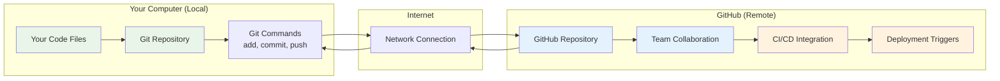
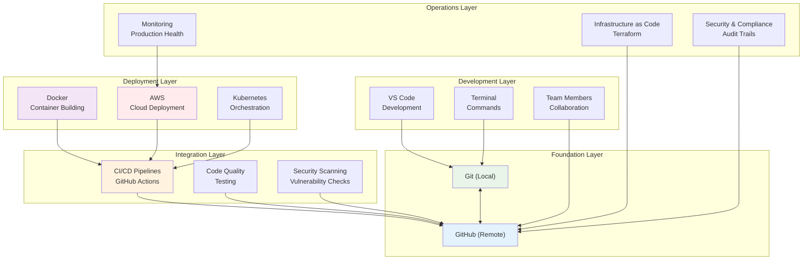
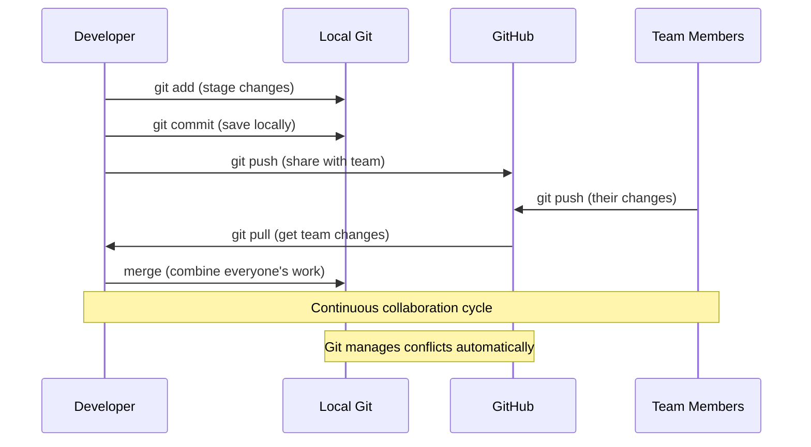
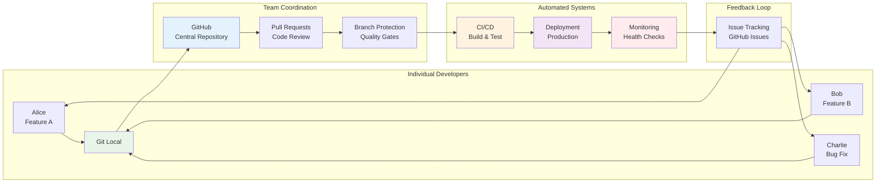
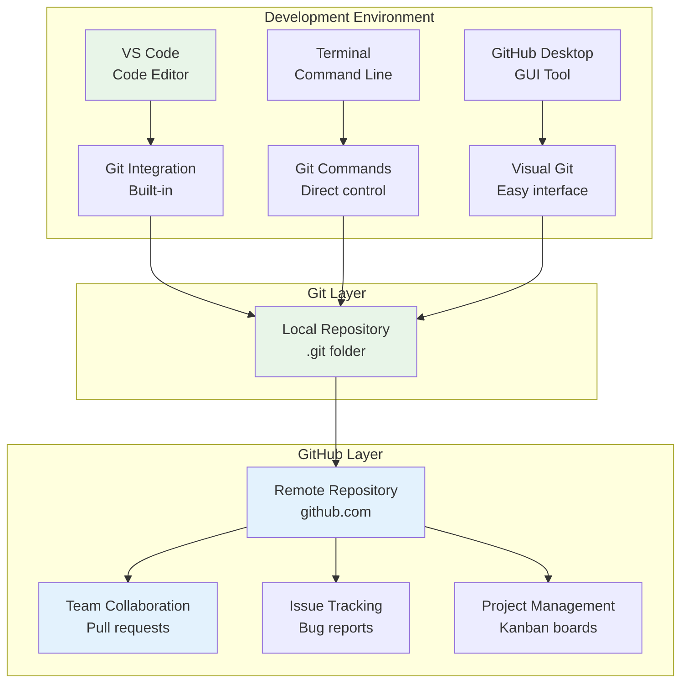
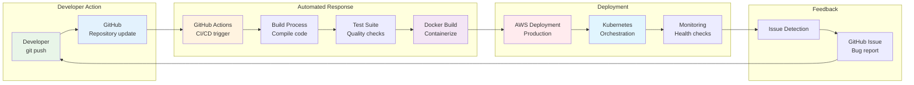
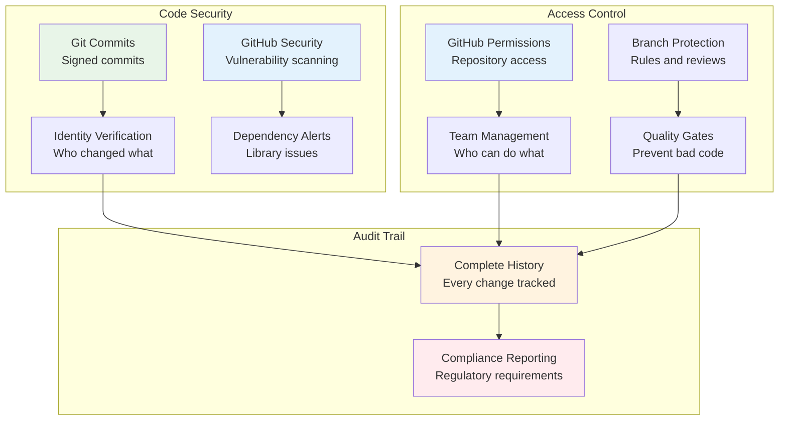
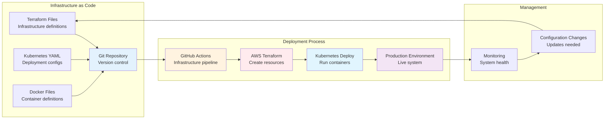
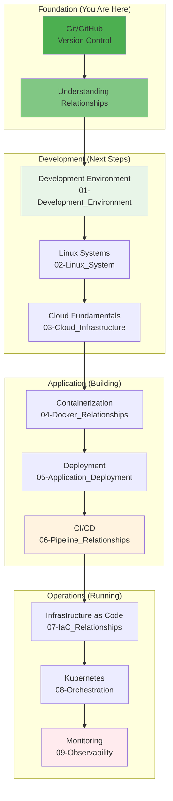

# 🌱 Git & GitHub: The Foundation of All DevOps Relationships

## 📖 What This File Does
This guide explains how Git and GitHub form the **foundational relationship** that connects to every other technology in your DevOps journey. Understanding this relationship is crucial because **everything else builds on top of version control**.

## 🎯 Learning Objectives
- Understand the Git ↔ GitHub relationship and why both are needed
- See how Git/GitHub connects to IDEs, CI/CD, deployment, and infrastructure
- Learn why version control is the foundation for all DevOps practices
- Understand local vs. remote development workflows
- See how Git/GitHub enables team collaboration at scale

## 📋 Prerequisites
- Basic understanding of files and folders
- General concept of software development
- Awareness that multiple people work on the same code

---

## 🔍 **The Fundamental Relationship: Git ↔ GitHub**

### **🎯 What Each Technology Does**

| Technology | What It Is | What It Does | Where It Lives |
|------------|------------|--------------|----------------|
| **Git** | Version control system | Tracks file changes locally | Your computer |
| **GitHub** | Cloud hosting platform | Stores repositories online | GitHub's servers |

### **🔗 How They Work Together**



### **💡 The Key Insight: Git ≠ GitHub**

> **📝 Quick Context for New Devs:**  
> Think of Git like a diary that you write in every day (tracking all your code changes), and GitHub like a copy machine that shares your diary entries with your friends and teammates. You need both - the diary to record what happened, and the copy machine to share it with others.

**Common Beginner Confusion:**
- "I thought Git and GitHub were the same thing!"
- "Why do I need both?"
- "Can't I just use GitHub?"

**The Reality:**
- **Git** = The tool that tracks changes (like Microsoft Word's "Track Changes" but for code)
- **GitHub** = The place where code lives online (like Google Drive but for developers)
- **You need both** because Git handles local changes, GitHub handles sharing and collaboration

> **🎯 Real-World Analogy:**  
> Git is like your car (you use it to get around locally), and GitHub is like the highway system (it connects everyone together). You can't drive on the highway without a car, and having a car is pointless if there are no roads to connect to other places.

---

## 🏗️ **How Git/GitHub Connects to Everything Else**

### **🔄 The Central Hub Concept**

Git and GitHub act as the **central hub** that connects all other DevOps technologies:



### **🎯 Why This Foundation Matters**

Every other technology in your DevOps journey **depends on** having code in version control:

1. **CI/CD** can't run without code to build
2. **Docker** needs code to containerize
3. **AWS** deploys code that comes from repositories
4. **Kubernetes** orchestrates containers built from code
5. **Monitoring** tracks applications deployed from code

---

## 👥 **Team Collaboration Relationships**

### **🔄 Individual Developer Workflow**



### **🏢 Enterprise Team Relationships**



---

## 🛠️ **Development Tool Relationships**

### **🎨 How IDEs Connect to Git/GitHub**



### **💡 Why Multiple Tools Access Git**

Different tools serve different purposes:
- **VS Code**: Writing code with Git integration
- **Terminal**: Direct Git control and advanced operations
- **GitHub Desktop**: Visual interface for Git operations
- **GitHub Web**: Online collaboration and project management

**They all work with the same Git repository** - just different interfaces!

---

## 🚀 **CI/CD Pipeline Relationships**

### **🔄 How Code Moves Through Systems**



### **🎯 The Trigger Relationship**

**Key Insight:** Almost everything in DevOps is **triggered by Git events**:

| Git Event | What It Triggers | Technology Used |
|-----------|------------------|-----------------|
| `git push` | Build pipeline | CI/CD (GitHub Actions) |
| Pull request | Code review | GitHub + team process |
| Merge to main | Production deployment | CI/CD + AWS |
| Tag creation | Release process | GitHub Releases + deployment |
| Issue creation | Bug tracking | GitHub Issues + project management |

---

## 🔒 **Security & Compliance Relationships**

### **🛡️ How Git/GitHub Enables Security**



---

## 🌐 **Infrastructure Relationships**

### **🏗️ How Git Manages Infrastructure**



### **💡 Infrastructure as Code Concept**

**Traditional Approach:** Click buttons in AWS console
**Modern Approach:** Infrastructure defined in code files, managed with Git

**Benefits of Git for Infrastructure:**
- **Version control** for infrastructure changes
- **Team collaboration** on infrastructure design
- **Automated deployment** of infrastructure updates
- **Rollback capability** if infrastructure changes cause issues

---

## 📊 **Learning Path Connections**

### **🎯 How Git/GitHub Connects to Your Learning Journey**



### **🔗 Cross-File References**

As you progress through the learning path, you'll see how Git/GitHub relationships expand:

- **`01-Development_Environment_Relationships.md`**: How Git integrates with IDEs and local development
- **`04-Containerization_Relationships.md`**: How Docker builds from Git repositories  
- **`06-CI_CD_Pipeline_Relationships.md`**: How Git events trigger automated pipelines
- **`07-Infrastructure_As_Code_Relationships.md`**: How Terraform and infrastructure live in Git
- **`08-Container_Orchestration_Relationships.md`**: How Kubernetes deployments come from Git

---

## 🎯 **Practical Examples**

### **🔰 Example 1: Simple Website Relationship**

```
Your HTML Files → Git (track changes) → GitHub (share) → GitHub Pages (deploy) → Live Website
```

**Technologies Involved:**
- **Git**: Version control for your HTML/CSS files
- **GitHub**: Repository hosting and collaboration
- **GitHub Pages**: Automatic deployment from repository

### **👨‍💻 Example 2: Full-Stack Application**

```
React Code → Git → GitHub → CI/CD → Docker → AWS → Users
```

**Technologies Involved:**
- **Git**: Version control for React source code
- **GitHub**: Team collaboration and code reviews
- **CI/CD**: Automated building and testing
- **Docker**: Containerized deployment
- **AWS**: Cloud hosting and scaling

### **🏢 Example 3: Enterprise Microservices**

```
Multiple Services → Git Repositories → GitHub → Kubernetes → Monitoring → Security
```

**Technologies Involved:**
- **Git**: Version control for each microservice
- **GitHub**: Centralized repository management
- **Kubernetes**: Container orchestration
- **Monitoring**: Production observability
- **Security**: Vulnerability scanning and compliance

---

## 🚨 **Common Relationship Misunderstandings**

### **❌ Misconception 1: "I can skip Git and just use GitHub"**
**✅ Reality:** GitHub **requires** Git. GitHub is just a hosting service for Git repositories.

### **❌ Misconception 2: "Git is just for backing up code"**
**✅ Reality:** Git enables **collaboration, deployment, infrastructure management, and security**.

### **❌ Misconception 3: "GitHub is just for storing code"**
**✅ Reality:** GitHub **integrates with every other DevOps tool** - CI/CD, deployment, monitoring, security.

### **❌ Misconception 4: "I only need to learn Git commands"**
**✅ Reality:** Understanding **Git workflows and team collaboration** patterns is more important than memorizing commands.

---

## 🔄 **Next Steps in Your Learning Journey**

### **🎯 Immediate Next Steps**
1. **Set up Git and GitHub** if you haven't already (see our Git authentication guide)
2. **Practice basic workflows**: clone, add, commit, push, pull
3. **Understand branching** for team collaboration

### **🔗 Related Files to Read Next**
- **`01-Development_Environment_Relationships.md`**: How Git integrates with your coding setup
- **Terminal Commands**: `/Terminal_Commands/Git_Commands.md` for comprehensive Git command reference
- **Git Fundamentals**: `/DevOps/01-Fundamentals_And_Environment_Setup/03-Version_Control_Mastery/` for deep Git knowledge

### **💡 Key Relationship Concepts to Remember**
- **Git is local, GitHub is remote** - you need both
- **Everything else builds on version control** - no Git/GitHub = no modern DevOps
- **Git events trigger automated systems** - pushes start pipelines, merges deploy to production
- **Version control enables team collaboration** at any scale

---

## 🔧 **Configuration Notes**

- **Foundation Dependency**: Every other technology relationship depends on understanding this one
- **Team Coordination**: Git/GitHub workflows determine how your team collaborates
- **Automation Trigger**: Most DevOps automation starts with Git events
- **Security Foundation**: Git provides identity, audit trails, and access control

---

## 📚 **Terminology**

### **Version Control**
- **Repository (Repo)**: A project folder containing all files and their complete change history
- **Working Directory**: Your local folder where you edit files
- **Staging Area**: Temporary area where changes are prepared before committing
- **Commit**: A snapshot of your project at a specific point in time
- **Branch**: An independent line of development within a repository
- **Merge**: Combining changes from one branch into another
- **Clone**: Creating a local copy of a remote repository
- **Fork**: Creating your own copy of someone else's repository

### **Git Commands**
- **git add**: Stage changes for the next commit
- **git commit**: Save staged changes as a new commit
- **git push**: Upload local commits to remote repository
- **git pull**: Download and merge remote changes to local repository
- **git fetch**: Download remote changes without merging
- **git status**: Show current state of working directory and staging area
- **git log**: Display commit history
- **git diff**: Show differences between files or commits

### **GitHub Platform**
- **Remote Repository**: Repository hosted on GitHub's servers
- **Pull Request (PR)**: Proposed changes submitted for review and merging
- **Issue**: Bug report, feature request, or discussion topic
- **Release**: Tagged version of your project with release notes
- **GitHub Actions**: Automated workflows triggered by repository events
- **GitHub Pages**: Free static website hosting from your repository

### **Collaboration**
- **Collaborator**: Team member with write access to a repository
- **Contributor**: Anyone who submits changes to a project
- **Maintainer**: Person responsible for managing a project
- **Code Review**: Process of examining proposed changes before merging
- **Conflict**: When Git cannot automatically merge changes
- **Upstream**: The original repository when working with forks

### **Workflow Patterns**
- **Feature Branch**: Separate branch for developing a new feature
- **Main/Master Branch**: Primary branch containing production-ready code
- **Development Branch**: Integration branch for ongoing development
- **Hotfix**: Quick fix for critical issues in production
- **Git Flow**: Branching strategy with specific branch purposes
- **GitHub Flow**: Simplified workflow using feature branches and pull requests

---

📄 **File Path:** `/Tech_Relationships/00-Git_GitHub_Foundation.md` 