# 🛠️ Development Environment Relationships: Your Local DevOps Foundation

## 📖 What This File Does
This guide explains how your local development environment tools work together to create a productive DevOps workflow. You'll understand how IDEs, terminals, package managers, and development servers connect to form your daily development experience.

## 🎯 Learning Objectives
- Understand how IDEs, terminals, and package managers relate to each other
- See how local development tools connect to Git/GitHub workflows
- Learn the relationship between development and production environments
- Understand how Node.js, npm, and package management fit together
- See how development servers relate to production deployment

## 📋 Prerequisites
- Understanding of Git/GitHub relationships (see `00-Git_GitHub_Foundation.md`)
- Basic familiarity with text editors and command-line concepts
- General awareness of web development (HTML, CSS, JavaScript)

---

## 🏗️ **The Development Environment Ecosystem**

### **🔄 How Local Tools Work Together**

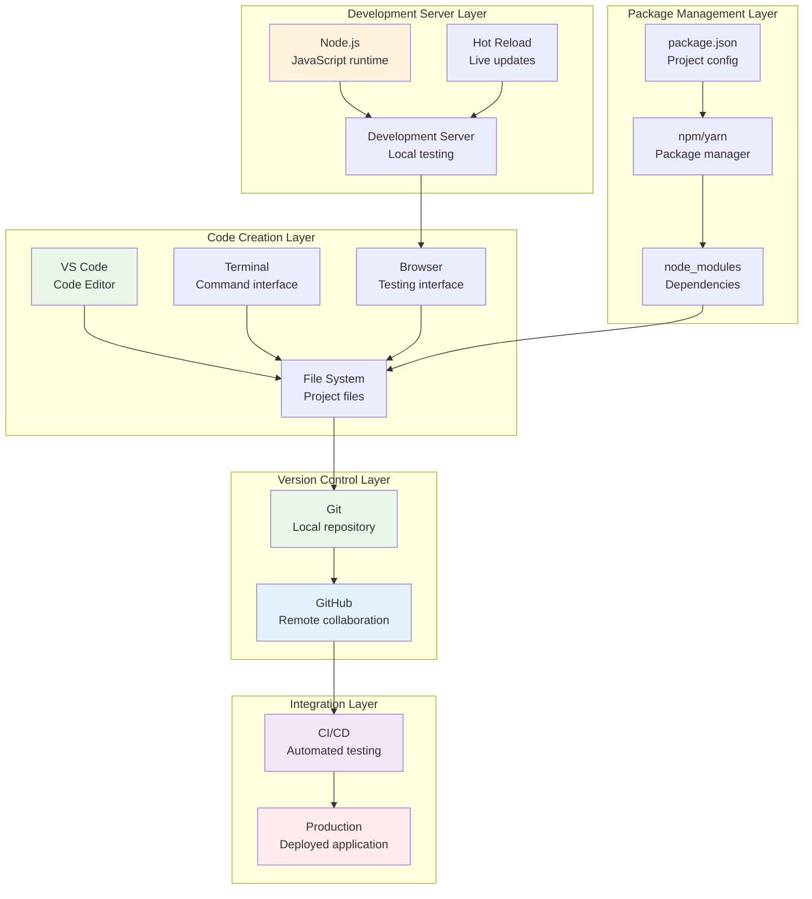

### **💡 Key Insight: Development ↔ Production Relationship**

> **📝 Quick Context for New Devs:**  
> Your laptop is like a small-scale version of a real website's infrastructure. When you run `npm start` and see your app on localhost:3000, you're essentially running the same type of server that powers Netflix or Twitter - just smaller and local to your machine.

Your local development environment is a **miniature version** of production:

| Local Development | Production Equivalent | Purpose |
|-------------------|----------------------|---------|
| **VS Code** | Code deployment | Writing and editing code |
| **Development Server** | Production server | Running your application |
| **localhost:3000** | your-domain.com | Accessing your application |
| **npm install** | Container/server setup | Installing dependencies |
| **Git commits** | Production deployments | Publishing changes |

> **🚀 Why This Matters:**  
> This isn't just an analogy - it's literally the same Node.js runtime, the same npm packages, and often the same code! The main differences are scale (production handles millions of users vs just you) and infrastructure (production has load balancers, databases, etc.).

---

## 🎨 **IDE and Code Editor Relationships**

### **🔄 VS Code as the Central Hub**

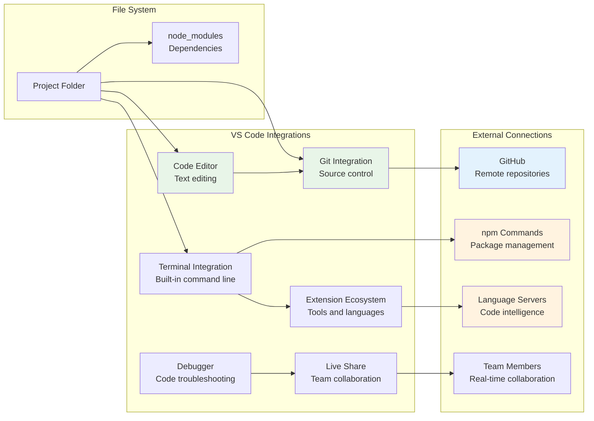

### **🎯 Why VS Code Dominates Development**

**Integration Benefits:**
- **Git built-in**: See changes, commit, push without leaving the editor
- **Terminal embedded**: Run commands without switching windows
- **Extension ecosystem**: One tool for all languages and frameworks
- **Live debugging**: Set breakpoints and inspect code execution
- **Team collaboration**: Share coding sessions in real-time

### **🔧 Alternative Editor Relationships**

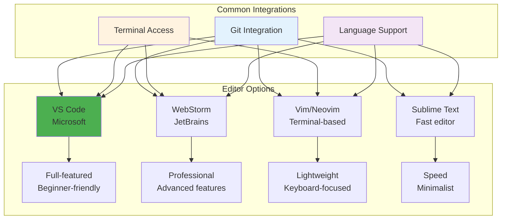

---

## 💻 **Terminal and Command-Line Relationships**

### **🔄 Terminal as the Universal Interface**

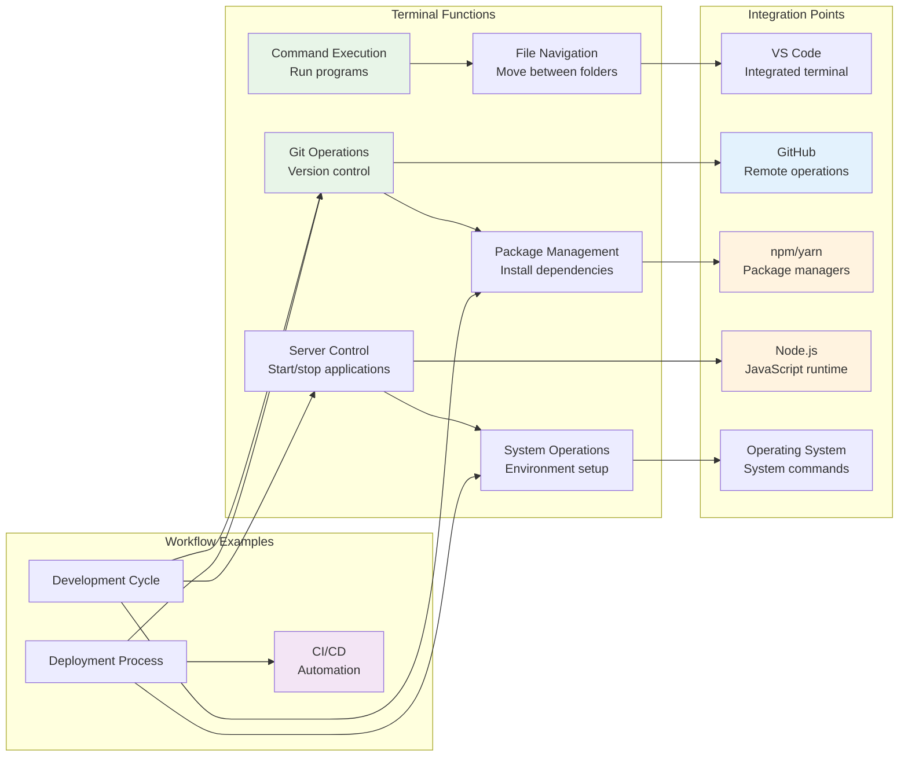

### **💡 Terminal Skills for DevOps**

> **📝 Quick Context for New Devs:**  
> Don't let the terminal intimidate you! These commands are like keyboard shortcuts - they seem scary at first, but they're actually faster than clicking through menus once you learn them. You'll use these same commands whether you're working on a small project or managing servers for millions of users.

**Essential Command Categories:**
```bash
# File and directory operations
ls, cd, mkdir, rm, cp, mv

# Git operations  
git add, git commit, git push, git pull

# Package management
npm install, npm start, npm run build

# Server operations
node server.js, npm run dev, kill process

# System operations
ps, top, df, which, whereis
```

> **🚀 Pro Tip:**  
> Start with just 5 commands: `ls` (list files), `cd` (change directory), `git status`, `npm install`, and `npm start`. These five will handle 80% of your daily work. Add more commands as you need them - don't try to memorize everything at once!

### **🎯 Terminal Relationship to Other Tools**

| Terminal Command | Related Tool | What It Does |
|------------------|--------------|--------------|
| `git status` | VS Code Git panel | Shows file changes |
| `npm start` | Development server | Starts local application |
| `code .` | VS Code | Opens current folder in editor |
| `node --version` | Node.js runtime | Checks JavaScript environment |
| `npm install` | package.json | Installs project dependencies |

---

## 📦 **Package Management Relationships**

### **🔄 npm/Node.js Ecosystem**

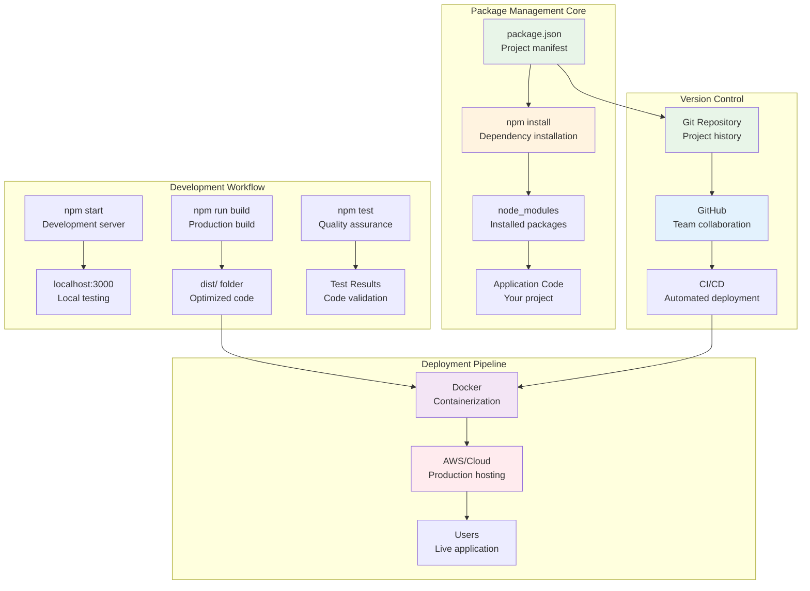

### **📋 package.json: The Project Relationship Hub**

```json
{
  "name": "my-app",
  "version": "1.0.0",
  "scripts": {
    "start": "node server.js",
    "dev": "nodemon server.js",
    "build": "webpack --mode production",
    "test": "jest"
  },
  "dependencies": {
    "express": "^4.18.0",
    "react": "^18.2.0"
  },
  "devDependencies": {
    "nodemon": "^2.0.15",
    "jest": "^29.0.0"
  }
}
```

**Relationship Breakdown:**
- **`scripts`**: Commands that connect to development tools
- **`dependencies`**: Libraries your application needs in production
- **`devDependencies`**: Tools for development and building
- **`name`/`version`**: Identity for package registries and deployment

### **🎯 Development vs Production Dependencies**

> **📝 Quick Context for New Devs:**  
> Think of dependencies like tools in a toolbox. Development dependencies (devDependencies) are like your drafting tools - you use them while building, but you don't ship them with the final product. Production dependencies are like the actual screws and bolts - they're part of the final product that users interact with.

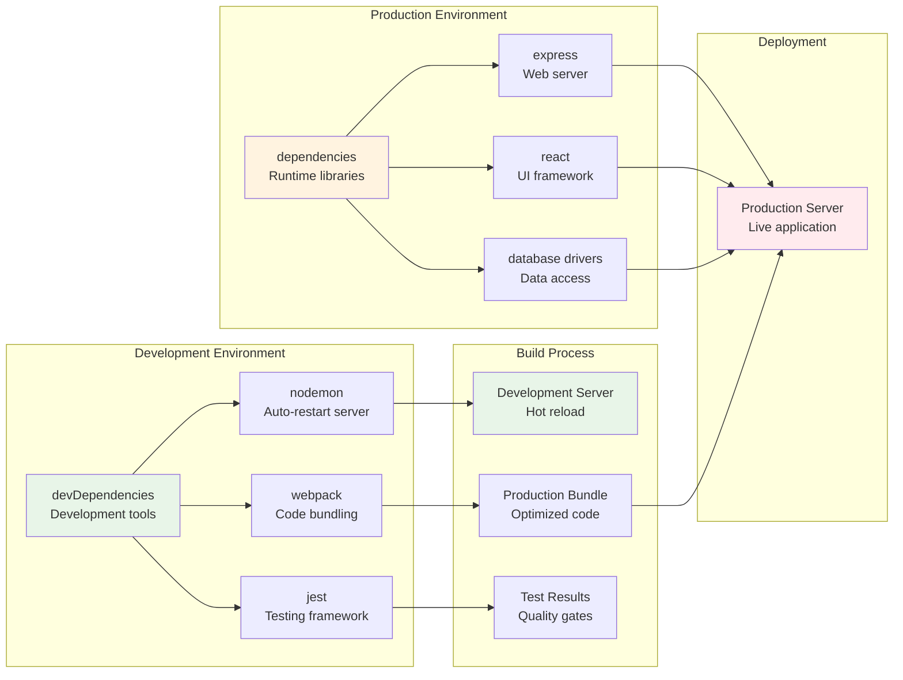

> **💰 Why This Matters for Performance:**  
> Keeping development tools out of production makes your application smaller and faster. A React app might need 50MB of dev tools during development but only ship 2MB to users. This means faster load times and lower bandwidth costs.

---

## 🌐 **Development Server Relationships**

### **🔄 Local Development Server Ecosystem**

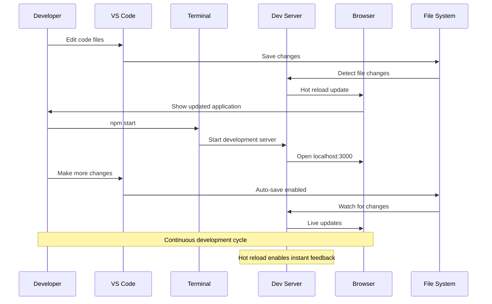

### **🎯 Development Server Technologies**

| Technology | What It Provides | Relationship to Production |
|------------|------------------|----------------------------|
| **Webpack Dev Server** | Hot module replacement | Simulates production bundling |
| **Vite** | Fast rebuilds and HMR | Modern build tool alternative |
| **Node.js + Express** | Backend API development | Direct production equivalent |
| **Create React App** | Full-stack development | Production build pipeline |
| **Next.js** | Full-stack React development | Server-side rendering + API |

### **💡 Development vs Production Server Relationship**

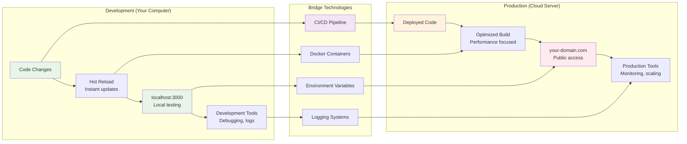

---

## 🔗 **Integration with Git/GitHub Workflows**

### **🔄 Complete Development Cycle**

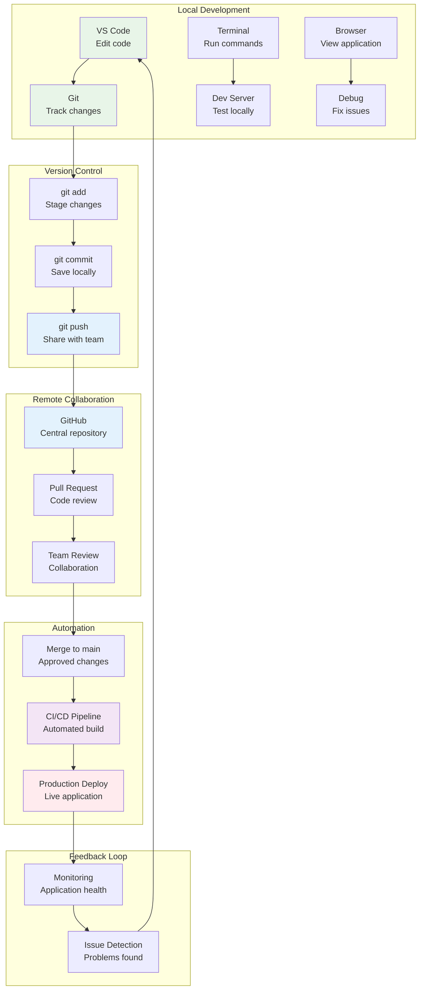

### **🎯 Daily Development Workflow Integration**

```bash
# Morning: Start development
code .                          # Open VS Code
git pull origin main           # Get team updates
npm install                    # Update dependencies
npm start                      # Start development server

# During development: Continuous cycle
# 1. Edit code in VS Code
# 2. See changes in browser (localhost:3000)
# 3. Test functionality
# 4. Debug issues

# End of day: Share progress
git add .                      # Stage changes
git commit -m "feat: add user login"  # Save locally
git push origin feature-branch # Share with team

# Deployment: Automated process
# 1. Create pull request on GitHub
# 2. Team reviews code
# 3. Merge triggers CI/CD
# 4. Application deploys to production
```

---

## 🛠️ **Tool Relationships by Development Type**

### **🌐 Frontend Development Stack**

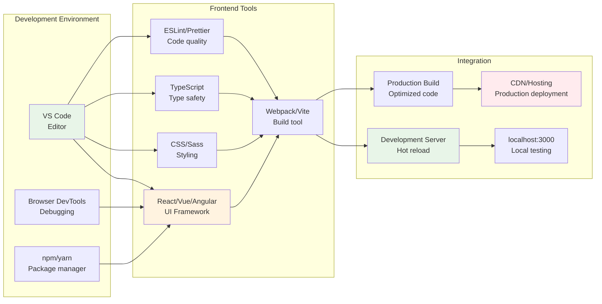

### **🔧 Backend Development Stack**

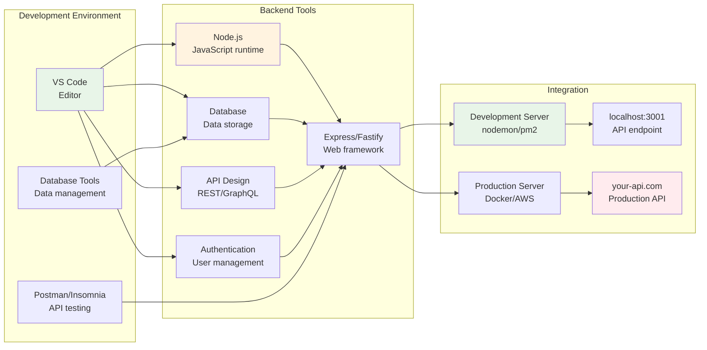

### **🔄 Full-Stack Development Integration**

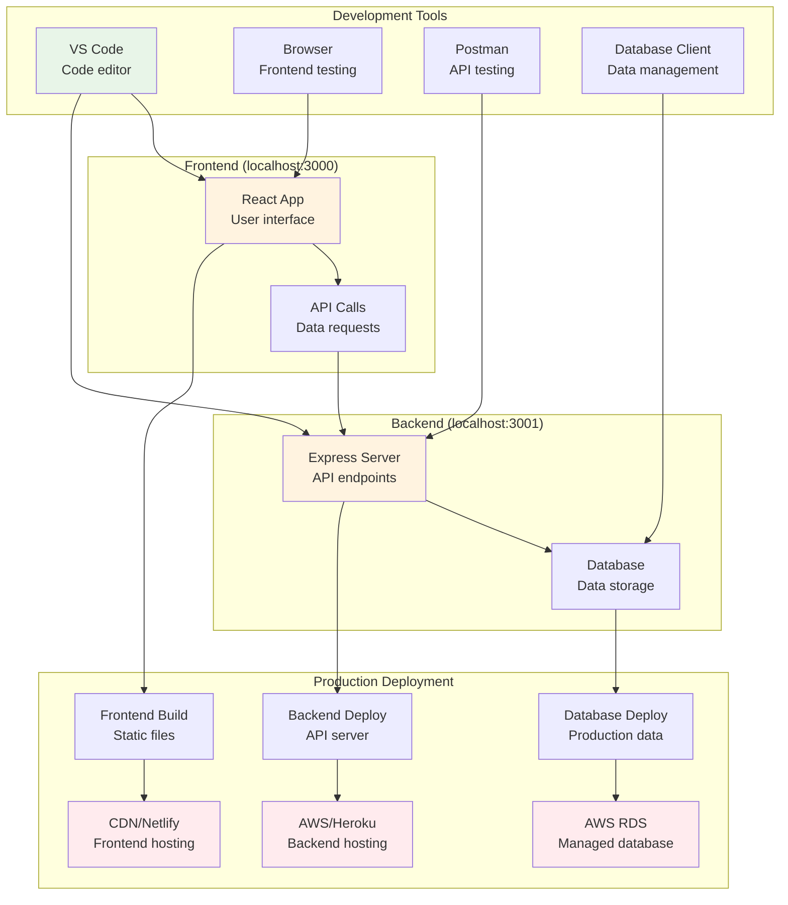

---

## 🎯 **Environment Configuration Relationships**

### **🔧 Environment Variables and Configuration**

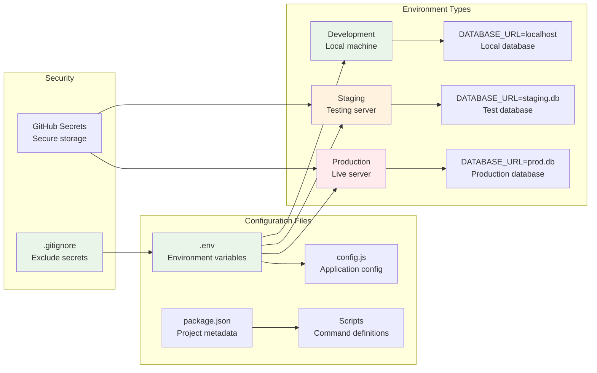

### **💡 Configuration Best Practices**

**Development Environment Setup:**
```bash
# .env file (local development)
DATABASE_URL=postgresql://localhost:5432/myapp_dev
API_KEY=dev_api_key_12345
PORT=3000
NODE_ENV=development

# package.json scripts
{
  "scripts": {
    "dev": "NODE_ENV=development nodemon server.js",
    "start": "NODE_ENV=production node server.js",
    "test": "NODE_ENV=test jest"
  }
}
```

**Environment Separation Benefits:**
- **Development**: Fast feedback, detailed logging, hot reload
- **Staging**: Production-like testing, integration validation
- **Production**: Performance optimized, monitoring enabled, security hardened

---

## 🚨 **Common Development Environment Issues**

### **❌ Problem: "It works on my machine"**

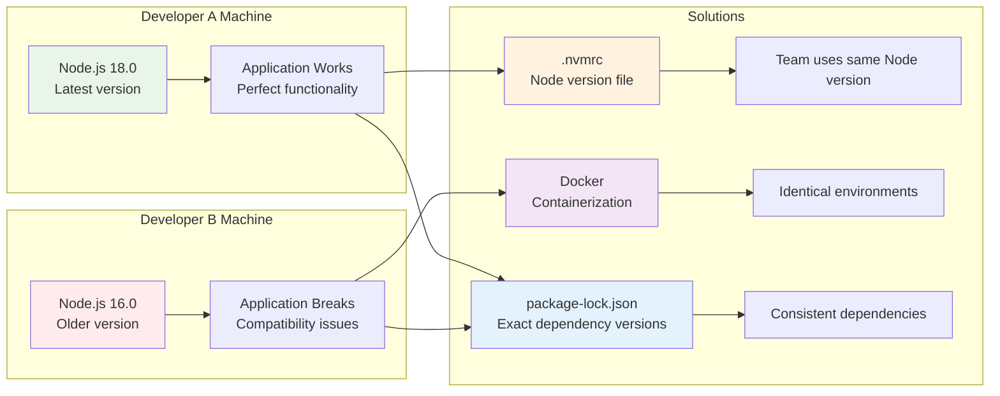

### **✅ Solution: Environment Standardization**

**Tools for Consistency:**
- **`.nvmrc`**: Specify Node.js version for the project
- **`package-lock.json`**: Lock exact dependency versions
- **Docker**: Containerize development environment
- **VS Code settings**: Share editor configuration
- **ESLint/Prettier**: Enforce code formatting standards

---

## 🔄 **Next Steps in Your Learning Journey**

### **🎯 Development Environment Mastery**

1. **Master your IDE**: Learn VS Code shortcuts and extensions
2. **Terminal proficiency**: Practice Git and npm commands daily
3. **Package management**: Understand dependencies vs devDependencies
4. **Development servers**: Set up hot reload and debugging
5. **Environment configuration**: Manage multiple environments properly

### **🔗 Related Files to Read Next**

- **`02-Linux_System_Relationships.md`**: How your development environment runs on the operating system
- **`04-Containerization_Relationships.md`**: How Docker standardizes development environments
- **`06-CI_CD_Pipeline_Relationships.md`**: How local development connects to automated deployment

### **💡 Key Relationship Concepts**

- **Local mirrors production**: Your development environment should simulate production
- **Git connects everything**: Version control integrates all development tools
- **Package managers handle dependencies**: npm/yarn manage your project's requirements
- **Development servers enable rapid feedback**: Hot reload accelerates development cycles
- **Environment configuration ensures consistency**: Same code, different environments

---

## 🔧 **Configuration Notes**

- **Tool Integration**: Choose tools that work well together (VS Code + Terminal + Git)
- **Environment Parity**: Keep development and production as similar as possible
- **Team Consistency**: Standardize tools and configurations across the team
- **Security**: Never commit secrets, use environment variables and .gitignore

---

## 📚 **Terminology**

### **Development Environment**
- **IDE (Integrated Development Environment)**: Complete development platform with editor, debugger, and tools
- **Code Editor**: Text editor optimized for writing code
- **Extension**: Add-on that provides additional functionality to an editor
- **Workspace**: Project folder and its configuration in an IDE
- **IntelliSense**: Code completion and suggestions based on context
- **Syntax Highlighting**: Color-coding of code elements for readability
- **Linting**: Automated code analysis for errors and style issues
- **Debugging**: Process of finding and fixing code errors

### **Terminal and Command Line**
- **Terminal**: Text-based interface for running commands
- **Shell**: Program that interprets and executes commands (bash, zsh, PowerShell)
- **Command Line Interface (CLI)**: Text-based user interface
- **Path**: Location of files or programs in the file system
- **Environment Variables**: System-wide settings accessible to programs
- **Script**: File containing commands to be executed by the shell
- **Alias**: Custom shortcut for frequently used commands
- **Tab Completion**: Auto-complete feature for commands and file names

### **Package Management**
- **Package Manager**: Tool for installing and managing software dependencies
- **Dependency**: External library or tool required by your project
- **package.json**: Configuration file defining Node.js project metadata and dependencies
- **node_modules**: Folder containing installed npm packages
- **npm (Node Package Manager)**: Default package manager for Node.js
- **yarn**: Alternative package manager for JavaScript projects
- **Semantic Versioning**: Version numbering system (major.minor.patch)
- **Lock File**: File ensuring consistent dependency versions across environments

### **Development Servers**
- **Development Server**: Local server for testing applications during development
- **Hot Reload/HMR (Hot Module Replacement)**: Automatic browser refresh when code changes
- **Live Reload**: Browser refresh when files are saved
- **Port**: Network endpoint where services listen for connections
- **localhost**: Loopback address (127.0.0.1) referring to your local machine
- **Proxy**: Intermediate server that forwards requests to another server
- **Build Tool**: Software that compiles and optimizes code for production
- **Bundler**: Tool that combines multiple files into optimized bundles

### **Environment Configuration**
- **Environment Variables**: Configuration values stored outside the code
- **.env File**: File containing environment-specific configuration
- **Configuration Management**: Practice of handling settings across different environments
- **Development vs Production**: Different environment types with specific configurations
- **Environment Parity**: Keeping development and production environments similar
- **.gitignore**: File specifying which files Git should ignore
- **dotfiles**: Configuration files starting with a dot (hidden files)
- **PATH Variable**: System variable listing directories containing executable programs

### **File System and Project Structure**
- **Working Directory**: Current folder where commands are executed
- **Root Directory**: Top-level directory of a file system or project
- **Relative Path**: File path relative to current directory
- **Absolute Path**: Complete file path from root directory
- **Symlink (Symbolic Link)**: Reference pointing to another file or directory
- **Project Structure**: Organization of files and folders in a codebase
- **Source Control**: Managing code changes and versions
- **Backup**: Copy of files for disaster recovery

---

📄 **File Path:** `/Tech_Relationships/01-Development_Environment_Relationships.md` 