# 🐧 Linux System Administration Relationships: The Foundation Infrastructure

## 📖 What This File Does
This guide explains how Linux system administration forms the **foundational infrastructure layer** that underlies all DevOps technologies. You'll understand how Linux connects to containers, cloud services, automation tools, and enterprise operations.

## 🎯 Learning Objectives
- Understand how Linux serves as the foundation for all DevOps infrastructure
- See the relationship between Linux system administration and cloud platforms
- Learn how Linux connects to containerization, orchestration, and automation
- Understand how system administration skills scale from single servers to enterprise infrastructure
- See how Linux security and monitoring integrate with DevOps practices

## 📋 Prerequisites
- Basic understanding of operating systems and file systems
- Familiarity with command-line concepts
- General awareness of servers and networking
- Understanding of the role of system administrators

---

## 🔍 **The Linux Foundation Paradigm**

### **🎯 Why Linux Dominates DevOps Infrastructure**


### **💡 Key Insight: Linux as the Universal Platform**

> **📝 Quick Context for New DevOps Engineers:**  
> Think of Linux like the foundation of a skyscraper. You might not see it once the building is complete, but everything else—containers, cloud services, databases, web servers—depends on that solid foundation. Even when you're using "serverless" technologies, Linux is still running underneath.

**Linux Market Dominance in Infrastructure:**
- **96.3%** of the world's top 1 million servers run Linux
- **100%** of the top 500 supercomputers run Linux
- **85%** of smartphones run Linux (Android)
- **Major cloud providers** run primarily on Linux infrastructure
- **Container ecosystem** is built entirely on Linux technologies

> **🚀 Why This Matters for Your Career:**  
> Every DevOps technology you'll learn—Docker, Kubernetes, AWS, CI/CD pipelines—ultimately runs on Linux. Understanding Linux system administration gives you the foundational knowledge to troubleshoot, optimize, and secure any infrastructure at any scale.

---

## 🏗️ **Linux File System Relationships**

### **🔄 File System as the DevOps Backbone**


### **📋 Essential Linux Directory Relationships**

| Directory | DevOps Purpose | Related Technologies | Why It Matters |
|-----------|----------------|---------------------|----------------|
| **`/var/log`** | Application and system logs | ELK Stack, Fluentd, Grafana | Debugging, monitoring, compliance |
| **`/etc`** | Configuration files | Ansible, Puppet, Docker configs | Infrastructure as Code, automation |
| **`/home`** | User directories and SSH keys | Git repositories, SSH access | Development workflows, access control |
| **`/opt`** | Third-party applications | Custom software, vendor tools | Application deployment, package management |
| **`/var/lib`** | Application data | Docker images, database files | Persistent storage, state management |
| **`/proc`** | System information | Monitoring tools, health checks | Real-time system metrics, troubleshooting |
| **`/sys`** | Hardware interface | Resource monitoring, tuning | Performance optimization, hardware management |

### **🔧 File System Operations for DevOps**

```bash
# Essential file system commands for DevOps
# ==========================================

# Log analysis and monitoring
tail -f /var/log/syslog              # Follow system logs in real-time
grep "ERROR" /var/log/nginx/error.log # Search for errors in web server logs
find /var/log -name "*.log" -mtime -1 # Find logs modified in last day

# Configuration management
sudo cp /etc/nginx/nginx.conf /etc/nginx/nginx.conf.backup  # Backup configs
sudo diff /etc/nginx/nginx.conf.backup /etc/nginx/nginx.conf # Compare configs
sudo find /etc -name "*.conf" -type f  # Find all configuration files

# Disk space monitoring (critical for servers)
df -h                                # Check disk usage by filesystem
du -sh /var/log/*                    # Check space used by log directories
sudo find / -size +100M -type f      # Find large files consuming space

# Process and service management
ps aux | grep nginx                  # Find web server processes
sudo systemctl status docker        # Check Docker service status
sudo netstat -tulpn | grep :80       # Check what's listening on port 80
```

---

## 👥 **User and Permission Management Relationships**

### **🔒 Security Foundation for DevOps**

```mermaid
flowchart TD
    subgraph "User Management Layer"
        A["System Users<br/>• root (admin)<br/>• service accounts<br/>• application users<br/>• developer accounts"] --> B["Groups<br/>• sudo group<br/>• docker group<br/>• application groups<br/>• department groups"]
    end
    
    subgraph "Permission Systems"
        C["File Permissions<br/>• read (r)<br/>• write (w)<br/>• execute (x)<br/>• owner/group/other"] --> D["Advanced Permissions<br/>• setuid/setgid<br/>• sticky bit<br/>• ACLs<br/>• SELinux/AppArmor"]
    end
    
    subgraph "DevOps Integration"
        E["SSH Access<br/>• Key-based authentication<br/>• SSH agent forwarding<br/>• Bastion hosts<br/>• Certificate authority"] --> F["Service Accounts<br/>• Docker daemon<br/>• Kubernetes service accounts<br/>• CI/CD runners<br/>• Monitoring agents"]
        G["Sudo Configuration<br/>• Passwordless sudo<br/>• Command restrictions<br/>• Audit logging<br/>• Role-based access"] --> H["Application Security<br/>• Non-root containers<br/>• Principle of least privilege<br/>• Resource quotas<br/>• Security contexts"]
    end
    
    B --> C
    D --> E
    F --> G
    
    style A fill:#ff6b6b
    style E fill:#4ecdc4
    style G fill:#96ceb4
    style H fill:#feca57
```



### **🎯 Permission Management for DevOps Scenarios**

```bash
# User and permission management for DevOps
# =========================================

# Create service users for applications
sudo useradd -r -s /bin/false nginx-user    # System user for nginx
sudo useradd -r -s /bin/false app-user      # Application service user
sudo usermod -aG docker developer           # Add user to docker group

# SSH key management for automation
ssh-keygen -t ed25519 -C "deployment-key"   # Generate deployment key
ssh-copy-id -i ~/.ssh/id_ed25519.pub user@server  # Copy key to server
sudo mkdir -p /home/deploy/.ssh             # Create SSH directory for deploy user
sudo chown deploy:deploy /home/deploy/.ssh   # Set proper ownership

# File permissions for applications
sudo chmod 755 /opt/myapp                   # Executable directory
sudo chmod 644 /etc/myapp/config.yaml       # Read-only config file
sudo chmod 600 /etc/myapp/secrets.yaml      # Secret file (owner only)
sudo chown app-user:app-group /var/log/myapp  # Application log ownership

# Sudo configuration for DevOps users
echo "deploy ALL=(ALL) NOPASSWD: ALL" | sudo tee /etc/sudoers.d/deploy
echo "developer ALL=(ALL) NOPASSWD: /usr/bin/docker, /usr/bin/kubectl" | sudo tee /etc/sudoers.d/developer
```

### **💡 Security Best Practices Integration**

**Principle of Least Privilege in DevOps:**
- **Container security**: Run containers as non-root users
- **SSH access**: Use key-based authentication, disable password login
- **Service accounts**: Create dedicated users for each service
- **File permissions**: Restrict access to configuration and secret files
- **Sudo access**: Grant only necessary commands, log all actions

---

## 🌐 **Networking and System Services**

### **🔄 Network Infrastructure Relationships**

```mermaid
flowchart LR
    subgraph "Linux Network Stack"
        A["Network Interfaces<br/>• eth0, wlan0<br/>• Virtual interfaces<br/>• Bridge networks<br/>• Tunnel interfaces"] --> B["IP Configuration<br/>• Static IP addressing<br/>• DHCP client<br/>• DNS resolution<br/>• Routing tables"]
    end
    
    subgraph "System Services"
        C["SSH Service<br/>• Remote access<br/>• Key management<br/>• Port forwarding<br/>• Secure tunneling"] --> D["Web Services<br/>• nginx/apache<br/>• Load balancing<br/>• SSL termination<br/>• Reverse proxy"]
        E["Container Networking<br/>• Docker bridge<br/>• Kubernetes CNI<br/>• Service mesh<br/>• Ingress controllers"] --> F["Monitoring Services<br/>• Prometheus exporters<br/>• Log shipping<br/>• Health checks<br/>• Metrics collection"]
    end
    
    subgraph "DevOps Tools Integration"
        G["CI/CD Connectivity<br/>• GitHub webhooks<br/>• API endpoints<br/>• Build agents<br/>• Deployment targets"] --> H["Cloud Integration<br/>• VPN connections<br/>• Private networks<br/>• Load balancers<br/>• CDN endpoints"]
    end
    
    B --> C
    D --> E
    F --> G
    
    style A fill:#ff6b6b
    style C fill:#4ecdc4
    style E fill:#45b7d1
    style G fill:#96ceb4
```



### **🔧 Network Configuration for DevOps**

```bash
# Network management for DevOps infrastructure
# ============================================

# Network interface management
ip addr show                         # Show all network interfaces
sudo ip addr add 192.168.1.100/24 dev eth0  # Assign static IP
sudo ip route add default via 192.168.1.1    # Set default gateway

# Service management with systemd
sudo systemctl enable nginx         # Enable nginx to start at boot
sudo systemctl start nginx          # Start nginx service
sudo systemctl status docker        # Check Docker service status
sudo systemctl reload ssh           # Reload SSH configuration

# Firewall configuration (iptables/ufw)
sudo ufw enable                      # Enable UFW firewall
sudo ufw allow 22/tcp                # Allow SSH
sudo ufw allow 80,443/tcp            # Allow HTTP/HTTPS
sudo ufw allow from 10.0.0.0/8 to any port 3000  # Allow internal traffic

# Network troubleshooting
ping -c 4 google.com                 # Test internet connectivity
traceroute 8.8.8.8                  # Trace network path
netstat -tulpn | grep LISTEN         # Show listening ports
ss -tulpn                           # Modern alternative to netstat
```

### **📊 Service Management Relationships**

| Service Type | Linux Service | DevOps Integration | Monitoring Command |
|--------------|---------------|-------------------|-------------------|
| **Web Server** | nginx, apache | Reverse proxy, load balancer | `systemctl status nginx` |
| **Container Runtime** | docker, containerd | Container orchestration | `systemctl status docker` |
| **SSH Access** | sshd | Remote management, automation | `systemctl status ssh` |
| **Database** | mysql, postgresql | Data persistence, applications | `systemctl status mysql` |
| **Monitoring** | prometheus, grafana | Observability stack | `systemctl status prometheus` |
| **Log Management** | rsyslog, journald | Centralized logging | `journalctl -u service-name` |

---

## 📦 **Package Management Relationships**

### **🔄 Package Management Ecosystem**

```mermaid
flowchart TD
    subgraph "Linux Package Managers"
        A["APT (Debian/Ubuntu)<br/>• apt update/upgrade<br/>• apt install/remove<br/>• Package repositories<br/>• Dependency resolution"] --> B["YUM/DNF (RHEL/CentOS)<br/>• yum install/update<br/>• Repository management<br/>• Group packages<br/>• Security updates"]
        C["Snap Packages<br/>• Universal packages<br/>• Sandboxed applications<br/>• Automatic updates<br/>• Cross-distribution"] --> D["Homebrew (macOS/Linux)<br/>• Developer tools<br/>• Latest versions<br/>• Custom formulas<br/>• Easy installation"]
    end
    
    subgraph "DevOps Tool Installation"
        E["Container Tools<br/>• Docker<br/>• Kubernetes<br/>• Helm<br/>• Container runtimes"] --> F["Cloud CLIs<br/>• AWS CLI<br/>• Azure CLI<br/>• GCP SDK<br/>• Terraform"]
        G["Programming Languages<br/>• Python<br/>• Node.js<br/>• Go<br/>• Java"] --> H["Monitoring Tools<br/>• Prometheus<br/>• Grafana<br/>• ELK Stack<br/>• DataDog agent"]
    end
    
    subgraph "Automation Integration"
        I["Configuration Management<br/>• Ansible<br/>• Puppet<br/>• Chef<br/>• SaltStack"] --> J["CI/CD Tools<br/>• Jenkins<br/>• GitLab Runner<br/>• GitHub Actions runner<br/>• Build tools"]
    end
    
    A --> E
    B --> F
    C --> G
    D --> H
    E --> I
    F --> J
    
    style A fill:#ff6b6b
    style E fill:#4ecdc4
    style I fill:#96ceb4
```



### **🎯 Package Management for DevOps**

```bash
# Package management for DevOps tools installation
# ================================================

# System package management (Ubuntu/Debian)
sudo apt update                      # Update package lists
sudo apt upgrade -y                  # Upgrade all packages
sudo apt install -y curl wget git vim docker.io  # Install essential tools
sudo apt autoremove                  # Remove unnecessary packages

# Add third-party repositories
curl -fsSL https://download.docker.com/linux/ubuntu/gpg | sudo apt-key add -
sudo add-apt-repository "deb [arch=amd64] https://download.docker.com/linux/ubuntu $(lsb_release -cs) stable"

# Install specific versions for stability
sudo apt install docker-ce=5:20.10.12~3-0~ubuntu-focal  # Specific Docker version
sudo apt-mark hold docker-ce         # Prevent automatic updates

# Language-specific package managers
pip3 install --user boto3 ansible    # Python packages for DevOps
npm install -g @aws-cli/cli           # Node.js global packages
go install github.com/hashicorp/terraform@latest  # Go packages

# Snap packages for universal applications
sudo snap install kubectl --classic   # Kubernetes CLI
sudo snap install helm --classic      # Helm package manager
sudo snap install code --classic      # VS Code editor
```

---

## 🔍 **Process Management and Monitoring**

### **⚙️ Process Management for DevOps**

```mermaid
flowchart LR
    subgraph "Process Management"
        A["Process Control<br/>• ps commands<br/>• top/htop<br/>• Process signals<br/>• Job control"] --> B["Service Management<br/>• systemd<br/>• Service files<br/>• Timers<br/>• Dependencies"]
    end
    
    subgraph "Resource Monitoring"
        C["CPU Monitoring<br/>• Load average<br/>• CPU utilization<br/>• Process scheduling<br/>• Performance tuning"] --> D["Memory Management<br/>• RAM usage<br/>• Swap management<br/>• Memory leaks<br/>• Buffer/cache"]
        E["Disk I/O<br/>• Disk usage<br/>• I/O wait<br/>• File system performance<br/>• Storage optimization"] --> F["Network Monitoring<br/>• Network interfaces<br/>• Bandwidth usage<br/>• Connection tracking<br/>• Security monitoring"]
    end
    
    subgraph "DevOps Integration"
        G["Container Monitoring<br/>• Docker stats<br/>• Container metrics<br/>• Resource limits<br/>• Health checks"] --> H["Application Monitoring<br/>• Process health<br/>• Performance metrics<br/>• Log correlation<br/>• Alerting"]
    end
    
    B --> C
    D --> E
    F --> G
    
    style A fill:#ff6b6b
    style C fill:#4ecdc4
    style G fill:#96ceb4
```



### **📊 System Monitoring Commands for DevOps**

```bash
# Process and resource monitoring
# ===============================

# Process monitoring
ps aux                               # List all running processes
ps aux | grep docker                 # Find Docker processes
top                                  # Real-time process monitor
htop                                 # Enhanced process monitor (more user-friendly)
pgrep -f "nginx"                     # Find processes by pattern

# System resource monitoring
free -h                              # Memory usage (human readable)
df -h                               # Disk space usage
du -sh /var/log/*                   # Directory size analysis
iostat 1 5                          # I/O statistics (5 samples, 1 second apart)
vmstat 1 5                          # Virtual memory statistics

# Network monitoring
netstat -tulpn                      # Show listening ports and processes
ss -tulpn                           # Modern alternative to netstat
iftop                               # Real-time network traffic
nload                               # Network traffic visualization

# System load and performance
uptime                              # System uptime and load average
w                                   # Who is logged in and what they're doing
lscpu                               # CPU information
lsblk                               # Block device information
```

### **🎯 Performance Tuning for DevOps Workloads**

```bash
# Performance optimization for DevOps infrastructure
# ==================================================

# CPU optimization
echo 'performance' | sudo tee /sys/devices/system/cpu/cpu*/cpufreq/scaling_governor
sudo sysctl -w vm.swappiness=10      # Reduce swap usage preference

# Memory optimization  
echo 3 | sudo tee /proc/sys/vm/drop_caches  # Clear filesystem caches
sudo sysctl -w vm.dirty_ratio=5      # Reduce dirty memory ratio

# Network optimization
sudo sysctl -w net.core.rmem_max=16777216    # Increase receive buffer
sudo sysctl -w net.core.wmem_max=16777216    # Increase send buffer
sudo sysctl -w net.ipv4.tcp_congestion_control=bbr  # Use BBR congestion control

# File system optimization
sudo mount -o remount,noatime /      # Disable access time updates
echo deadline | sudo tee /sys/block/sda/queue/scheduler  # Set I/O scheduler
```

---

## 🔒 **Security and Compliance Integration**

### **🛡️ Linux Security for DevOps**

```mermaid
flowchart TD
    subgraph "System Security"
        A["Access Control<br/>• User authentication<br/>• SSH key management<br/>• Sudo configuration<br/>• Account policies"] --> B["File System Security<br/>• File permissions<br/>• ACLs<br/>• Encryption<br/>• Secure mount options"]
    end
    
    subgraph "Network Security"
        C["Firewall Management<br/>• iptables/nftables<br/>• UFW/firewalld<br/>• Port filtering<br/>• Traffic rules"] --> D["SSL/TLS Configuration<br/>• Certificate management<br/>• Secure protocols<br/>• Cipher suites<br/>• HSTS"]
    end
    
    subgraph "Application Security"
        E["Container Security<br/>• Non-root containers<br/>• Image scanning<br/>• Runtime protection<br/>• Security contexts"] --> F["Service Hardening<br/>• Service configurations<br/>• Resource limits<br/>• Sandboxing<br/>• SELinux/AppArmor"]
    end
    
    subgraph "Monitoring & Compliance"
        G["Security Monitoring<br/>• Log analysis<br/>• Intrusion detection<br/>• Vulnerability scanning<br/>• Compliance reporting"] --> H["Audit & Compliance<br/>• Audit trails<br/>• Policy enforcement<br/>• Regulatory compliance<br/>• Security baselines"]
    end
    
    B --> C
    D --> E
    F --> G
    
    style A fill:#ff6b6b
    style C fill:#4ecdc4
    style E fill:#45b7d1
    style G fill:#96ceb4
```



### **🔐 Security Configuration for DevOps**

```bash
# Linux security configuration for DevOps
# ========================================

# SSH hardening
sudo sed -i 's/#PasswordAuthentication yes/PasswordAuthentication no/' /etc/ssh/sshd_config
sudo sed -i 's/#PermitRootLogin yes/PermitRootLogin no/' /etc/ssh/sshd_config
echo "AllowUsers developer deploy" | sudo tee -a /etc/ssh/sshd_config
sudo systemctl reload ssh

# Firewall configuration
sudo ufw --force reset               # Reset firewall rules
sudo ufw default deny incoming       # Deny all incoming by default
sudo ufw default allow outgoing      # Allow all outgoing by default
sudo ufw allow from 10.0.0.0/8       # Allow internal network
sudo ufw allow 22/tcp                # SSH access
sudo ufw allow 80,443/tcp            # Web traffic
sudo ufw enable                      # Enable firewall

# File system security
sudo find /etc -name "*.conf" -exec chmod 644 {} \;  # Secure config files
sudo chmod 600 /etc/ssh/ssh_host_*_key              # Secure SSH host keys
sudo chmod 755 /var/log                             # Secure log directory
sudo chown root:root /etc/sudoers                   # Secure sudoers file

# System monitoring and auditing
sudo apt install -y auditd          # Install audit daemon
sudo systemctl enable auditd        # Enable audit logging
echo "-w /etc/passwd -p wa -k passwd_changes" | sudo tee -a /etc/audit/rules.d/audit.rules
```

---

## 🔄 **Integration with DevOps Lifecycle**

### **🚀 Linux in the Complete DevOps Pipeline**

```mermaid
flowchart LR
    subgraph "Development"
        A["Local Linux<br/>• Development environment<br/>• Docker Desktop<br/>• Local testing<br/>• Git repositories"] --> B["Version Control<br/>• Git on Linux servers<br/>• GitHub/GitLab runners<br/>• Webhook processing<br/>• Code repositories"]
    end
    
    subgraph "CI/CD Pipeline"
        C["Build Servers<br/>• Linux build agents<br/>• Compilation<br/>• Testing<br/>• Artifact creation"] --> D["Container Building<br/>• Docker builds<br/>• Image registries<br/>• Security scanning<br/>• Multi-arch builds"]
    end
    
    subgraph "Deployment"
        E["Target Servers<br/>• Linux production servers<br/>• Container orchestration<br/>• Load balancers<br/>• Application deployment"] --> F["Operations<br/>• Monitoring<br/>• Logging<br/>• Backup<br/>• Maintenance"]
    end
    
    B --> C
    D --> E
    
    style A fill:#ff6b6b
    style C fill:#4ecdc4
    style E fill:#45b7d1
    style F fill:#96ceb4
```



### **🎯 Daily Linux Operations in DevOps**

```bash
# Daily Linux operations for DevOps engineers
# ===========================================

# System health monitoring
uptime && free -h && df -h           # Quick system overview
sudo systemctl --failed             # Check for failed services
journalctl -p err --since "1 hour ago"  # Recent error logs
top -bn1 | head -10                  # Current top processes

# Application management
sudo systemctl status nginx docker kubernetes  # Check critical services
docker ps --format "table {{.Names}}\t{{.Status}}\t{{.Ports}}"  # Container status
kubectl get pods --all-namespaces   # Kubernetes pod status (if applicable)

# Log analysis and troubleshooting
sudo tail -f /var/log/syslog | grep ERROR  # Monitor for errors
sudo find /var/log -name "*.log" -mtime -1 -exec ls -lh {} \;  # Recent log files
sudo dmesg | tail -20                # Recent kernel messages

# Security and maintenance
sudo apt list --upgradable           # Check for updates
sudo fail2ban-client status          # Security monitoring status
sudo lynis audit system              # Security audit (if installed)
sudo rkhunter --check --skip-keypress  # Rootkit check (if installed)
```

---

## 🔄 **Next Steps in Your Learning Journey**

### **🎯 Linux System Administration Mastery Path**

1. **Master essential commands**: File operations, process management, networking
2. **Understand system services**: systemd, service management, scheduling
3. **Learn security practices**: User management, firewall configuration, SSL/TLS
4. **Practice automation**: Shell scripting, configuration management
5. **Integrate with DevOps tools**: Container platforms, cloud services, monitoring

### **🔗 Related Files to Read Next**

- **`03-Shell_Scripting_Bash_Relationships.md`**: How to automate Linux administration tasks
- **`05-Python_DevOps_Relationships.md`**: Python for Linux automation and infrastructure management
- **`04-Containerization_Relationships.md`**: How Linux enables container technologies
- **`06-CI_CD_Pipeline_Relationships.md`**: Linux servers in automated pipelines

### **💡 Key Linux Relationship Concepts**

- **Linux is the foundation**: Every DevOps technology ultimately runs on Linux
- **System administration scales**: Skills transfer from single servers to enterprise infrastructure
- **Security is built-in**: Linux provides the security foundation for DevOps practices
- **Automation is essential**: Linux administration must be automated for DevOps success
- **Monitoring is continuous**: Linux provides the metrics and logs for observability

---

## 🔧 **Configuration Notes**

- **Distribution Choice**: Ubuntu LTS for beginners, RHEL/CentOS for enterprise
- **Security First**: Always configure security from the beginning
- **Automation Ready**: Set up infrastructure for automation from day one
- **Monitoring Enabled**: Configure logging and monitoring on all systems

---

## 📚 **Terminology**

### **Linux System Administration**
- **Kernel**: Core of the operating system that manages hardware and system resources
- **Distribution (Distro)**: Complete operating system built around the Linux kernel
- **Package Manager**: Tool for installing, updating, and removing software packages
- **Repository**: Central location where packages are stored and distributed
- **Daemon**: Background process that runs continuously to provide services
- **Process**: Running instance of a program with its own memory space
- **Thread**: Lightweight subprocess that shares memory with parent process
- **Init System**: First process started by kernel (systemd, SysV, upstart)

### **File System and Storage**
- **File System**: Method of organizing and storing files on storage devices
- **Mount Point**: Directory where a file system is attached to the directory tree
- **Inode**: Data structure that stores metadata about files and directories
- **Hard Link**: Additional name for an existing file (same inode)
- **Symbolic Link (Symlink)**: Reference to another file or directory path
- **Partition**: Logical division of storage device for organizing data
- **Logical Volume Manager (LVM)**: System for managing disk storage flexibly
- **RAID**: Technology for combining multiple disks for performance or redundancy

### **Process and Resource Management**
- **Process ID (PID)**: Unique identifier assigned to running processes
- **Parent Process**: Process that created another process (child)
- **Zombie Process**: Terminated process whose entry remains in process table
- **Load Average**: Measure of system activity (running + waiting processes)
- **CPU Utilization**: Percentage of time CPU is actively processing tasks
- **Memory Pages**: Fixed-size blocks of memory used by virtual memory system
- **Swap Space**: Disk space used as virtual memory when RAM is full
- **File Descriptor**: Handle used by processes to access files and I/O resources

### **Networking and Security**
- **Network Interface**: Hardware or software component for network communication
- **IP Address**: Unique numerical identifier for devices on a network
- **Port**: Endpoint for network communication (0-65535)
- **Socket**: Communication endpoint for network processes
- **Firewall**: Security system that monitors and controls network traffic
- **iptables**: Linux kernel firewall for filtering network packets
- **SSH (Secure Shell)**: Encrypted protocol for secure remote access
- **SSL/TLS**: Cryptographic protocols for secure communication

### **System Services and Configuration**
- **systemd**: Modern init system and service manager for Linux
- **Service Unit**: Configuration file defining how systemd manages a service
- **Cron**: Time-based job scheduler for running recurring tasks
- **Environment Variable**: Named value that affects process behavior
- **Configuration File**: File containing settings and parameters for programs
- **Log File**: File containing recorded events and messages from system/applications
- **Syslog**: Standard for message logging on Unix-like systems
- **Journal**: systemd's logging system that stores structured log data

### **User and Permission Management**
- **User Account**: Identity for accessing system resources and services
- **Group**: Collection of users sharing common permissions
- **Root User**: Superuser account with complete system access
- **Sudo**: Mechanism allowing users to run commands with elevated privileges
- **File Permissions**: Access rights (read, write, execute) for files and directories
- **Access Control List (ACL)**: Extended permission system beyond basic rwx
- **SELinux**: Security-enhanced Linux with mandatory access controls
- **AppArmor**: Application security system using profiles to restrict programs

---

📄 **File Path:** `/Tech_Relationships/02-Linux_System_Administration_Relationships.md` 