# 🐚 Shell Scripting & Bash Relationships: The Automation Language

## 📖 What This File Does
This guide explains how shell scripting and Bash form the **automation foundation** that connects all DevOps tools and workflows. You'll understand how shell scripts bridge manual operations and sophisticated automation systems.

## 🎯 Learning Objectives
- Understand how shell scripting enables DevOps automation workflows
- See the relationship between Bash and other DevOps technologies
- Learn how shell scripts integrate with CI/CD pipelines and infrastructure tools
- Understand the role of shell scripting in configuration management and deployment
- See how shell scripts scale from simple tasks to enterprise automation

## 📋 Prerequisites
- Basic Linux command-line knowledge (see `02-Linux_System_Administration_Relationships.md`)
- Understanding of file systems and process management
- Familiarity with text editors and basic programming concepts

---

## 🔍 **The Shell Scripting Foundation Paradigm**

### **🎯 Shell Scripting as the DevOps Glue Language**


### **💡 Key Insight: Shell Scripting as Universal Automation**

> **📝 Quick Context for DevOps Engineers:**  
> Think of shell scripting like the "Swiss Army knife" of DevOps. While Python might be elegant and powerful for complex applications, shell scripts are the quickest way to automate daily tasks, glue different tools together, and create simple automation that any team member can understand and modify.

**Why Shell Scripting Dominates DevOps Automation:**
- **Universal availability**: Every Linux system has Bash installed
- **Direct system access**: Native integration with all system commands
- **Simple syntax**: Quick to write, easy to read and modify
- **Tool integration**: Seamlessly orchestrates any command-line tool
- **Rapid prototyping**: Fast iteration for automation development
- **Debugging simplicity**: Easy to trace and troubleshoot

> **🚀 Career Impact:**  
> Shell scripting is the automation skill that makes you immediately productive in any DevOps environment. While you might use Python for complex infrastructure projects, shell scripts handle 80% of daily automation tasks—server setup, deployments, monitoring, and troubleshooting.

---

## 🏗️ **Basic Shell Scripting Relationships**

### **🔄 Shell Script Structure and DevOps Patterns**


### **📋 Essential Shell Scripting for DevOps**

```bash
#!/bin/bash
# DevOps Shell Script Template
# ============================

# Script configuration
set -euo pipefail  # Exit on error, undefined vars, pipe failures
SCRIPT_DIR="$(cd "$(dirname "${BASH_SOURCE[0]}")" && pwd)"
LOG_FILE="/var/log/$(basename "$0" .sh).log"

# Logging function
log() {
    echo "[$(date +'%Y-%m-%d %H:%M:%S')] $*" | tee -a "$LOG_FILE"
}

# Error handling
error_exit() {
    log "ERROR: $1"
    exit 1
}

# Environment validation
validate_environment() {
    command -v docker >/dev/null 2>&1 || error_exit "Docker not installed"
    command -v kubectl >/dev/null 2>&1 || error_exit "kubectl not installed"
    [ -n "${AWS_PROFILE:-}" ] || error_exit "AWS_PROFILE not set"
}

# Main deployment function
deploy_application() {
    local environment="$1"
    local version="$2"
    
    log "Starting deployment: $environment version $version"
    
    # Build Docker image
    docker build -t "myapp:$version" . || error_exit "Docker build failed"
    
    # Push to registry
    docker tag "myapp:$version" "registry.example.com/myapp:$version"
    docker push "registry.example.com/myapp:$version" || error_exit "Docker push failed"
    
    # Deploy to Kubernetes
    kubectl set image deployment/myapp myapp="registry.example.com/myapp:$version" \
        -n "$environment" || error_exit "Kubernetes deployment failed"
    
    # Wait for rollout
    kubectl rollout status deployment/myapp -n "$environment" --timeout=300s \
        || error_exit "Deployment rollout failed"
    
    log "Deployment completed successfully"
}

# Main script execution
main() {
    validate_environment
    deploy_application "${1:-staging}" "${2:-latest}"
}

# Execute main function with all arguments
main "$@"
```

---

## 🔧 **CI/CD Pipeline Integration**

### **🚀 Shell Scripts in Automated Pipelines**


### **🎯 GitHub Actions with Shell Scripts**

```yaml
# .github/workflows/deploy.yml
name: Deploy Application

on:
  push:
    branches: [main]

jobs:
  deploy:
    runs-on: ubuntu-latest
    steps:
    - uses: actions/checkout@v3
    
    - name: Setup Environment
      run: |
        # Shell script embedded in GitHub Actions
        chmod +x scripts/setup-environment.sh
        ./scripts/setup-environment.sh
    
    - name: Build and Test
      run: |
        # Multi-command shell execution
        ./scripts/build.sh
        ./scripts/test.sh
        ./scripts/security-scan.sh
    
    - name: Deploy to Production
      env:
        AWS_ACCESS_KEY_ID: ${{ secrets.AWS_ACCESS_KEY_ID }}
        AWS_SECRET_ACCESS_KEY: ${{ secrets.AWS_SECRET_ACCESS_KEY }}
      run: |
        # Production deployment script
        ./scripts/deploy-production.sh
```

### **📋 Essential CI/CD Shell Scripts**

```bash
#!/bin/bash
# scripts/build.sh - Application build script
set -euo pipefail

BUILD_NUMBER="${BUILD_NUMBER:-$(date +%s)}"
VERSION="${VERSION:-v1.0.${BUILD_NUMBER}}"

echo "Building application version: $VERSION"

# Install dependencies
npm ci --production

# Run linting
npm run lint

# Run unit tests
npm test -- --coverage

# Build application
npm run build

# Create build artifact
tar -czf "app-${VERSION}.tar.gz" dist/
echo "Build completed: app-${VERSION}.tar.gz"
```

```bash
#!/bin/bash
# scripts/deploy-production.sh - Production deployment
set -euo pipefail

ENVIRONMENT="production"
NAMESPACE="myapp-prod"
IMAGE_TAG="${GITHUB_SHA:-latest}"

# Authenticate with AWS
aws eks update-kubeconfig --name production-cluster

# Update Kubernetes deployment
kubectl set image deployment/myapp \
    myapp="myregistry/myapp:${IMAGE_TAG}" \
    -n "${NAMESPACE}"

# Wait for deployment
kubectl rollout status deployment/myapp -n "${NAMESPACE}" --timeout=600s

# Run health checks
./scripts/health-check.sh "${ENVIRONMENT}"

echo "Production deployment completed successfully"
```

---

## ☁️ **Cloud Infrastructure Automation**

### **🌐 Shell Scripts for Cloud Management**

```mermaid
flowchart TD
    subgraph "AWS Automation"
        A["EC2 Management<br/>• Instance provisioning<br/>• Auto Scaling Groups<br/>• Security group updates<br/>• AMI management"] --> B["S3 Operations<br/>• Bucket creation<br/>• File synchronization<br/>• Lifecycle management<br/>• Backup automation"]
        C["Database Operations<br/>• RDS management<br/>• Backup scheduling<br/>• Parameter updates<br/>• Monitoring setup"] --> D["Networking<br/>• VPC configuration<br/>• Route table updates<br/>• Load balancer setup<br/>• DNS management"]
    end
    
    subgraph "Multi-Cloud Integration"
        E["Terraform Wrappers<br/>• Plan execution<br/>• State management<br/>• Environment switching<br/>• Validation scripts"] --> F["Ansible Integration<br/>• Playbook execution<br/>• Inventory management<br/>• Variable injection<br/>• Result processing"]
    end
    
    B --> E
    D --> F
    
    style A fill:#ff6b6b
    style E fill:#4ecdc4
```



### **🔧 AWS CLI Automation Scripts**

```bash
#!/bin/bash
# aws-infrastructure-setup.sh - AWS infrastructure automation
set -euo pipefail

ENVIRONMENT="${1:-staging}"
REGION="${AWS_DEFAULT_REGION:-us-west-2}"
VPC_CIDR="10.0.0.0/16"

log() {
    echo "[$(date +'%Y-%m-%d %H:%M:%S')] $*"
}

# Create VPC
create_vpc() {
    log "Creating VPC for environment: $ENVIRONMENT"
    
    VPC_ID=$(aws ec2 create-vpc \
        --cidr-block "$VPC_CIDR" \
        --tag-specifications "ResourceType=vpc,Tags=[{Key=Name,Value=${ENVIRONMENT}-vpc},{Key=Environment,Value=${ENVIRONMENT}}]" \
        --query 'Vpc.VpcId' \
        --output text)
    
    log "Created VPC: $VPC_ID"
    echo "$VPC_ID"
}

# Create security groups
create_security_groups() {
    local vpc_id="$1"
    
    # Web security group
    WEB_SG_ID=$(aws ec2 create-security-group \
        --group-name "${ENVIRONMENT}-web-sg" \
        --description "Security group for web servers" \
        --vpc-id "$vpc_id" \
        --tag-specifications "ResourceType=security-group,Tags=[{Key=Name,Value=${ENVIRONMENT}-web-sg}]" \
        --query 'GroupId' \
        --output text)
    
    # Add HTTP and HTTPS rules
    aws ec2 authorize-security-group-ingress \
        --group-id "$WEB_SG_ID" \
        --protocol tcp \
        --port 80 \
        --cidr 0.0.0.0/0
    
    aws ec2 authorize-security-group-ingress \
        --group-id "$WEB_SG_ID" \
        --protocol tcp \
        --port 443 \
        --cidr 0.0.0.0/0
    
    log "Created web security group: $WEB_SG_ID"
}

# Deploy application stack
deploy_stack() {
    log "Deploying CloudFormation stack"
    
    aws cloudformation deploy \
        --template-file infrastructure/cloudformation.yaml \
        --stack-name "${ENVIRONMENT}-app-stack" \
        --parameter-overrides \
            Environment="$ENVIRONMENT" \
            VpcId="$VPC_ID" \
            SecurityGroupId="$WEB_SG_ID" \
        --capabilities CAPABILITY_IAM \
        --tags \
            Environment="$ENVIRONMENT" \
            ManagedBy="automation-script"
}

# Main execution
main() {
    log "Starting infrastructure setup for: $ENVIRONMENT"
    
    VPC_ID=$(create_vpc)
    create_security_groups "$VPC_ID"
    deploy_stack
    
    log "Infrastructure setup completed"
}

main "$@"
```

---

## 📦 **Container and Orchestration Integration**

### **🐳 Docker Automation Scripts**

```mermaid
flowchart LR
    subgraph "Container Lifecycle"
        A["Image Management<br/>• Build automation<br/>• Multi-stage builds<br/>• Registry operations<br/>• Cleanup scripts"] --> B["Container Operations<br/>• Deployment scripts<br/>• Health monitoring<br/>• Scaling automation<br/>• Update procedures"]
    end
    
    subgraph "Kubernetes Integration"
        C["Cluster Management<br/>• Cluster setup<br/>• Node management<br/>• Namespace operations<br/>• Resource quotas"] --> D["Application Deployment<br/>• Manifest generation<br/>• Rolling updates<br/>• Canary deployments<br/>• Rollback procedures"]
    end
    
    B --> C
    
    style A fill:#ff6b6b
    style C fill:#4ecdc4
```



### **🎯 Docker Build and Deploy Scripts**

```bash
#!/bin/bash
# docker-build-deploy.sh - Container build and deployment
set -euo pipefail

APP_NAME="${APP_NAME:-myapp}"
REGISTRY="${REGISTRY:-registry.example.com}"
VERSION="${VERSION:-$(git rev-parse --short HEAD)}"
ENVIRONMENT="${1:-staging}"

# Multi-stage Docker build
build_image() {
    echo "Building Docker image: ${APP_NAME}:${VERSION}"
    
    docker build \
        --target production \
        --build-arg VERSION="$VERSION" \
        --build-arg BUILD_DATE="$(date -u +'%Y-%m-%dT%H:%M:%SZ')" \
        --tag "${APP_NAME}:${VERSION}" \
        --tag "${APP_NAME}:latest" \
        .
}

# Security scanning
scan_image() {
    echo "Scanning image for vulnerabilities"
    
    # Using Trivy for security scanning
    trivy image --exit-code 1 --severity HIGH,CRITICAL "${APP_NAME}:${VERSION}"
}

# Push to registry
push_image() {
    echo "Pushing image to registry"
    
    docker tag "${APP_NAME}:${VERSION}" "${REGISTRY}/${APP_NAME}:${VERSION}"
    docker tag "${APP_NAME}:latest" "${REGISTRY}/${APP_NAME}:latest"
    
    docker push "${REGISTRY}/${APP_NAME}:${VERSION}"
    docker push "${REGISTRY}/${APP_NAME}:latest"
}

# Deploy to Kubernetes
deploy_to_k8s() {
    echo "Deploying to Kubernetes environment: $ENVIRONMENT"
    
    # Update deployment with new image
    kubectl set image deployment/"$APP_NAME" \
        "$APP_NAME"="${REGISTRY}/${APP_NAME}:${VERSION}" \
        -n "$ENVIRONMENT"
    
    # Wait for rollout to complete
    kubectl rollout status deployment/"$APP_NAME" \
        -n "$ENVIRONMENT" \
        --timeout=300s
    
    # Verify deployment
    kubectl get pods -l app="$APP_NAME" -n "$ENVIRONMENT"
}

# Main workflow
main() {
    build_image
    scan_image
    push_image
    deploy_to_k8s
    
    echo "Deployment completed successfully"
}

main "$@"
```

---

## 🔍 **Monitoring and Operations Scripts**

### **📊 System Monitoring Automation**

```bash
#!/bin/bash
# system-health-check.sh - Comprehensive system monitoring
set -euo pipefail

ALERT_THRESHOLD_CPU=80
ALERT_THRESHOLD_MEMORY=85
ALERT_THRESHOLD_DISK=90
LOG_FILE="/var/log/health-check.log"

log() {
    echo "[$(date +'%Y-%m-%d %H:%M:%S')] $*" | tee -a "$LOG_FILE"
}

# Check CPU usage
check_cpu() {
    CPU_USAGE=$(top -bn1 | grep "Cpu(s)" | awk '{print $2}' | cut -d'%' -f1)
    CPU_USAGE=${CPU_USAGE%.*}  # Remove decimal
    
    if [ "$CPU_USAGE" -gt "$ALERT_THRESHOLD_CPU" ]; then
        log "ALERT: High CPU usage: ${CPU_USAGE}%"
        send_alert "High CPU usage: ${CPU_USAGE}%"
    else
        log "CPU usage OK: ${CPU_USAGE}%"
    fi
}

# Check memory usage
check_memory() {
    MEMORY_USAGE=$(free | grep Mem | awk '{printf "%.0f", $3/$2 * 100.0}')
    
    if [ "$MEMORY_USAGE" -gt "$ALERT_THRESHOLD_MEMORY" ]; then
        log "ALERT: High memory usage: ${MEMORY_USAGE}%"
        send_alert "High memory usage: ${MEMORY_USAGE}%"
    else
        log "Memory usage OK: ${MEMORY_USAGE}%"
    fi
}

# Check disk usage
check_disk() {
    while IFS= read -r line; do
        USAGE=$(echo "$line" | awk '{print $(NF-1)}' | sed 's/%//')
        FILESYSTEM=$(echo "$line" | awk '{print $NF}')
        
        if [ "$USAGE" -gt "$ALERT_THRESHOLD_DISK" ]; then
            log "ALERT: High disk usage on $FILESYSTEM: ${USAGE}%"
            send_alert "High disk usage on $FILESYSTEM: ${USAGE}%"
        else
            log "Disk usage OK on $FILESYSTEM: ${USAGE}%"
        fi
    done < <(df -h | awk 'NR>1 && $5+0 > 0 {print}')
}

# Check critical services
check_services() {
    SERVICES=("nginx" "docker" "sshd")
    
    for service in "${SERVICES[@]}"; do
        if systemctl is-active --quiet "$service"; then
            log "Service OK: $service"
        else
            log "ALERT: Service down: $service"
            send_alert "Critical service down: $service"
        fi
    done
}

# Send alert notification
send_alert() {
    local message="$1"
    
    # Send to Slack webhook
    if [ -n "${SLACK_WEBHOOK:-}" ]; then
        curl -X POST -H 'Content-type: application/json' \
            --data "{\"text\":\"🚨 Alert: $message\"}" \
            "$SLACK_WEBHOOK"
    fi
    
    # Send email (if sendmail is configured)
    if command -v sendmail >/dev/null 2>&1; then
        echo "Subject: System Alert: $message" | sendmail admin@example.com
    fi
}

# Main health check
main() {
    log "Starting system health check"
    
    check_cpu
    check_memory
    check_disk
    check_services
    
    log "Health check completed"
}

main "$@"
```

---

## 🔄 **Next Steps in Your Learning Journey**

### **🎯 Shell Scripting Mastery Path**

1. **Master basic scripting**: Variables, loops, functions, error handling
2. **Learn tool integration**: Combining multiple DevOps tools in scripts
3. **Practice automation patterns**: Common DevOps automation scenarios
4. **Develop testing strategies**: Script validation and testing approaches
5. **Scale to enterprise**: Advanced scripting for large-scale operations

### **🔗 Related Files to Read Next**

- **`05-Python_DevOps_Relationships.md`**: When to use Python vs shell scripting
- **`06-CI_CD_Pipeline_Relationships.md`**: How shell scripts integrate with CI/CD systems
- **`02-Linux_System_Administration_Relationships.md`**: Linux foundation for shell scripting

### **💡 Key Shell Scripting Relationship Concepts**

- **Universal automation language**: Shell scripts work everywhere Linux is used
- **Tool orchestration**: Scripts coordinate multiple DevOps tools seamlessly  
- **Rapid development**: Quick to write, easy to modify and maintain
- **Pipeline integration**: Native support in all CI/CD platforms
- **Operations foundation**: Essential for daily DevOps tasks and troubleshooting

---

## 🔧 **Configuration Notes**

- **Error Handling**: Always use `set -euo pipefail` for robust scripts
- **Logging**: Implement comprehensive logging for debugging and auditing
- **Security**: Validate inputs and handle secrets properly
- **Portability**: Write scripts that work across different environments

---

📄 **File Path:** `/Tech_Relationships/03-Shell_Scripting_Bash_Relationships.md` 