# 🐍 Python for DevOps Relationships: The Infrastructure Programming Language

## 📖 What This File Does
This guide explains how Python serves as the **infrastructure programming language** that powers modern DevOps automation, tooling, and infrastructure management. You'll understand how Python integrates with every aspect of the DevOps ecosystem.

## 🎯 Learning Objectives
- Understand Python's role as the primary DevOps programming language
- See how Python integrates with cloud platforms, containers, and orchestration
- Learn the relationship between Python and Infrastructure as Code
- Understand how Python powers DevOps tools and automation frameworks
- See how Python scripts scale from simple automation to enterprise platforms

## 📋 Prerequisites
- Basic programming concepts and Python syntax
- Understanding of Linux system administration (see `02-Linux_System_Administration_Relationships.md`)
- Familiarity with shell scripting (see `03-Shell_Scripting_Bash_Relationships.md`)
- Basic knowledge of DevOps concepts and workflows

---

## 🔍 **The Python DevOps Ecosystem**

### **🎯 Python as the DevOps Foundation Language**


### **💡 Key Insight: Python's DevOps Dominance**

> **📝 Quick Context for DevOps Engineers:**  
> Python is like the "operating system" of modern DevOps. While you might use shell scripts for quick automation, Python is what you reach for when you need reliability, maintainability, and integration with complex systems. Most DevOps tools are either written in Python or have Python APIs.

**Python's DevOps Market Position:**
- **Ansible**: Configuration management platform written in Python
- **AWS CLI**: Built with Python, extensive boto3 SDK
- **Docker Compose**: Originally written in Python
- **OpenStack**: Cloud platform built entirely in Python
- **Most monitoring tools**: Prometheus exporters, custom metrics collectors
- **Machine Learning Ops**: TensorFlow, PyTorch, MLflow integration

> **🚀 Career Impact:**  
> Python is the skill that transforms you from a "script writer" to an "infrastructure engineer." It enables you to build sophisticated automation, integrate with enterprise systems, and contribute to the tools that power modern DevOps practices.

---

## ☁️ **Cloud Platform Integration**

### **🌐 Python Cloud SDK Relationships**

```mermaid
flowchart LR
    subgraph "AWS Integration"
        A["boto3 SDK<br/>• EC2, S3, RDS<br/>• IAM management<br/>• CloudFormation<br/>• Lambda functions"] --> B["AWS Services<br/>• Auto Scaling<br/>• Load Balancers<br/>• CloudWatch<br/>• SNS/SQS"]
    end
    
    subgraph "Azure Integration"
        C["azure-sdk<br/>• Virtual Machines<br/>• Storage Accounts<br/>• Resource Groups<br/>• Azure Functions"] --> D["Azure Services<br/>• Container Instances<br/>• Kubernetes Service<br/>• Application Gateway<br/>• Monitor"]
    end
    
    subgraph "GCP Integration"
        E["google-cloud<br/>• Compute Engine<br/>• Cloud Storage<br/>• BigQuery<br/>• Cloud Functions"] --> F["GCP Services<br/>• GKE<br/>• Cloud SQL<br/>• Pub/Sub<br/>• Monitoring"]
    end
    
    subgraph "Multi-Cloud Orchestration"
        G["Python Orchestration<br/>• Resource comparison<br/>• Cost optimization<br/>• Deployment coordination<br/>• Disaster recovery"] --> H["Infrastructure as Code<br/>• Terraform Python provider<br/>• Pulumi (Python-native)<br/>• CDK (AWS/Azure)<br/>• Custom provisioning"]
    end
    
    B --> G
    D --> G
    F --> G
    G --> H
    
    style A fill:#ff9900
    style C fill:#0078d4
    style E fill:#4285f4
    style G fill:#96ceb4
```



### **🔧 AWS Automation with Python**

```python
#!/usr/bin/env python3
"""
AWS Infrastructure Management with Python
Comprehensive AWS automation using boto3
"""

import boto3
import json
import logging
from typing import Dict, List, Optional
from botocore.exceptions import ClientError, NoCredentialsError

class AWSInfrastructureManager:
    def __init__(self, region: str = 'us-west-2', profile: Optional[str] = None):
        """Initialize AWS infrastructure manager"""
        self.region = region
        self.session = boto3.Session(profile_name=profile)
        self.ec2 = self.session.client('ec2', region_name=region)
        self.s3 = self.session.client('s3')
        self.rds = self.session.client('rds', region_name=region)
        self.cloudformation = self.session.client('cloudformation', region_name=region)
        
        # Setup logging
        logging.basicConfig(level=logging.INFO)
        self.logger = logging.getLogger(__name__)
    
    def create_vpc_infrastructure(self, environment: str) -> Dict[str, str]:
        """Create complete VPC infrastructure for an environment"""
        try:
            # Create VPC
            vpc_response = self.ec2.create_vpc(
                CidrBlock='10.0.0.0/16',
                TagSpecifications=[{
                    'ResourceType': 'vpc',
                    'Tags': [
                        {'Key': 'Name', 'Value': f'{environment}-vpc'},
                        {'Key': 'Environment', 'Value': environment}
                    ]
                }]
            )
            vpc_id = vpc_response['Vpc']['VpcId']
            self.logger.info(f"Created VPC: {vpc_id}")
            
            # Create Internet Gateway
            igw_response = self.ec2.create_internet_gateway(
                TagSpecifications=[{
                    'ResourceType': 'internet-gateway',
                    'Tags': [{'Key': 'Name', 'Value': f'{environment}-igw'}]
                }]
            )
            igw_id = igw_response['InternetGateway']['InternetGatewayId']
            
            # Attach Internet Gateway to VPC
            self.ec2.attach_internet_gateway(
                InternetGatewayId=igw_id,
                VpcId=vpc_id
            )
            
            # Create subnets
            subnet_configs = [
                {'cidr': '10.0.1.0/24', 'az': 'a', 'type': 'public'},
                {'cidr': '10.0.2.0/24', 'az': 'b', 'type': 'public'},
                {'cidr': '10.0.10.0/24', 'az': 'a', 'type': 'private'},
                {'cidr': '10.0.20.0/24', 'az': 'b', 'type': 'private'}
            ]
            
            subnet_ids = {}
            for config in subnet_configs:
                subnet_response = self.ec2.create_subnet(
                    VpcId=vpc_id,
                    CidrBlock=config['cidr'],
                    AvailabilityZone=f"{self.region}{config['az']}",
                    TagSpecifications=[{
                        'ResourceType': 'subnet',
                        'Tags': [
                            {'Key': 'Name', 'Value': f"{environment}-{config['type']}-{config['az']}"},
                            {'Key': 'Type', 'Value': config['type']}
                        ]
                    }]
                )
                subnet_ids[f"{config['type']}-{config['az']}"] = subnet_response['Subnet']['SubnetId']
            
            return {
                'vpc_id': vpc_id,
                'igw_id': igw_id,
                'subnet_ids': subnet_ids
            }
            
        except ClientError as e:
            self.logger.error(f"Error creating VPC infrastructure: {e}")
            raise
    
    def deploy_application_stack(self, stack_name: str, template_body: str, parameters: Dict[str, str]):
        """Deploy CloudFormation stack for application"""
        try:
            # Convert parameters to CloudFormation format
            cf_parameters = [
                {'ParameterKey': key, 'ParameterValue': value}
                for key, value in parameters.items()
            ]
            
            # Deploy stack
            response = self.cloudformation.create_stack(
                StackName=stack_name,
                TemplateBody=template_body,
                Parameters=cf_parameters,
                Capabilities=['CAPABILITY_IAM'],
                Tags=[
                    {'Key': 'ManagedBy', 'Value': 'PythonAutomation'},
                    {'Key': 'Environment', 'Value': parameters.get('Environment', 'unknown')}
                ]
            )
            
            stack_id = response['StackId']
            self.logger.info(f"Creating stack: {stack_name} ({stack_id})")
            
            # Wait for stack creation to complete
            waiter = self.cloudformation.get_waiter('stack_create_complete')
            waiter.wait(StackName=stack_name)
            
            self.logger.info(f"Stack creation completed: {stack_name}")
            return stack_id
            
        except ClientError as e:
            self.logger.error(f"Error deploying stack {stack_name}: {e}")
            raise
    
    def setup_monitoring(self, environment: str) -> None:
        """Setup CloudWatch monitoring and alarms"""
        cloudwatch = self.session.client('cloudwatch', region_name=self.region)
        
        # Create custom dashboard
        dashboard_body = {
            "widgets": [
                {
                    "type": "metric",
                    "properties": {
                        "metrics": [
                            ["AWS/EC2", "CPUUtilization"],
                            ["AWS/ApplicationELB", "RequestCount"]
                        ],
                        "period": 300,
                        "stat": "Average",
                        "region": self.region,
                        "title": f"{environment} Infrastructure Metrics"
                    }
                }
            ]
        }
        
        try:
            cloudwatch.put_dashboard(
                DashboardName=f"{environment}-infrastructure",
                DashboardBody=json.dumps(dashboard_body)
            )
            self.logger.info(f"Created dashboard for {environment}")
        except ClientError as e:
            self.logger.error(f"Error creating dashboard: {e}")

# Usage example
if __name__ == "__main__":
    # Initialize infrastructure manager
    infra = AWSInfrastructureManager(region='us-west-2')
    
    # Create VPC infrastructure
    vpc_info = infra.create_vpc_infrastructure('staging')
    print(f"VPC Infrastructure: {vpc_info}")
    
    # Setup monitoring
    infra.setup_monitoring('staging')
```

---

## 📦 **Container and Orchestration Integration**

### **🐳 Docker API Integration with Python**

```python
#!/usr/bin/env python3
"""
Docker Management with Python
Advanced container lifecycle management
"""

import docker
import logging
from typing import Dict, List, Optional
from datetime import datetime
import json

class DockerManager:
    def __init__(self):
        """Initialize Docker client"""
        try:
            self.client = docker.from_env()
            self.logger = logging.getLogger(__name__)
            self.logger.info("Docker client initialized successfully")
        except docker.errors.DockerException as e:
            raise RuntimeError(f"Failed to connect to Docker: {e}")
    
    def build_application_image(self, 
                              dockerfile_path: str, 
                              image_name: str, 
                              version: str,
                              build_args: Optional[Dict[str, str]] = None) -> str:
        """Build Docker image with advanced configuration"""
        
        full_image_name = f"{image_name}:{version}"
        
        try:
            # Build image with custom build arguments
            image, build_logs = self.client.images.build(
                path=dockerfile_path,
                tag=full_image_name,
                buildargs=build_args or {},
                rm=True,  # Remove intermediate containers
                forcerm=True,  # Always remove intermediate containers
                pull=True,  # Always pull base image
                labels={
                    'version': version,
                    'built_at': datetime.utcnow().isoformat(),
                    'managed_by': 'python_automation'
                }
            )
            
            # Log build output
            for log in build_logs:
                if 'stream' in log:
                    self.logger.info(log['stream'].strip())
            
            self.logger.info(f"Successfully built image: {full_image_name}")
            return image.id
            
        except docker.errors.BuildError as e:
            self.logger.error(f"Build failed: {e}")
            raise
    
    def deploy_container_stack(self, stack_config: Dict) -> List[str]:
        """Deploy multi-container application stack"""
        deployed_containers = []
        
        try:
            # Create network if specified
            if 'network' in stack_config:
                network_name = stack_config['network']['name']
                try:
                    network = self.client.networks.get(network_name)
                    self.logger.info(f"Using existing network: {network_name}")
                except docker.errors.NotFound:
                    network = self.client.networks.create(
                        name=network_name,
                        driver=stack_config['network'].get('driver', 'bridge')
                    )
                    self.logger.info(f"Created network: {network_name}")
            
            # Deploy containers
            for service_name, service_config in stack_config['services'].items():
                container = self.client.containers.run(
                    image=service_config['image'],
                    name=f"{stack_config['stack_name']}_{service_name}",
                    ports=service_config.get('ports', {}),
                    environment=service_config.get('environment', {}),
                    volumes=service_config.get('volumes', {}),
                    network=stack_config.get('network', {}).get('name'),
                    restart_policy={'Name': 'unless-stopped'},
                    detach=True,
                    labels={
                        'stack': stack_config['stack_name'],
                        'service': service_name,
                        'managed_by': 'python_automation'
                    }
                )
                
                deployed_containers.append(container.id)
                self.logger.info(f"Deployed container: {service_name} ({container.id[:12]})")
            
            return deployed_containers
            
        except docker.errors.DockerException as e:
            self.logger.error(f"Deployment failed: {e}")
            # Cleanup on failure
            for container_id in deployed_containers:
                try:
                    container = self.client.containers.get(container_id)
                    container.stop()
                    container.remove()
                except docker.errors.NotFound:
                    pass
            raise
    
    def health_check_containers(self, stack_name: str) -> Dict[str, str]:
        """Check health status of all containers in a stack"""
        health_status = {}
        
        containers = self.client.containers.list(
            filters={'label': f'stack={stack_name}'}
        )
        
        for container in containers:
            service_name = container.labels.get('service', 'unknown')
            
            # Check container status
            container.reload()
            status = container.status
            
            # Check application health if health check is configured
            if container.attrs['Config'].get('Healthcheck'):
                health = container.attrs['State'].get('Health', {})
                health_status[service_name] = {
                    'status': status,
                    'health': health.get('Status', 'none')
                }
            else:
                health_status[service_name] = {
                    'status': status,
                    'health': 'no_healthcheck'
                }
        
        return health_status

# Kubernetes integration
class KubernetesManager:
    def __init__(self, config_file: Optional[str] = None):
        """Initialize Kubernetes client"""
        try:
            from kubernetes import client, config
            
            if config_file:
                config.load_kube_config(config_file=config_file)
            else:
                config.load_incluster_config()  # For running inside cluster
            
            self.v1 = client.CoreV1Api()
            self.apps_v1 = client.AppsV1Api()
            self.logger = logging.getLogger(__name__)
            
        except ImportError:
            raise RuntimeError("kubernetes package not installed. Install with: pip install kubernetes")
        except Exception as e:
            raise RuntimeError(f"Failed to initialize Kubernetes client: {e}")
    
    def deploy_application(self, manifest: Dict, namespace: str = 'default') -> None:
        """Deploy application using Kubernetes manifest"""
        try:
            kind = manifest['kind']
            name = manifest['metadata']['name']
            
            if kind == 'Deployment':
                self.apps_v1.create_namespaced_deployment(
                    namespace=namespace,
                    body=manifest
                )
                self.logger.info(f"Created deployment: {name}")
                
            elif kind == 'Service':
                self.v1.create_namespaced_service(
                    namespace=namespace,
                    body=manifest
                )
                self.logger.info(f"Created service: {name}")
                
            elif kind == 'ConfigMap':
                self.v1.create_namespaced_config_map(
                    namespace=namespace,
                    body=manifest
                )
                self.logger.info(f"Created config map: {name}")
                
        except Exception as e:
            self.logger.error(f"Failed to deploy {kind} {name}: {e}")
            raise

# Usage example
if __name__ == "__main__":
    # Docker operations
    docker_mgr = DockerManager()
    
    # Build application image
    image_id = docker_mgr.build_application_image(
        dockerfile_path='.',
        image_name='myapp',
        version='v1.2.3',
        build_args={'BUILD_ENV': 'production'}
    )
    
    # Deploy container stack
    stack_config = {
        'stack_name': 'myapp-stack',
        'network': {
            'name': 'myapp-network',
            'driver': 'bridge'
        },
        'services': {
            'web': {
                'image': 'myapp:v1.2.3',
                'ports': {'80/tcp': 8080},
                'environment': {'ENV': 'production'}
            },
            'redis': {
                'image': 'redis:alpine',
                'ports': {'6379/tcp': 6379}
            }
        }
    }
    
    containers = docker_mgr.deploy_container_stack(stack_config)
    print(f"Deployed containers: {containers}")
```

---

## 🔧 **Configuration Management and IaC**

### **⚙️ Python for Infrastructure as Code**

```python
#!/usr/bin/env python3
"""
Infrastructure as Code with Python
Terraform and Ansible integration
"""

import subprocess
import json
import yaml
from pathlib import Path
from typing import Dict, List, Any
import logging

class TerraformManager:
    def __init__(self, working_dir: str):
        """Initialize Terraform manager"""
        self.working_dir = Path(working_dir)
        self.logger = logging.getLogger(__name__)
        
        # Verify Terraform is installed
        try:
            result = subprocess.run(['terraform', 'version'], 
                                  capture_output=True, text=True, check=True)
            self.logger.info(f"Terraform version: {result.stdout.strip()}")
        except (subprocess.CalledProcessError, FileNotFoundError):
            raise RuntimeError("Terraform not found. Please install Terraform.")
    
    def init(self, upgrade: bool = True) -> bool:
        """Initialize Terraform working directory"""
        cmd = ['terraform', 'init']
        if upgrade:
            cmd.append('-upgrade')
        
        try:
            result = subprocess.run(cmd, cwd=self.working_dir, 
                                  capture_output=True, text=True, check=True)
            self.logger.info("Terraform initialized successfully")
            return True
        except subprocess.CalledProcessError as e:
            self.logger.error(f"Terraform init failed: {e.stderr}")
            return False
    
    def plan(self, var_file: str = None, variables: Dict[str, str] = None) -> Dict[str, Any]:
        """Create Terraform execution plan"""
        cmd = ['terraform', 'plan', '-json']
        
        if var_file:
            cmd.extend(['-var-file', var_file])
        
        if variables:
            for key, value in variables.items():
                cmd.extend(['-var', f'{key}={value}'])
        
        try:
            result = subprocess.run(cmd, cwd=self.working_dir, 
                                  capture_output=True, text=True, check=True)
            
            # Parse JSON output
            plan_lines = result.stdout.strip().split('\n')
            plan_data = []
            
            for line in plan_lines:
                try:
                    plan_data.append(json.loads(line))
                except json.JSONDecodeError:
                    continue
            
            # Extract summary
            summary = {
                'add': 0,
                'change': 0,
                'destroy': 0,
                'resources': []
            }
            
            for item in plan_data:
                if item.get('type') == 'planned_change':
                    change = item.get('change', {})
                    action = change.get('action')
                    resource = change.get('resource', {})
                    
                    if action == 'create':
                        summary['add'] += 1
                    elif action == 'update':
                        summary['change'] += 1
                    elif action == 'delete':
                        summary['destroy'] += 1
                    
                    summary['resources'].append({
                        'address': resource.get('addr'),
                        'action': action,
                        'type': resource.get('resource_type')
                    })
            
            self.logger.info(f"Plan: +{summary['add']} ~{summary['change']} -{summary['destroy']}")
            return summary
            
        except subprocess.CalledProcessError as e:
            self.logger.error(f"Terraform plan failed: {e.stderr}")
            raise
    
    def apply(self, auto_approve: bool = False) -> bool:
        """Apply Terraform configuration"""
        cmd = ['terraform', 'apply']
        if auto_approve:
            cmd.append('-auto-approve')
        
        try:
            result = subprocess.run(cmd, cwd=self.working_dir, check=True)
            self.logger.info("Terraform apply completed successfully")
            return True
        except subprocess.CalledProcessError as e:
            self.logger.error(f"Terraform apply failed")
            return False

class AnsibleManager:
    def __init__(self):
        """Initialize Ansible manager"""
        self.logger = logging.getLogger(__name__)
        
        # Verify Ansible is installed
        try:
            result = subprocess.run(['ansible', '--version'], 
                                  capture_output=True, text=True, check=True)
            self.logger.info("Ansible available")
        except (subprocess.CalledProcessError, FileNotFoundError):
            raise RuntimeError("Ansible not found. Please install Ansible.")
    
    def run_playbook(self, playbook_path: str, inventory: str, 
                    extra_vars: Dict[str, str] = None, 
                    tags: List[str] = None) -> bool:
        """Execute Ansible playbook"""
        cmd = ['ansible-playbook', playbook_path, '-i', inventory]
        
        if extra_vars:
            vars_json = json.dumps(extra_vars)
            cmd.extend(['--extra-vars', vars_json])
        
        if tags:
            cmd.extend(['--tags', ','.join(tags)])
        
        try:
            result = subprocess.run(cmd, check=True)
            self.logger.info(f"Playbook {playbook_path} executed successfully")
            return True
        except subprocess.CalledProcessError as e:
            self.logger.error(f"Playbook execution failed")
            return False
    
    def generate_inventory(self, hosts: Dict[str, Dict[str, Any]], 
                          output_file: str) -> None:
        """Generate Ansible inventory file"""
        inventory = {
            'all': {
                'children': {}
            }
        }
        
        for group_name, group_hosts in hosts.items():
            inventory['all']['children'][group_name] = {
                'hosts': group_hosts
            }
        
        with open(output_file, 'w') as f:
            yaml.dump(inventory, f, default_flow_style=False)
        
        self.logger.info(f"Generated inventory: {output_file}")

# Template generation for Infrastructure as Code
class TemplateGenerator:
    def __init__(self):
        """Initialize template generator"""
        from jinja2 import Environment, FileSystemLoader
        self.env = Environment(loader=FileSystemLoader('.'))
        self.logger = logging.getLogger(__name__)
    
    def generate_terraform_config(self, template_file: str, 
                                 variables: Dict[str, Any], 
                                 output_file: str) -> None:
        """Generate Terraform configuration from template"""
        template = self.env.get_template(template_file)
        rendered = template.render(**variables)
        
        with open(output_file, 'w') as f:
            f.write(rendered)
        
        self.logger.info(f"Generated Terraform config: {output_file}")
    
    def generate_ansible_playbook(self, template_file: str, 
                                 variables: Dict[str, Any], 
                                 output_file: str) -> None:
        """Generate Ansible playbook from template"""
        template = self.env.get_template(template_file)
        rendered = template.render(**variables)
        
        with open(output_file, 'w') as f:
            f.write(rendered)
        
        self.logger.info(f"Generated Ansible playbook: {output_file}")

# Usage example
if __name__ == "__main__":
    # Infrastructure deployment workflow
    terraform = TerraformManager('./infrastructure')
    ansible = AnsibleManager()
    
    # Initialize and plan Terraform
    terraform.init()
    plan = terraform.plan(variables={
        'environment': 'staging',
        'instance_type': 't3.micro'
    })
    
    print(f"Terraform plan summary: {plan}")
    
    # Apply infrastructure if plan looks good
    if plan['add'] > 0 and plan['destroy'] == 0:
        terraform.apply(auto_approve=True)
    
    # Configure servers with Ansible
    ansible.run_playbook(
        playbook_path='playbooks/configure-servers.yml',
        inventory='inventory/staging.yml',
        extra_vars={'environment': 'staging'}
    )
```

---

## 📊 **Monitoring and Observability**

### **🔍 Python for DevOps Monitoring**

```python
#!/usr/bin/env python3
"""
DevOps Monitoring and Alerting with Python
Comprehensive monitoring solution
"""

import time
import json
import requests
import psutil
from datetime import datetime
from typing import Dict, List, Any, Optional
import logging

class MetricsCollector:
    def __init__(self):
        """Initialize metrics collector"""
        self.logger = logging.getLogger(__name__)
        self.hostname = psutil.os.uname().nodename
    
    def collect_system_metrics(self) -> Dict[str, Any]:
        """Collect comprehensive system metrics"""
        return {
            'timestamp': datetime.utcnow().isoformat(),
            'hostname': self.hostname,
            'cpu': {
                'usage_percent': psutil.cpu_percent(interval=1),
                'load_average': psutil.getloadavg(),
                'core_count': psutil.cpu_count()
            },
            'memory': {
                'total': psutil.virtual_memory().total,
                'available': psutil.virtual_memory().available,
                'percent': psutil.virtual_memory().percent,
                'swap_percent': psutil.swap_memory().percent
            },
            'disk': {
                partition.mountpoint: {
                    'total': psutil.disk_usage(partition.mountpoint).total,
                    'free': psutil.disk_usage(partition.mountpoint).free,
                    'percent': psutil.disk_usage(partition.mountpoint).percent
                }
                for partition in psutil.disk_partitions()
                if partition.fstype
            },
            'network': {
                interface: {
                    'bytes_sent': stats.bytes_sent,
                    'bytes_recv': stats.bytes_recv,
                    'packets_sent': stats.packets_sent,
                    'packets_recv': stats.packets_recv
                }
                for interface, stats in psutil.net_io_counters(pernic=True).items()
            }
        }
    
    def collect_docker_metrics(self) -> Dict[str, Any]:
        """Collect Docker container metrics"""
        try:
            import docker
            client = docker.from_env()
            
            containers_metrics = {}
            for container in client.containers.list():
                stats = container.stats(stream=False)
                
                # Calculate CPU percentage
                cpu_delta = stats['cpu_stats']['cpu_usage']['total_usage'] - \
                           stats['precpu_stats']['cpu_usage']['total_usage']
                system_delta = stats['cpu_stats']['system_cpu_usage'] - \
                              stats['precpu_stats']['system_cpu_usage']
                cpu_percent = (cpu_delta / system_delta) * 100.0 if system_delta > 0 else 0.0
                
                # Memory usage
                memory_usage = stats['memory_stats']['usage']
                memory_limit = stats['memory_stats']['limit']
                memory_percent = (memory_usage / memory_limit) * 100.0
                
                containers_metrics[container.name] = {
                    'cpu_percent': cpu_percent,
                    'memory_usage': memory_usage,
                    'memory_percent': memory_percent,
                    'network_rx': stats['networks']['eth0']['rx_bytes'],
                    'network_tx': stats['networks']['eth0']['tx_bytes'],
                    'status': container.status
                }
            
            return containers_metrics
            
        except ImportError:
            self.logger.warning("Docker library not available")
            return {}
        except Exception as e:
            self.logger.error(f"Error collecting Docker metrics: {e}")
            return {}

class PrometheusExporter:
    def __init__(self, port: int = 8000):
        """Initialize Prometheus metrics exporter"""
        try:
            from prometheus_client import start_http_server, Gauge, Counter
            self.Gauge = Gauge
            self.Counter = Counter
            
            # Define metrics
            self.cpu_usage = Gauge('system_cpu_usage_percent', 'CPU usage percentage')
            self.memory_usage = Gauge('system_memory_usage_percent', 'Memory usage percentage')
            self.disk_usage = Gauge('system_disk_usage_percent', 'Disk usage percentage', ['mountpoint'])
            self.container_cpu = Gauge('container_cpu_usage_percent', 'Container CPU usage', ['container'])
            self.container_memory = Gauge('container_memory_usage_percent', 'Container memory usage', ['container'])
            
            # Start HTTP server for Prometheus scraping
            start_http_server(port)
            self.logger = logging.getLogger(__name__)
            self.logger.info(f"Prometheus exporter started on port {port}")
            
        except ImportError:
            raise RuntimeError("prometheus_client not installed. Install with: pip install prometheus-client")
    
    def update_metrics(self, system_metrics: Dict[str, Any], container_metrics: Dict[str, Any]):
        """Update Prometheus metrics"""
        # Update system metrics
        self.cpu_usage.set(system_metrics['cpu']['usage_percent'])
        self.memory_usage.set(system_metrics['memory']['percent'])
        
        for mountpoint, disk_info in system_metrics['disk'].items():
            self.disk_usage.labels(mountpoint=mountpoint).set(disk_info['percent'])
        
        # Update container metrics
        for container_name, metrics in container_metrics.items():
            self.container_cpu.labels(container=container_name).set(metrics['cpu_percent'])
            self.container_memory.labels(container=container_name).set(metrics['memory_percent'])

class AlertManager:
    def __init__(self, webhook_url: Optional[str] = None):
        """Initialize alert manager"""
        self.webhook_url = webhook_url
        self.logger = logging.getLogger(__name__)
        self.alert_thresholds = {
            'cpu': 80.0,
            'memory': 85.0,
            'disk': 90.0
        }
    
    def check_alerts(self, metrics: Dict[str, Any]) -> List[Dict[str, str]]:
        """Check metrics against thresholds and generate alerts"""
        alerts = []
        
        # Check CPU usage
        if metrics['cpu']['usage_percent'] > self.alert_thresholds['cpu']:
            alerts.append({
                'severity': 'warning',
                'service': 'system',
                'metric': 'cpu_usage',
                'value': metrics['cpu']['usage_percent'],
                'threshold': self.alert_thresholds['cpu'],
                'message': f"High CPU usage: {metrics['cpu']['usage_percent']:.1f}%"
            })
        
        # Check memory usage
        if metrics['memory']['percent'] > self.alert_thresholds['memory']:
            alerts.append({
                'severity': 'warning',
                'service': 'system',
                'metric': 'memory_usage',
                'value': metrics['memory']['percent'],
                'threshold': self.alert_thresholds['memory'],
                'message': f"High memory usage: {metrics['memory']['percent']:.1f}%"
            })
        
        # Check disk usage
        for mountpoint, disk_info in metrics['disk'].items():
            if disk_info['percent'] > self.alert_thresholds['disk']:
                alerts.append({
                    'severity': 'critical',
                    'service': 'system',
                    'metric': 'disk_usage',
                    'value': disk_info['percent'],
                    'threshold': self.alert_thresholds['disk'],
                    'message': f"High disk usage on {mountpoint}: {disk_info['percent']:.1f}%"
                })
        
        return alerts
    
    def send_alert(self, alert: Dict[str, str]) -> bool:
        """Send alert notification"""
        if not self.webhook_url:
            self.logger.warning("No webhook URL configured for alerts")
            return False
        
        payload = {
            'text': f"🚨 {alert['severity'].upper()}: {alert['message']}",
            'attachments': [{
                'color': 'danger' if alert['severity'] == 'critical' else 'warning',
                'fields': [
                    {'title': 'Service', 'value': alert['service'], 'short': True},
                    {'title': 'Metric', 'value': alert['metric'], 'short': True},
                    {'title': 'Current Value', 'value': f"{alert['value']:.1f}", 'short': True},
                    {'title': 'Threshold', 'value': f"{alert['threshold']:.1f}", 'short': True}
                ]
            }]
        }
        
        try:
            response = requests.post(self.webhook_url, json=payload, timeout=10)
            response.raise_for_status()
            self.logger.info(f"Alert sent: {alert['message']}")
            return True
        except requests.RequestException as e:
            self.logger.error(f"Failed to send alert: {e}")
            return False

# Main monitoring application
class DevOpsMonitor:
    def __init__(self, prometheus_port: int = 8000, webhook_url: Optional[str] = None):
        """Initialize DevOps monitoring system"""
        self.metrics_collector = MetricsCollector()
        self.prometheus_exporter = PrometheusExporter(prometheus_port)
        self.alert_manager = AlertManager(webhook_url)
        self.logger = logging.getLogger(__name__)
    
    def run_monitoring_loop(self, interval: int = 60):
        """Run continuous monitoring loop"""
        self.logger.info(f"Starting monitoring loop with {interval}s interval")
        
        while True:
            try:
                # Collect metrics
                system_metrics = self.metrics_collector.collect_system_metrics()
                container_metrics = self.metrics_collector.collect_docker_metrics()
                
                # Update Prometheus metrics
                self.prometheus_exporter.update_metrics(system_metrics, container_metrics)
                
                # Check for alerts
                alerts = self.alert_manager.check_alerts(system_metrics)
                for alert in alerts:
                    self.alert_manager.send_alert(alert)
                
                # Wait for next iteration
                time.sleep(interval)
                
            except KeyboardInterrupt:
                self.logger.info("Monitoring stopped by user")
                break
            except Exception as e:
                self.logger.error(f"Error in monitoring loop: {e}")
                time.sleep(interval)

# Usage example
if __name__ == "__main__":
    logging.basicConfig(level=logging.INFO, 
                       format='%(asctime)s - %(name)s - %(levelname)s - %(message)s')
    
    # Start monitoring with Slack webhook for alerts
    monitor = DevOpsMonitor(
        prometheus_port=8000,
        webhook_url="https://hooks.slack.com/services/YOUR/SLACK/WEBHOOK"
    )
    
    monitor.run_monitoring_loop(interval=30)
```

---

## 🔄 **Next Steps in Your Learning Journey**

### **🎯 Python DevOps Mastery Path**

1. **Master Python fundamentals**: Data structures, functions, error handling, modules
2. **Learn cloud SDKs**: boto3 (AWS), azure-sdk, google-cloud libraries
3. **Practice automation**: Infrastructure provisioning, configuration management
4. **Build monitoring tools**: Custom metrics collection, alerting systems
5. **Integrate with DevOps tools**: Terraform, Ansible, Kubernetes APIs

### **🔗 Related Files to Read Next**

- **`06-CI_CD_Pipeline_Relationships.md`**: Python in automated pipelines and testing
- **`02-Linux_System_Administration_Relationships.md`**: Linux foundation for Python automation
- **`03-Shell_Scripting_Bash_Relationships.md`**: When to use Python vs shell scripts

### **💡 Key Python DevOps Relationship Concepts**

- **Infrastructure as Code**: Python enables programmatic infrastructure management
- **API Integration**: Python excels at integrating with cloud and DevOps APIs  
- **Automation at Scale**: Python handles complex automation better than shell scripts
- **Tool Ecosystem**: Most DevOps tools are Python-based or have Python APIs
- **Enterprise Ready**: Python provides the robustness needed for production systems

---

## 🔧 **Configuration Notes**

- **Virtual Environments**: Always use virtual environments for project isolation
- **Dependency Management**: Use requirements.txt and pip-tools for reproducible builds
- **Error Handling**: Implement comprehensive error handling and logging
- **Testing**: Write tests for your automation scripts and infrastructure code

---

📄 **File Path:** `/Tech_Relationships/05-Python_DevOps_Relationships.md` 