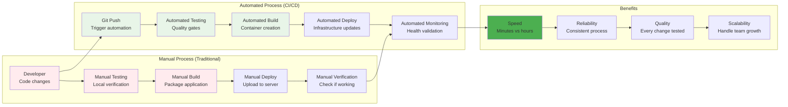
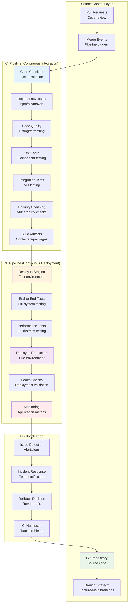
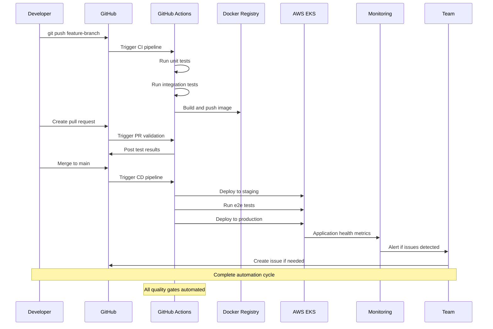
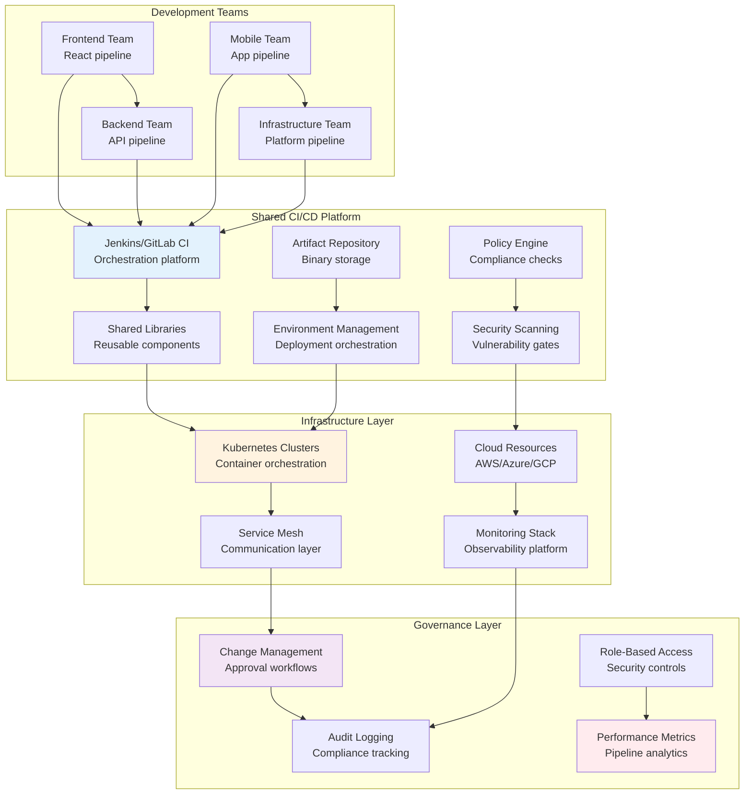
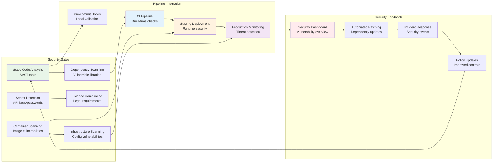
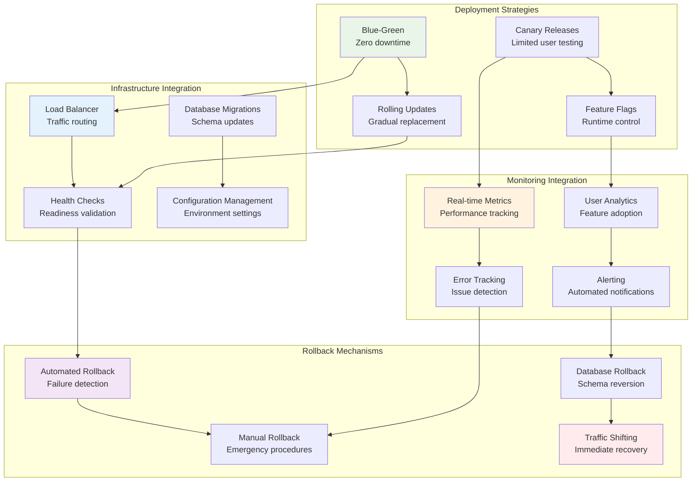
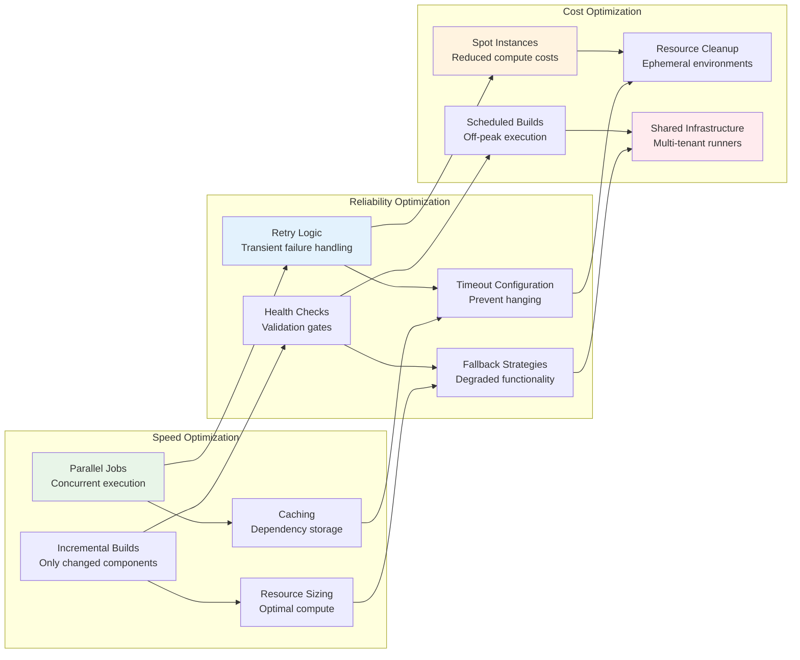
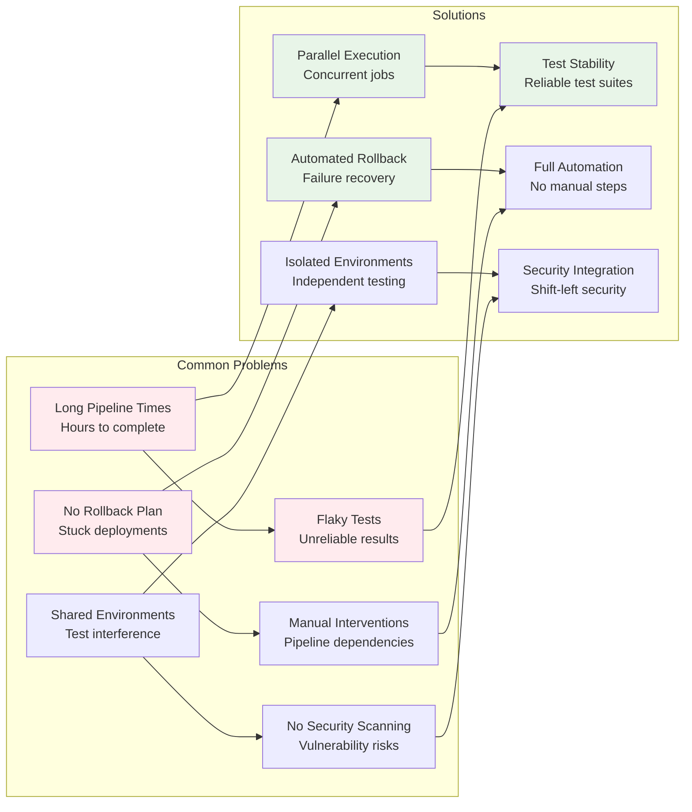

# 🔄 CI/CD Pipeline Relationships: The Automation Backbone

## 📖 What This File Does
This guide explains how Continuous Integration and Continuous Deployment (CI/CD) pipelines act as the **automation backbone** that connects all DevOps technologies. You'll understand how pipelines orchestrate code, containers, infrastructure, and deployment.

## 🎯 Learning Objectives
- Understand how CI/CD pipelines connect Git, containers, and cloud infrastructure
- See the relationship between automated testing, building, and deployment
- Learn how GitHub Actions, Jenkins, and other CI/CD tools integrate with your stack
- Understand pipeline triggers, stages, and deployment strategies
- See how monitoring and feedback loops complete the DevOps cycle

## 📋 Prerequisites
- Git/GitHub foundation (see `00-Git_GitHub_Foundation.md`)
- Development environment understanding (see `01-Development_Environment_Relationships.md`)
- Containerization concepts (see `04-Containerization_Relationships.md`)
- Basic awareness of automated testing concepts

---

## 🔍 **The CI/CD Relationship Paradigm**

### **🎯 From Manual to Automated: The Transformation**



### **💡 Key Insight: CI/CD as the Integration Layer**

> **📝 Quick Context for New Devs:**  
> Think of CI/CD as the "conductor" of an orchestra. It doesn't play the instruments (Git, Docker, AWS), but it coordinates when each one plays and ensures they work together harmoniously. Without CI/CD, you'd be manually running each tool yourself - imagine doing this 50 times a day!

CI/CD pipelines **don't replace technologies** - they **orchestrate them**:

| Technology | Role in Pipeline | Integration Point |
|------------|------------------|-------------------|
| **Git** | Source of truth | Pipeline triggers |
| **Docker** | Packaging tool | Build and deploy stages |
| **AWS/Cloud** | Runtime environment | Deployment targets |
| **Kubernetes** | Orchestration platform | Container deployment |
| **Monitoring** | Feedback system | Success/failure validation |

> **🚀 Why This Matters:**  
> Before CI/CD, developers would manually: 1) Pull code, 2) Run tests, 3) Build application, 4) Upload to server, 5) Restart services. This took hours and was error-prone. CI/CD does all this automatically in minutes, every time code changes.

---

## 🏗️ **Pipeline Architecture Relationships**

### **🔄 Complete Pipeline Ecosystem**



---

## 🚀 **GitHub Actions: Modern CI/CD Relationships**

### **🔄 GitHub-Integrated Pipeline**

```mermaid
flowchart LR
    subgraph "GitHub Repository"
        A["Source Code<br/>Application files"] --> B[".github/workflows<br/>Pipeline definitions"]
        C["Dockerfile<br/>Container specs"] --> D["package.json<br/>Dependencies"]
    end
    
    subgraph "Trigger Events"
        E["git push<br/>Code changes"] --> F["Pull Request<br/>Code review"]
        F --> G["Schedule<br/>Cron jobs"]
        G --> H["Manual Trigger<br/>Workflow dispatch"]
    end
    
    subgraph "GitHub Actions Execution"
        I["Runner<br/>Ubuntu/Windows/macOS"] --> J["Checkout Code<br/>Download repository"]
        J --> K["Setup Environment<br/>Node.js/Python/etc"]
        K --> L["Run Tests<br/>Quality validation"]
        L --> M["Build Container<br/>Docker image"]
        M --> N["Push to Registry<br/>ECR/Docker Hub"]
    end
    
    subgraph "Deployment Integration"
        O["AWS Deploy<br/>ECS/EKS"] --> P["Health Monitoring<br/>CloudWatch"]
        Q["Slack Notification<br/>Team updates"] --> R["Status Badges<br/>README updates"]
    end
    
    B --> E
    H --> I
    N --> O
    P --> Q
    
    style A fill:#e8f5e8
    style B fill:#e3f2fd
    style I fill:#fff3e0
    style O fill:#f3e5f5
    style P fill:#ffebee
```



### **📋 GitHub Actions Workflow Example**

```yaml
# .github/workflows/deploy.yml
name: Deploy to Production

on:
  push:
    branches: [ main ]
  pull_request:
    branches: [ main ]

jobs:
  # CI Stage - Test and Build
  test-and-build:
    runs-on: ubuntu-latest
    
    steps:
    - name: Checkout code
      uses: actions/checkout@v3
      
    - name: Setup Node.js
      uses: actions/setup-node@v3
      with:
        node-version: '18'
        cache: 'npm'
        
    - name: Install dependencies
      run: npm ci
      
    - name: Run tests
      run: npm test
      
    - name: Build Docker image
      run: docker build -t myapp:${{ github.sha }} .
      
    - name: Push to ECR
      run: |
        aws ecr get-login-password | docker login --username AWS --password-stdin $ECR_REGISTRY
        docker push myapp:${{ github.sha }}
  
  # CD Stage - Deploy to Production  
  deploy:
    needs: test-and-build
    runs-on: ubuntu-latest
    if: github.ref == 'refs/heads/main'
    
    steps:
    - name: Deploy to EKS
      run: |
        kubectl set image deployment/myapp myapp=myapp:${{ github.sha }}
        kubectl rollout status deployment/myapp
        
    - name: Notify team
      uses: 8398a7/action-slack@v3
      with:
        status: ${{ job.status }}
        text: 'Deployment to production completed!'
```

**Workflow Relationship Breakdown:**
- **Triggers**: `on` defines when pipeline runs (push, PR, schedule)
- **Jobs**: Independent units of work that can run in parallel
- **Steps**: Sequential actions within a job
- **Actions**: Reusable components (`actions/checkout`, `actions/setup-node`)
- **Secrets**: Secure storage for API keys and credentials

---

## 🔧 **Multi-Technology Integration**

### **🌐 Full-Stack Pipeline Relationships**



### **🎯 Technology Integration Points**

| Pipeline Stage | Technology Used | Integration Method | Purpose |
|----------------|----------------|-------------------|---------|
| **Source** | Git/GitHub | Webhook triggers | Code change detection |
| **Test** | Jest/Pytest/JUnit | Test runners | Quality validation |
| **Build** | Docker/Maven/Webpack | Build tools | Artifact creation |
| **Scan** | Snyk/OWASP/SonarQube | Security tools | Vulnerability detection |
| **Deploy** | Kubernetes/Terraform | Infrastructure tools | Environment provisioning |
| **Monitor** | Prometheus/DataDog | Observability tools | Health validation |

---

## 🏢 **Enterprise CI/CD Relationships**

### **🔄 Enterprise-Scale Pipeline Architecture**



### **🎯 Enterprise Pipeline Benefits**

**Standardization Across Teams:**
- **Shared pipeline templates** - Consistent processes across projects
- **Common security policies** - Uniform vulnerability scanning and compliance
- **Centralized artifact management** - Single source of truth for deployments
- **Unified monitoring** - Consistent observability across all applications

**Governance and Compliance:**
- **Approval workflows** - Required sign-offs for production deployments
- **Audit trails** - Complete history of all changes and deployments
- **Policy enforcement** - Automated compliance checking
- **Role-based access** - Granular permissions for different team members

---

## 🔐 **Security Integration Relationships**

### **🛡️ Security-First Pipeline Design**



### **🔒 Security Tool Integration**

```yaml
# Security-integrated pipeline example
jobs:
  security-scan:
    runs-on: ubuntu-latest
    steps:
    - name: Checkout code
      uses: actions/checkout@v3
      
    - name: Run static analysis
      uses: github/super-linter@v4
      
    - name: Scan for secrets
      uses: trufflesecurity/trufflehog@main
      
    - name: Dependency vulnerability scan
      run: npm audit --audit-level high
      
    - name: Build Docker image
      run: docker build -t myapp:latest .
      
    - name: Container security scan
      uses: aquasecurity/trivy-action@master
      with:
        image-ref: 'myapp:latest'
        format: 'sarif'
        output: 'trivy-results.sarif'
        
    - name: Upload security results
      uses: github/codeql-action/upload-sarif@v2
      with:
        sarif_file: 'trivy-results.sarif'
```

---

## 📊 **Deployment Strategy Relationships**

### **🔄 Advanced Deployment Patterns**



### **🎯 Deployment Strategy Selection**

> **📝 Quick Context for New Devs:**  
> Deployment strategies are like different ways to change the oil in your car while it's still running. Each method has trade-offs between safety, speed, and cost.

| Strategy | Risk Level | Rollback Speed | Resource Usage | Use Case |
|----------|------------|----------------|----------------|----------|
| **Blue-Green** | Low | Instant | High (2x resources) | Critical applications |
| **Rolling** | Medium | Gradual | Normal | Standard applications |
| **Canary** | Low | Fast | Low overhead | New feature testing |
| **Feature Flags** | Very Low | Instant | Minimal | A/B testing, gradual rollout |

> **🏠 Real-World Analogy:**  
> **Blue-Green**: Building a second identical house, moving in, then tearing down the first  
> **Rolling**: Renovating one room at a time while living in the house  
> **Canary**: Letting one family member try the new house first  
> **Feature Flags**: Having light switches you can turn on/off for different rooms

---

## 🔄 **Pipeline Optimization Relationships**

### **⚡ Performance and Efficiency**



### **📈 Pipeline Metrics and KPIs**

**Key Performance Indicators:**
- **Lead Time**: Code commit to production deployment
- **Deployment Frequency**: How often deployments occur
- **Mean Time to Recovery (MTTR)**: Time to fix issues
- **Change Failure Rate**: Percentage of deployments causing issues

**Optimization Targets:**
```
Lead Time: < 1 hour (from hours/days)
Deployment Frequency: Multiple times per day
MTTR: < 15 minutes
Change Failure Rate: < 5%
```

---

## 🚨 **Common CI/CD Pitfalls and Solutions**

### **❌ Anti-Patterns and Best Practices**



---

## 🔄 **Next Steps in Your Learning Journey**

### **🎯 CI/CD Mastery Path**

1. **Start with GitHub Actions**: Create basic workflows for your projects
2. **Add automated testing**: Integrate unit and integration tests
3. **Implement security scanning**: Add vulnerability and compliance checks
4. **Practice deployment strategies**: Try blue-green and canary deployments
5. **Optimize for scale**: Parallel execution, caching, and monitoring

### **🔗 Related Files to Read Next**

- **`08-Container_Orchestration_Relationships.md`**: How Kubernetes integrates with CI/CD pipelines
- **`09-Monitoring_Observability_Relationships.md`**: How monitoring provides feedback to pipelines
- **`10-Security_Compliance_Relationships.md`**: Advanced security integration in pipelines

### **💡 Key CI/CD Relationship Concepts**

- **Pipelines orchestrate, don't replace** - CI/CD coordinates existing tools
- **Every commit triggers automation** - Consistent quality and deployment
- **Feedback loops are essential** - Monitoring informs pipeline improvements
- **Security is integrated, not bolted on** - Shift-left security approach
- **Optimization is ongoing** - Continuous improvement of pipeline performance

---

## 🔧 **Configuration Notes**

- **Start Simple**: Begin with basic build/test/deploy, add complexity gradually
- **Security First**: Integrate security scanning from the beginning
- **Monitor Everything**: Pipeline performance, application health, user experience
- **Team Alignment**: Ensure all team members understand and contribute to pipeline health

---

## 📚 **Terminology**

### **CI/CD Fundamentals**
- **Continuous Integration (CI)**: Practice of automatically building and testing code changes
- **Continuous Deployment (CD)**: Automated deployment of code changes to production
- **Continuous Delivery**: Ensuring code is always in a deployable state
- **Pipeline**: Automated sequence of steps for building, testing, and deploying code
- **Build**: Process of compiling and packaging code into deployable artifacts
- **Artifact**: Output of build process (binaries, packages, containers)
- **Trigger**: Event that starts a pipeline (commit, pull request, schedule)
- **Webhook**: HTTP callback that notifies systems of events

### **Pipeline Components**
- **Stage**: Logical grouping of related steps in a pipeline
- **Job**: Unit of work that runs on a specific environment
- **Step**: Individual task within a job (run command, use action)
- **Runner**: Compute environment where pipeline jobs execute
- **Agent**: Software that executes pipeline jobs on runners
- **Matrix Build**: Running jobs with multiple configurations in parallel
- **Conditional Execution**: Running steps only when specific conditions are met
- **Pipeline as Code**: Defining pipelines in version-controlled files

### **Testing in Pipelines**
- **Unit Test**: Testing individual components in isolation
- **Integration Test**: Testing interactions between components
- **End-to-End (E2E) Test**: Testing complete user workflows
- **Smoke Test**: Basic tests to verify system functionality
- **Regression Test**: Testing to ensure new changes don't break existing features
- **Load Test**: Testing system performance under expected traffic
- **Security Test**: Automated scanning for vulnerabilities
- **Quality Gate**: Pass/fail criteria that must be met to proceed

### **Deployment Strategies**
- **Blue-Green Deployment**: Switching between two identical production environments
- **Canary Deployment**: Gradual rollout to a subset of users
- **Rolling Deployment**: Incrementally replacing instances with new versions
- **Feature Flag**: Runtime toggle for enabling/disabling features
- **Rollback**: Reverting to a previous version after deployment issues
- **Immutable Deployment**: Replacing entire infrastructure rather than updating
- **Zero-Downtime Deployment**: Deploying without service interruption
- **A/B Testing**: Comparing two versions to determine better performance

### **GitHub Actions Specific**
- **Workflow**: Automated process defined in YAML file
- **Action**: Reusable unit of code that performs a specific task
- **Event**: Activity that triggers a workflow (push, pull_request, schedule)
- **Context**: Information about workflow run, environment, and event
- **Secret**: Encrypted environment variable for sensitive data
- **Environment**: Deployment target with protection rules
- **Marketplace**: Repository of pre-built actions for reuse
- **Self-hosted Runner**: Your own infrastructure for running workflows

### **Security and Compliance**
- **SAST (Static Application Security Testing)**: Analyzing source code for vulnerabilities
- **DAST (Dynamic Application Security Testing)**: Testing running applications
- **Dependency Scanning**: Checking third-party libraries for vulnerabilities
- **Secret Scanning**: Detecting accidentally committed secrets
- **Policy as Code**: Defining compliance rules in version-controlled files
- **Audit Trail**: Complete record of all pipeline activities
- **RBAC (Role-Based Access Control)**: Permissions based on user roles
- **Compliance Gate**: Mandatory checks for regulatory requirements

### **Monitoring and Observability**
- **Pipeline Metrics**: Performance measurements of CI/CD processes
- **Build Time**: Duration from start to completion of build process
- **Deployment Frequency**: How often deployments occur
- **Lead Time**: Time from code commit to production deployment
- **MTTR (Mean Time to Recovery)**: Average time to fix issues
- **Change Failure Rate**: Percentage of deployments causing problems
- **Alerting**: Automated notifications when issues occur
- **Dashboard**: Visual display of pipeline and application metrics

### **Advanced Concepts**
- **GitOps**: Using Git repositories as source of truth for infrastructure
- **Infrastructure as Code (IaC)**: Managing infrastructure through code
- **Multi-stage Pipeline**: Pipeline spanning multiple environments
- **Pipeline Orchestration**: Coordinating multiple related pipelines
- **Approval Workflow**: Manual review process before deployment
- **Environment Promotion**: Moving artifacts through development stages
- **Branch Protection**: Rules preventing direct changes to important branches
- **Merge Strategy**: Approach for combining code changes (merge, squash, rebase)

---

📄 **File Path:** `/Tech_Relationships/06-CI_CD_Pipeline_Relationships.md` 