# 🏢 Enterprise Scale Relationships: Large-Scale DevOps Ecosystems

## 📖 What This File Does
This guide explains how DevOps technologies integrate and scale at enterprise level, where hundreds of developers work on dozens of services serving millions of users. You'll understand the complex relationships between microservices, infrastructure, and organizational patterns.

## 🎯 Learning Objectives
- Understand how simple applications evolve into enterprise microservices architectures
- See the relationships between load balancers, CDNs, service meshes, and API gateways
- Learn how organizational structure affects technology architecture (Conway's Law)
- Understand enterprise-scale security, monitoring, and compliance requirements
- See how DevOps practices scale from teams to large organizations

## 📋 Prerequisites
- Understanding of all previous relationship files (00-10)
- Familiarity with containerization and CI/CD concepts
- Basic awareness of microservices architecture
- General knowledge of enterprise software challenges

---

## 🔍 **The Enterprise Scale Transformation**

### **🎯 From Monolith to Microservices: Architectural Evolution**

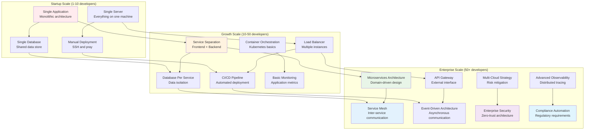

### **💡 Key Insight: Conway's Law in Action**

> **📝 Quick Context for New Devs:**  
> Conway's Law explains why your company's org chart often looks like your software architecture! If your teams don't talk to each other, your software won't either. This isn't a bug - it's a fundamental principle of how humans build systems.

**Conway's Law**: "Organizations design systems that mirror their communication structures"

| Organization Structure | Resulting Architecture | Technology Implications |
|------------------------|------------------------|-------------------------|
| **Single team** | Monolithic application | Shared database, simple deployment |
| **Frontend/Backend teams** | 2-tier architecture | API boundaries, service separation |
| **Domain teams** | Microservices | Service ownership, independent deployment |
| **Platform teams** | Service mesh + platforms | Shared infrastructure, common tooling |

> **💡 Real-World Example:**  
> If your company has separate iOS, Android, and Web teams that rarely coordinate, you'll likely end up with three different APIs, three different user experiences, and three different ways of handling authentication. If instead you have product teams that own entire features across all platforms, you'll get consistent APIs and user experiences.

> **⚠️ Why This Matters for Your Career:**  
> Understanding Conway's Law helps you predict what kind of architecture you'll be working with based on the company's structure. It also explains why "just fixing the code" often requires organizational changes too.

---

## 🏗️ **Enterprise Infrastructure Relationships**

### **🔄 Complete Enterprise Technology Stack**

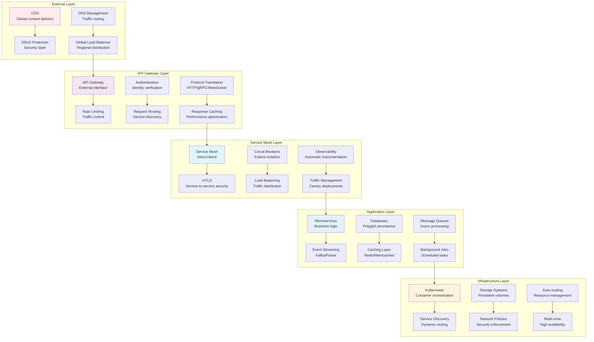

---

## 🌐 **Microservices Architecture Relationships**

> **📝 Quick Context for New Devs:**  
> Microservices are like having a restaurant where each chef specializes in one thing (pizza chef, salad chef, dessert chef) instead of one chef doing everything. Each "chef" (service) can work independently, be updated separately, and if one has problems, the others keep working. But now you need a manager (orchestration) to coordinate everyone!

### **🔄 Domain-Driven Service Design**

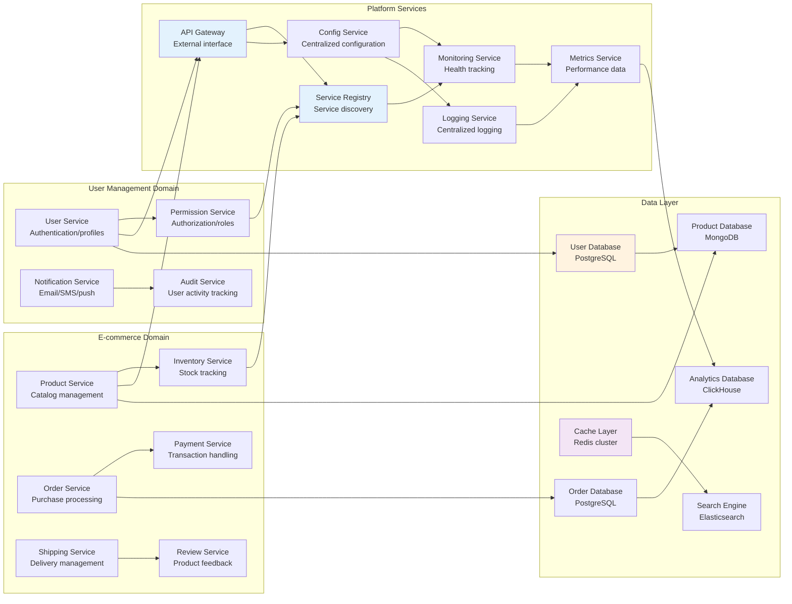

### **🎯 Service Communication Patterns**

> **📝 Quick Context for New Devs:**  
> When microservices need to talk to each other, it's like organizing a massive conference call with hundreds of participants. Service mesh is like having a professional conference call coordinator who handles routing, security, and quality - so each participant just focuses on their message, not the technical details of the call.

| Communication Type | Technology | Use Case | Complexity | Performance |
|--------------------|------------|----------|------------|-------------|
| **Synchronous** | HTTP/REST, gRPC | Real-time queries | Low | High latency |
| **Asynchronous** | Kafka, RabbitMQ | Event processing | Medium | High throughput |
| **Service Mesh** | Istio, Linkerd | Service-to-service | High | Optimized routing |
| **Event Sourcing** | Event streams | State changes | High | Eventual consistency |

> **🎯 Why Service Mesh Matters:**  
> Without service mesh, each microservice needs to implement its own security, monitoring, and routing logic. With service mesh, these concerns are handled automatically by the infrastructure, so developers focus on business logic instead of plumbing.

---

## ☁️ **Multi-Cloud Enterprise Strategy**

### **🔄 Cloud Service Integration**

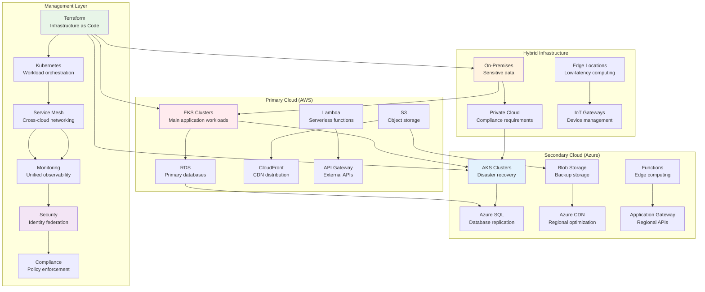

### **🎯 Multi-Cloud Benefits and Challenges**

> **📝 Quick Context for New Devs:**  
> Multi-cloud means using multiple cloud providers (AWS + Azure + Google Cloud) instead of putting all your eggs in one basket. Think of it like having accounts at multiple banks - more flexibility, but more complexity to manage.

**Benefits:**
- **Vendor lock-in avoidance** - Reduced dependency on single provider
- **Geographic distribution** - Better global performance
- **Disaster recovery** - Higher availability and resilience
- **Cost optimization** - Leverage best pricing from each provider

**Challenges:**
- **Complexity management** - Multiple platforms to maintain
- **Data consistency** - Cross-cloud synchronization
- **Network performance** - Inter-cloud latency
- **Security integration** - Unified identity and access management

> **💰 Reality Check:**  
> Multi-cloud sounds great in theory, but it's **expensive and complex**. Most companies start with one cloud provider and only go multi-cloud when they have specific business needs (compliance, acquisition, or risk management). Don't assume every company needs this!

---

## 🔒 **Enterprise Security Relationships**

### **🛡️ Zero-Trust Architecture**

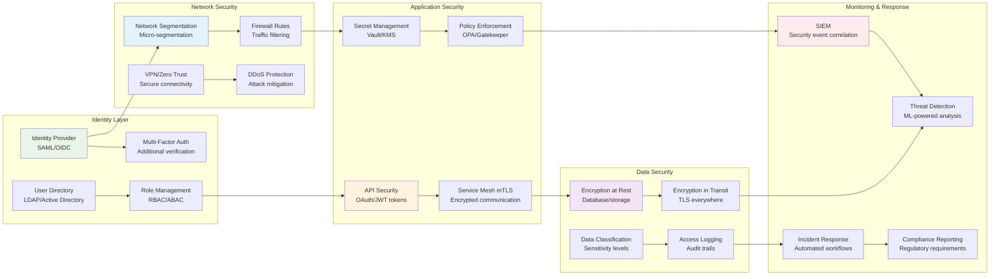

### **🔐 Security Integration Points**

```yaml
# Enterprise security integration example
apiVersion: security.istio.io/v1beta1
kind: AuthorizationPolicy
metadata:
  name: payment-service-policy
spec:
  selector:
    matchLabels:
      app: payment-service
  rules:
  - from:
    - source:
        principals: ["cluster.local/ns/default/sa/order-service"]
  - to:
    - operation:
        methods: ["POST"]
        paths: ["/api/v1/payments/*"]
  - when:
    - key: custom.claims.role
      values: ["payment-processor"]
    - key: source.ip
      values: ["10.0.0.0/8"]  # Internal network only
```

---

## 📊 **Enterprise Observability Relationships**

### **🔄 Three Pillars of Observability at Scale**

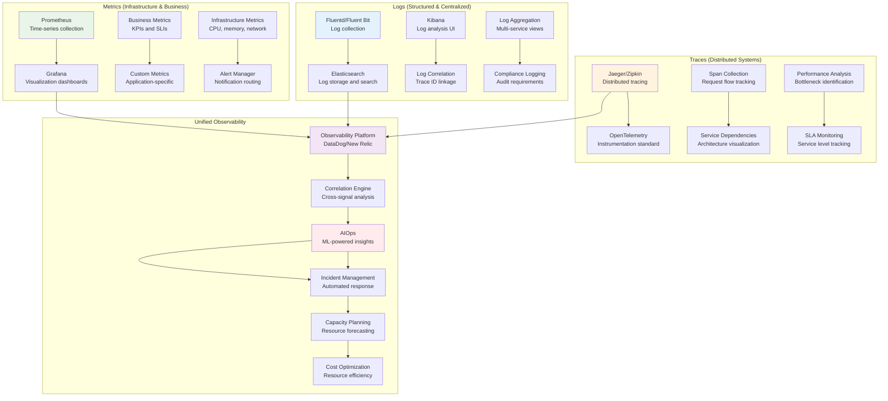

### **📈 Enterprise SLI/SLO Framework**

| Service Tier | Availability SLO | Latency SLO | Error Rate SLO | Business Impact |
|--------------|------------------|-------------|----------------|-----------------|
| **Critical** | 99.99% | p99 < 100ms | < 0.01% | Revenue impact |
| **Important** | 99.9% | p99 < 500ms | < 0.1% | User experience |
| **Standard** | 99.5% | p99 < 1s | < 1% | Feature functionality |
| **Best Effort** | 99% | p99 < 5s | < 5% | Nice-to-have features |

---

## 🔄 **Enterprise CI/CD at Scale**

### **🚀 Pipeline Orchestration Architecture**

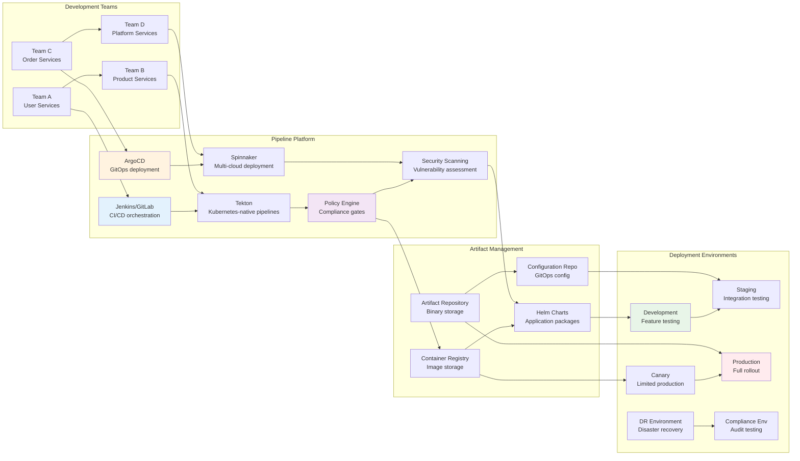

### **🎯 Enterprise Pipeline Patterns**

**Deployment Strategies by Service Tier:**
- **Critical Services**: Blue-green with extensive validation
- **Important Services**: Canary deployment with monitoring
- **Standard Services**: Rolling updates with health checks
- **Experimental Services**: Feature flags with A/B testing

**Quality Gates by Environment:**
- **Development**: Unit tests, linting, basic security scans
- **Staging**: Integration tests, performance tests, security audits
- **Canary**: Business metrics, user experience validation
- **Production**: Health monitoring, rollback automation

---

## 🏢 **Organizational Scaling Relationships**

### **🔄 Team Topologies and Technology Architecture**

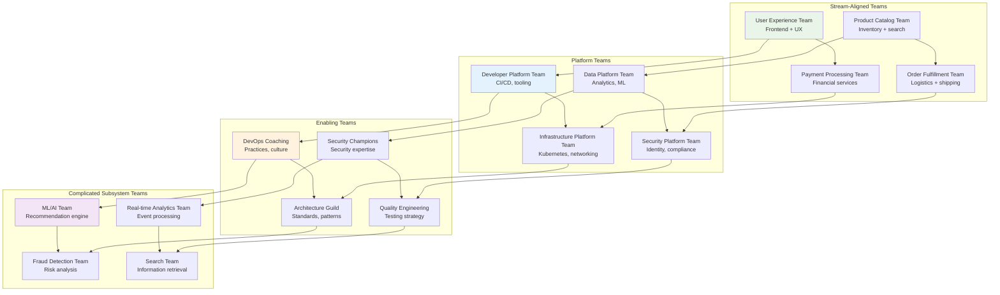

### **💡 Team Autonomy vs Platform Standardization**

| Aspect | Team Autonomy | Platform Standardization | Balance Point |
|--------|---------------|---------------------------|---------------|
| **Technology Choice** | Teams choose best tools | Standardized stack | Golden path + exceptions |
| **Deployment** | Custom pipelines | Standard CI/CD | Template-based customization |
| **Monitoring** | Team-specific dashboards | Unified observability | Standard metrics + custom views |
| **Security** | Team responsibility | Platform enforcement | Automated compliance + team ownership |

---

## 🎯 **Enterprise Performance Optimization**

### **⚡ System-Wide Performance Relationships**

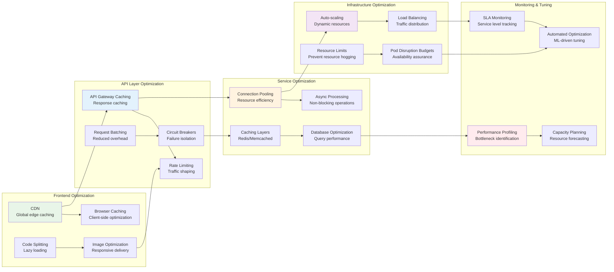

---

## 🚨 **Enterprise-Scale Challenges and Solutions**

### **❌ Common Enterprise Anti-Patterns**

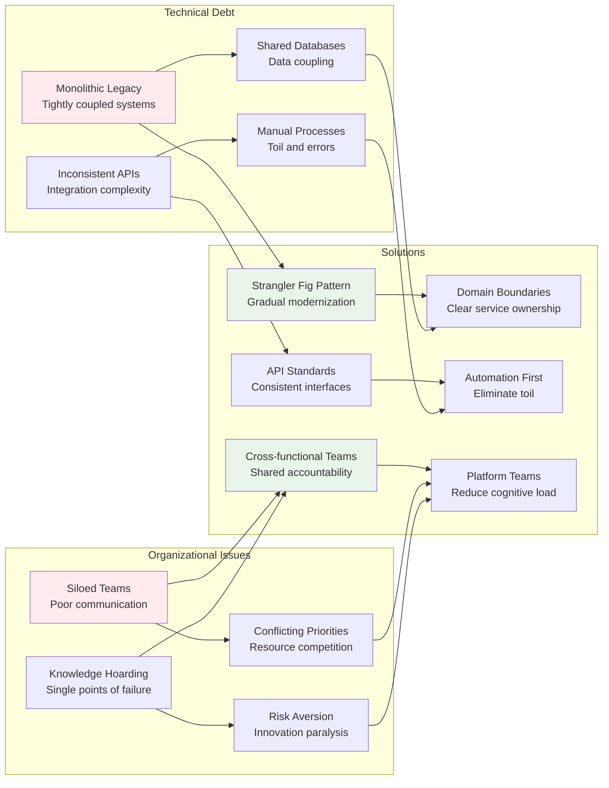

### **✅ Enterprise Success Patterns**

**Technical Patterns:**
- **API-first design** - Contracts before implementation
- **Event-driven architecture** - Loose coupling through events
- **Shared nothing architecture** - Service independence
- **Infrastructure as Code** - Repeatable, version-controlled infrastructure

**Organizational Patterns:**
- **You build it, you run it** - Service ownership model
- **Blameless post-mortems** - Learning from failures
- **Inner sourcing** - Open source practices internally
- **Communities of practice** - Knowledge sharing across teams

---

## 🔄 **Next Steps: Scaling Your Organization**

### **🎯 Enterprise Transformation Roadmap**

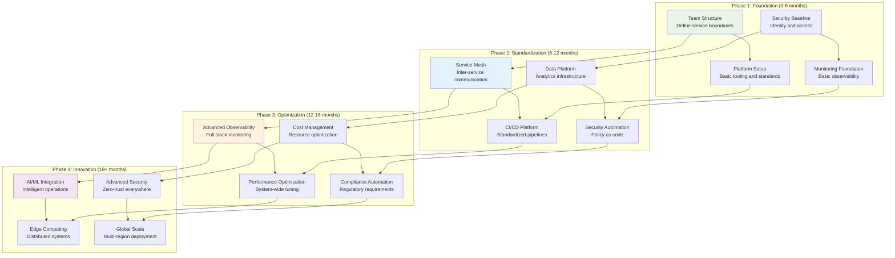

### **💡 Key Enterprise Relationship Concepts**

- **Conway's Law drives architecture** - Organize teams to match desired system design
- **Platform thinking reduces cognitive load** - Shared infrastructure enables team autonomy
- **Observability is non-negotiable** - You can't manage what you can't measure
- **Security must be built in** - Retrofit security is expensive and incomplete
- **Continuous optimization is required** - Systems and organizations must evolve together

---

## 🔧 **Configuration Notes**

- **Start with Team Topology**: Organize teams before choosing technologies
- **Platform Investment**: Build internal platforms to accelerate team delivery
- **Security by Design**: Integrate security controls from the beginning
- **Measure Everything**: Comprehensive observability across all layers
- **Gradual Evolution**: Transform incrementally to minimize risk

---

## 📚 **Terminology**

### **Enterprise Architecture**
- **Microservices**: Architectural pattern of small, independent services
- **Monolith**: Single-tiered software application with tightly coupled components
- **Service-Oriented Architecture (SOA)**: Design pattern using discrete services
- **Domain-Driven Design (DDD)**: Modeling software based on business domains
- **Conway's Law**: Systems mirror the communication structure of organizations
- **Bounded Context**: Boundary within which a domain model is defined
- **Event-Driven Architecture**: Design pattern using events for service communication
- **Distributed Systems**: Software systems with components on networked computers

### **Infrastructure at Scale**
- **Load Balancer**: Device distributing network traffic across multiple servers
- **CDN (Content Delivery Network)**: Geographically distributed servers for content delivery
- **API Gateway**: Management tool for APIs, providing routing and security
- **Service Mesh**: Infrastructure layer handling service-to-service communication
- **Ingress Controller**: Kubernetes component managing external access to services
- **Auto-scaling**: Automatically adjusting resources based on demand
- **Multi-zone Deployment**: Distributing services across multiple availability zones
- **Disaster Recovery**: Procedures for recovering from catastrophic failures

### **Service Communication**
- **REST (Representational State Transfer)**: Architectural style for web services
- **gRPC**: High-performance RPC framework using HTTP/2
- **Message Queue**: System for asynchronous communication between services
- **Event Streaming**: Continuous flow of events between services
- **Pub/Sub (Publish/Subscribe)**: Messaging pattern where publishers and subscribers are decoupled
- **Circuit Breaker**: Design pattern preventing cascading failures
- **Retry Logic**: Mechanism for handling transient failures
- **Timeout**: Maximum time allowed for an operation to complete

### **Security and Compliance**
- **Zero Trust**: Security model assuming no implicit trust within network
- **mTLS (Mutual TLS)**: Authentication method where both parties verify each other
- **RBAC (Role-Based Access Control)**: Access control based on user roles
- **ABAC (Attribute-Based Access Control)**: Access control based on attributes
- **Identity Provider (IdP)**: Service managing user identities and authentication
- **Single Sign-On (SSO)**: Authentication scheme allowing access to multiple systems
- **Policy as Code**: Managing security policies through version-controlled code
- **Compliance Automation**: Automated checking and enforcement of regulatory requirements

### **Observability at Scale**
- **Three Pillars of Observability**: Metrics, logs, and traces
- **Distributed Tracing**: Tracking requests across multiple services
- **SLI (Service Level Indicator)**: Specific metric measuring service performance
- **SLO (Service Level Objective)**: Target value for SLI measurements
- **SLA (Service Level Agreement)**: Contract specifying service commitments
- **Error Budget**: Allowable amount of unreliability in a service
- **Telemetry**: Automated collection and transmission of data
- **Correlation ID**: Unique identifier tracking requests across services

### **Team Organization**
- **Stream-Aligned Team**: Team aligned to business value streams
- **Platform Team**: Team providing internal platform services
- **Enabling Team**: Team helping other teams adopt new technologies
- **Complicated Subsystem Team**: Team responsible for complex subsystems
- **DevOps**: Cultural practice combining development and operations
- **Site Reliability Engineering (SRE)**: Discipline applying software engineering to operations
- **Platform Engineering**: Practice of building internal developer platforms
- **Inner Source**: Applying open source practices within organizations

### **Performance and Optimization**
- **Horizontal Scaling**: Adding more instances to handle increased load
- **Vertical Scaling**: Adding more power to existing instances
- **Caching**: Storing frequently accessed data for faster retrieval
- **Connection Pooling**: Reusing database connections for efficiency
- **Rate Limiting**: Controlling the rate of requests to prevent overload
- **Bulkhead Pattern**: Isolating critical resources to prevent failure propagation
- **Backpressure**: Mechanism for handling overwhelming data flow
- **Capacity Planning**: Determining resources needed to handle expected load

### **Multi-Cloud and Hybrid**
- **Multi-Cloud**: Using multiple cloud service providers
- **Hybrid Cloud**: Combination of on-premises and cloud infrastructure
- **Cloud Native**: Applications designed specifically for cloud environments
- **Vendor Lock-in**: Dependence on a single vendor's products or services
- **Cloud Migration**: Process of moving applications to cloud infrastructure
- **Edge Computing**: Processing data near the source rather than centralized locations
- **Federation**: Joining separate infrastructure components into a unified system
- **Cloud Bursting**: Using cloud resources when on-premises capacity is exceeded

### **Advanced DevOps Practices**
- **GitOps**: Operational framework using Git as source of truth
- **Infrastructure as Code (IaC)**: Managing infrastructure through code
- **Policy as Code**: Defining operational policies in version-controlled code
- **Immutable Infrastructure**: Infrastructure that's never modified after deployment
- **Blue-Green Deployment**: Deployment strategy using two identical environments
- **Canary Release**: Gradual rollout of changes to subset of users
- **Feature Flags**: Runtime toggles for enabling/disabling features
- **Chaos Engineering**: Practice of intentionally introducing failures to test resilience

### **Enterprise Integration**
- **Enterprise Service Bus (ESB)**: Architecture pattern for service integration
- **Data Lake**: Storage repository holding raw data in native format
- **Data Warehouse**: Central repository for integrated data from multiple sources
- **ETL (Extract, Transform, Load)**: Process for moving data between systems
- **API Management**: Platform for creating, deploying, and managing APIs
- **Integration Platform**: Tools for connecting disparate systems
- **Event Sourcing**: Persisting state changes as sequence of events
- **CQRS (Command Query Responsibility Segregation)**: Pattern separating read and write operations

---

📄 **File Path:** `/Tech_Relationships/11-Enterprise_Scale_Relationships.md` 