# 🔄 DevOps Development Cycle Relationships: From Code to Production

## 📖 What This File Does
This guide maps the complete DevOps development cycle, showing how every technology, tool, and process connects from initial code creation to production monitoring and feedback loops. You'll see both the high-level flow and the minute technical details at each stage.

## 🎯 Learning Objectives
- Understand the complete DevOps development cycle and all technology touchpoints
- See how code progresses through each stage with specific tools and commands
- Learn the detailed relationships between development, build, test, deploy, and monitor phases
- Understand feedback loops and how production insights drive development decisions
- Master the technical specifics at each stage of the cycle

## 📋 Prerequisites
- Familiarity with all previous Tech_Relationships files (00-12)
- Understanding of Git/GitHub workflows
- Basic knowledge of containerization and CI/CD concepts
- Awareness of cloud infrastructure and monitoring principles

---

## 🌟 **High-Level Development Cycle Overview**

### **🔄 The Complete DevOps Cycle**

```mermaid
flowchart LR
    subgraph "Development"
        A["💻 Code<br/>Local development"] --> B["🔄 Commit<br/>Version control"]
    end
    
    subgraph "Integration"
        C["🏗️ Build<br/>Package creation"] --> D["🧪 Test<br/>Quality validation"]
    end
    
    subgraph "Delivery"
        E["🚀 Deploy<br/>Environment promotion"] --> F["📊 Monitor<br/>Health tracking"]
    end
    
    subgraph "Feedback"
        G["📈 Analyze<br/>Performance review"] --> H["🎯 Plan<br/>Next iteration"]
    end
    
    B --> C
    D --> E
    F --> G
    H --> A
    
    style A fill:#e8f5e8
    style C fill:#e3f2fd
    style E fill:#fff3e0
    style G fill:#f3e5f5
```



---

## 🔍 **Comprehensive Development Cycle: All Technical Details**

### **🌐 Complete Technology Ecosystem Map**

```mermaid
flowchart TD
    subgraph "Development Environment"
        A1["VS Code/IDE<br/>• Extensions: GitLens, Docker<br/>• Settings: ESLint, Prettier<br/>• Integrated terminal"] --> A2["Local File System<br/>• .gitignore configurations<br/>• Environment variables (.env)<br/>• Package managers (npm, pip)"]
        A3["Development Server<br/>• npm start / python manage.py<br/>• Hot reload / nodemon<br/>• Local databases (SQLite, PostgreSQL)"] --> A4["Browser Dev Tools<br/>• Console debugging<br/>• Network inspection<br/>• Performance profiling"]
    end
    
    subgraph "Version Control Layer"
        B1["Git Local<br/>• git add, commit, branch<br/>• Hooks: pre-commit, pre-push<br/>• Merge strategies"] --> B2["GitHub Remote<br/>• Pull requests workflow<br/>• Branch protection rules<br/>• Issue tracking integration"]
        B3["Code Review<br/>• Review assignments<br/>• Status checks<br/>• Merge requirements"] --> B4["Repository Management<br/>• README.md maintenance<br/>• License and contribution guides<br/>• Release tagging"]
    end
    
    subgraph "CI/CD Pipeline Layer"
        C1["Trigger Events<br/>• Push to main/develop<br/>• Pull request creation<br/>• Scheduled builds (cron)"] --> C2["GitHub Actions/Jenkins<br/>• Workflow YAML definitions<br/>• Runner environments<br/>• Secret management"]
        C3["Build Process<br/>• Dependency installation<br/>• Code compilation/transpilation<br/>• Asset optimization"] --> C4["Testing Suite<br/>• Unit tests (Jest, pytest)<br/>• Integration tests<br/>• E2E tests (Cypress, Selenium)"]
        C5["Security Scanning<br/>• SAST (SonarQube, CodeQL)<br/>• Dependency checks (npm audit)<br/>• Container scanning (Trivy)"] --> C6["Artifact Creation<br/>• Docker image building<br/>• Package creation<br/>• Registry pushing"]
    end
    
    subgraph "Deployment Infrastructure"
        D1["Container Registry<br/>• Docker Hub / AWS ECR<br/>• Image tagging strategies<br/>• Vulnerability scanning"] --> D2["Infrastructure as Code<br/>• Terraform configurations<br/>• CloudFormation templates<br/>• Kubernetes manifests"]
        D3["Environment Management<br/>• Development/Staging/Production<br/>• Configuration management<br/>• Secret management (Vault)"] --> D4["Deployment Strategies<br/>• Blue-green deployments<br/>• Canary releases<br/>• Rolling updates"]
        D5["Cloud Services<br/>• AWS ECS/EKS/Lambda<br/>• Load balancers (ALB/NLB)<br/>• Auto-scaling groups"] --> D6["Database Management<br/>• RDS instances<br/>• Migration scripts<br/>• Backup strategies"]
    end
    
    subgraph "Monitoring & Observability"
        E1["Application Monitoring<br/>• Prometheus metrics<br/>• Custom business metrics<br/>• Performance counters"] --> E2["Log Management<br/>• Structured logging (JSON)<br/>• Centralized collection (ELK)<br/>• Log correlation"]
        E3["Distributed Tracing<br/>• OpenTelemetry instrumentation<br/>• Jaeger/Zipkin<br/>• Request flow tracking"] --> E4["Alerting Systems<br/>• PagerDuty/Slack integration<br/>• Alert escalation policies<br/>• SLA monitoring"]
        E5["Dashboard Creation<br/>• Grafana visualizations<br/>• Business KPI tracking<br/>• Real-time status boards"] --> E6["Incident Response<br/>• Runbook automation<br/>• Post-mortem processes<br/>• Chaos engineering"]
    end
    
    subgraph "Security & Compliance"
        F1["Identity Management<br/>• RBAC implementations<br/>• SSO integration<br/>• API key management"] --> F2["Network Security<br/>• VPC configurations<br/>• Security groups<br/>• WAF rules"]
        F3["Data Protection<br/>• Encryption at rest/transit<br/>• Backup encryption<br/>• GDPR compliance"] --> F4["Audit & Compliance<br/>• Access logging<br/>• Change tracking<br/>• Compliance reporting"]
    end
    
    subgraph "Feedback & Optimization"
        G1["Performance Analysis<br/>• APM tools (New Relic)<br/>• Database query optimization<br/>• CDN performance"] --> G2["User Analytics<br/>• Feature usage tracking<br/>• A/B testing results<br/>• User experience metrics"]
        G3["Cost Optimization<br/>• Resource utilization<br/>• Reserved instance planning<br/>• Rightsizing recommendations"] --> G4["Capacity Planning<br/>• Traffic forecasting<br/>• Scale testing<br/>• Resource scaling policies"]
    end
    
    A2 --> B1
    B4 --> C1
    C6 --> D1
    D6 --> E1
    E6 --> F1
    F4 --> G1
    G4 --> A1
    
    style A1 fill:#e8f5e8
    style C2 fill:#e3f2fd
    style D5 fill:#fff3e0
    style E4 fill:#f3e5f5
    style G2 fill:#ffebee
```



---

## 💻 **Stage 1: Development Environment & Code Creation**

### **🔄 Local Development Ecosystem**


### **🛠️ Development Stage Technical Specifics**

**IDE Configuration & Extensions:**
```json
// VS Code settings.json
{
  "editor.formatOnSave": true,
  "eslint.autoFixOnSave": true,
  "git.enableSmartCommit": true,
  "docker.images.label": "CreatedTime",
  "python.defaultInterpreterPath": "./venv/bin/python"
}
```

**Local Development Commands:**
```bash
# Node.js development setup
npm install                    # Install dependencies
npm run dev                   # Start development server
npm test -- --watch          # Run tests in watch mode
npm run lint                  # Check code quality

# Python development setup  
python -m venv venv           # Create virtual environment
source venv/bin/activate      # Activate environment (Linux/Mac)
pip install -r requirements.txt  # Install dependencies
python manage.py runserver    # Start Django development server
pytest --cov=.               # Run tests with coverage

# Database management
docker-compose up -d postgres # Start local database
python manage.py migrate      # Apply database migrations
npm run db:seed              # Seed development data
```

**Environment Configuration:**
```bash
# .env file structure
NODE_ENV=development
DATABASE_URL=postgresql://localhost:5432/myapp_dev
API_KEY=dev_api_key_12345
PORT=3000
DEBUG=true

# Docker development environment
docker-compose -f docker-compose.dev.yml up
```

---

## 🔄 **Stage 2: Version Control & Collaboration**

### **🌿 Git Workflow Integration**

```mermaid
flowchart TD
    subgraph "Local Git Operations"
        A["Working Directory<br/>• Modified files<br/>• New features<br/>• Bug fixes"] --> B["Staging Area<br/>• git add .<br/>• Selective staging<br/>• Review changes"]
        B --> C["Local Repository<br/>• git commit -m<br/>• Commit messaging<br/>• Branch management"]
    end
    
    subgraph "Remote Collaboration"
        D["Feature Branches<br/>• git checkout -b feature/xyz<br/>• Isolated development<br/>• Parallel work"] --> E["Pull Requests<br/>• Code review process<br/>• CI/CD triggers<br/>• Merge strategies"]
        E --> F["Main Branch<br/>• Production-ready code<br/>• Protected branch<br/>• Release tagging"]
    end
    
    subgraph "Quality Gates"
        G["Pre-commit Hooks<br/>• Linting checks<br/>• Test execution<br/>• Security scans"] --> H["Status Checks<br/>• CI pipeline success<br/>• Code review approval<br/>• Security clearance"]
    end
    
    C --> D
    F --> A
    A --> G
    H --> E
    
    style A fill:#e8f5e8
    style E fill:#e3f2fd
    style F fill:#f3e5f5
```



### **📋 Version Control Technical Specifics**

**Git Commands and Workflows:**
```bash
# Feature development workflow
git checkout main
git pull origin main
git checkout -b feature/user-authentication
# ... make changes ...
git add .
git commit -m "feat: implement JWT authentication"
git push origin feature/user-authentication

# Code review and merge
gh pr create --title "Add JWT authentication" --body "Implements secure user login"
git checkout main
git pull origin main
git branch -d feature/user-authentication

# Release management
git tag v1.2.0
git push origin v1.2.0
```

**GitHub Actions Integration:**
```yaml
# .github/workflows/pr-validation.yml
name: Pull Request Validation
on:
  pull_request:
    branches: [ main, develop ]

jobs:
  validate:
    runs-on: ubuntu-latest
    steps:
    - uses: actions/checkout@v3
    - name: Setup Node.js
      uses: actions/setup-node@v3
      with:
        node-version: '18'
        cache: 'npm'
    - name: Install dependencies
      run: npm ci
    - name: Run linting
      run: npm run lint
    - name: Run tests
      run: npm test -- --coverage
    - name: Security audit
      run: npm audit --audit-level high
```

---

## 🏗️ **Stage 3: Build & Packaging**

### **🔧 Build Pipeline Architecture**

```mermaid
flowchart LR
    subgraph "Source Preparation"
        A["Code Checkout<br/>• git clone/fetch<br/>• Specific commit SHA<br/>• Submodule handling"] --> B["Dependency Resolution<br/>• npm ci / pip install<br/>• Dependency caching<br/>• Version locking"]
    end
    
    subgraph "Build Process"
        C["Code Compilation<br/>• TypeScript → JavaScript<br/>• SASS → CSS<br/>• Asset optimization"] --> D["Bundle Creation<br/>• Webpack bundling<br/>• Code splitting<br/>• Minification"]
    end
    
    subgraph "Container Packaging"
        E["Docker Build<br/>• Multi-stage Dockerfile<br/>• Layer optimization<br/>• Security scanning"] --> F["Registry Push<br/>• Image tagging<br/>• Vulnerability checks<br/>• Manifest creation"]
    end
    
    B --> C
    D --> E
    
    style A fill:#e8f5e8
    style C fill:#e3f2fd
    style E fill:#fff3e0
```



### **🔨 Build Stage Technical Specifics**

**Docker Multi-Stage Build:**
```dockerfile
# Build stage
FROM node:18-alpine AS builder
WORKDIR /app
COPY package*.json ./
RUN npm ci --only=production && npm cache clean --force
COPY . .
RUN npm run build

# Production stage
FROM node:18-alpine AS production
RUN addgroup -g 1001 -S nodejs
RUN adduser -S nextjs -u 1001
WORKDIR /app
COPY --from=builder --chown=nextjs:nodejs /app/dist ./dist
COPY --from=builder --chown=nextjs:nodejs /app/node_modules ./node_modules
COPY --chown=nextjs:nodejs package.json ./
USER nextjs
EXPOSE 3000
CMD ["npm", "start"]
```

**Build Pipeline Commands:**
```bash
# Node.js build process
npm ci                        # Clean install from lock file
npm run lint:fix              # Fix linting issues
npm run test:ci               # Run tests for CI
npm run build                 # Create production build
npm run analyze               # Bundle analysis

# Docker build and registry
docker build -t myapp:${GITHUB_SHA} .
docker tag myapp:${GITHUB_SHA} myapp:latest
docker push myregistry/myapp:${GITHUB_SHA}
docker push myregistry/myapp:latest

# Security scanning
trivy image myapp:${GITHUB_SHA}
snyk container test myapp:${GITHUB_SHA}
```

**Build Optimization Strategies:**
```yaml
# Build caching configuration
- name: Cache node modules
  uses: actions/cache@v3
  with:
    path: ~/.npm
    key: ${{ runner.os }}-node-${{ hashFiles('**/package-lock.json') }}
    
- name: Cache Docker layers
  uses: actions/cache@v3
  with:
    path: /tmp/.buildx-cache
    key: ${{ runner.os }}-buildx-${{ github.sha }}
    restore-keys: |
      ${{ runner.os }}-buildx-
```

---

## 🧪 **Stage 4: Testing & Quality Assurance**

### **🔍 Comprehensive Testing Strategy**

```mermaid
flowchart TD
    subgraph "Unit Testing"
        A["Component Tests<br/>• Jest/Mocha<br/>• pytest/unittest<br/>• 80%+ coverage target"] --> B["Mock & Stub<br/>• API mocking<br/>• Database mocking<br/>• External service stubs"]
    end
    
    subgraph "Integration Testing"
        C["API Testing<br/>• Supertest/requests<br/>• Database integration<br/>• Service endpoints"] --> D["Contract Testing<br/>• Pact testing<br/>• Schema validation<br/>• API versioning"]
    end
    
    subgraph "End-to-End Testing"
        E["Browser Testing<br/>• Cypress/Selenium<br/>• User workflows<br/>• Cross-browser support"] --> F["Performance Testing<br/>• Load testing (k6)<br/>• Stress testing<br/>• Memory profiling"]
    end
    
    subgraph "Security Testing"
        G["SAST Scanning<br/>• SonarQube<br/>• CodeQL analysis<br/>• Vulnerability detection"] --> H["DAST Testing<br/>• OWASP ZAP<br/>• Penetration testing<br/>• Runtime security"]
    end
    
    A --> C
    B --> D
    C --> E
    D --> F
    E --> G
    F --> H
    
    style A fill:#e8f5e8
    style C fill:#e3f2fd
    style E fill:#fff3e0
    style G fill:#f3e5f5
```



### **🧪 Testing Technical Specifics**

**Unit Testing Configuration:**
```javascript
// Jest configuration
module.exports = {
  testEnvironment: 'node',
  collectCoverageFrom: [
    'src/**/*.{js,ts}',
    '!src/**/*.test.{js,ts}'
  ],
  coverageThreshold: {
    global: {
      branches: 80,
      functions: 80,
      lines: 80,
      statements: 80
    }
  },
  setupFilesAfterEnv: ['<rootDir>/src/test/setup.js']
};

// Example unit test
describe('UserService', () => {
  it('should create user with valid data', async () => {
    const userData = { email: 'test@example.com', name: 'Test User' };
    const user = await UserService.create(userData);
    expect(user.id).toBeDefined();
    expect(user.email).toBe(userData.email);
  });
});
```

**API Testing Examples:**
```javascript
// Supertest API testing
describe('POST /api/users', () => {
  it('should create a new user', async () => {
    const response = await request(app)
      .post('/api/users')
      .send({ email: 'test@example.com', name: 'Test User' })
      .expect(201);
    
    expect(response.body.user.email).toBe('test@example.com');
  });
});
```

**End-to-End Testing:**
```javascript
// Cypress E2E testing
describe('User Authentication', () => {
  it('should allow user to login', () => {
    cy.visit('/login');
    cy.get('[data-cy=email]').type('user@example.com');
    cy.get('[data-cy=password]').type('password123');
    cy.get('[data-cy=submit]').click();
    cy.url().should('include', '/dashboard');
  });
});
```

---

## 🚀 **Stage 5: Deployment & Infrastructure**

### **🌐 Deployment Pipeline Architecture**

```mermaid
flowchart LR
    subgraph "Environment Promotion"
        A["Development<br/>• Feature testing<br/>• Integration validation<br/>• Developer access"] --> B["Staging<br/>• Production-like data<br/>• Full E2E testing<br/>• Performance validation"]
        B --> C["Production<br/>• Live user traffic<br/>• Monitoring enabled<br/>• Rollback ready"]
    end
    
    subgraph "Infrastructure Management"
        D["Terraform<br/>• Infrastructure as Code<br/>• State management<br/>• Resource provisioning"] --> E["Kubernetes<br/>• Container orchestration<br/>• Service management<br/>• Auto-scaling"]
        E --> F["Cloud Services<br/>• AWS ECS/EKS<br/>• Load balancers<br/>• Database services"]
    end
    
    subgraph "Deployment Strategies"
        G["Blue-Green<br/>• Zero downtime<br/>• Instant rollback<br/>• Full validation"] --> H["Canary<br/>• Gradual rollout<br/>• Risk mitigation<br/>• A/B testing"]
        H --> I["Rolling<br/>• Resource efficient<br/>• Gradual replacement<br/>• Health monitoring"]
    end
    
    A --> D
    C --> G
    F --> I
    
    style A fill:#e8f5e8
    style D fill:#e3f2fd
    style G fill:#fff3e0
```



### **⚙️ Deployment Technical Specifics**

**Terraform Infrastructure:**
```hcl
# AWS EKS cluster configuration
resource "aws_eks_cluster" "main" {
  name     = var.cluster_name
  role_arn = aws_iam_role.cluster.arn
  version  = "1.24"

  vpc_config {
    subnet_ids              = var.subnet_ids
    endpoint_private_access = true
    endpoint_public_access  = true
  }

  depends_on = [
    aws_iam_role_policy_attachment.cluster_AmazonEKSClusterPolicy,
  ]
}

# Node group configuration
resource "aws_eks_node_group" "main" {
  cluster_name    = aws_eks_cluster.main.name
  node_group_name = "main-nodes"
  node_role_arn   = aws_iam_role.node.arn
  subnet_ids      = var.private_subnet_ids

  scaling_config {
    desired_size = 2
    max_size     = 10
    min_size     = 1
  }

  instance_types = ["t3.medium"]
}
```

**Kubernetes Deployment:**
```yaml
# Deployment manifest
apiVersion: apps/v1
kind: Deployment
metadata:
  name: myapp
  labels:
    app: myapp
spec:
  replicas: 3
  selector:
    matchLabels:
      app: myapp
  template:
    metadata:
      labels:
        app: myapp
    spec:
      containers:
      - name: myapp
        image: myregistry/myapp:v1.2.0
        ports:
        - containerPort: 3000
        env:
        - name: DATABASE_URL
          valueFrom:
            secretKeyRef:
              name: db-secret
              key: url
        resources:
          requests:
            memory: "256Mi"
            cpu: "250m"
          limits:
            memory: "512Mi"
            cpu: "500m"
        livenessProbe:
          httpGet:
            path: /health
            port: 3000
          initialDelaySeconds: 30
        readinessProbe:
          httpGet:
            path: /ready
            port: 3000
          initialDelaySeconds: 5
```

**Deployment Commands:**
```bash
# Infrastructure provisioning
terraform init
terraform plan -var-file="production.tfvars"
terraform apply -auto-approve

# Kubernetes deployment
kubectl apply -f k8s/namespace.yaml
kubectl apply -f k8s/configmap.yaml
kubectl apply -f k8s/secret.yaml
kubectl apply -f k8s/deployment.yaml
kubectl apply -f k8s/service.yaml
kubectl apply -f k8s/ingress.yaml

# Deployment verification
kubectl rollout status deployment/myapp
kubectl get pods -l app=myapp
kubectl logs -f deployment/myapp
```

---

## 📊 **Stage 6: Monitoring & Observability**

### **👁️ Three Pillars of Observability**

```mermaid
flowchart TD
    subgraph "Metrics Collection"
        A["Prometheus<br/>• Time-series metrics<br/>• Application metrics<br/>• Infrastructure metrics"] --> B["Custom Metrics<br/>• Business KPIs<br/>• Performance counters<br/>• User behavior tracking"]
    end
    
    subgraph "Logging System"
        C["Structured Logging<br/>• JSON format<br/>• Correlation IDs<br/>• Log levels"] --> D["Centralized Collection<br/>• Fluentd/Fluent Bit<br/>• ELK Stack<br/>• CloudWatch Logs"]
    end
    
    subgraph "Distributed Tracing"
        E["OpenTelemetry<br/>• Automatic instrumentation<br/>• Span collection<br/>• Context propagation"] --> F["Trace Analysis<br/>• Jaeger/Zipkin<br/>• Request flow tracking<br/>• Performance bottlenecks"]
    end
    
    subgraph "Alerting & Response"
        G["Alert Rules<br/>• SLI/SLO monitoring<br/>• Threshold alerts<br/>• Anomaly detection"] --> H["Incident Management<br/>• PagerDuty integration<br/>• Escalation policies<br/>• Post-mortem process"]
    end
    
    A --> C
    B --> D
    C --> E
    D --> F
    E --> G
    F --> H
    
    style A fill:#e8f5e8
    style C fill:#e3f2fd
    style E fill:#fff3e0
    style G fill:#f3e5f5
```



### **📈 Monitoring Technical Specifics**

**Prometheus Configuration:**
```yaml
# prometheus.yml
global:
  scrape_interval: 15s
  evaluation_interval: 15s

rule_files:
  - "alert_rules.yml"

scrape_configs:
  - job_name: 'kubernetes-pods'
    kubernetes_sd_configs:
      - role: pod
    relabel_configs:
      - source_labels: [__meta_kubernetes_pod_annotation_prometheus_io_scrape]
        action: keep
        regex: true
      - source_labels: [__meta_kubernetes_pod_annotation_prometheus_io_path]
        action: replace
        target_label: __metrics_path__
        regex: (.+)

alerting:
  alertmanagers:
    - static_configs:
        - targets:
          - alertmanager:9093
```

**Application Metrics Implementation:**
```javascript
// Node.js Prometheus metrics
const prometheus = require('prom-client');

// Create custom metrics
const httpRequestDuration = new prometheus.Histogram({
  name: 'http_request_duration_seconds',
  help: 'Duration of HTTP requests in seconds',
  labelNames: ['method', 'route', 'status']
});

const activeUsers = new prometheus.Gauge({
  name: 'active_users_total',
  help: 'Number of currently active users'
});

// Middleware to collect metrics
app.use((req, res, next) => {
  const start = Date.now();
  res.on('finish', () => {
    const duration = (Date.now() - start) / 1000;
    httpRequestDuration
      .labels(req.method, req.route?.path || req.path, res.statusCode)
      .observe(duration);
  });
  next();
});
```

**Structured Logging:**
```javascript
// Winston logger configuration
const winston = require('winston');

const logger = winston.createLogger({
  level: 'info',
  format: winston.format.combine(
    winston.format.timestamp(),
    winston.format.errors({ stack: true }),
    winston.format.json()
  ),
  defaultMeta: { 
    service: 'user-service',
    version: process.env.APP_VERSION 
  },
  transports: [
    new winston.transports.File({ filename: 'error.log', level: 'error' }),
    new winston.transports.File({ filename: 'combined.log' }),
    new winston.transports.Console({
      format: winston.format.simple()
    })
  ]
});

// Usage with correlation ID
app.use((req, res, next) => {
  req.correlationId = uuidv4();
  req.logger = logger.child({ correlationId: req.correlationId });
  next();
});
```

---

## 🔄 **Stage 7: Feedback & Continuous Improvement**

### **📊 Data-Driven Development Cycle**

```mermaid
flowchart LR
    subgraph "Performance Analysis"
        A["APM Tools<br/>• New Relic/DataDog<br/>• Performance profiling<br/>• Database optimization"] --> B["User Analytics<br/>• Feature usage tracking<br/>• A/B testing results<br/>• Conversion metrics"]
    end
    
    subgraph "Operational Insights"
        C["Error Tracking<br/>• Sentry integration<br/>• Error rate monitoring<br/>• Stack trace analysis"] --> D["Cost Analysis<br/>• Cloud spend tracking<br/>• Resource utilization<br/>• Optimization opportunities"]
    end
    
    subgraph "Business Intelligence"
        E["KPI Dashboards<br/>• Revenue metrics<br/>• User engagement<br/>• Feature adoption"] --> F["Capacity Planning<br/>• Traffic forecasting<br/>• Resource scaling<br/>• Infrastructure growth"]
    end
    
    subgraph "Development Feedback"
        G["Code Quality Metrics<br/>• Technical debt tracking<br/>• Test coverage trends<br/>• Build success rates"] --> H["Team Productivity<br/>• Deployment frequency<br/>• Lead time tracking<br/>• MTTR improvements"]
    end
    
    A --> C
    B --> D
    C --> E
    D --> F
    E --> G
    F --> H
    H --> A
    
    style A fill:#e8f5e8
    style C fill:#e3f2fd
    style E fill:#fff3e0
    style G fill:#f3e5f5
```



### **🎯 Feedback Loop Technical Specifics**

**Error Tracking and Analysis:**
```javascript
// Sentry error tracking setup
import * as Sentry from "@sentry/node";

Sentry.init({
  dsn: process.env.SENTRY_DSN,
  environment: process.env.NODE_ENV,
  release: process.env.APP_VERSION,
  integrations: [
    new Sentry.Integrations.Http({ tracing: true }),
    new Sentry.Integrations.Express({ app }),
  ],
  tracesSampleRate: 0.1,
});

// Custom error context
app.use((err, req, res, next) => {
  Sentry.configureScope((scope) => {
    scope.setTag("path", req.path);
    scope.setUser({ id: req.user?.id });
    scope.setContext("request", {
      method: req.method,
      url: req.url,
      headers: req.headers,
    });
  });
  Sentry.captureException(err);
  next(err);
});
```

**Performance Monitoring:**
```python
# Python APM integration with New Relic
import newrelic.agent

@newrelic.agent.function_trace()
def process_order(order_data):
    """Process customer order with performance tracking"""
    with newrelic.agent.database_trace(
        'PostgreSQL', 'orders', 'insert'
    ):
        order = create_order(order_data)
    
    # Custom metrics
    newrelic.agent.record_custom_metric(
        'Custom/Orders/ProcessingTime', 
        processing_time
    )
    
    return order

# Business metric tracking
@newrelic.agent.background_task()
def track_user_engagement():
    active_users = get_active_user_count()
    newrelic.agent.record_custom_metric(
        'Custom/Users/ActiveCount', 
        active_users
    )
```

---

## 🔧 **Configuration Notes**

- **Tool Integration**: Each stage builds upon previous stages and feeds into the next
- **Automation First**: Every manual process should be identified for automation
- **Security Throughout**: Security considerations at every stage, not bolted on
- **Monitoring Everything**: Comprehensive observability from development through production

---

## 📚 **Stage-Specific Commands Reference**

### **Development Stage**
```bash
# Environment setup
npm install / pip install -r requirements.txt
docker-compose up -d
npm run dev / python manage.py runserver

# Code quality
npm run lint / flake8 .
npm test / pytest
npm run coverage / pytest --cov
```

### **Build Stage**
```bash
# Build and package
npm run build
docker build -t app:latest .
docker tag app:latest registry/app:v1.0.0
docker push registry/app:v1.0.0
```

### **Deploy Stage**
```bash
# Infrastructure
terraform apply
kubectl apply -f k8s/
helm upgrade --install app ./chart

# Verification
kubectl rollout status deployment/app
curl https://api.example.com/health
```

### **Monitor Stage**
```bash
# Metrics and logs
kubectl logs -f deployment/app
kubectl port-forward svc/prometheus 9090:9090
kubectl port-forward svc/grafana 3000:3000
```

---

📄 **File Path:** `/Tech_Relationships/13-DevOps_Development_Cycle_Relationships.md` 