# 📚 Learning Progression Relationships: DevOps Mastery Path

## 📖 What This File Does
This guide maps the complete learning journey for DevOps technologies, showing prerequisite relationships, skill dependencies, and the optimal progression from basic concepts to enterprise-scale expertise. You'll see both the high-level learning path and detailed technical milestones.

## 🎯 Learning Objectives
- Understand the prerequisite relationships between DevOps technologies
- See how foundational concepts build into advanced practices
- Learn the optimal sequence for acquiring DevOps skills
- Understand which languages and tools are prerequisites for others
- Master the progression from basic commands to enterprise implementations

## 📋 Prerequisites
- Basic computer literacy and willingness to learn command-line interfaces
- Understanding that learning DevOps is a journey, not a destination
- Commitment to hands-on practice and continuous learning

---

## 🌟 **High-Level Learning Progression Overview**

### **🎯 The DevOps Learning Journey**

```mermaid
flowchart TD
    subgraph "Foundation (Months 1-2)"
        A["🖥️ Command Line<br/>Terminal basics"] --> B["📝 Version Control<br/>Git fundamentals"]
    end
    
    subgraph "Development (Months 2-4)"
        C["💻 Programming<br/>Python/JavaScript"] --> D["🌐 Web Development<br/>APIs and servers"]
    end
    
    subgraph "Infrastructure (Months 4-6)"
        E["☁️ Cloud Basics<br/>AWS fundamentals"] --> F["📦 Containerization<br/>Docker mastery"]
    end
    
    subgraph "Automation (Months 6-9)"
        G["🔄 CI/CD<br/>Pipeline automation"] --> H["🏗️ Infrastructure as Code<br/>Terraform/Ansible"]
    end
    
    subgraph "Orchestration (Months 9-12)"
        I["🎯 Container Orchestration<br/>Kubernetes"] --> J["📊 Monitoring<br/>Observability"]
    end
    
    subgraph "Mastery (Year 2+)"
        K["🔒 Security<br/>DevSecOps"] --> L["🏢 Enterprise<br/>Scale & Architecture"]
    end
    
    B --> C
    D --> E
    F --> G
    H --> I
    J --> K
    
    style A fill:#ffebee
    style C fill:#fff3e0
    style E fill:#e8f5e8
    style G fill:#e3f2fd
    style I fill:#f3e5f5
    style K fill:#e1f5fe
```

---

## 🔍 **Comprehensive Learning Dependencies Map**

### **🌐 Complete Technology Learning Ecosystem**

```mermaid
flowchart TD
    subgraph "Foundational Skills"
        A1["Command Line Basics<br/>• ls, cd, mkdir, rm<br/>• File permissions (chmod)<br/>• Process management (ps, kill)<br/>• Text editors (nano, vim)"] --> A2["Git Version Control<br/>• git init, add, commit<br/>• Branching strategies<br/>• GitHub workflow<br/>• Merge vs rebase"]
        A3["Networking Fundamentals<br/>• IP addresses and ports<br/>• DNS resolution<br/>• HTTP/HTTPS protocols<br/>• SSH connections"] --> A4["Linux System Administration<br/>• User management<br/>• Package managers (apt, yum)<br/>• Service management (systemctl)<br/>• Log file locations"]
    end
    
    subgraph "Programming Foundation"
        B1["Shell Scripting (Bash)<br/>• Variables and conditionals<br/>• Loops and functions<br/>• Command substitution<br/>• Exit codes and error handling"] --> B2["Python Programming<br/>• Basic syntax and data types<br/>• Functions and modules<br/>• File I/O operations<br/>• API calls with requests"]
        B3["JavaScript/Node.js<br/>• ES6+ syntax<br/>• Async/await patterns<br/>• NPM package management<br/>• Express.js frameworks"] --> B4["YAML/JSON Configuration<br/>• Data structure understanding<br/>• Configuration file formats<br/>• Template engines<br/>• Environment variables"]
    end
    
    subgraph "Infrastructure Concepts"
        C1["Cloud Computing Basics<br/>• IaaS, PaaS, SaaS models<br/>• Virtual machines vs containers<br/>• Scaling concepts<br/>• Cost management"] --> C2["AWS Core Services<br/>• EC2 instances<br/>• S3 storage<br/>• VPC networking<br/>• IAM security"]
        C3["Containerization<br/>• Docker fundamentals<br/>• Dockerfile creation<br/>• Image management<br/>• Container networking"] --> C4["Container Registries<br/>• Docker Hub usage<br/>• AWS ECR<br/>• Image scanning<br/>• Registry security"]
    end
    
    subgraph "Automation & CI/CD"
        D1["Build Automation<br/>• npm scripts<br/>• Make files<br/>• Build pipelines<br/>• Dependency management"] --> D2["Testing Frameworks<br/>• Unit testing (Jest, pytest)<br/>• Integration testing<br/>• E2E testing (Cypress)<br/>• Test coverage analysis"]
        D3["CI/CD Pipelines<br/>• GitHub Actions<br/>• Pipeline as code<br/>• Deployment strategies<br/>• Environment promotion"] --> D4["Infrastructure as Code<br/>• Terraform basics<br/>• Ansible playbooks<br/>• CloudFormation<br/>• State management"]
    end
    
    subgraph "Orchestration & Scale"
        E1["Container Orchestration<br/>• Kubernetes architecture<br/>• Pods, services, deployments<br/>• kubectl commands<br/>• Helm package management"] --> E2["Service Mesh<br/>• Istio/Linkerd<br/>• Traffic management<br/>• Security policies<br/>• Observability"]
        E3["Monitoring & Observability<br/>• Prometheus metrics<br/>• Grafana dashboards<br/>• ELK stack logging<br/>• Distributed tracing"] --> E4["Alerting & Incident Response<br/>• Alert manager<br/>• PagerDuty integration<br/>• SLA/SLO definitions<br/>• Post-mortem processes"]
    end
    
    subgraph "Security & Enterprise"
        F1["Security Fundamentals<br/>• Authentication/Authorization<br/>• SSL/TLS certificates<br/>• Secret management<br/>• Security scanning"] --> F2["DevSecOps Integration<br/>• SAST/DAST tools<br/>• Security policies as code<br/>• Compliance automation<br/>• Vulnerability management"]
        F3["Enterprise Architecture<br/>• Microservices patterns<br/>• API gateways<br/>• Load balancers<br/>• Multi-cloud strategies"] --> F4["Advanced Operations<br/>• Chaos engineering<br/>• Performance optimization<br/>• Capacity planning<br/>• Cost optimization"]
    end
    
    A2 --> B1
    A4 --> B2
    B2 --> C1
    B4 --> C3
    C2 --> D1
    C4 --> D3
    D2 --> E1
    D4 --> E3
    E2 --> F1
    E4 --> F3
    
    style A1 fill:#ffebee
    style B1 fill:#fff3e0
    style C1 fill:#e8f5e8
    style D1 fill:#e3f2fd
    style E1 fill:#f3e5f5
    style F1 fill:#e1f5fe
```

---

## 🖥️ **Foundation Layer: Command Line & System Basics**

### **🔧 Terminal and Command Line Mastery**


### **📋 Command Line Learning Checkpoints**

**Week 1-2: Basic Navigation**
```bash
# Essential commands to master
ls -la                        # List files with details
cd ~/projects                 # Navigate to directories
mkdir -p project/src/components  # Create nested directories
cp file.txt backup/           # Copy files
mv oldname.txt newname.txt    # Rename/move files
rm -rf temp/                  # Remove directories recursively

# Practice exercises
find . -name "*.js" -type f   # Find JavaScript files
grep -r "function" src/       # Search for text in files
chmod +x script.sh            # Make script executable
```

**Week 3-4: System Administration**
```bash
# Process and system management
ps aux | grep node           # Find Node.js processes
kill -9 1234                 # Force kill process
df -h                        # Check disk usage
free -m                      # Check memory usage
top                          # Monitor system resources

# File permissions and ownership
sudo chown user:group file.txt  # Change ownership
chmod 644 file.txt           # Set file permissions
sudo systemctl status nginx  # Check service status
```

---

## 📝 **Version Control Foundation: Git Mastery**

### **🌿 Git Learning Progression**

```mermaid
flowchart TD
    subgraph "Git Basics (Week 1)"
        A["Repository Setup<br/>• git init<br/>• git clone<br/>• .gitignore creation<br/>• Remote configuration"] --> B["Basic Workflow<br/>• git add .<br/>• git commit -m<br/>• git push/pull<br/>• Status checking"]
    end
    
    subgraph "Branching (Week 2)"
        C["Branch Management<br/>• git branch<br/>• git checkout -b<br/>• git merge<br/>• git rebase"] --> D["Collaboration<br/>• Pull requests<br/>• Code reviews<br/>• Conflict resolution<br/>• Team workflows"]
    end
    
    subgraph "Advanced Git (Week 3-4)"
        E["History Management<br/>• git log --oneline<br/>• git reset/revert<br/>• git cherry-pick<br/>• Interactive rebase"] --> F["GitHub Integration<br/>• GitHub CLI<br/>• Actions basics<br/>• Issue tracking<br/>• Project management"]
    end
    
    B --> C
    D --> E
    
    style A fill:#ffebee
    style C fill:#fff3e0
    style E fill:#e8f5e8
```

### **🎯 Git Skill Checkpoints**

**Git Fundamentals (Must Master First):**
```bash
# Repository initialization and basic workflow
git init                      # Initialize repository
git add file.txt             # Stage specific files
git add .                     # Stage all changes
git commit -m "Initial commit"  # Commit with message
git status                    # Check repository status
git log --oneline            # View commit history

# Remote repository management
git remote add origin https://github.com/user/repo.git
git push -u origin main      # Push and set upstream
git pull origin main         # Pull latest changes
git clone https://github.com/user/repo.git  # Clone repository
```

**Branching Workflow (Build on Fundamentals):**
```bash
# Feature branch workflow
git checkout -b feature/user-auth  # Create and switch to branch
git push -u origin feature/user-auth  # Push branch to remote
git checkout main            # Switch to main branch
git merge feature/user-auth  # Merge feature branch
git branch -d feature/user-auth  # Delete local branch
git push origin --delete feature/user-auth  # Delete remote branch
```

---

## 💻 **Programming Foundation: Language Mastery**

### **🐍 Python for DevOps Learning Path**

```mermaid
flowchart LR
    subgraph "Python Basics (Month 1)"
        A["Syntax & Data Types<br/>• Variables, strings<br/>• Lists, dictionaries<br/>• Functions, modules<br/>• File operations"] --> B["Control Flow<br/>• if/elif/else<br/>• for/while loops<br/>• Exception handling<br/>• List comprehensions"]
    end
    
    subgraph "DevOps Python (Month 2)"
        C["System Interaction<br/>• os, sys modules<br/>• subprocess calls<br/>• Environment variables<br/>• Path manipulation"] --> D["API & Networking<br/>• requests library<br/>• JSON handling<br/>• HTTP status codes<br/>• Error handling"]
    end
    
    subgraph "Advanced Python (Month 3)"
        E["Automation Scripts<br/>• Argparse for CLI<br/>• Logging configuration<br/>• Config file parsing<br/>• Cron job scripts"] --> F["Cloud Integration<br/>• boto3 (AWS SDK)<br/>• Azure/GCP libraries<br/>• Infrastructure scripts<br/>• Cost optimization"]
    end
    
    B --> C
    D --> E
    
    style A fill:#ffebee
    style C fill:#fff3e0
    style E fill:#e8f5e8
```

### **🔧 Python DevOps Skill Progression**

**Python Fundamentals for DevOps:**
```python
# Essential Python concepts for DevOps
import os
import sys
import subprocess
import json
import requests
from pathlib import Path

# File operations (critical for DevOps)
def read_config_file(file_path):
    """Read JSON configuration file"""
    with open(file_path, 'r') as f:
        return json.load(f)

# System command execution
def run_command(command):
    """Execute system command and return result"""
    try:
        result = subprocess.run(
            command, 
            shell=True, 
            capture_output=True, 
            text=True,
            check=True
        )
        return result.stdout
    except subprocess.CalledProcessError as e:
        print(f"Command failed: {e}")
        return None

# Environment variable handling
DATABASE_URL = os.getenv('DATABASE_URL', 'localhost:5432')
DEBUG = os.getenv('DEBUG', 'False').lower() == 'true'
```

**Infrastructure Automation with Python:**
```python
# AWS infrastructure management with boto3
import boto3
from botocore.exceptions import ClientError

def create_ec2_instance(instance_type='t3.micro'):
    """Create EC2 instance with basic configuration"""
    ec2 = boto3.resource('ec2')
    
    try:
        instances = ec2.create_instances(
            ImageId='ami-0abcdef1234567890',  # Amazon Linux 2
            MinCount=1,
            MaxCount=1,
            InstanceType=instance_type,
            KeyName='my-key-pair',
            SecurityGroups=['default'],
            TagSpecifications=[{
                'ResourceType': 'instance',
                'Tags': [
                    {'Key': 'Name', 'Value': 'DevOps-Learning-Instance'},
                    {'Key': 'Environment', 'Value': 'development'}
                ]
            }]
        )
        return instances[0].id
    except ClientError as e:
        print(f"Error creating instance: {e}")
        return None
```

---

## 🌐 **JavaScript/Node.js for DevOps**

### **⚡ Node.js DevOps Learning Track**

```mermaid
flowchart LR
    subgraph "JavaScript Fundamentals"
        A["ES6+ Syntax<br/>• Arrow functions<br/>• Destructuring<br/>• Template literals<br/>• Promises/async-await"] --> B["Node.js Basics<br/>• File system (fs)<br/>• Path manipulation<br/>• Process environment<br/>• Event loops"]
    end
    
    subgraph "DevOps Applications"
        C["Build Tools<br/>• npm scripts<br/>• Webpack basics<br/>• Package.json config<br/>• Dependency management"] --> D["API Development<br/>• Express.js<br/>• REST API design<br/>• Middleware patterns<br/>• Error handling"]
    end
    
    subgraph "Infrastructure Integration"
        E["AWS SDK<br/>• aws-sdk-js<br/>• Lambda functions<br/>• DynamoDB operations<br/>• S3 file operations"] --> F["DevOps Tooling<br/>• GitHub API<br/>• Docker API<br/>• Monitoring APIs<br/>• Slack integrations"]
    end
    
    B --> C
    D --> E
    
    style A fill:#ffebee
    style C fill:#fff3e0
    style E fill:#e8f5e8
```

### **🎯 Node.js DevOps Checkpoints**

**Essential Node.js for DevOps:**
```javascript
// File system operations for DevOps
const fs = require('fs').promises;
const path = require('path');

async function deploymentScript() {
    try {
        // Read deployment configuration
        const config = JSON.parse(
            await fs.readFile('deploy-config.json', 'utf8')
        );
        
        // Execute deployment steps
        for (const step of config.steps) {
            console.log(`Executing: ${step.name}`);
            await executeCommand(step.command);
        }
        
        console.log('Deployment completed successfully');
    } catch (error) {
        console.error('Deployment failed:', error);
        process.exit(1);
    }
}

// Utility function for command execution
const { exec } = require('child_process');
const util = require('util');
const execAsync = util.promisify(exec);

async function executeCommand(command) {
    try {
        const { stdout, stderr } = await execAsync(command);
        if (stderr) console.warn('Warning:', stderr);
        return stdout;
    } catch (error) {
        throw new Error(`Command failed: ${command}\n${error.message}`);
    }
}
```

---

## ☁️ **Cloud Infrastructure Learning: AWS Foundation**

### **🚀 AWS Learning Progression**

```mermaid
flowchart TD
    subgraph "AWS Basics (Month 1)"
        A["Account Setup<br/>• IAM users/roles<br/>• Billing setup<br/>• Service limits<br/>• Cost monitoring"] --> B["Core Compute<br/>• EC2 instances<br/>• Security groups<br/>• Key pairs<br/>• Elastic IPs"]
    end
    
    subgraph "Storage & Networking (Month 2)"
        C["Storage Services<br/>• S3 buckets<br/>• EBS volumes<br/>• Backup strategies<br/>• Lifecycle policies"] --> D["Networking<br/>• VPC creation<br/>• Subnets<br/>• Route tables<br/>• Internet gateways"]
    end
    
    subgraph "Advanced Services (Month 3)"
        E["Database Services<br/>• RDS instances<br/>• Parameter groups<br/>• Read replicas<br/>• Backup automation"] --> F["Application Services<br/>• Elastic Load Balancer<br/>• Auto Scaling Groups<br/>• CloudWatch monitoring<br/>• SNS notifications"]
    end
    
    B --> C
    D --> E
    
    style A fill:#ffebee
    style C fill:#fff3e0
    style E fill:#e8f5e8
```

### **⚙️ AWS Skill Checkpoints**

**AWS CLI Fundamentals (Must Learn Early):**
```bash
# AWS CLI configuration and basic operations
aws configure                 # Set up credentials
aws s3 ls                    # List S3 buckets
aws ec2 describe-instances   # List EC2 instances
aws iam list-users          # List IAM users

# Essential AWS operations for DevOps
aws s3 cp file.txt s3://my-bucket/  # Upload file to S3
aws ec2 start-instances --instance-ids i-1234567890abcdef0
aws logs describe-log-groups  # List CloudWatch log groups
aws sts get-caller-identity  # Check current AWS identity
```

**Infrastructure Management with AWS CLI:**
```bash
# EC2 instance management
aws ec2 run-instances \
    --image-id ami-0abcdef1234567890 \
    --count 1 \
    --instance-type t3.micro \
    --key-name my-key-pair \
    --security-group-ids sg-903004f8 \
    --subnet-id subnet-6e7f829e

# VPC and networking setup
aws ec2 create-vpc --cidr-block 10.0.0.0/16
aws ec2 create-subnet --vpc-id vpc-12345678 --cidr-block 10.0.1.0/24
aws ec2 create-internet-gateway
aws ec2 attach-internet-gateway --vpc-id vpc-12345678 --internet-gateway-id igw-12345678
```

---

## 📦 **Containerization Mastery: Docker Foundation**

### **🐳 Docker Learning Pathway**

```mermaid
flowchart LR
    subgraph "Docker Basics (Week 1-2)"
        A["Container Concepts<br/>• Images vs containers<br/>• Dockerfile basics<br/>• docker run commands<br/>• Port mapping"] --> B["Image Management<br/>• docker build<br/>• Image layers<br/>• Registry operations<br/>• Tagging strategies"]
    end
    
    subgraph "Docker Compose (Week 3)"
        C["Multi-container Apps<br/>• docker-compose.yml<br/>• Service definitions<br/>• Volume management<br/>• Network configuration"] --> D["Development Workflow<br/>• Hot reload setup<br/>• Database integration<br/>• Environment variables<br/>• Debugging containers"]
    end
    
    subgraph "Production Docker (Week 4)"
        E["Optimization<br/>• Multi-stage builds<br/>• Security practices<br/>• Resource limits<br/>• Health checks"] --> F["Registry Management<br/>• Private registries<br/>• Image scanning<br/>• Automated builds<br/>• Deployment strategies"]
    end
    
    B --> C
    D --> E
    
    style A fill:#ffebee
    style C fill:#fff3e0
    style E fill:#e8f5e8
```

### **🎯 Docker Skill Progression**

**Docker Fundamentals (Week 1):**
```bash
# Essential Docker commands
docker --version             # Check Docker installation
docker images               # List local images
docker ps                   # List running containers
docker ps -a                # List all containers

# Basic container operations
docker run hello-world      # Test Docker installation
docker run -it ubuntu bash  # Interactive container
docker run -d -p 80:80 nginx  # Background container with port mapping
docker stop container_id    # Stop container
docker rm container_id      # Remove container
```

**Dockerfile Creation (Week 2):**
```dockerfile
# Multi-stage Dockerfile for Node.js application
FROM node:18-alpine AS builder
WORKDIR /app
COPY package*.json ./
RUN npm ci --only=production && npm cache clean --force

# Copy source code and build
COPY . .
RUN npm run build

# Production stage
FROM node:18-alpine AS production
RUN addgroup -g 1001 -S nodejs
RUN adduser -S nextjs -u 1001
WORKDIR /app

# Copy built application
COPY --from=builder --chown=nextjs:nodejs /app/dist ./dist
COPY --from=builder --chown=nextjs:nodejs /app/node_modules ./node_modules
COPY --chown=nextjs:nodejs package.json ./

USER nextjs
EXPOSE 3000
CMD ["npm", "start"]
```

---

## 🔄 **CI/CD Pipeline Mastery**

### **⚡ GitHub Actions Learning Track**

```mermaid
flowchart TD
    subgraph "CI Basics (Week 1)"
        A["Workflow Syntax<br/>• YAML structure<br/>• Triggers (on:)<br/>• Jobs and steps<br/>• Environment variables"] --> B["Basic Pipeline<br/>• Checkout code<br/>• Setup Node/Python<br/>• Install dependencies<br/>• Run tests"]
    end
    
    subgraph "Advanced CI (Week 2)"
        C["Build & Package<br/>• Docker builds<br/>• Artifact uploads<br/>• Multi-platform builds<br/>• Caching strategies"] --> D["Testing Integration<br/>• Unit tests<br/>• Integration tests<br/>• Code coverage<br/>• Security scans"]
    end
    
    subgraph "CD Implementation (Week 3-4)"
        E["Deployment Strategies<br/>• Environment promotion<br/>• Blue-green deploys<br/>• Canary releases<br/>• Rollback procedures"] --> F["Production Operations<br/>• Monitoring integration<br/>• Alerting setup<br/>• Post-deploy validation<br/>• Incident response"]
    end
    
    B --> C
    D --> E
    
    style A fill:#ffebee
    style C fill:#fff3e0
    style E fill:#e8f5e8
```

### **📋 CI/CD Learning Checkpoints**

**Basic GitHub Actions Workflow:**
```yaml
# .github/workflows/ci.yml
name: Continuous Integration

on:
  push:
    branches: [ main, develop ]
  pull_request:
    branches: [ main ]

jobs:
  test:
    runs-on: ubuntu-latest
    
    strategy:
      matrix:
        node-version: [16.x, 18.x, 20.x]
    
    steps:
    - name: Checkout code
      uses: actions/checkout@v3
      
    - name: Setup Node.js ${{ matrix.node-version }}
      uses: actions/setup-node@v3
      with:
        node-version: ${{ matrix.node-version }}
        cache: 'npm'
        
    - name: Install dependencies
      run: npm ci
      
    - name: Run linting
      run: npm run lint
      
    - name: Run tests
      run: npm test -- --coverage
      
    - name: Upload coverage reports
      uses: codecov/codecov-action@v3
```

---

## 🏗️ **Infrastructure as Code: Terraform Foundation**

### **🌍 Terraform Learning Progression**

```mermaid
flowchart LR
    subgraph "Terraform Basics (Week 1-2)"
        A["HCL Syntax<br/>• Resource blocks<br/>• Provider configuration<br/>• Variables & outputs<br/>• State management"] --> B["AWS Resources<br/>• EC2 instances<br/>• S3 buckets<br/>• IAM policies<br/>• Security groups"]
    end
    
    subgraph "Advanced Terraform (Week 3-4)"
        C["Modules & Structure<br/>• Module creation<br/>• Input/output variables<br/>• Module composition<br/>• Versioning"] --> D["State Management<br/>• Remote state<br/>• State locking<br/>• Workspace management<br/>• Import existing resources"]
    end
    
    subgraph "Production Terraform (Month 2)"
        E["CI/CD Integration<br/>• Automated planning<br/>• Approval workflows<br/>• Multi-environment<br/>• Drift detection"] --> F["Advanced Patterns<br/>• Data sources<br/>• Dynamic blocks<br/>• Conditional resources<br/>• Zero-downtime updates"]
    end
    
    B --> C
    D --> E
    
    style A fill:#ffebee
    style C fill:#fff3e0
    style E fill:#e8f5e8
```

### **🎯 Terraform Skill Checkpoints**

**Basic Terraform Configuration:**
```hcl
# main.tf - Basic AWS infrastructure
terraform {
  required_version = ">= 1.0"
  required_providers {
    aws = {
      source  = "hashicorp/aws"
      version = "~> 5.0"
    }
  }
}

provider "aws" {
  region = var.aws_region
}

# Variables
variable "aws_region" {
  description = "AWS region"
  type        = string
  default     = "us-west-2"
}

variable "environment" {
  description = "Environment name"
  type        = string
  default     = "development"
}

# VPC and networking
resource "aws_vpc" "main" {
  cidr_block           = "10.0.0.0/16"
  enable_dns_hostnames = true
  enable_dns_support   = true

  tags = {
    Name        = "${var.environment}-vpc"
    Environment = var.environment
  }
}

# EC2 instance
resource "aws_instance" "web" {
  ami           = "ami-0abcdef1234567890"
  instance_type = "t3.micro"
  subnet_id     = aws_subnet.public.id
  
  vpc_security_group_ids = [aws_security_group.web.id]
  
  user_data = <<-EOF
              #!/bin/bash
              yum update -y
              yum install -y docker
              systemctl start docker
              EOF

  tags = {
    Name        = "${var.environment}-web-server"
    Environment = var.environment
  }
}

# Outputs
output "instance_ip" {
  description = "Public IP of the EC2 instance"
  value       = aws_instance.web.public_ip
}
```

---

## 🎯 **Container Orchestration: Kubernetes Mastery**

### **☸️ Kubernetes Learning Journey**

```mermaid
flowchart TD
    subgraph "K8s Basics (Month 1)"
        A["Architecture<br/>• Clusters, nodes<br/>• Control plane<br/>• kubectl basics<br/>• YAML manifests"] --> B["Core Objects<br/>• Pods<br/>• Services<br/>• Deployments<br/>• ConfigMaps/Secrets"]
    end
    
    subgraph "Intermediate K8s (Month 2)"
        C["Networking<br/>• Ingress controllers<br/>• Network policies<br/>• Service discovery<br/>• Load balancing"] --> D["Storage<br/>• Persistent volumes<br/>• Storage classes<br/>• StatefulSets<br/>• Volume mounting"]
    end
    
    subgraph "Advanced K8s (Month 3)"
        E["Operations<br/>• Helm charts<br/>• Resource quotas<br/>• RBAC<br/>• Monitoring"] --> F["Production K8s<br/>• Auto-scaling<br/>• Rolling updates<br/>• Health checks<br/>• Troubleshooting"]
    end
    
    B --> C
    D --> E
    
    style A fill:#ffebee
    style C fill:#fff3e0
    style E fill:#e8f5e8
```

### **⚙️ Kubernetes Skill Progression**

**Essential kubectl Commands:**
```bash
# Cluster and node information
kubectl cluster-info         # Display cluster information
kubectl get nodes           # List cluster nodes
kubectl describe node node-name  # Node details

# Pod operations
kubectl get pods            # List pods in default namespace
kubectl get pods -A         # List pods in all namespaces
kubectl describe pod pod-name  # Pod details
kubectl logs pod-name       # View pod logs
kubectl exec -it pod-name -- /bin/bash  # Shell into pod

# Deployment management
kubectl create deployment nginx --image=nginx:latest
kubectl scale deployment nginx --replicas=3
kubectl rollout status deployment/nginx
kubectl rollout undo deployment/nginx
```

**Basic Kubernetes Manifests:**
```yaml
# deployment.yaml
apiVersion: apps/v1
kind: Deployment
metadata:
  name: web-app
  labels:
    app: web-app
spec:
  replicas: 3
  selector:
    matchLabels:
      app: web-app
  template:
    metadata:
      labels:
        app: web-app
    spec:
      containers:
      - name: web-app
        image: nginx:1.21
        ports:
        - containerPort: 80
        resources:
          requests:
            memory: "64Mi"
            cpu: "250m"
          limits:
            memory: "128Mi"
            cpu: "500m"
        livenessProbe:
          httpGet:
            path: /
            port: 80
          initialDelaySeconds: 30
          periodSeconds: 10
---
apiVersion: v1
kind: Service
metadata:
  name: web-app-service
spec:
  selector:
    app: web-app
  ports:
    - protocol: TCP
      port: 80
      targetPort: 80
  type: LoadBalancer
```

---

## 📊 **Monitoring & Observability Mastery**

### **👁️ Observability Learning Track**

```mermaid
flowchart LR
    subgraph "Metrics (Week 1-2)"
        A["Prometheus Setup<br/>• Installation<br/>• Configuration<br/>• Service discovery<br/>• Recording rules"] --> B["Application Metrics<br/>• Custom metrics<br/>• Client libraries<br/>• Counter/gauge/histogram<br/>• Business KPIs"]
    end
    
    subgraph "Visualization (Week 3)"
        C["Grafana Dashboards<br/>• Data sources<br/>• Panel types<br/>• Variables<br/>• Alerting"] --> D["Log Management<br/>• ELK stack setup<br/>• Log shipping<br/>• Structured logging<br/>• Log correlation"]
    end
    
    subgraph "Advanced Observability (Week 4)"
        E["Distributed Tracing<br/>• OpenTelemetry<br/>• Jaeger/Zipkin<br/>• Trace collection<br/>• Performance analysis"] --> F["Alerting & Response<br/>• Alert rules<br/>• Notification channels<br/>• Escalation policies<br/>• Runbooks"]
    end
    
    B --> C
    D --> E
    
    style A fill:#ffebee
    style C fill:#fff3e0
    style E fill:#e8f5e8
```

---

## 🔄 **Next Steps: Continuous Learning Path**

### **📈 Skills Development Roadmap**

```mermaid
flowchart TD
    subgraph "Years 1-2: Foundation & Intermediate"
        A["Master Core Tools<br/>• Command line fluency<br/>• Git workflow mastery<br/>• Basic cloud operations<br/>• Container fundamentals"] --> B["Build Projects<br/>• Personal portfolio<br/>• Open source contributions<br/>• Practice environments<br/>• Documentation writing"]
    end
    
    subgraph "Years 2-3: Advanced & Specialization"
        C["Advanced Practices<br/>• Infrastructure as Code<br/>• CI/CD pipelines<br/>• Monitoring systems<br/>• Security integration"] --> D["Choose Specialization<br/>• Platform engineering<br/>• Site reliability engineering<br/>• Security engineering<br/>• Cloud architecture"]
    end
    
    subgraph "Years 3+: Expertise & Leadership"
        E["Enterprise Patterns<br/>• Microservices architecture<br/>• Multi-cloud strategies<br/>• Team leadership<br/>• Technology evangelism"] --> F["Continuous Innovation<br/>• Emerging technologies<br/>• Industry speaking<br/>• Mentoring others<br/>• Strategic planning"]
    end
    
    B --> C
    D --> E
    
    style A fill:#ffebee
    style C fill:#fff3e0
    style E fill:#e8f5e8
```

---

## 🔧 **Configuration Notes**

- **Hands-on Practice**: Theory without practice leads to shallow understanding
- **Build Real Projects**: Apply skills to actual problems, not just tutorials
- **Community Engagement**: Join DevOps communities, attend meetups, contribute to open source
- **Continuous Learning**: Technology evolves rapidly; maintain learning habits

---

## 📚 **Learning Resources by Stage**

### **Foundation Stage Resources**
- **Books**: "The Phoenix Project", "The DevOps Handbook"
- **Online**: Linux Command Line tutorials, Git documentation
- **Practice**: Virtual machines, GitHub repositories
- **Certifications**: Linux+ or similar system administration

### **Intermediate Stage Resources**
- **Books**: "Kubernetes in Action", "Terraform: Up & Running"
- **Online**: AWS documentation, Docker official tutorials
- **Practice**: Personal projects, contribution to open source
- **Certifications**: AWS Solutions Architect Associate, CKA

### **Advanced Stage Resources**
- **Books**: "Site Reliability Engineering", "Building Microservices"
- **Online**: Advanced Kubernetes patterns, enterprise architecture
- **Practice**: Complex multi-service applications, performance optimization
- **Certifications**: AWS DevOps Professional, CKS, specialized vendor certs

---

📄 **File Path:** `/Tech_Relationships/14-Learning_Progression_Relationships.md` 