# 🔀 Git Commands Reference

## 📋 Command Directory

| Command | Description |
|---------|-------------|
| [git init](#git-init) | Initialize a new Git repository |
| [git clone](#git-clone) | Clone a remote repository |
| [git status](#git-status) | Check repository status |
| [git add](#git-add) | Stage changes for commit |
| [git commit](#git-commit) | Create a commit with staged changes |
| [git push](#git-push) | Upload commits to remote repository |
| [git pull](#git-pull) | Download and merge remote changes |
| [git fetch](#git-fetch) | Download remote changes without merging |
| [git branch](#git-branch) | List, create, or delete branches |
| [git checkout](#git-checkout) | Switch branches or restore files |
| [git merge](#git-merge) | Merge branches together |
| [git log](#git-log) | View commit history |
| [git diff](#git-diff) | Show differences between commits/files |
| [git reset](#git-reset) | Undo commits or unstage changes |
| [git stash](#git-stash) | Temporarily save uncommitted changes |
| [git remote](#git-remote) | Manage remote repositories |
| [git config](#git-config) | Configure Git settings |

---

## Repository Initialization

### git init

**What it does:** Creates a new Git repository in the current directory

**Syntax:**
```bash
git init [directory-name]
```

**Example Usage:**
```bash
# Initialize repository in current directory
git init

# Initialize repository in new directory
git init my-project
cd my-project
```

**Important Notes:**
- Creates a hidden `.git` folder containing repository metadata
- Only needed once per project
- Can be run in existing directories with files

---

### git clone

**What it does:** Downloads a complete copy of a remote repository

**Syntax:**
```bash
git clone <repository-url> [directory-name]
```

**Example Usage:**
```bash
# Clone from GitHub
git clone https://github.com/username/repo-name.git

# Clone into specific directory
git clone https://github.com/username/repo-name.git my-local-folder

# Clone specific branch
git clone -b develop https://github.com/username/repo-name.git
```

**Important Notes:**
- Downloads entire commit history
- Automatically sets up remote origin
- Creates directory with repository name if not specified

---

## Status and Information

### git status

**What it does:** Shows the current state of your working directory and staging area

**Syntax:**
```bash
git status [options]
```

**Example Usage:**
```bash
# Full status information
git status

# Short format status
git status -s

# Show branch information
git status -b
```

**Important Notes:**
- Shows modified, staged, and untracked files
- Indicates current branch and remote tracking status
- Use frequently to understand repository state

---

### git log

**What it does:** Displays commit history

**Syntax:**
```bash
git log [options]
```

**Example Usage:**
```bash
# Basic commit history
git log

# One line per commit
git log --oneline

# Last 5 commits
git log -5

# Graphical representation
git log --graph --oneline --all

# Show commits by author
git log --author="John Doe"

# Show commits in date range
git log --since="2023-01-01" --until="2023-12-31"
```

**Important Notes:**
- Press `q` to exit log view
- Use arrow keys to navigate long histories
- Combine options for customized output

---

### git diff

**What it does:** Shows differences between files, commits, or branches

**Syntax:**
```bash
git diff [options] [commit1] [commit2]
```

**Example Usage:**
```bash
# Show unstaged changes
git diff

# Show staged changes
git diff --staged

# Compare two commits
git diff HEAD~1 HEAD

# Compare two branches
git diff main feature-branch

# Show changes for specific file
git diff filename.txt
```

**Important Notes:**
- Green lines are additions (+)
- Red lines are deletions (-)
- Use `--name-only` to see just filenames

---

## Staging and Committing

### git add

**What it does:** Stages changes for the next commit

**Syntax:**
```bash
git add <file-pattern>
```

**Example Usage:**
```bash
# Add specific file
git add filename.txt

# Add all files in directory
git add .

# Add all JavaScript files
git add *.js

# Add files interactively
git add -i

# Add parts of a file
git add -p filename.txt
```

**Important Notes:**
- Staging area is between working directory and repository
- Must stage changes before committing
- Can stage partial file changes with `-p`

---

### git commit

**What it does:** Creates a snapshot of staged changes

**Syntax:**
```bash
git commit [options]
```

**Example Usage:**
```bash
# Commit with message
git commit -m "Add user authentication feature"

# Commit and stage all modified files
git commit -am "Fix bug in login validation"

# Commit with detailed message
git commit -m "Add user auth" -m "Includes login, logout, and session management"

# Amend last commit
git commit --amend -m "Updated commit message"
```

**Important Notes:**
- Write clear, descriptive commit messages
- Use present tense ("Add feature" not "Added feature")
- Keep first line under 50 characters

---

## Remote Operations

### git push

**What it does:** Uploads local commits to a remote repository

**Syntax:**
```bash
git push [remote] [branch]
```

**📤 Push Workflow (Local → Remote):**

#### **ASCII Push Flow (Simple & Fast)**
```
main:       A---B---C-------G---H
                 \         /
feature-new:      D---E---F
```

> **🎯 ASCII Push Workflow Explained:**  
> This text-based diagram shows Git's push workflow using simple characters. The `main` branch progresses (A→B→C→G→H), while the `feature-new` branch is created (D), developed (E→F), then merged back. Each commit represents a git add + commit + push operation, showing how local work gets uploaded to remote repositories.
>
> **📍 What Each Letter Represents:**
> - **A-B** = Initial commits on main branch 
> - **C** = Push to origin (upload main to remote)
> - **D-E-F** = Feature development on separate branch
> - **G** = Merge feature back to main  
> - **H** = Push merged result to remote


**🔍 GitGraph Explanation:**

This diagram shows Git's **branch structure and commit history** over time, reading **left to right**:

**📍 Main Branch (Blue line):**
- **Row 1**: The primary `main` branch starts here
- **Commits 1-2**: Two sequential commits on main branch
- **Commit 3**: `push: Upload to origin` - uploads main branch to remote
- **Return to main**: After working on feature branch, we return to main
- **Final commits**: Hotfix work and push to remote

**🌿 feature-new Branch (Purple line):**
- **Branch creation**: `branch feature-new` creates new branch from current main position
- **Checkout**: `checkout feature-new` switches working directory to this branch
- **Commits 4-5**: New feature development and tests (only on this branch)
- **Commit 6**: `push -u: Set upstream` - uploads branch and sets tracking

**⚡ Key Concepts:**
- **Horizontal flow**: Time progresses left → right
- **Vertical separation**: Each branch gets its own "lane" or row
- **Branch points**: Where lines split/merge show branch creation/merging
- **Commit IDs**: Each node shows the Git command that created that state
- **Parallel development**: Multiple branches can have commits at same time

**🎯 Why This Matters:**
- **Visual Git**: See exactly how Git tracks branch relationships
- **Command context**: Each commit shows the Git commands that created it
- **Branch isolation**: Feature work doesn't affect main until merged
- **Remote tracking**: Shows when local work gets pushed to GitHub/remote

**📤 Push Sequence:**


**📤 Push Branch Flow:**


**Example Usage:**
```bash
# Push to default remote and branch
git push

# Push to specific remote and branch
git push origin main

# Push new branch to remote
git push -u origin feature-branch

# Force push (use carefully!)
git push --force-with-lease

# Push all branches
git push --all
```

**Important Notes:**
- Use `-u` to set upstream tracking for new branches
- Avoid force pushing to shared branches
- Push regularly to backup your work

---

### git pull

**What it does:** Downloads and merges remote changes into current branch

**Syntax:**
```bash
git pull [remote] [branch]
```

**📥 Pull Workflow (Remote → Local):**

#### **ASCII Pull Flow (Team Sync)**
```
main:           A---B-------E---F
                     \     /
feature-collab:       C---D
```

> **🎯 ASCII Pull Workflow Explained:**  
> Shows pulling remote changes (A-B) and merging with local work. The pull operation fetches remote commits and integrates them with your local branch, keeping everyone synchronized.


**📥 Pull Sequence:**


**📥 Pull Branch Flow:**


**Example Usage:**
```bash
# Pull from default remote
git pull

# Pull from specific remote and branch
git pull origin main

# Pull with rebase instead of merge
git pull --rebase

# Pull all branches
git pull --all
```

**Important Notes:**
- Combines `git fetch` and `git merge`
- May create merge conflicts that need resolution
- Pull before pushing to avoid conflicts

---

### git fetch

**What it does:** Downloads remote changes without merging them

**Syntax:**
```bash
git fetch [remote]
```

**Example Usage:**
```bash
# Fetch from default remote
git fetch

# Fetch from specific remote
git fetch origin

# Fetch all remotes
git fetch --all

# Fetch and prune deleted branches
git fetch --prune
```

**Important Notes:**
- Safer than `git pull` as it doesn't modify working directory
- Use to see remote changes before merging
- Follow with `git merge` or `git rebase` to apply changes

---

## Branch Management

### git branch

**What it does:** Lists, creates, or deletes branches

**Syntax:**
```bash
git branch [options] [branch-name]
```

**Example Usage:**
```bash
# List all branches
git branch

# List remote branches
git branch -r

# List all branches (local and remote)
git branch -a

# Create new branch
git branch feature-login

# Delete branch
git branch -d feature-login

# Force delete unmerged branch
git branch -D feature-login

# Rename current branch
git branch -m new-branch-name
```

**Important Notes:**
- Current branch is marked with asterisk (*)
- Use descriptive branch names
- Delete merged branches to keep repository clean

---

### git checkout

**What it does:** Switches branches or restores files

**Syntax:**
```bash
git checkout [options] [branch-or-file]
```

**🔄 Branch Switching Workflow:**


**🔄 Branch Switching Sequence:**


**🔄 Branch Switching Flow:**


**Example Usage:**
```bash
# Switch to existing branch
git checkout main

# Create and switch to new branch
git checkout -b feature-signup

# Switch to previous branch
git checkout -

# Restore file to last committed version
git checkout -- filename.txt

# Checkout specific commit
git checkout abc1234
```

**Important Notes:**
- Use `git switch` in newer Git versions for branch switching
- Checkout specific commits creates "detached HEAD" state
- Be careful when checking out files (loses uncommitted changes)

---

### git merge

**What it does:** Combines changes from different branches

**Syntax:**
```bash
git merge [branch-name]
```

**🔀 Merge Workflow:**


**🔀 Merge Sequence:**


**🔀 Merge Branch Flow:**

```mermaid
flowchart LR
    subgraph "Main Branch (Production)"
        A["Main<br/>Initial setup"] --> B["Main<br/>Main work"]
        B --> F["Main<br/>git checkout main"]
        F --> G["Main<br/>Hotfix commit"]
        G --> J["Main<br/>git merge feature-login"]
        J --> K["Main<br/>Integration commit"]
    end
    
    subgraph "feature-login Branch"
        C["Feature<br/>git checkout -b feature-login"] --> D["Feature<br/>Login form commit"]
        D --> E["Feature<br/>Validation commit"]
    end
    
    subgraph "Testing & Quality"
        H["Tests<br/>Run test suite"] --> I["Tests<br/>✅ Pass"]
        I --> J
    end
    
    subgraph "Branch Operations"
        B --> C
        E --> F
        G --> H
        K --> L["Cleanup<br/>Delete feature branch"]
    end
    
    style A fill:#e1f5fe
    style B fill:#e1f5fe
    style F fill:#e1f5fe
    style G fill:#e1f5fe
    style J fill:#e1f5fe
    style K fill:#e1f5fe
    style C fill:#f3e5f5
    style D fill:#f3e5f5
    style E fill:#f3e5f5
    style H fill:#e8f5e8
    style I fill:#c8e6c9
```


**Example Usage:**
```bash
# Merge feature branch into current branch
git merge feature-login

# Merge with no fast-forward
git merge --no-ff feature-login

# Merge with custom commit message
git merge -m "Merge feature-login into main" feature-login

# Abort merge during conflicts
git merge --abort
```

**Important Notes:**
- Always merge into the target branch (switch first)
- May create merge conflicts requiring manual resolution
- Use `--no-ff` to preserve branch history

---

## Undoing Changes

### git reset

**What it does:** Undoes commits or unstages changes

**Syntax:**
```bash
git reset [options] [commit]
```

**Example Usage:**
```bash
# Unstage all files
git reset

# Unstage specific file
git reset filename.txt

# Reset to previous commit (keep changes)
git reset HEAD~1

# Reset to previous commit (discard changes)
git reset --hard HEAD~1

# Reset to specific commit
git reset --hard abc1234
```

**Important Notes:**
- `--soft`: Keep changes staged
- `--mixed` (default): Keep changes unstaged
- `--hard`: Discard all changes (dangerous!)

---

### git stash

**What it does:** Temporarily saves uncommitted changes

**Syntax:**
```bash
git stash [options]
```

**💾 Stash Workflow (Save & Restore Work):**


**💾 Stash Sequence:**


**💾 Stash Branch Flow:**


**Example Usage:**
```bash
# Stash current changes
git stash

# Stash with message
git stash push -m "Work in progress on login feature"

# List all stashes
git stash list

# Apply most recent stash
git stash pop

# Apply specific stash
git stash apply stash@{1}

# Drop specific stash
git stash drop stash@{0}

# Clear all stashes
git stash clear
```

**Important Notes:**
- Useful when switching branches with uncommitted work
- `pop` applies and removes stash, `apply` keeps stash
- Can stash untracked files with `-u` option

---

## Configuration

### git remote

**What it does:** Manages remote repository connections

**Syntax:**
```bash
git remote [options]
```

**Example Usage:**
```bash
# List remotes
git remote

# List remotes with URLs
git remote -v

# Add new remote
git remote add upstream https://github.com/original/repo.git

# Remove remote
git remote remove upstream

# Rename remote
git remote rename origin new-origin

# Change remote URL
git remote set-url origin https://github.com/newuser/repo.git
```

**Important Notes:**
- `origin` is conventional name for main remote
- `upstream` often used for original repository in forks
- Use HTTPS or SSH URLs depending on authentication setup

---

### git config

**What it does:** Sets Git configuration options

**Syntax:**
```bash
git config [--global|--local] <key> <value>
```

**Example Usage:**
```bash
# Set global user information
git config --global user.name "John Doe"
git config --global user.email "john@example.com"

# Set default editor
git config --global core.editor "code --wait"

# Set default branch name
git config --global init.defaultBranch main

# List all configuration
git config --list

# Get specific configuration
git config user.name

# Set local repository configuration
git config user.email "work@company.com"
```

**Important Notes:**
- `--global` applies to all repositories
- `--local` applies only to current repository
- Local settings override global settings

---

## 📊 Git Workflow Diagrams

### Basic Git Workflow (Local Machine)


### Git Remote Operations (Local ↔ GitHub)


### Git Branching Workflow


**🌿 Branching Workflow Sequence:**


**🌿 Branching Workflow Flow:**


### Complete Development Workflow (Team Collaboration)

```mermaid
sequenceDiagram
    participant Dev as Developer
    participant Local as Local Repository
    participant GitHub as GitHub Repository
    participant Team as Team Member
    
    Dev->>Local: git clone
    GitHub->>Local: Download repository
    
    Dev->>Local: git checkout -b feature-branch
    Dev->>Local: Make changes
    Dev->>Local: git add .
    Dev->>Local: git commit -m "message"
    
    Dev->>GitHub: git push origin feature-branch
    Local->>GitHub: Upload branch
    
    Dev->>GitHub: Create Pull Request
    Team->>GitHub: Review & Approve
    GitHub->>GitHub: Merge to main
    
    Dev->>Local: git checkout main
    Dev->>GitHub: git pull origin main
    GitHub->>Local: Download latest changes
    
    Dev->>Local: git branch -d feature-branch
```

**🤝 Team Collaboration Flow:**
```mermaid
flowchart LR
    subgraph "Main Branch (Shared)"
        J["GitHub<br/>Merge to main"] --> L["GitHub<br/>git pull origin main"]
    end
    
    subgraph "feature-branch Work"
        C["Local<br/>git checkout -b feature-branch"] --> D["Local<br/>Make changes"]
        D --> E["Local<br/>git add ."]
        E --> F["Local<br/>git commit -m 'message'"]
        F --> G["GitHub<br/>git push origin feature-branch"]
    end
    
    subgraph "GitHub PR Process"
        G --> H["GitHub<br/>Create Pull Request"]
        H --> I["Team<br/>Review & Approve"]
        I --> J
    end
    
    subgraph "Local Repository Setup"
        A["GitHub<br/>git clone repository"] --> B["Local<br/>Download repository"]
        B --> C
    end
    
    subgraph "Cleanup & Sync"
        J --> K["Local<br/>git checkout main"]
        K --> L
        L --> M["Local<br/>git branch -d feature-branch"]
    end
    
    style A fill:#f3e5f5
    style B fill:#e1f5fe
    style C fill:#f3e5f5
    style F fill:#e1f5fe
    style G fill:#c8e6c9
    style H fill:#f3e5f5
    style I fill:#e3f2fd
    style J fill:#c8e6c9
    style L fill:#c8e6c9
    style M fill:#fff3e0
```

### Advanced Branching Strategies

#### Git Flow Model

```mermaid
gitGraph
    commit id: "add+commit: Initial"
    branch develop
    checkout develop
    commit id: "branch+push: Dev setup"
    
    branch feature/user-auth
    checkout feature/user-auth
    commit id: "add+commit: Add login"
    commit id: "add+commit: Add logout"
    checkout develop
    merge feature/user-auth
    commit id: "merge: Auth complete"
    
    branch release/v1.0
    checkout release/v1.0
    commit id: "add+commit: Version bump"
    commit id: "add+commit: Bug fixes"
    checkout main
    merge release/v1.0
    commit id: "merge+tag: Release v1.0"
    
    checkout develop
    merge release/v1.0
    
    branch hotfix/critical-bug
    checkout hotfix/critical-bug
    commit id: "add+commit: Fix security"
    checkout main
    merge hotfix/critical-bug
    commit id: "merge+tag: Hotfix v1.0.1"
    checkout develop
    merge hotfix/critical-bug
```

**🏢 Git Flow Sequence:**
```mermaid
sequenceDiagram
    participant Dev as Developer
    participant Develop as Develop Branch
    participant Feature as Feature Branch
    participant Release as Release Branch
    participant Main as Main Branch
    participant Prod as Production
    
    Dev->>Main: git add . && git commit (Initial)
    Dev->>Develop: git checkout -b develop
    
    Dev->>Feature: git checkout -b feature/user-auth
    Dev->>Feature: git add . && git commit (Add login)
    Dev->>Feature: git add . && git commit (Add logout)
    Dev->>Develop: git checkout develop
    Dev->>Develop: git merge feature/user-auth
    
    Dev->>Release: git checkout -b release/v1.0
    Dev->>Release: git add . && git commit (Version bump)
    Dev->>Release: git add . && git commit (Bug fixes)
    
    Dev->>Main: git checkout main
    Dev->>Main: git merge release/v1.0
    Dev->>Prod: git tag v1.0.0 && git push (Release v1.0)
    
    Dev->>Develop: git checkout develop
    Dev->>Develop: git merge release/v1.0
    
    Note over Prod: Critical issue found!
    Dev->>Feature: git checkout -b hotfix/critical-bug
    Dev->>Feature: git add . && git commit (Fix security)
    Dev->>Main: git checkout main
    Dev->>Main: git merge hotfix/critical-bug
    Dev->>Prod: git tag v1.0.1 && git push (Hotfix v1.0.1)
    
    Dev->>Develop: git checkout develop
    Dev->>Develop: git merge hotfix/critical-bug
    
    Note over Prod: Production secured
```

#### GitHub Flow (Simplified)

```mermaid
gitGraph
    commit id: "pull: Production ready"
    branch feature/new-api
    checkout feature/new-api
    commit id: "add+commit: API design"
    commit id: "add+commit: Implementation"
    commit id: "push+PR: Tests added"
    checkout main
    merge feature/new-api
    commit id: "merge+deploy: Auto-deploy"
    
    branch feature/ui-update
    checkout feature/ui-update
    commit id: "add+commit: UI changes"
    commit id: "push+PR: Responsive fix"
    checkout main
    merge feature/ui-update
    commit id: "merge+deploy: Deploy UI"
```

**🚀 GitHub Flow Sequence:**
```mermaid
sequenceDiagram
    participant Dev as Developer
    participant GitHub as GitHub
    participant CI as CI/CD Pipeline
    participant Prod as Production
    
    Dev->>Dev: git checkout main && git pull
    
    Dev->>GitHub: git checkout -b feature/new-api
    Dev->>GitHub: git add . && git commit (API design)
    Dev->>GitHub: git add . && git commit (Implementation)
    Dev->>GitHub: git push + Create PR (Tests added)
    
    GitHub->>CI: Trigger automated tests
    CI->>GitHub: Tests pass ✅
    GitHub->>GitHub: Merge to main
    GitHub->>Prod: Auto-deploy to production
    
    Dev->>Dev: git checkout main && git pull
    Dev->>GitHub: git checkout -b feature/ui-update
    Dev->>GitHub: git add . && git commit (UI changes)
    Dev->>GitHub: git push + Create PR (Responsive fix)
    
    GitHub->>CI: Trigger automated tests
    CI->>GitHub: Tests pass ✅
    GitHub->>GitHub: Merge to main
    GitHub->>Prod: Auto-deploy UI updates
    
    Note over Prod: Always deployable main branch
    Note over CI: Continuous deployment
```

#### Collaborative Workflow with Conflict Resolution

```mermaid
gitGraph
    commit id: "pull: Team sync"
    commit id: "add+commit: Shared work"
    branch alice-feature
    checkout alice-feature
    commit id: "add+commit: Alice changes"
    commit id: "add+commit: Alice tests"
    checkout main
    branch bob-feature
    checkout bob-feature
    commit id: "add+commit: Bob changes"
    commit id: "add+commit: Bob refactor"
    checkout main
    merge alice-feature
    commit id: "push: Alice merged"
    checkout bob-feature
    commit id: "pull: Sync with main"
    commit id: "resolve+commit: Fix conflicts"
    checkout main
    merge bob-feature
    commit id: "push: Bob merged"
```

**🤝 Collaborative Conflict Resolution Sequence:**
```mermaid
sequenceDiagram
    participant Alice as Alice
    participant Bob as Bob
    participant Remote as Remote Repository
    participant Conflicts as Conflict Resolution
    
    Alice->>Remote: git add . && git commit (Shared base)
    Bob->>Remote: git pull (Get shared base)
    
    Alice->>Alice: git checkout -b alice-work
    Alice->>Alice: git add . && git commit (Alice changes)
    
    Bob->>Bob: git checkout -b bob-work  
    Bob->>Bob: git add . && git commit (Bob changes)
    
    Alice->>Remote: git checkout main
    Alice->>Remote: git merge alice-work
    Alice->>Remote: git push (Alice merged first)
    
    Bob->>Remote: git checkout main
    Bob->>Remote: git pull (Get Alice changes)
    Note over Bob: Conflict detected!
    
    Bob->>Conflicts: Resolve merge conflicts
    Conflicts->>Bob: Manual conflict resolution
    Bob->>Bob: git add . && git commit (Fix conflicts)
    
    Bob->>Remote: git checkout main
    Bob->>Remote: git merge bob-work
    Bob->>Remote: git push (Bob merged after resolve)
    
    Note over Remote: Both changes integrated
    Note over Bob: Conflict resolution successful
```

#### Feature Branch Workflow with Code Review

```mermaid
sequenceDiagram
    participant Dev1 as Developer 1
    participant Dev2 as Developer 2
    participant Feature as Feature Branch
    participant Main as Main Branch
    participant CI as CI/CD Pipeline
    
    Dev1->>Feature: git checkout -b feature/payment
    Dev1->>Feature: git commit (multiple commits)
    Dev1->>Feature: git push origin feature/payment
    
    Dev1->>Main: Create Pull Request
    Note over Main: Automated checks run
    CI->>Main: Run tests, linting, security scans
    
    Dev2->>Main: Code review & feedback
    Dev1->>Feature: Address review comments
    Dev1->>Feature: git push (force with lease)
    
    Dev2->>Main: Approve Pull Request
    Main->>Main: Squash and merge
    CI->>Main: Deploy to staging/production
    
    Dev1->>Feature: git branch -d feature/payment
    Dev1->>Main: git pull origin main
```

### Branch Naming Conventions

```mermaid
graph TD
    A[Branch Types] --> B[feature/]
    A --> C[bugfix/]
    A --> D[hotfix/]
    A --> E[release/]
    A --> F[chore/]
    
    B --> B1[feature/user-authentication]
    B --> B2[feature/payment-integration]
    B --> B3[feature/admin-dashboard]
    
    C --> C1[bugfix/login-validation]
    C --> C2[bugfix/memory-leak-fix]
    
    D --> D1[hotfix/security-patch]
    D --> D2[hotfix/critical-crash]
    
    E --> E1[release/v2.0.0]
    E --> E2[release/v1.5.0]
    
    F --> F1[chore/update-dependencies]
    F --> F2[chore/refactor-utils]
    
    style B fill:#e1f5fe
    style C fill:#fff3e0
    style D fill:#ffebee
    style E fill:#f3e5f5
    style F fill:#e8f5e8
```

### Branch Protection and Policies

```mermaid
flowchart TD
    A[Developer pushes to feature branch] --> B[Create Pull Request]
    B --> C{Branch Protection Rules}
    
    C --> D[Require Pull Request Reviews]
    C --> E[Require Status Checks]
    C --> F[Require Up-to-date Branches]
    C --> G[Restrict Push to Main]
    
    D --> H{Reviews Approved?}
    E --> I{All Checks Pass?}
    F --> J{Branch Up-to-date?}
    
    H -->|No| K[Request Changes]
    H -->|Yes| L[Review Approved ✓]
    
    I -->|No| M[Fix Failing Tests]
    I -->|Yes| N[Status Checks Pass ✓]
    
    J -->|No| O[Rebase/Merge Main]
    J -->|Yes| P[Branch Current ✓]
    
    L --> Q{All Requirements Met?}
    N --> Q
    P --> Q
    
    Q -->|No| R[Cannot Merge]
    Q -->|Yes| S[Merge to Main]
    
    K --> B
    M --> B
    O --> B
    
    style S fill:#c8e6c9
    style R fill:#ffcdd2
```

### Merge Strategies Comparison

```mermaid
graph TB
    subgraph "Merge Commit Strategy"
        A1[main: commit A] --> B1[main: commit B]
        C1[feature: commit C] --> D1[feature: commit D]
        B1 --> E1[main: merge commit]
        D1 --> E1
        E1 --> F1[main: commit E]
        
        style E1 fill:#e3f2fd
    end
    
    subgraph "Squash and Merge"
        A2[main: commit A] --> B2[main: commit B]
        C2[feature: commit C] --> D2[feature: commit D]
        B2 --> E2[main: squashed commit C+D]
        E2 --> F2[main: commit E]
        
        style E2 fill:#f3e5f5
    end
    
    subgraph "Rebase and Merge"
        A3[main: commit A] --> B3[main: commit B]
        B3 --> C3[main: commit C]
        C3 --> D3[main: commit D]
        D3 --> E3[main: commit E]
        
        style C3 fill:#e8f5e8
        style D3 fill:#e8f5e8
    end
```

### Branch Lifecycle Management

```mermaid
stateDiagram-v2
    [*] --> Created: git checkout -b feature/name
    Created --> Development: Start coding
    Development --> Testing: git push origin feature/name
    Testing --> Review: Create Pull Request
    Review --> Approved: Code review passed
    Review --> Changes: Request changes
    Changes --> Development: Address feedback
    Approved --> Merged: Merge to main
    Merged --> Cleanup: Delete feature branch
    Cleanup --> [*]: git branch -d feature/name
    
    note right of Review: - Automated tests<br/>- Code review<br/>- Security scans
    note right of Merged: - CI/CD deployment<br/>- Integration tests<br/>- Monitoring
```

**Branch Visualization with Status Indicators:**

```mermaid
graph TD
    subgraph "Repository Branch Structure"
        A[main 🟢] --> B[feature/user-auth 🔄]
        A --> C[feature/dashboard 🔄]
        A --> D[hotfix/security-patch ⚡]
        A --> E[release/v1.3.0 🚀]
        
        B --> B1[3 commits ahead]
        B --> B2[PR #42 open]
        
        C --> C1[2 commits ahead]
        C --> C2[Draft PR]
        
        D --> D1[1 commit ahead]
        D --> D2[Critical fix]
        
        E --> E1[Release candidate]
        E --> E2[Testing phase]
    end
    
    style A fill:#c8e6c9
    style B fill:#e3f2fd
    style C fill:#e3f2fd
    style D fill:#ffebee
    style E fill:#f3e5f5
```

**Detailed Branch Relationships:**

```mermaid
graph LR
    subgraph "Main Branch"
        M1[commit 1] --> M2[commit 2]
        M2 --> M3[commit 3]
        M3 --> M4[merge commit]
        M4 --> M5[commit 5]
    end
    
    subgraph "Feature Branch"
        F1[branch point] --> F2[feature commit 1]
        F2 --> F3[feature commit 2]
        F3 --> F4[feature commit 3]
    end
    
    subgraph "Hotfix Branch"
        H1[hotfix start] --> H2[hotfix commit]
    end
    
    M2 --> F1
    F4 --> M4
    M3 --> H1
    H2 --> M4
    
    style M4 fill:#fff3e0
    style F1 fill:#e8f5e8
    style H1 fill:#ffebee
```
 
#### Part 2: GitHub Repository Tree Views

**Stage 1: Initial Repository State**
```
📁 my-project (main branch)
├── 📄 README.md
├── 📄 package.json
├── 📁 src/
│   ├── 📄 app.js
│   └── 📄 utils.js
└── 📁 tests/
    └── 📄 app.test.js

🌿 Branches visible on GitHub:
└── main (default)
```

**Stage 2: Feature Branch Created**
```mermaid
gitgraph
    commit id: "Initial commit"
    commit id: "Add basic structure"
    branch feature/user-auth
    checkout feature/user-auth
    commit id: "WIP: Auth setup"
```

```
📁 my-project
├── 📄 README.md
├── 📄 package.json
├── 📁 src/
│   ├── 📄 app.js
│   ├── 📄 utils.js
│   └── 📄 auth.js (new in feature branch)
└── 📁 tests/
    ├── 📄 app.test.js
    └── 📄 auth.test.js (new in feature branch)

🌿 Branches visible on GitHub:
├── main (behind by 2 commits)
└── feature/user-auth (active development) ⭐
```

**Stage 3: Pull Request Created**
```
📋 GitHub Pull Request View:
┌─────────────────────────────────────────────────────────────┐
│ 🔄 Pull Request #42                                         │
│ Add user authentication system                              │
│                                                             │
│ feature/user-auth → main                                    │
│                                                             │
│ 📊 Changes:                                                 │
│ +2 files changed, +145 additions, -0 deletions             │
│                                                             │
│ 📁 Files changed:                                           │
│ ✅ src/auth.js                    (+89 lines)               │
│ ✅ tests/auth.test.js             (+56 lines)               │
│                                                             │
│ 🔍 Checks:                                                  │
│ ✅ CI/CD Pipeline                 (2m 34s)                  │
│ ✅ Code Quality                   (45s)                     │
│ ✅ Security Scan                  (1m 12s)                  │
│ ⏳ Code Review                    (pending)                 │
│                                                             │
│ 👥 Reviewers:                                               │
│ 📝 @senior-dev (requested)                                  │
│ 📝 @team-lead (requested)                                   │
└─────────────────────────────────────────────────────────────┘

🌿 Branch Status:
├── main (protected, up to date)
└── feature/user-auth (2 commits ahead, ready for review)
```

**Stage 4: Code Review in Progress**
```
📋 GitHub Review Interface:
┌─────────────────────────────────────────────────────────────┐
│ 📝 Code Review by @senior-dev                               │
│                                                             │
│ 📄 src/auth.js                                              │
│ ┌─────────────────────────────────────────────────────────┐ │
│ │ 15  + function validatePassword(password) {             │ │
│ │ 16  +   if (password.length < 8) {                     │ │
│ │ 17  +     return false;                                │ │
│ │ 18  +   }                                              │ │
│ │ 19  +   // TODO: Add more validation                   │ │
│ │                                                         │ │
│ │ 💬 @senior-dev: Consider using a more robust           │ │
│ │    password validation library like joi or zxcvbn      │ │
│ │                                                         │ │
│ │ 💬 @author: Good point! I'll update this.              │ │
│ └─────────────────────────────────────────────────────────┘ │
│                                                             │
│ 🔄 Status: Changes Requested                                │
│ 📊 2 conversations, 1 resolved, 1 pending                   │
└─────────────────────────────────────────────────────────────┘

🌿 Branch Status:
├── main (protected)
└── feature/user-auth (changes requested, needs updates)
```

**Stage 5: Updates Pushed After Review**
```mermaid
gitgraph
    commit id: "Initial commit"
    commit id: "Add basic structure"
    branch feature/user-auth
    checkout feature/user-auth
    commit id: "Add auth system"
    commit id: "Add tests"
    commit id: "Address review feedback"
```

```
📁 my-project (feature/user-auth branch)
├── 📄 README.md
├── 📄 package.json
├── 📁 src/
│   ├── 📄 app.js
│   ├── 📄 utils.js
│   └── 📄 auth.js (updated with joi validation)
├── 📁 tests/
│   ├── 📄 app.test.js
│   └── 📄 auth.test.js (comprehensive test coverage)
└── 📄 package-lock.json (updated dependencies)

🔄 GitHub Activity:
├── 🔨 3 new commits pushed
├── ✅ All checks passing
├── 👍 Review approved by @senior-dev
└── 🟢 Ready to merge

🌿 Branch Status:
├── main (will be updated after merge)
└── feature/user-auth (approved, 3 commits ahead) ✅
```

**Stage 6: Merged to Main**
```mermaid
gitgraph
    commit id: "Initial commit"
    commit id: "Add basic structure"
    branch feature/user-auth
    checkout feature/user-auth
    commit id: "Add auth system"
    commit id: "Add tests"
    commit id: "Address feedback"
    checkout main
    merge feature/user-auth
    commit id: "Merge PR #42"
```

```
📁 my-project (main branch - updated)
├── 📄 README.md
├── 📄 package.json
├── 📁 src/
│   ├── 📄 app.js
│   ├── 📄 utils.js
│   └── 📄 auth.js (now in main) ✨
├── 📁 tests/
│   ├── 📄 app.test.js
│   └── 📄 auth.test.js (now in main) ✨
└── 📄 package-lock.json

📋 GitHub Merge Notification:
┌─────────────────────────────────────────────────────────────┐
│ ✅ Pull Request #42 merged                                  │
│ feature/user-auth → main                                    │
│                                                             │
│ 🚀 Deployment triggered:                                    │
│ ├── ✅ Staging deployment (2m 15s)                          │
│ ├── ✅ Integration tests (3m 42s)                           │
│ └── 🔄 Production deployment (in progress...)               │
│                                                             │
│ 🗑️ feature/user-auth branch deleted                         │
└─────────────────────────────────────────────────────────────┘

🌿 Final Branch Status:
└── main (updated, deployed) 🎉
```

**Stage 7: Clean Repository State**
```
📊 GitHub Repository Overview:
┌─────────────────────────────────────────────────────────────┐
│ 📁 my-project                                               │
│ ⭐ 15 stars  🍴 3 forks  👁️ 8 watching                      │
│                                                             │
│ 🌿 main branch (default)                                    │
│ └── 📊 5 commits, last updated 2 minutes ago               │
│                                                             │
│ 📋 Recent Activity:                                         │
│ ├── ✅ Merged PR #42: Add user authentication              │
│ ├── 🚀 Deployed to production                              │
│ ├── 🗑️ Deleted feature/user-auth branch                    │
│ └── 📈 Code coverage: 94% (+12%)                           │
│                                                             │
│ 🏷️ Tags:                                                    │
│ └── v1.2.0 (latest release)                                │
│                                                             │
│ 📊 Contributors:                                            │
│ ├── @developer1 (3 commits this week)                      │
│ ├── @senior-dev (code reviews)                             │
│ └── @team-lead (project oversight)                         │
└─────────────────────────────────────────────────────────────┘

💡 Repository Health:
├── 🟢 All checks passing
├── 🟢 No security vulnerabilities
├── 🟢 Dependencies up to date
└── 🟢 Code quality: A+
```

#### Part 3: Branch Tree Structure

**Visual Branch Tree Throughout Lifecycle**

```mermaid
gitgraph
    commit id: "Initial commit"
    commit id: "Add basic structure"
    
    branch feature/user-auth
    checkout feature/user-auth
    commit id: "WIP: Auth setup"
    commit id: "Add auth system"
    commit id: "Add tests"
    commit id: "Address review feedback"
    
    checkout main
    commit id: "Hotfix: Update deps"
    
    merge feature/user-auth
    commit id: "Merge PR #42: User Auth"
    
    branch feature/dashboard
    checkout feature/dashboard
    commit id: "Dashboard layout"
    commit id: "Add charts"
    
    checkout main
    commit id: "Update README"
    
    branch hotfix/security-patch
    checkout hotfix/security-patch
    commit id: "Security fix"
    
    checkout main
    merge hotfix/security-patch
    commit id: "Merge security patch"
    
    checkout feature/dashboard
    commit id: "Dashboard tests"
    
    checkout main
    merge feature/dashboard
    commit id: "Merge PR #43: Dashboard"
    
    commit id: "Release v1.3.0"
```

**Branch Tree at Different Stages:**

**Stage A: Single Branch Development**
```mermaid
gitgraph
    commit id: "Initial"
    commit id: "Setup"
    commit id: "Basic features"
```

**Stage B: Feature Branch Active**
```mermaid
gitgraph
    commit id: "Initial"
    commit id: "Setup"
    branch feature/auth
    checkout feature/auth
    commit id: "Auth work"
    commit id: "More auth"
    checkout main
    commit id: "Bug fix"
```

**Stage C: Multiple Parallel Features**
```mermaid
gitgraph
    commit id: "Base"
    branch feature/auth
    checkout feature/auth
    commit id: "Auth v1"
    
    checkout main
    branch feature/ui
    checkout feature/ui
    commit id: "UI work"
    
    checkout feature/auth
    commit id: "Auth v2"
    
    checkout feature/ui
    commit id: "UI polish"
    
    checkout main
    commit id: "Hotfix"
```

**Stage D: Feature Integration**
```mermaid
gitgraph
    commit id: "Base"
    branch feature/auth
    checkout feature/auth
    commit id: "Auth complete"
    
    checkout main
    branch feature/ui
    checkout feature/ui
    commit id: "UI complete"
    
    checkout main
    merge feature/auth
    commit id: "Merge auth"
    
    merge feature/ui
    commit id: "Merge UI"
    
    commit id: "Release"
```

### Long-Running Branch Strategy

```mermaid
gitgraph
    commit id: "v1.0"
    branch develop
    checkout develop
    commit id: "Dev work"
    
    branch feature/api-v2
    checkout feature/api-v2
    commit id: "API design"
    commit id: "Core logic"
    
    checkout develop
    branch feature/new-ui
    checkout feature/new-ui
    commit id: "UI mockups"
    commit id: "Components"
    
    checkout feature/api-v2
    commit id: "API tests"
    checkout develop
    merge feature/api-v2
    
    checkout feature/new-ui
    commit id: "Integration"
    checkout develop
    merge feature/new-ui
    
    branch release/v2.0
    checkout release/v2.0
    commit id: "Release prep"
    commit id: "Bug fixes"
    
    checkout main
    merge release/v2.0
    commit id: "v2.0 Release"
    tag: "v2.0.0"
    
    checkout develop
    merge main
    commit id: "Back to dev"
```

### Git Status Flow States

```mermaid
stateDiagram-v2
    [*] --> Untracked: New file created
    Untracked --> Staged: git add
    Staged --> Committed: git commit
    Committed --> Modified: File edited
    Modified --> Staged: git add
    Staged --> Untracked: git reset
    Modified --> Committed: git commit -a
    Committed --> [*]: git rm
    
    note right of Staged: Files ready for commit
    note right of Modified: Changes not staged
    note right of Committed: Files in repository
```

### Git Merge vs Rebase

```mermaid
graph TB
    subgraph "Git Merge Strategy"
        A1[main] --> B1[commit 1]
        B1 --> C1[commit 2]
        A2[feature] --> B2[feature commit 1]
        B2 --> C2[feature commit 2]
        C1 --> D1[merge commit]
        C2 --> D1
        D1 --> E1[main updated]
    end
    
    subgraph "Git Rebase Strategy"
        A3[main] --> B3[commit 1]
        B3 --> C3[commit 2]
        C3 --> D3[feature commit 1]
        D3 --> E3[feature commit 2]
        E3 --> F3[main updated]
    end
```

### Git Conflict Resolution Flow

```mermaid
flowchart TD
    A[git pull/merge] --> B{Conflicts?}
    B -->|No| C[Success: Changes merged]
    B -->|Yes| D[Git shows conflict markers]
    D --> E[Edit files to resolve conflicts]
    E --> F[Remove conflict markers]
    F --> G[git add resolved-file]
    G --> H[git commit]
    H --> I[Conflicts resolved]
    
    style D fill:#ffcccc
    style E fill:#ffffcc
    style I fill:#ccffcc
```

### Repository States and Commands

```mermaid
graph LR
    subgraph "Repository States"
        A[Clean Working Directory] 
        B[Modified Files]
        C[Staged Changes]
        D[Committed Changes]
        E[Pushed to Remote]
    end
    
    A -->|Edit files| B
    B -->|git add| C
    C -->|git commit| D
    D -->|git push| E
    
    B -->|git checkout --| A
    C -->|git reset| B
    D -->|git reset HEAD~1| C
    E -->|git revert| D
```

---

## 🎯 Diagram Usage Tips

### **Understanding the Flows:**
- **Follow the arrows** to see command sequences
- **Colors indicate** different areas (local vs remote)
- **Decision points** show when conflicts or choices occur
- **State changes** illustrate file status transitions

### **Practical Application:**
- Use **Basic Workflow** when learning Git fundamentals
- Reference **Remote Operations** for GitHub collaboration
- Study **Branching Workflow** for feature development
- Follow **Team Collaboration** for professional workflows

### **Troubleshooting with Diagrams:**
- Check **Status Flow** when `git status` shows confusing states
- Use **Conflict Resolution** when merges fail
- Reference **Merge vs Rebase** when choosing integration strategies

---

**💡 Quick Reference:** Bookmark this page and use `Ctrl+F` to quickly find commands during your development workflow! 